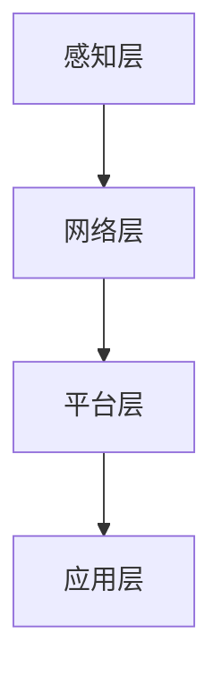
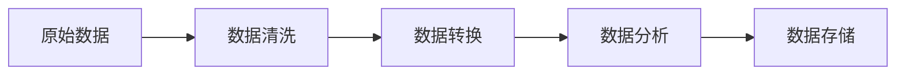
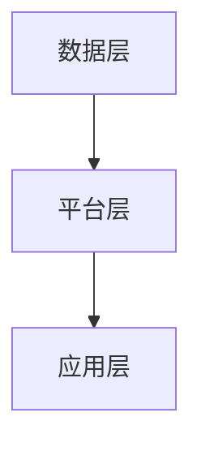
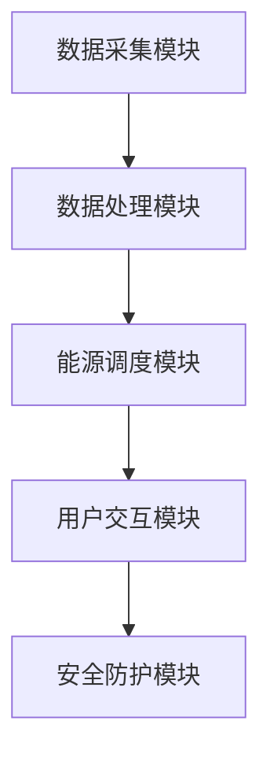
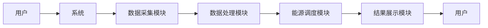

                 


# 智能电网技术的发展与能源互联网投资

## 关键词：智能电网、能源互联网、投资分析、能源优化、可再生能源

## 摘要：智能电网技术的发展与能源互联网投资探讨了智能电网技术的核心概念、算法原理、系统架构及能源互联网的投资价值。文章通过背景介绍、技术分析、案例研究等方法，深入剖析了智能电网与能源互联网的内在联系，为投资者和技术开发者提供了理论支持和实践指导。

---

# 第1章：智能电网技术的背景与概念

## 1.1 智能电网的定义与核心特征

### 1.1.1 什么是智能电网

智能电网是一种基于信息化、自动化、互动化的现代电力系统，通过整合先进的信息技术、通信技术和电力电子技术，实现电力的高效传输、分配和管理。

### 1.1.2 智能电网的核心特征

智能电网具有以下核心特征：
- **智能化**：通过先进的信息处理技术，实现电力系统的智能决策和优化管理。
- **互动性**：支持用户与电网之间的双向互动，提升用户参与度。
- **可靠性**：通过多种技术手段，确保电力供应的稳定性和可靠性。
- **可持续性**：支持可再生能源的接入与整合，减少对环境的负面影响。

### 1.1.3 智能电网与传统电网的区别

| 特性       | 传统电网                     | 智能电网                     |
|------------|------------------------------|-------------------------------|
| 数据采集   | 单向、周期性                  | 实时、双向                   |
| 控制方式   | 离散控制                    | 智能化、自动化                |
| 可扩展性   | 有限                        | 高度可扩展                   |
| 环保性     | 较低                        | 高                          |

### 1.1.4 智能电网的系统架构

以下是智能电网的系统架构图：

```mermaid
graph TD
    A[电力用户] --> B[智能电表]
    B --> C[数据采集与监控系统(SCADA)]
    C --> D[能源调度中心]
    D --> E[可再生能源]
    D --> F[传统能源]
```

## 1.2 智能电网的发展背景

### 1.2.1 能源结构变化与智能电网的需求

随着全球能源结构的调整，可再生能源（如风能、太阳能）的占比不断增加，传统电网的单向传输模式已无法满足需求，智能电网的双向传输和灵活调节能力成为必然选择。

### 1.2.2 技术进步推动智能电网发展

信息技术、通信技术和电力电子技术的快速发展为智能电网的实现提供了技术支撑，尤其是大数据、人工智能和物联网技术的应用，极大提升了电力系统的智能化水平。

### 1.2.3 智能电网在全球范围内的发展现状

目前，全球多个国家和地区已经启动智能电网项目，例如欧盟的智能电网示范项目、美国的智能电网投资计划以及中国的智能电网发展规划。

---

# 第2章：智能电网的核心技术

## 2.1 智能电网的体系结构

### 2.1.1 智能电网的分层架构

智能电网的分层架构包括感知层、网络层、平台层和应用层。



### 2.1.2 数据采集与监控系统（SCADA）

SCADA系统通过采集电力系统中的实时数据，进行监控和管理。其核心流程如下：


### 2.1.3 能源存储与管理技术

能源存储技术是智能电网的重要组成部分，常用的存储技术包括电池储能、超级电容器和飞轮储能。

---

## 2.2 智能电网的数据采集与处理

### 2.2.1 数据采集技术

数据采集技术包括传感器采集、远程采集和本地采集三种方式。

### 2.2.2 数据处理与分析

数据处理流程如下：



### 2.2.3 数据安全与隐私保护

数据安全是智能电网系统的重要组成部分，常用的安全技术包括加密传输、访问控制和数据备份。

---

## 2.3 智能电网的能源优化调度

### 2.3.1 能源调度的基本原理

能源调度的目标是实现电力系统的最优配置和运行。其基本原理包括负荷预测、电源分配和状态监测。

### 2.3.2 智能算法在能源调度中的应用

常用的智能算法包括遗传算法、粒子群优化算法和模拟退火算法。

### 2.3.3 调度优化的数学模型

调度优化的数学模型如下：

$$ \text{目标函数：} \min \sum_{i=1}^{n} c_i x_i $$
$$ \text{约束条件：} \sum_{i=1}^{n} x_i = D $$

其中，\( c_i \) 为第 \( i \) 个电源的单位成本，\( x_i \) 为第 \( i \) 个电源的输出功率，\( D \) 为总需求。

---

## 2.4 智能电网的通信技术

### 2.4.1 通信网络的构建

智能电网的通信网络包括光纤通信、无线通信和电力线通信。

### 2.4.2 通信协议的选择

常用的通信协议包括MQTT、HTTP和Modbus。

### 2.4.3 通信安全性

通信安全性是智能电网系统的重要组成部分，常用的加密算法包括AES和RSA。

---

# 第3章：能源互联网的架构与功能

## 3.1 能源互联网的定义与体系架构

### 3.1.1 能源互联网的定义

能源互联网是将能源流、信息流和业务流深度融合的新型能源体系，支持多种能源形式的互连、互通和互用。

### 3.1.2 能源互联网的体系架构

能源互联网的体系架构包括数据层、平台层和应用层。



## 3.2 能源互联网的功能与优势

### 3.2.1 能源互联网的功能

能源互联网的功能包括能源的生产、传输、存储、消费和交易。

### 3.2.2 能源互联网的优势

能源互联网的优势包括高效性、灵活性和可持续性。

---

## 3.3 能源互联网的实现技术

### 3.3.1 多能源形式的整合

能源互联网支持多种能源形式的整合，包括风能、太阳能、生物质能和化石能源。

### 3.3.2 能源数据的共享与分析

能源数据的共享与分析是能源互联网的重要组成部分，支持能源的优化配置和智能管理。

### 3.3.3 能源交易的智能化

能源交易的智能化是能源互联网的重要应用，支持实时交易和智能结算。

---

# 第4章：能源互联网的投资价值

## 4.1 能源互联网的投资背景

### 4.1.1 能源结构转型的需求

随着全球能源结构的转型，可再生能源的占比不断增加，能源互联网的投资需求日益迫切。

### 4.1.2 技术进步推动投资

信息技术、通信技术和能源技术的快速发展为能源互联网的投资提供了技术支撑。

## 4.2 能源互联网的投资机会

### 4.2.1 可再生能源领域的投资机会

可再生能源是能源互联网的重要组成部分，包括风能、太阳能和生物质能等领域。

### 4.2.2 能源存储与管理领域的投资机会

能源存储与管理是能源互联网的关键技术，包括电池储能、超级电容器和飞轮储能等领域。

## 4.3 能源互联网的投资模式

### 4.3.1 传统投资模式

传统投资模式包括直接投资和间接投资两种方式。

### 4.3.2 创新投资模式

创新投资模式包括股权投资、风险投资和PPP模式。

## 4.4 能源互联网的投资风险

### 4.4.1 技术风险

技术风险是能源互联网投资的主要风险之一，包括技术不成熟和成本过高等问题。

### 4.4.2 市场风险

市场风险是能源互联网投资的另一个主要风险，包括市场需求不足和竞争激烈等问题。

### 4.4.3 政策风险

政策风险是能源互联网投资的重要风险，包括政策变化和监管不确定性等问题。

## 4.5 能源互联网的成功案例

### 4.5.1 国内外典型案例

国内外的典型能源互联网案例包括欧盟的智能电网示范项目和中国的智能电网发展规划。

### 4.5.2 成功经验总结

成功经验总结包括技术创新、政策支持和市场开拓等方面。

---

# 第5章：智能电网与能源互联网的关键算法

## 5.1 数据采集与处理算法

### 5.1.1 数据清洗算法

数据清洗算法用于处理数据中的噪声和异常值，常用的算法包括基于统计的方法和基于机器学习的方法。

### 5.1.2 数据融合算法

数据融合算法用于整合来自不同传感器的数据，常用的算法包括加权平均法和最大似然估计法。

## 5.2 能源优化调度算法

### 5.2.1 负荷预测算法

负荷预测算法用于预测电力系统中的负荷需求，常用的算法包括时间序列分析和机器学习算法。

### 5.2.2 电源分配算法

电源分配算法用于优化电源的分配，常用的算法包括线性规划和非线性规划。

## 5.3 能源互联网的网络安全算法

### 5.3.1 加密算法

加密算法用于保护能源互联网中的数据安全，常用的算法包括AES和RSA。

### 5.3.2 认证算法

认证算法用于验证用户的身份，常用的算法包括数字签名和哈希函数。

---

# 第6章：智能电网与能源互联网的系统架构设计

## 6.1 系统架构设计概述

### 6.1.1 问题场景介绍

系统架构设计需要解决智能电网和能源互联网中的复杂问题，例如能源的高效传输和智能管理。

### 6.1.2 系统功能设计

系统功能设计包括数据采集、能源调度、用户交互和安全防护。



### 6.1.3 系统架构设计

系统架构设计采用分层架构，包括感知层、网络层、平台层和应用层。


## 6.2 系统接口设计

### 6.2.1 数据接口

数据接口用于不同模块之间的数据传输，常用的接口包括API和数据库接口。

### 6.2.2 用户接口

用户接口用于用户与系统的交互，常用的接口包括Web界面和移动应用界面。

## 6.3 系统交互设计

### 6.3.1 交互流程设计

系统交互流程包括用户登录、数据采集、能源调度和结果展示。


### 6.3.2 交互序列图

系统交互序列图如下：



---

# 第7章：智能电网与能源互联网的项目实战

## 7.1 项目环境安装

### 7.1.1 系统需求

项目实战需要安装Python、Java和数据库等基础环境。

### 7.1.2 工具安装

需要安装的工具包括JDK、Python、数据库和可视化工具。

## 7.2 项目核心代码实现

### 7.2.1 数据采集代码

数据采集代码如下：

```python
import serial

ser = serial.Serial('COM1', 9600)
while True:
    data = ser.readline()
    print(data)
```

### 7.2.2 数据处理代码

数据处理代码如下：

```python
import pandas as pd

data = pd.read_csv('data.csv')
data_cleaned = data.dropna()
data_cleaned.to_csv('cleaned_data.csv', index=False)
```

## 7.3 项目代码解读与分析

### 7.3.1 代码结构分析

代码结构包括数据采集、数据处理和能源调度三个部分。

### 7.3.2 代码功能说明

数据采集代码用于采集实时数据，数据处理代码用于清洗和分析数据，能源调度代码用于优化能源分配。

## 7.4 项目案例分析

### 7.4.1 案例背景介绍

案例背景包括项目目标、实施环境和数据来源。

### 7.4.2 案例实施过程

案例实施过程包括需求分析、系统设计、代码实现和测试验证。

### 7.4.3 案例结果分析

案例结果分析包括数据分析、结果展示和性能优化。

## 7.5 项目小结

### 7.5.1 项目总结

项目总结包括项目目标的实现情况、技术创新和经验总结。

### 7.5.2 项目展望

项目展望包括未来的研究方向和潜在的应用领域。

---

# 第8章：智能电网与能源互联网的最佳实践与投资建议

## 8.1 最佳实践 tips

### 8.1.1 技术选型建议

技术选型建议包括选择成熟的技术和注重系统的可扩展性。

### 8.1.2 项目实施建议

项目实施建议包括注重团队协作和加强项目管理。

## 8.2 投资建议

### 8.2.1 投资领域建议

投资领域建议包括投资可再生能源和能源存储技术。

### 8.2.2 投资策略建议

投资策略建议包括分散投资和注重风险控制。

## 8.3 注意事项

### 8.3.1 技术风险

技术风险包括技术不成熟和成本过高。

### 8.3.2 市场风险

市场风险包括市场需求不足和竞争激烈。

### 8.3.3 政策风险

政策风险包括政策变化和监管不确定性。

## 8.4 拓展阅读

### 8.4.1 推荐书籍

推荐书籍包括《智能电网技术》和《能源互联网投资》。

### 8.4.2 推荐网站

推荐网站包括IEEE Xplore和Energy Internet Association。

---

# 作者信息

作者：AI天才研究院/AI Genius Institute & 禅与计算机程序设计艺术 /Zen And The Art of Computer Programming

---

以上是《智能电网技术的发展与能源互联网投资》的完整目录大纲，内容涵盖了智能电网和能源互联网的背景、技术、系统架构和投资分析等方面。希望对您有所帮助！

