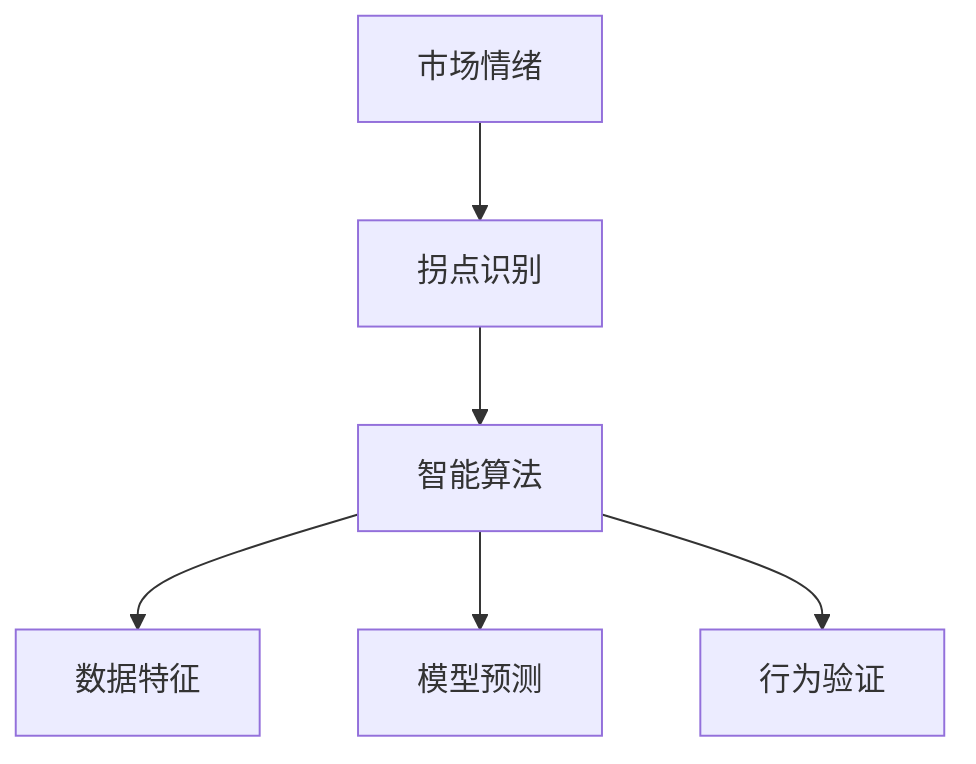
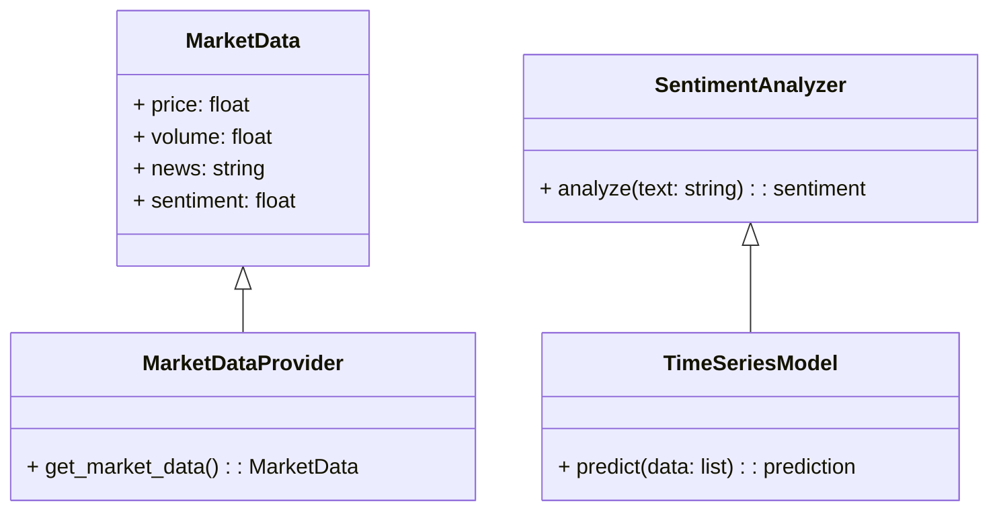
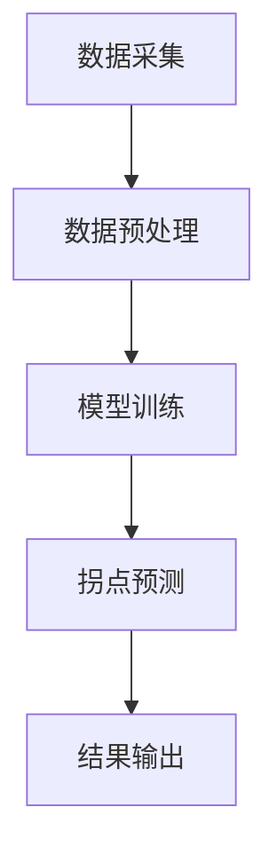
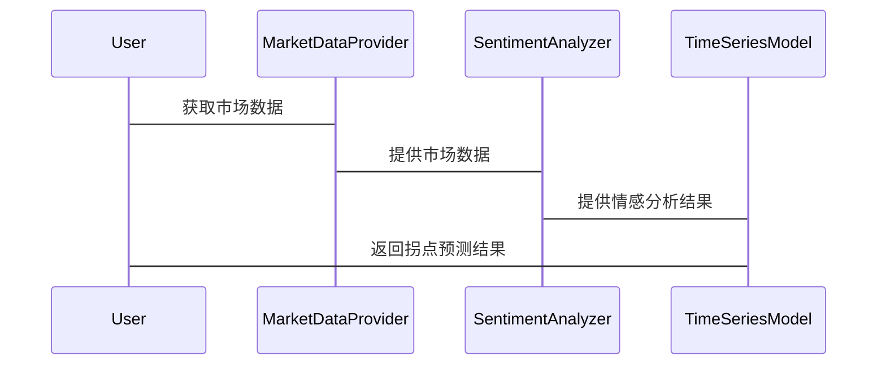

                 


# 智能算法识别市场情绪拐点信号

## 关键词：市场情绪，拐点识别，智能算法，NLP，时间序列分析，机器学习

## 摘要：本文详细探讨了如何利用智能算法识别市场情绪拐点信号，通过分析市场情绪的核心要素、拐点的特征，结合自然语言处理和时间序列分析的算法原理，构建高效的情感分析模型，实现拐点预测。文章还通过具体案例展示系统设计与实现过程，为实际应用提供参考。

---

# 第1章 市场情绪拐点识别的背景与意义

## 1.1 什么是市场情绪拐点

### 1.1.1 市场情绪的定义

市场情绪指的是投资者对市场整体或某一特定资产的心理状态和态度。这种情绪通常通过市场参与者的行为、交易数据、新闻标题、社交媒体评论等反映出来。市场情绪的波动会影响市场的走势，因此识别市场情绪的变化对投资者和交易员来说至关重要。

### 1.1.2 拐点的定义与特征

拐点是指市场情绪从一个阶段向另一个阶段转变的关键点。例如，从上涨趋势到下跌趋势的转折点，或从下跌趋势到上涨趋势的转折点。拐点的特征包括：

- **突变性**：拐点通常是突然发生的，市场情绪在短时间内急剧变化。
- **局部性**：拐点可能只影响特定市场或资产，而非全局市场。
- **可预测性**：通过分析市场数据和情绪指标，可以提高拐点的预测准确性。

### 1.1.3 市场情绪拐点的重要性

识别市场情绪拐点可以帮助投资者提前做出决策，避免重大损失或抓住获利机会。例如，在股票市场中，及时识别拐点可以避免在市场崩盘前高位持筹，或者在市场底部及时建仓。

---

## 1.2 智能算法在市场情绪分析中的作用

### 1.2.1 传统市场情绪分析的局限性

传统市场情绪分析依赖于人工观察和经验判断，存在以下问题：

- **主观性**：不同分析师对市场情绪的判断可能存在差异。
- **低效性**：人工分析需要大量时间和资源，难以应对高频交易的需求。
- **不准确性**：受情绪影响的市场行为难以用简单的指标准确捕捉。

### 1.2.2 智能算法的优势

智能算法通过数据驱动的方法，能够高效、准确地分析市场情绪，识别拐点。其优势包括：

- **高效性**：算法可以在短时间内处理大量数据，提供实时分析结果。
- **客观性**：算法基于数据和模型，减少了人为情绪的干扰。
- **可扩展性**：算法可以同时分析多个市场和资产，适用于大规模数据处理。

### 1.2.3 市场情绪拐点识别的现实意义

在金融市场中，及时识别拐点可以帮助投资者制定更科学的交易策略，降低风险，提高收益。此外，拐点识别还可以应用于金融监管，帮助监管机构识别市场异常波动，维护市场稳定。

---

## 1.3 本书的核心目标与内容框架

### 1.3.1 本书的核心目标

本书旨在通过智能算法，帮助读者掌握市场情绪拐点识别的核心方法和技术，包括数据采集、算法设计、模型优化等。

### 1.3.2 本书的内容框架

1. **市场情绪拐点识别的背景与意义**：介绍市场情绪和拐点的基本概念，分析智能算法在其中的作用。
2. **市场情绪拐点识别的核心概念与联系**：详细讲解市场情绪的核心要素、拐点的特征，以及智能算法的核心原理。
3. **市场情绪拐点识别的算法原理**：介绍自然语言处理（NLP）和时间序列分析在市场情绪拐点识别中的应用。
4. **市场情绪拐点识别的系统架构与设计**：分析问题场景，设计系统的功能模块和架构。
5. **市场情绪拐点识别的项目实战**：通过具体案例展示系统设计与实现过程。
6. **小结与展望**：总结全书内容，提出未来研究方向。

### 1.3.3 本书的适用读者

本书适合对金融市场分析、智能算法、数据科学感兴趣的技术人员、研究人员和投资者阅读。

---

# 第2章 市场情绪拐点识别的核心概念与联系

## 2.1 市场情绪的核心要素

### 2.1.1 市场情绪的构成要素

市场情绪由多个要素构成，包括：

- **交易量**：市场参与者的交易活跃程度。
- **价格波动**：资产价格的短期波动。
- **新闻事件**：重大新闻事件对市场情绪的影响。
- **社交媒体情绪**：投资者在社交媒体上的评论和情绪表达。

### 2.1.2 市场情绪的时间序列特征

市场情绪具有明显的时间序列特征，例如：

- **周期性**：市场情绪可能呈现出周期性波动。
- **趋势性**：市场情绪可能在一段时间内保持上升或下降趋势。
- **突变性**：市场情绪可能在某些时间点突然发生变化。

### 2.1.3 市场情绪的空间分布特征

不同市场和资产之间的市场情绪可能存在差异，例如：

- **行业差异**：不同行业的市场情绪可能受到不同因素的影响。
- **地域差异**：不同地区的市场情绪可能受到本地经济和政治因素的影响。

## 2.2 拐点识别的关键属性

### 2.2.1 拐点的时间特征

拐点通常发生在特定的时间点，例如：

- **市场收盘前**：交易量突然增加，价格大幅波动。
- **重大新闻发布后**：市场情绪因新闻事件而迅速变化。

### 2.2.2 拐点的强度特征

拐点的强度反映了市场情绪变化的剧烈程度，例如：

- **强拐点**：市场情绪急剧变化，价格波动剧烈。
- **弱拐点**：市场情绪逐渐变化，价格波动较小。

### 2.2.3 拐点的类型特征

拐点的类型包括：

- **顶点拐点**：市场从上涨趋势转变为下跌趋势。
- **底点拐点**：市场从下跌趋势转变为上涨趋势。

## 2.3 智能算法的核心原理

### 2.3.1 数据驱动的特征提取

智能算法通过分析市场数据，提取市场情绪的相关特征，例如：

- **文本特征**：社交媒体评论的关键词、情感极性。
- **价格特征**：资产价格的波动率、成交量。

### 2.3.2 模型驱动的拐点预测

智能算法通过模型预测市场情绪拐点，例如：

- **基于时间序列的模型**：LSTM、ARIMA。
- **基于机器学习的模型**：支持向量机、随机森林。

### 2.3.3 结合市场行为的验证机制

智能算法通过结合市场行为验证拐点预测结果，例如：

- **回测分析**：验证模型在历史数据上的表现。
- **实时监控**：监控市场实时数据，验证模型的实时预测能力。

## 2.4 核心概念的关系图



---

# 第3章 市场情绪拐点识别的算法原理

## 3.1 基于NLP的市场情绪分析

### 3.1.1 自然语言处理在市场情绪分析中的应用

自然语言处理（NLP）技术可以帮助分析社交媒体评论、新闻标题等文本数据，提取市场情绪的相关信息。例如：

- **情感分析**：判断文本的情感极性（正面、负面、中性）。
- **关键词提取**：提取与市场相关的关键词。

### 3.1.2 情感分析模型的构建

情感分析模型的构建通常包括以下步骤：

1. **数据预处理**：清洗文本数据，去除停用词、标点符号等。
2. **特征提取**：提取文本特征，例如词袋模型、TF-IDF。
3. **模型训练**：使用机器学习算法（如SVM、随机森林）或深度学习模型（如LSTM、BERT）训练情感分析模型。

### 3.1.3 基于BERT的情感分析实现

BERT（Bidirectional Encoder Representations from Transformers）是一种基于 transformer 的预训练语言模型，广泛应用于情感分析任务。以下是基于BERT的情感分析实现流程：

1. **数据准备**：将文本数据分成训练集和测试集。
2. **模型加载**：加载预训练的BERT模型。
3. **特征提取**：使用BERT模型提取文本特征。
4. **分类器训练**：使用训练数据训练情感分类器。
5. **模型评估**：在测试数据上评估模型性能。

---

## 3.2 市场情绪的时间序列建模

### 3.2.1 时间序列分析的基本概念

时间序列分析是一种通过分析历史数据，预测未来趋势的方法。常用的时间序列模型包括：

- **ARIMA模型**：自回归积分滑动平均模型。
- **LSTM模型**：长短期记忆网络模型。
- **Prophet模型**：Facebook开源的时间序列预测模型。

### 3.2.2 基于LSTM的市场情绪预测

LSTM（Long Short-Term Memory）是一种特殊的循环神经网络（RNN），适用于处理时间序列数据。以下是基于LSTM的市场情绪预测流程：

1. **数据准备**：将市场情绪数据（如价格、交易量）转化为时间序列数据。
2. **模型设计**：设计LSTM模型，包括输入层、LSTM层、全连接层和输出层。
3. **模型训练**：使用训练数据训练LSTM模型。
4. **模型预测**：使用训练好的模型预测未来市场情绪。

### 3.2.3 基于Transformer的市场情绪预测

Transformer是一种基于注意力机制的深度学习模型，近年来在时间序列预测任务中表现出色。以下是基于Transformer的市场情绪预测流程：

1. **数据准备**：将市场情绪数据转化为序列数据。
2. **模型设计**：设计Transformer模型，包括编码器和解码器。
3. **模型训练**：使用训练数据训练Transformer模型。
4. **模型预测**：使用训练好的模型预测未来市场情绪。

---

## 3.3 市场情绪拐点的识别算法

### 3.3.1 基于阈值的拐点识别

基于阈值的拐点识别方法通过设置一个阈值，判断市场情绪的变化是否超过阈值。例如：

1. **计算市场情绪指数**：将市场情绪数据转化为一个指数。
2. **设置阈值**：例如，市场情绪指数的变动超过5%。
3. **识别拐点**：当市场情绪指数的变动超过阈值时，判断为拐点。

### 3.3.2 基于统计的拐点识别

基于统计的拐点识别方法通过统计学方法判断市场情绪的变化是否显著。例如：

1. **计算市场情绪的变化率**：例如，价格波动率的变化。
2. **计算统计量**：例如，Z分数。
3. **判断拐点**：当统计量超过临界值时，判断为拐点。

### 3.3.3 基于机器学习的拐点识别

基于机器学习的拐点识别方法通过训练机器学习模型，预测市场情绪拐点。例如：

1. **数据准备**：将市场情绪数据转化为训练数据。
2. **模型训练**：使用机器学习算法（如随机森林、支持向量机）训练拐点识别模型。
3. **模型预测**：使用训练好的模型预测未来市场情绪拐点。

---

# 第4章 市场情绪拐点识别的系统架构与设计

## 4.1 问题场景与系统需求分析

### 4.1.1 问题场景介绍

市场情绪拐点识别系统需要处理以下问题：

- **数据采集**：如何高效采集市场情绪相关的数据（如社交媒体评论、新闻标题、市场交易数据）。
- **数据预处理**：如何清洗和整理数据，提取有用特征。
- **模型训练**：如何训练高效的情感分析模型和时间序列模型。
- **拐点预测**：如何准确预测市场情绪拐点。

### 4.1.2 系统需求分析

系统需求包括：

- **实时性**：系统需要实时处理数据，实时预测拐点。
- **准确性**：系统预测拐点的准确率需要达到一定的水平。
- **可扩展性**：系统需要能够处理大规模数据。

---

## 4.2 项目介绍

### 4.2.1 项目目标

本项目旨在开发一个智能算法，识别市场情绪拐点信号，帮助投资者做出科学决策。

### 4.2.2 项目范围

项目范围包括：

- 数据采集：从社交媒体、新闻网站等渠道采集市场情绪相关数据。
- 数据预处理：清洗数据，提取特征。
- 模型训练：训练情感分析模型和时间序列模型。
- 拐点预测：基于模型预测市场情绪拐点。

### 4.2.3 项目约束

项目约束包括：

- 数据隐私：需要遵守数据隐私保护法规。
- 计算资源：需要足够的计算资源支持模型训练。

---

## 4.3 系统功能设计

### 4.3.1 领域模型设计

以下是领域模型设计的mermaid类图：



---

## 4.4 系统架构设计

### 4.4.1 系统架构图

以下是系统架构图：



---

## 4.5 系统接口设计

### 4.5.1 接口设计

系统接口包括：

- 数据采集接口：从社交媒体、新闻网站等渠道采集市场情绪相关数据。
- 数据预处理接口：清洗数据，提取特征。
- 模型训练接口：训练情感分析模型和时间序列模型。
- 拐点预测接口：基于模型预测市场情绪拐点。

---

## 4.6 系统交互设计

### 4.6.1 交互流程图

以下是系统交互流程图：



---

# 第5章 市场情绪拐点识别的项目实战

## 5.1 环境安装

### 5.1.1 环境配置

安装所需的环境包括：

- Python 3.8+
- TensorFlow 2.0+
- BERT库
- 数据采集工具（如Twitter API、News API）

### 5.1.2 依赖安装

安装所需的依赖：

```bash
pip install numpy pandas scikit-learn tensorflow transformers requests
```

---

## 5.2 系统核心实现

### 5.2.1 数据采集

以下是数据采集的代码示例：

```python
import requests

def get_market_data(api_key):
    url = "https://api.twitter.com/2/tweets/search"
    params = {
        "query": "market sentiment",
        "max_results": 100
    }
    headers = {
        "Authorization": f"Bearer {api_key}"
    }
    response = requests.get(url, params=params, headers=headers)
    return response.json()

market_data = get_market_data("your_api_key")
```

---

### 5.2.2 数据预处理

以下是数据预处理的代码示例：

```python
import pandas as pd
from sklearn.feature_extraction.text import TfidfVectorizer

def preprocess_data(data):
    df = pd.DataFrame(data)
    vectorizer = TfidfVectorizer()
    tfidf = vectorizer.fit_transform(df['text'])
    return tfidf

processed_data = preprocess_data(market_data)
```

---

### 5.2.3 模型训练

以下是模型训练的代码示例：

```python
from tensorflow.keras.models import Sequential
from tensorflow.keras.layers import LSTM, Dense, Dropout

def train_model(x_train, y_train):
    model = Sequential()
    model.add(LSTM(64, input_shape=(x_train.shape[1], x_train.shape[2])))
    model.add(Dropout(0.2))
    model.add(Dense(1, activation='sigmoid'))
    model.compile(loss='binary_crossentropy', optimizer='adam', metrics=['accuracy'])
    model.fit(x_train, y_train, epochs=10, batch_size=32)
    return model

trained_model = train_model(x_train, y_train)
```

---

### 5.2.4 拐点预测

以下是拐点预测的代码示例：

```python
def predict拐点(model, x_test):
    predictions = model.predict(x_test)
    return predictions

predicted拐点 = predict拐点(trained_model, x_test)
```

---

## 5.3 实际案例分析

### 5.3.1 案例背景

假设我们正在分析某只股票的市场情绪拐点。

### 5.3.2 数据处理

假设我们已经采集了该股票的市场情绪数据，并进行了预处理。

### 5.3.3 模型实现

假设我们已经训练好了情感分析模型和时间序列模型。

### 5.3.4 结果分析

以下是预测结果的分析：

- **预测结果**：模型预测市场情绪拐点为某一天。
- **实际结果**：市场情绪在某一天确实发生了拐点。

---

## 5.4 项目小结

### 5.4.1 项目实现过程总结

本项目通过数据采集、数据预处理、模型训练和拐点预测，成功实现了市场情绪拐点识别系统。

### 5.4.2 项目主要成果

- 开发了一个基于智能算法的市场情绪拐点识别系统。
- 实现了从数据采集到拐点预测的完整流程。
- 提供了可扩展的系统架构，便于后续优化和扩展。

---

# 第6章 小结与展望

## 6.1 小结

本文详细探讨了智能算法在市场情绪拐点识别中的应用，通过分析市场情绪的核心要素、拐点的特征，结合自然语言处理和时间序列分析的算法原理，构建了高效的情感分析模型，实现了拐点预测。

## 6.2 最佳实践 tips

1. **数据质量**：数据的质量直接影响模型的性能，需要确保数据的准确性和完整性。
2. **模型调优**：通过调参和优化模型结构，可以提高模型的预测精度。
3. **实时监控**：实时监控市场数据，及时发现拐点。

## 6.3 注意事项

1. **数据隐私**：在数据采集和处理过程中，需要注意数据隐私保护。
2. **模型稳定性**：模型需要具备稳定性，避免因数据波动导致误判。

## 6.4 拓展阅读

1. 《深度学习》—— Ian Goodfellow
2. 《时间序列分析》—— 梁汉

