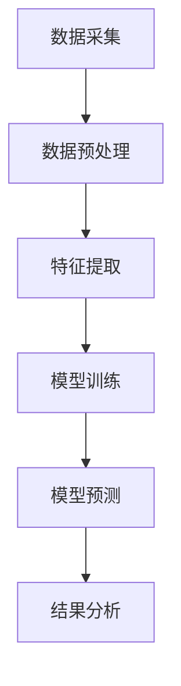
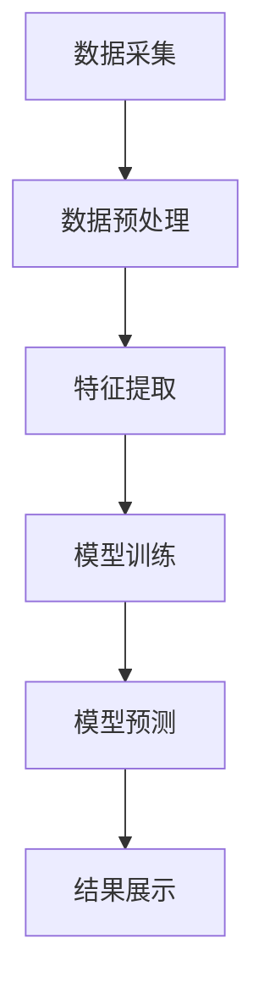
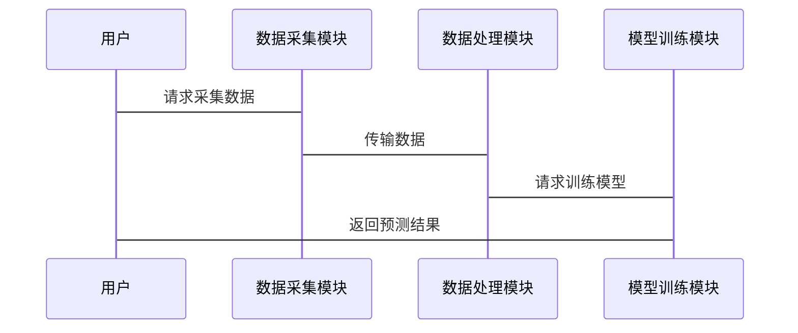

                 


# 智能算法识别市场泡沫形成过程

> 关键词：智能算法，市场泡沫，金融分析，机器学习，时间序列分析

> 摘要：本文通过智能算法分析市场泡沫的形成过程，结合数据驱动的方法，探讨如何利用机器学习和深度学习技术识别市场泡沫的前兆。文章从市场泡沫的基本概念出发，逐步分析智能算法的核心原理，结合数学模型和实际案例，深入探讨如何通过算法实现市场泡沫的预测与识别。内容涵盖数据处理、特征提取、算法模型构建、系统设计与实现等多方面，旨在为金融从业者和算法爱好者提供一套完整的解决方案。

---

# 第1章: 市场泡沫与智能算法概述

## 1.1 市场泡沫的基本概念

### 1.1.1 市场泡沫的定义与特征
市场泡沫是指资产价格在短期内迅速上涨，远远偏离其实际价值，最终价格回归理性后的剧烈下跌现象。其主要特征包括：
- 非理性上涨：价格增长脱离基本面。
- 市场情绪主导：投资者行为受乐观预期驱动。
- 泡沫破裂的突发性：价格快速崩盘。

### 1.1.2 市场泡沫的形成机制
市场泡沫的形成通常经历三个阶段：
1. **积累阶段**：投资者对资产的乐观预期逐渐升温，需求增加，价格开始上涨。
2. **膨胀阶段**：价格快速上涨，吸引更多投资者入场，形成正反馈循环。
3. **破裂阶段**：价格达到峰值后，市场情绪转向恐慌，投资者大量抛售资产，价格迅速下跌。

### 1.1.3 智能算法在市场分析中的作用
智能算法通过分析历史数据和市场行为，识别价格波动中的异常模式，帮助预测和识别市场泡沫的形成。

---

## 1.2 智能算法的基本原理

### 1.2.1 算法的基本概念
智能算法的核心是通过数据驱动的方法，利用数学模型和机器学习技术，从历史数据中提取规律，预测未来趋势。

### 1.2.2 机器学习与深度学习在市场分析中的应用
- **机器学习**：通过训练数据，识别价格波动的模式。
- **深度学习**：利用神经网络模型，捕捉复杂的价格波动特征。

### 1.2.3 智能算法的核心优势
- **数据驱动**：基于历史数据，减少人为判断的偏差。
- **实时性**：能够快速处理市场数据，提供实时反馈。
- **自适应性**：算法能够根据市场变化自动调整模型。

---

## 1.3 市场泡沫识别的背景与意义

### 1.3.1 当前金融市场的发展现状
- 金融市场的复杂性增加，价格波动更加频繁。
- 投资者行为趋于理性化，但市场情绪仍主导短期波动。

### 1.3.2 市场泡沫的危害与防范
- 泡沫破裂可能导致大规模资产贬值，引发金融危机。
- 通过智能算法提前识别泡沫，可以有效规避风险。

### 1.3.3 智能算法在金融监管中的应用前景
- 帮助监管机构及时发现市场异常，维护市场稳定。

---

## 1.4 本章小结
本章介绍了市场泡沫的基本概念和形成机制，并探讨了智能算法在市场分析中的作用和优势。通过数据驱动的方法，智能算法能够有效识别市场泡沫的前兆，为投资者和监管机构提供决策支持。

---

# 第2章: 智能算法的核心概念与联系

## 2.1 数据驱动的市场分析

### 2.1.1 数据采集与处理
- 数据来源：历史价格数据、成交量数据、市场情绪数据等。
- 数据清洗：去除缺失值和异常值。
- 数据预处理：标准化、归一化。

### 2.1.2 数据特征提取
- 时间序列特征：均值、方差、趋势、周期性。
- 市场情绪特征：投资者情绪指数、新闻情感分析。

### 2.1.3 数据预处理方法
- 填充缺失值：均值、中位数填充。
- 标准化：归一化处理。

---

## 2.2 算法模型的选择与优化

### 2.2.1 常见算法模型介绍
- **线性回归**：适用于线性关系的预测。
- **支持向量机（SVM）**：适用于非线性分类。
- **随机森林**：适用于特征较多的场景。
- **长短期记忆网络（LSTM）**：适用于时间序列预测。

### 2.2.2 算法模型的优化策略
- 参数调优：交叉验证选择最优参数。
- 特征选择：基于特征重要性进行筛选。

### 2.2.3 模型评估与验证
- 交叉验证：评估模型的泛化能力。
- 回归指标：均方误差（MSE）、R²值。

---

## 2.3 智能算法的数学基础

### 2.3.1 线性回归模型
$$ y = \beta_0 + \beta_1x + \epsilon $$

### 2.3.2 时间序列模型
$$ ARIMA(p, d, q) $$

### 2.3.3 聚类分析与分类算法
- K-means算法：用于市场行为的聚类分析。
- K-近邻算法（KNN）：用于市场状态分类。

---

## 2.4 本章小结
本章详细介绍了智能算法的核心概念和数学基础，包括数据处理、特征提取、算法选择和优化策略。通过对比不同算法的优缺点，为后续的算法实现提供了理论基础。

---

# 第3章: 算法原理与流程

## 3.1 数据预处理与特征工程

### 3.1.1 数据清洗与标准化
- 使用Python的`pandas`库进行数据清洗。
- 使用`scikit-learn`库进行标准化处理。

### 3.1.2 特征选择与降维
- 使用随机森林模型提取特征重要性。
- 使用主成分分析（PCA）进行降维。

### 3.1.3 时间序列数据的处理
- 分解时间序列数据为趋势、周期性和噪声部分。

---

## 3.2 算法实现与流程

### 3.2.1 算法流程图


### 3.2.2 算法实现步骤
1. 数据采集与清洗。
2. 特征提取与选择。
3. 模型训练与优化。
4. 模型预测与结果分析。

### 3.2.3 算法优化与调参
- 使用网格搜索（Grid Search）进行参数调优。

---

## 3.3 数学模型与公式

### 3.3.1 线性回归模型
$$ y = \beta_0 + \beta_1x + \epsilon $$

### 3.3.2 时间序列模型
$$ ARIMA(p, d, q) $$

### 3.3.3 聚类分析模型
$$ K-means算法 $$

---

## 3.4 本章小结
本章详细讲解了智能算法的实现流程和数学模型，通过具体的步骤和公式推导，帮助读者理解算法的核心原理。

---

# 第4章: 系统分析与架构设计

## 4.1 系统功能设计

### 4.1.1 需求分析
- 系统需要实现市场数据的采集、处理和分析功能。

### 4.1.2 功能模块划分
- 数据采集模块：负责采集市场数据。
- 数据处理模块：负责数据清洗和特征提取。
- 模型训练模块：负责算法训练和预测。
- 结果展示模块：负责展示分析结果。

### 4.1.3 系统功能流程图


---

## 4.2 系统架构设计

### 4.2.1 分层架构设计
- **数据层**：存储市场数据。
- **业务逻辑层**：实现数据处理和模型训练。
- **用户界面层**：展示分析结果。

### 4.2.2 微服务架构设计
- 数据采集服务、数据处理服务、模型训练服务。

### 4.2.3 系统交互设计
- 使用API接口进行模块间通信。

---

## 4.3 系统接口设计

### 4.3.1 接口设计
- 数据采集接口：`GET /data/collect`
- 数据处理接口：`POST /data/process`
- 模型训练接口：`POST /model/train`

### 4.3.2 交互流程图


---

## 4.4 本章小结
本章详细设计了系统的功能模块、架构和接口，为后续的系统实现提供了清晰的指导。

---

# 第5章: 项目实战

## 5.1 环境安装与配置

### 5.1.1 安装Python和相关库
```bash
pip install numpy pandas scikit-learn matplotlib
```

### 5.1.2 数据集获取
- 数据来源：金融数据API或CSV文件。

---

## 5.2 系统核心实现

### 5.2.1 数据采集与处理
```python
import pandas as pd

# 数据采集
data = pd.read_csv('market_data.csv')

# 数据清洗
data.dropna(inplace=True)
data = data.iloc[:100]  # 取前100条数据
```

### 5.2.2 特征提取与选择
```python
from sklearn.feature_selection import SelectKBest
from sklearn.feature_selection import chi2

# 特征选择
selector = SelectKBest(score_func=chi2, k=5)
selector.fit_transform(data, labels)
```

### 5.2.3 模型训练与预测
```python
from sklearn.linear_model import LinearRegression
from sklearn.metrics import mean_squared_error

# 训练模型
model = LinearRegression()
model.fit(X_train, y_train)

# 预测结果
y_pred = model.predict(X_test)
```

### 5.2.4 结果分析
```python
# 计算均方误差
mse = mean_squared_error(y_test, y_pred)
print(f'均方误差: {mse}')
```

---

## 5.3 实际案例分析

### 5.3.1 案例背景
- 数据来源：某股票的历史价格数据。

### 5.3.2 数据分析与结果
- 使用线性回归模型进行预测，识别价格波动的异常值。

### 5.3.3 案例总结
- 模型能够有效识别价格波动的异常模式，为市场泡沫的识别提供参考。

---

## 5.4 本章小结
本章通过实际案例展示了智能算法在市场泡沫识别中的应用，从数据采集到模型训练，再到结果分析，详细讲解了系统的实现过程。

---

# 第6章: 最佳实践与总结

## 6.1 小结
智能算法通过数据驱动的方法，能够有效识别市场泡沫的形成过程。本文从理论到实践，详细讲解了算法的核心原理和实现步骤。

## 6.2 注意事项
- 数据质量对算法性能影响较大，需确保数据的完整性和准确性。
- 模型的泛化能力需通过交叉验证进行评估。
- 智能算法的结果需结合市场实际情况进行分析，避免过度依赖算法。

## 6.3 拓展阅读
- 推荐阅读《机器学习实战》和《时间序列分析》等相关书籍。

---

# 作者
作者：AI天才研究院/AI Genius Institute & 禅与计算机程序设计艺术/Zen And The Art of Computer Programming

