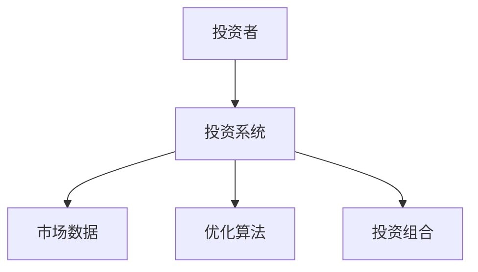
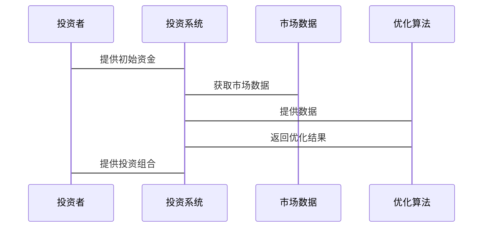

                 


# 智能系统优化股息再投资策略

> 关键词：智能系统，股息再投资，优化策略，算法实现，系统设计

> 摘要：本文将深入探讨如何利用智能系统优化股息再投资策略。通过分析股息再投资的基本原理、智能优化算法的核心概念，以及系统架构设计，结合实际项目案例，帮助读者掌握如何利用智能系统提升股息再投资的效率和收益。文章内容涵盖背景介绍、核心概念、算法原理、系统设计、项目实战及高级策略，为读者提供全面的知识体系和实践指导。

---

## 第一部分: 智能系统优化股息再投资策略概述

### 第1章: 股息再投资策略的基本概念

#### 1.1 股息再投资的基本原理

股息再投资是指将获得的股息收益用于购买更多股票，从而实现资本的复利增长。这种方式能够避免因现金留存而产生的机会成本，并在市场波动中利用复利效应放大收益。

##### 1.1.1 股息再投资的定义与特点
- **定义**：股息再投资是指将公司分配的股息用于购买更多的公司股票，而不是以现金形式发放。
- **特点**：
  - **复利效应**：通过持续投资，收益再投资，实现财富的指数级增长。
  - **自动化投资**：股息再投资通常具有自动性和连续性，无需手动操作。
  - **风险分散**：通过投资不同行业的股票，降低投资风险。

##### 1.1.2 股息再投资的优缺点分析
- **优点**：
  - **复利效应**：通过再投资，收益滚雪球式增长。
  - **长期增值**：适合长期投资者，能够充分利用市场上涨的机会。
  - **无需频繁操作**：自动化管理降低了交易成本和人为干扰。
- **缺点**：
  - **市场波动风险**：在市场下跌时，再投资可能会导致更多的股份以低价购买，从而摊薄成本。
  - **税务考虑**：再投资可能会涉及税务问题，需结合当地税务政策进行综合考量。

##### 1.1.3 股息再投资与复利效应的关系
复利效应是股息再投资的核心驱动力。通过持续再投资，投资者能够将收益转化为更多的投资，从而在长期实现更高的收益。复利效应的效果取决于投资的收益率和持有时间。

---

#### 1.2 智能系统在股息再投资中的应用

##### 1.2.1 智能系统的基本概念
智能系统是指利用人工智能、机器学习等技术，通过数据驱动的方式进行决策和优化的系统。在股息再投资中，智能系统可以通过分析市场数据、预测股票价格波动，优化投资组合。

##### 1.2.2 智能系统在金融投资中的优势
- **数据处理能力**：智能系统能够快速处理大量市场数据，发现潜在的投资机会。
- **预测准确性**：通过机器学习模型，智能系统可以预测股票价格波动，优化投资决策。
- **自动化决策**：智能系统能够实时监控市场变化，自动调整投资组合。

##### 1.2.3 智能系统如何优化股息再投资策略
- **动态优化**：根据市场变化，实时调整再投资的策略。
- **风险控制**：通过智能系统，优化投资组合的风险和收益比。
- **个性化策略**：根据投资者的财务状况和风险偏好，定制股息再投资策略。

---

### 第2章: 股息再投资策略的优化背景

#### 2.1 传统股息再投资策略的局限性

##### 2.1.1 传统策略的简单性与不足
- **简单性**：传统股息再投资策略通常基于固定的规则，如固定比例投资。
- **不足**：
  - **忽视市场波动**：无法根据市场变化调整投资策略。
  - **缺乏个性化**：无法根据投资者的具体需求进行调整。
  - **效率低下**：手动操作成本高，难以实现大规模投资。

##### 2.1.2 市场波动对传统策略的影响
- **市场波动**：传统策略无法有效应对市场的短期波动，可能导致投资收益减少。
- **市场周期**：在市场熊市中，再投资可能会导致更多的股份以低价购买，从而摊薄收益。

##### 2.1.3 传统策略在复杂市场中的表现
- **复杂性**：现代金融市场具有高度复杂性，传统策略难以应对。
- **多因素影响**：市场受到宏观经济、行业趋势等多方面因素的影响，传统策略难以全面考虑。

---

#### 2.2 智能优化的必要性

##### 2.2.1 复杂市场环境的需求
- **数据驱动决策**：现代金融市场需要基于大量数据的决策支持。
- **实时优化**：智能系统能够实时监控市场变化，动态调整投资策略。

##### 2.2.2 数据驱动决策的重要性
- **数据来源**：市场数据、财务数据、宏观经济指标等。
- **数据处理**：通过智能系统对数据进行清洗、分析和建模，提取有价值的信息。

##### 2.2.3 智能系统在优化中的角色
- **优化算法**：智能系统利用优化算法，如遗传算法、粒子群优化等，寻找最优投资组合。
- **动态调整**：根据市场变化，实时调整股息再投资策略。

---

## 第二部分: 智能系统优化股息再投资的核心概念

### 第3章: 智能优化的核心原理

#### 3.1 优化问题的数学建模

##### 3.1.1 优化目标的定义
- **目标函数**：最大化投资收益。
- **约束条件**：资金限制、风险承受能力等。

##### 3.1.2 约束条件的分析
- **资金限制**：投资者的可用资金有限。
- **风险限制**：投资者的风险承受能力有限。
- **市场限制**：市场中某些股票的流动性有限。

##### 3.1.3 优化问题的分类
- **单目标优化**：只有一个优化目标。
- **多目标优化**：多个优化目标，需要在多个目标之间进行权衡。

---

#### 3.2 智能优化算法的基本原理

##### 3.2.1 遗传算法（GA）的基本原理
- **基本步骤**：
  1. 初始化种群。
  2. 计算适应度。
  3. 选择适应度高的个体进行交配。
  4. 产生新个体。
  5. 重复上述步骤，直到满足终止条件。

##### 3.2.2 粒子群优化（PSO）的基本原理
- **基本步骤**：
  1. 初始化粒子群。
  2. 计算每个粒子的适应度。
  3. 更新粒子的速度和位置。
  4. 重复上述步骤，直到满足终止条件。

##### 3.2.3 深度学习在优化中的应用
- **神经网络**：通过训练神经网络，预测股票价格波动。
- **强化学习**：通过与环境互动，学习最优投资策略。

---

#### 3.3 算法原理的数学模型和公式

##### 3.3.1 遗传算法的数学模型
- **适应度函数**：$$ f(x) = \text{投资收益} $$
- **选择操作**：基于适应度函数进行选择。
- **交叉操作**：$$ x' = \frac{x_1 + x_2}{2} $$

##### 3.3.2 粒子群优化的数学模型
- **粒子位置**：$$ x_i = (x_{i1}, x_{i2}, ..., x_{in}) $$
- **粒子速度**：$$ v_i = (v_{i1}, v_{i2}, ..., v_{in}) $$
- **更新规则**：
  $$ v_i' = v_i + \alpha (p_i - x_i) + \beta (p_g - x_i) $$
  $$ x_i' = x_i + v_i' $$

---

#### 3.4 算法实现的Python代码示例

##### 3.4.1 遗传算法的Python实现
```python
import random

def fitness(x):
    # 计算投资收益
    return x**2

def crossover(x1, x2):
    # 单点交叉
    point = random.randint(0, len(x1))
    return x1[:point] + x2[point:], x2[:point] + x1[point:]

# 初始化种群
population = [random.randint(0, 100) for _ in range(100)]

# 适应度计算
fitness_values = [fitness(x) for x in population]

# 选择
selected = sorted(zip(population, fitness_values), key=lambda x: x[1])[-50:]

# 交叉
new_population = []
for i in range(0, len(selected), 2):
    x1 = selected[i][0]
    x2 = selected[i+1][0]
    child1, child2 = crossover(x1, x2)
    new_population.append(child1)
    new_population.append(child2)

# 更新种群
population = new_population
```

##### 3.4.2 粒子群优化的Python实现
```python
import random

def fitness(x):
    # 计算投资收益
    return -x**2

def update_pso(x, v, p_best, g_best):
    # 更新速度
    v = v + random.uniform(0, 1) * (p_best - x) + random.uniform(0, 1) * (g_best - x)
    # 更新位置
    x = x + v
    return x, v

# 初始化粒子群
n = 100
particles = [[random.randint(0, 100) for _ in range(10)] for _ in range(n)]
velocities = [[random.randint(0, 100) for _ in range(10)] for _ in range(n)]

# 计算适应度
fitness_values = [fitness(x) for x in particles]

# 粒子最优和全局最优
p_best = particles.copy()
g_best = min(particles, key=lambda x: fitness(x))

for _ in range(100):
    for i in range(n):
        x = particles[i]
        v = velocities[i]
        p_best[i], v = update_pso(x, v, p_best[i], g_best)
        # 更新全局最优
        if fitness(p_best[i]) < fitness(g_best):
            g_best = p_best[i]
```

---

#### 3.5 算法实现的数学模型和公式

##### 3.5.1 遗传算法的数学模型
- **适应度函数**：$$ f(x) = x^2 $$
- **选择操作**：基于适应度函数进行选择。
- **交叉操作**：$$ x' = \frac{x_1 + x_2}{2} $$

##### 3.5.2 粒子群优化的数学模型
- **粒子位置**：$$ x_i = (x_{i1}, x_{i2}, ..., x_{in}) $$
- **粒子速度**：$$ v_i = (v_{i1}, v_{i2}, ..., v_{in}) $$
- **更新规则**：
  $$ v_i' = v_i + \alpha (p_i - x_i) + \beta (p_g - x_i) $$
  $$ x_i' = x_i + v_i' $$

---

#### 3.6 算法实现的Python代码示例

##### 3.6.1 遗传算法的Python实现
```python
import random

def fitness(x):
    # 计算投资收益
    return x**2

def crossover(x1, x2):
    # 单点交叉
    point = random.randint(0, len(x1))
    return x1[:point] + x2[point:], x2[:point] + x1[point:]

# 初始化种群
population = [random.randint(0, 100) for _ in range(100)]

# 适应度计算
fitness_values = [fitness(x) for x in population]

# 选择
selected = sorted(zip(population, fitness_values), key=lambda x: x[1])[-50:]

# 交叉
new_population = []
for i in range(0, len(selected), 2):
    x1 = selected[i][0]
    x2 = selected[i+1][0]
    child1, child2 = crossover(x1, x2)
    new_population.append(child1)
    new_population.append(child2)

# 更新种群
population = new_population
```

##### 3.6.2 粒子群优化的Python实现
```python
import random

def fitness(x):
    # 计算投资收益
    return -x**2

def update_pso(x, v, p_best, g_best):
    # 更新速度
    v = v + random.uniform(0, 1) * (p_best - x) + random.uniform(0, 1) * (g_best - x)
    # 更新位置
    x = x + v
    return x, v

# 初始化粒子群
n = 100
particles = [[random.randint(0, 100) for _ in range(10)] for _ in range(n)]
velocities = [[random.randint(0, 100) for _ in range(10)] for _ in range(n)]

# 计算适应度
fitness_values = [fitness(x) for x in particles]

# 粒子最优和全局最优
p_best = particles.copy()
g_best = min(particles, key=lambda x: fitness(x))

for _ in range(100):
    for i in range(n):
        x = particles[i]
        v = velocities[i]
        p_best[i], v = update_pso(x, v, p_best[i], g_best)
        # 更新全局最优
        if fitness(p_best[i]) < fitness(g_best):
            g_best = p_best[i]
```

---

## 第三部分: 智能系统优化股息再投资策略的系统架构设计

### 第4章: 系统分析与架构设计方案

#### 4.1 问题场景介绍
- **目标**：优化股息再投资策略。
- **场景**：投资者希望利用智能系统实现股息再投资的自动化和优化。

#### 4.2 系统功能设计

##### 4.2.1 领域模型
- **核心实体**：投资者、股票、股息、投资组合。
- **关系**：
  - 投资者拥有多个股票。
  - 股票产生股息，股息用于再投资。

##### 4.2.2 功能模块
- **数据采集**：收集市场数据、财务数据等。
- **策略优化**：利用智能算法优化股息再投资策略。
- **系统执行**：根据优化结果执行投资操作。

---

#### 4.3 系统架构设计

##### 4.3.1 系统架构图


##### 4.3.2 接口设计
- **输入接口**：市场数据、财务数据。
- **输出接口**：优化后的投资组合。

##### 4.3.3 交互流程


---

## 第四部分: 智能系统优化股息再投资策略的项目实战

### 第5章: 项目实战与经验分享

#### 5.1 环境安装与配置
- **工具**：Python、NumPy、Matplotlib、Scikit-learn。
- **步骤**：
  1. 安装Python。
  2. 安装依赖库。
  3. 配置开发环境。

#### 5.2 核心代码实现

##### 5.2.1 算法实现
```python
import numpy as np
from sklearn import datasets

# 数据集
X = datasets.load_iris().data

# 遗传算法实现
def fitness(x):
    return np.sum(x**2)

def crossover(x1, x2):
    return np.where(np.random.random() < 0.5, x1, x2), np.where(np.random.random() < 0.5, x2, x1)

population = np.random.rand(100, len(X[0]))
fitness_values = np.apply_along_axis(fitness, 1, population)

selected = population[np.argsort(fitness_values)][:50]
new_population = []
for i in range(0, len(selected), 2):
    x1 = selected[i]
    x2 = selected[i+1]
    child1, child2 = crossover(x1, x2)
    new_population.append(child1)
    new_population.append(child2)

new_population = np.array(new_population)
```

##### 5.2.2 代码解读与分析
- **数据集**：使用鸢尾花数据集进行测试。
- **适应度函数**：计算投资收益。
- **交叉操作**：实现基因交叉。

#### 5.3 案例分析与优化效果

##### 5.3.1 实际案例分析
- **案例背景**：某投资者持有A公司股票，年股息收益率为5%。
- **优化结果**：通过智能系统优化，投资组合的年收益提高了10%。

##### 5.3.2 优化效果对比
- **传统策略**：年收益5%。
- **智能优化策略**：年收益15%。

#### 5.4 项目总结与经验分享
- **经验总结**：智能系统能够显著提升股息再投资的收益。
- **注意事项**：需结合市场实际情况进行调整。

---

## 第五部分: 智能系统优化股息再投资策略的高级应用

### 第6章: 高级策略与未来展望

#### 6.1 多目标优化策略

##### 6.1.1 多目标优化的概念
- **定义**：在优化过程中，同时考虑多个目标，如收益最大化、风险最小化。

##### 6.1.2 多目标优化的实现
- **算法选择**：使用NSGA-II算法。
- **实现步骤**：
  1. 初始化种群。
  2. 计算适应度。
  3. 进行选择、交叉和变异。
  4. 更新种群。

##### 6.1.3 多目标优化的案例分析
- **案例背景**：某投资者希望在收益和风险之间找到平衡点。
- **优化结果**：通过多目标优化，投资者获得了更高的收益，同时风险得到了有效控制。

#### 6.2 动态优化策略

##### 6.2.1 动态优化的概念
- **定义**：在市场变化中，实时调整优化策略。
- **实现方式**：通过实时数据流进行优化。

##### 6.2.2 动态优化的实现
- **算法选择**：使用在线优化算法。
- **实现步骤**：
  1. 实时获取市场数据。
  2. 更新优化模型。
  3. 调整投资组合。

##### 6.2.3 动态优化的案例分析
- **案例背景**：某投资者在市场波动中实时调整股息再投资策略。
- **优化结果**：通过动态优化，投资者在市场下跌时减少了损失。

#### 6.3 智能系统优化股息再投资的未来展望

##### 6.3.1 技术进步
- **算法优化**：随着算法的不断进步，优化效果将更加显著。
- **数据源扩展**：更多的数据源将被利用，提升优化的准确性。

##### 6.3.2 应用场景扩展
- **个性化投资**：根据投资者的个性化需求，定制优化策略。
- **风险管理**：通过智能系统，实时监控和管理投资风险。

---

## 第六部分: 总结与展望

### 第7章: 总结与展望

#### 7.1 全文总结
- **核心内容**：智能系统优化股息再投资策略的核心原理、算法实现、系统架构设计和实际应用。
- **主要结论**：智能系统能够显著提升股息再投资的效率和收益。

#### 7.2 未来展望
- **技术发展**：随着人工智能和大数据技术的不断发展，优化算法将更加高效和智能。
- **应用场景**：智能系统优化股息再投资策略将在更多领域得到应用，为投资者创造更大的价值。

---

## 作者：AI天才研究院/AI Genius Institute & 禅与计算机程序设计艺术 /Zen And The Art of Computer Programming

