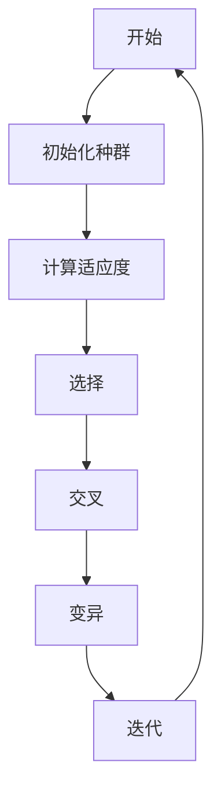
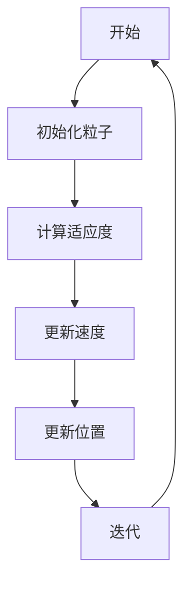

                 


# 智能系统优化逆向投资时机选择

> 关键词：智能系统优化、逆向投资、投资时机选择、数学模型、算法优化、系统架构

> 摘要：本文深入探讨了智能系统优化在逆向投资中的应用，分析了逆向投资的定义、特点及优化模型，结合数学建模与算法优化，构建了完整的智能系统优化框架，通过实际案例展示了如何利用智能系统优化选择最佳投资时机。

---

# 第一章：逆向投资与智能系统优化背景

## 1.1 逆向投资的定义与特点
### 1.1.1 逆向投资的定义
逆向投资是一种投资策略，强调在市场低迷时买入，在市场繁荣时卖出。其核心在于寻找市场非理性行为中的投资机会，通过逆市场趋势操作实现超额收益。

### 1.1.2 逆向投资的特点
1. **非同步性**：逆向投资与市场趋势相反。
2. **风险承受**：需要在市场低谷时承担短期亏损压力。
3. **长期收益**：通过低位买入，高位卖出，实现长期收益。

### 1.1.3 逆向投资与其他投资策略的对比
| 投资策略 | 定义 | 优点 | 缺点 |
|----------|------|------|------|
| 逆向投资 | 在市场低谷买入，高点卖出 | 获得超额收益 | 需要承受短期亏损压力 |
| 价值投资 | 买入被低估资产 | 稳定收益 | 需要长期持有 |
| 技术投资 | 依赖技术分析 | 短期见效快 | 易受市场情绪影响 |

## 1.2 智能系统优化的定义与特点
### 1.2.1 智能系统优化的定义
智能系统优化是指利用人工智能技术（如机器学习、深度学习）对复杂系统进行建模、分析和优化，以找到最优解决方案。

### 1.2.2 智能系统优化的特点
1. **数据驱动**：依赖大量数据进行建模。
2. **算法复杂**：涉及多种优化算法。
3. **计算高效**：通过并行计算加速优化过程。

## 1.3 逆向投资与智能系统优化的结合
### 1.3.1 优化目标
通过智能系统优化，寻找最佳逆向投资时机，最大化收益，最小化风险。

### 1.3.2 应用场景
1. **市场周期分析**：识别市场周期波动，寻找最佳买卖时机。
2. **情绪分析**：通过自然语言处理分析市场情绪，辅助投资决策。

### 1.3.3 优势分析
1. **数据处理能力强**：能够处理海量数据，发现市场规律。
2. **优化效率高**：通过算法快速找到最优解。

---

# 第二章：逆向投资时机选择的数学模型

## 2.1 模型构建
### 2.1.1 基本假设
1. 市场存在周期性波动。
2. 投资者行为存在非理性。

### 2.1.2 模型输入
- 历史价格数据
- 市场情绪数据
- 宏观经济指标

### 2.1.3 模型输出
- 最佳买入时机
- 最佳卖出时机
- 投资收益预测

## 2.2 智能优化算法
### 2.2.1 遗传算法


### 2.2.2 粒子群优化


## 2.3 模型验证
### 2.3.1 数据预处理
```python
import pandas as pd
data = pd.read_csv('market_data.csv')
data = data.dropna()
```

### 2.3.2 模型训练
```python
from sklearn.model_selection import train_test_split
X = data[['price', 'volume', 'sentiment']]
y = data['target']
X_train, X_test, y_train, y_test = train_test_split(X, y, test_size=0.2)
```

---

# 第三章：智能系统优化的算法实现

## 3.1 算法选择
### 3.1.1 遗传算法


### 3.1.2 粒子群优化


## 3.2 算法实现
### 3.2.1 遗传算法实现
```python
import numpy as np

def fitness(x):
    return -x**2

def mutate(x):
    return x + np.random.normal(0, 0.1)

# 初始化种群
population = np.random.uniform(-1, 1, 100)
fitness_values = [fitness(x) for x in population]

# 选择
selected = [population[i] for i in np.argsort(fitness_values)[:50]]
```

### 3.2.2 粒子群优化实现
```python
def update_position(particles, velocities):
    return particles + velocities

def update_velocity(particles, best_particle, global_best):
    return 0.5 * velocities + 0.3 * (best_particle - particles) + 0.2 * (global_best - particles)
```

---

# 第四章：系统架构与接口设计

## 4.1 系统架构


## 4.2 接口设计
### 4.2.1 数据接口
- 输入：历史价格、市场情绪
- 输出：优化结果

### 4.2.2 用户接口
- 输入：用户需求
- 输出：投资建议

---

# 第五章：项目实战与案例分析

## 5.1 环境搭建
```bash
pip install numpy pandas scikit-learn
```

## 5.2 核心代码实现
```python
import numpy as np
from sklearn import svm

# 训练模型
model = svm.SVR()
model.fit(X_train, y_train)

# 预测结果
y_pred = model.predict(X_test)
```

## 5.3 案例分析
### 5.3.1 数据分析
- 市场周期识别
- 情绪分析结果

### 5.3.2 结果解读
- 最佳买入时机
- 最佳卖出时机
- 投资收益预测

---

# 第六章：总结与展望

## 6.1 本章小结
通过智能系统优化，我们可以有效选择逆向投资时机，实现超额收益。

## 6.2 未来展望
1. 更多数据源的引入
2. 更复杂的优化算法研究
3. 实时交易系统的开发

---

# 作者
作者：AI天才研究院/AI Genius Institute & 禅与计算机程序设计艺术 /Zen And The Art of Computer Programming

