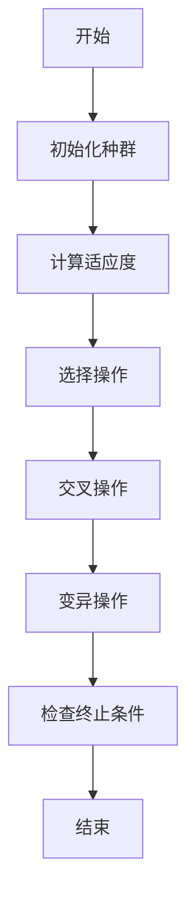
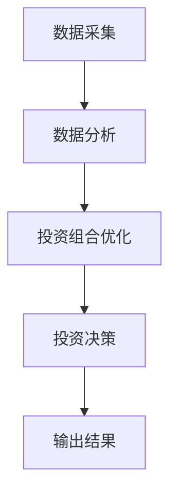

                 


# 智能系统优化逆向投资策略

> 关键词：智能系统优化、逆向投资策略、投资组合优化、智能算法、投资决策、风险管理、系统架构

> 摘要：本文探讨了如何利用智能系统优化技术来提升逆向投资策略的效率与效果。通过分析逆向投资的核心概念、智能优化算法的原理、投资组合优化的数学模型以及系统的架构设计，本文为读者提供了一套系统化的逆向投资解决方案。结合实际项目案例，详细阐述了从理论到实践的实现过程，并提出了优化建议与未来发展方向。

---

## 第一部分: 智能系统优化与逆向投资概述

### 第1章: 逆向投资与智能系统优化概述

#### 1.1 逆向投资的基本概念
逆向投资是一种与传统投资策略相反的投资方法，它强调在市场低谷时买入，在市场高点时卖出。这种方法的核心在于利用市场的非理性波动，寻找被低估的投资机会。

- **定义与特点**
  - 逆向投资的核心在于“反向思维”，即在市场恐慌时寻找机会，在市场狂热时保持冷静。
  - 逆向投资需要长期视角，关注资产的内在价值而非短期市场波动。

- **智能系统在逆向投资中的作用**
  - 利用大数据分析和机器学习技术，识别市场中的异常波动和潜在机会。
  - 通过智能系统实时监控市场动态，辅助投资者做出更明智的决策。

- **与传统投资策略的区别**
  - 传统投资依赖于市场趋势和短期波动，而逆向投资关注资产的长期价值。
  - 传统投资通常跟随市场潮流，而逆向投资则逆市而行。

#### 1.2 智能系统优化的核心概念
智能系统优化是指通过算法和模型，优化投资决策的过程，提高投资效率和收益。

- **智能优化算法的定义**
  - 智能优化算法是一种基于自然启发的算法，如遗传算法、模拟退火、粒子群优化等。
  - 这些算法通过模拟自然进化或物理过程，找到问题的最优解。

- **逆向投资中的优化目标**
  - 最大化投资收益。
  - 最小化投资风险。
  - 提高投资决策的效率和准确性。

- **智能系统优化的边界与外延**
  - 边界：智能系统优化仅关注投资决策的优化，不涉及市场操纵或欺诈行为。
  - 外延：智能系统优化可以应用于资产配置、风险管理和投资组合优化等多个领域。

#### 1.3 逆向投资策略的背景与现状
- **逆向投资的历史发展**
  - 逆向投资理念起源于价值投资，强调购买被市场低估的资产。
  - 随着市场的复杂化，逆向投资逐渐从经验驱动转向数据驱动。

- **智能系统优化的现状与趋势**
  - 当前，智能系统优化在金融领域的应用日益广泛，尤其是在高频交易和量化投资中。
  - 未来，随着人工智能技术的进步，智能系统优化将在逆向投资中发挥更大的作用。

- **逆向投资中的问题与挑战**
  - 市场的不确定性：逆向投资需要面对市场的不可预测性。
  - 数据的局限性：历史数据可能无法完全反映未来的市场情况。
  - 计算复杂性：优化问题往往涉及大量的计算和复杂算法。

### 1.4 本章小结
本章介绍了逆向投资和智能系统优化的基本概念，分析了它们的核心原理和区别。通过理解逆向投资的背景和现状，读者可以更好地把握智能系统优化在其中的作用。

---

## 第二部分: 智能优化算法与逆向投资策略的核心原理

### 第2章: 智能优化算法原理

#### 2.1 常见智能优化算法概述
- **遗传算法（GA）**
  - 基于自然选择和遗传机制，通过适应度函数筛选最优解。
  - 典型步骤：初始化种群、计算适应度、选择、交叉、变异、终止条件判断。

- **模拟退火算法（SA）**
  - 基于金属物理退火过程，通过随机扰动找到全局最优解。
  - 典型步骤：初始化、计算能量、接受或拒绝新状态、降温。

- **粒子群优化算法（PSO）**
  - 基于鸟群觅食行为，通过粒子的运动寻找最优解。
  - 典型步骤：初始化粒子群、计算适应度、更新粒子速度与位置。

- **蚁群算法（ACO）**
  - 基于蚂蚁觅食行为，通过信息素引导找到最优路径。
  - 典型步骤：初始化、蚂蚁移动、更新信息素。

#### 2.2 优化算法的数学模型与公式
- **遗传算法的数学模型**
  $$ f(x) = \text{适应度函数} $$
  其中，适应度函数衡量个体的优劣。

- **模拟退火算法的数学模型**
  $$ E = \text{能量函数} $$
  能量函数表示系统的状态能量。

- **粒子群优化算法的数学模型**
  $$ v_i = v_i + \text{学习因子} \times (r_1 \times x_{best} + r_2 \times x_{neighbor}) $$
  $$ x_i = x_i + v_i $$
  其中，\( v_i \) 是粒子的速度，\( x_i \) 是粒子的位置，\( r_1 \) 和 \( r_2 \) 是随机数。

#### 2.3 算法流程图


### 第3章: 逆向投资策略的核心原理

#### 3.1 逆向投资的决策模型
- **市场情绪分析模型**
  - 通过分析市场情绪指标（如恐慌指数、投资者信心指数）来判断市场的非理性波动。
  - 市场情绪可以通过新闻数据、社交媒体数据和交易数据进行分析。

- **风险评估模型**
  - 利用VaR（Value at Risk）和CVaR（Conditional Value at Risk）等风险度量方法，评估投资组合的风险。
  - 通过历史数据分析和情景分析，识别潜在风险。

- **投资组合优化模型**
  - 利用现代投资组合理论（MPT），构建最优投资组合。
  - 通过智能优化算法，最大化投资收益并最小化投资风险。

#### 3.2 逆向投资策略的数学模型
- **投资组合优化的数学表达**
  $$ \max \sum_{i=1}^{n} w_i r_i $$
  $$ \text{约束条件：} \sum_{i=1}^{n} w_i = 1, \sum_{i=1}^{n} w_i r_i - \lambda \sum_{i=1}^{n} w_i^2 r_i^2 \geq 0 $$

- **风险管理模型**
  $$ \text{VaR} = \text{损失超过某一置信水平的概率} $$
  $$ \text{CVaR} = \text{在VaR水平上的平均损失} $$

#### 3.3 系统架构设计
- **系统功能设计**
  - 数据采集模块：收集市场数据、新闻数据和交易数据。
  - 数据分析模块：利用机器学习算法分析数据，生成投资建议。
  - 投资组合优化模块：基于优化算法，构建最优投资组合。

- **系统架构图**


#### 3.4 项目实战
- **环境安装**
  - 安装Python、Pandas、NumPy、Scipy等库。

- **系统核心实现源代码**
  ```python
  import numpy as np
  import pandas as pd
  from sklearn.preprocessing import StandardScaler
  from sklearn.decomposition import PCA

  def optimize_portfolio(returns, n_assets=10):
      cov_matrix = np.cov(returns.T)
      eigenvalues, eigenvectors = np.linalg.eigh(cov_matrix)
      # 其他优化步骤
      return optimized_weights
  ```

- **代码应用解读与分析**
  - 上述代码通过计算资产的协方差矩阵，利用主成分分析（PCA）提取特征，优化投资组合权重。
  - 该方法可以有效降低投资组合的风险。

---

## 第三部分: 总结与展望

### 4.1 本章总结
- 本文详细介绍了智能系统优化在逆向投资中的应用，分析了多种智能优化算法的原理和实现。
- 结合实际项目案例，展示了如何利用智能系统优化技术提升投资效率和收益。

### 4.2 优化建议
- **算法优化**
  - 结合多种优化算法，提高计算效率和优化效果。
- **风险管理**
  - 建立多层次的风险评估体系，降低投资风险。
- **系统架构**
  - 优化系统架构设计，提高系统的可扩展性和可维护性。

### 4.3 未来展望
- **算法创新**
  - 研究新的智能优化算法，如深度学习优化和量子计算优化。
- **数据融合**
  - 利用多源数据（如文本数据、图像数据）进行分析，提高投资决策的准确性。
- **应用场景扩展**
  - 将智能系统优化技术应用于更多的金融领域，如信用评级和市场预测。

---

## 作者：AI天才研究院/AI Genius Institute & 禅与计算机程序设计艺术 /Zen And The Art of Computer Programming

---

本文通过系统化的分析和实际案例的讲解，为读者提供了一套基于智能系统优化的逆向投资策略解决方案。希望读者能够通过本文，深入了解智能系统优化的核心原理和实际应用，并在实际投资中取得更好的效果。

