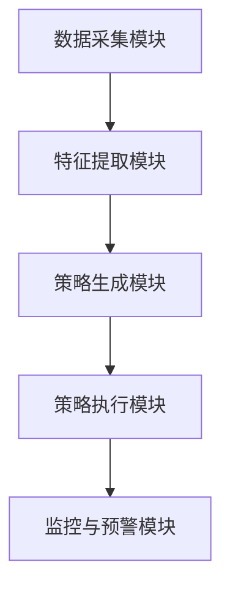

                 


# 智能系统优化逆向投资策略执行

## 关键词：
智能系统优化，逆向投资策略，投资策略执行，系统优化，算法优化，投资决策

## 摘要：
逆向投资策略是一种在市场低迷时期寻找低估资产的投资方法，而智能系统优化则通过数学建模和算法优化来提高投资决策的效率和准确性。本文将探讨如何将智能系统优化技术应用于逆向投资策略的执行中，分析其核心概念、算法原理、系统架构，并通过具体案例展示其实际应用。

---

## 第1章：智能系统优化与逆向投资策略背景

### 1.1 智能系统优化的背景与意义
智能系统优化是指通过数学建模和算法优化，帮助决策者在复杂环境中找到最优或近似最优的解决方案。随着金融市场的复杂化和数据量的增加，传统的投资策略难以应对市场的不确定性，因此智能系统优化在投资领域的应用变得尤为重要。

#### 1.1.1 传统投资策略的局限性
- 传统投资策略依赖于人工分析，容易受到主观判断的影响。
- 市场波动和突发事件难以预测，导致策略执行中的不确定性增加。
- 数据处理能力有限，难以应对海量数据的分析需求。

#### 1.1.2 智能系统优化的核心概念
- **数学建模**：通过建立数学模型描述问题，找到最优解。
- **算法优化**：利用优化算法（如遗传算法、模拟退火等）求解模型。
- **数据驱动**：基于大量历史数据，寻找潜在的规律和模式。

#### 1.1.3 逆向投资策略的特点
- **逆向思维**：在市场低迷时寻找低估资产，避免盲目跟随市场情绪。
- **长期视角**：注重长期价值，而非短期波动。
- **风险管理**：通过分散投资和严格的风险控制降低损失。

### 1.2 逆向投资策略的背景与应用
逆向投资策略起源于20世纪，最初由约翰·邓普顿等投资大师提出。随着量化投资的兴起，逆向策略逐渐被系统化和智能化，通过算法优化实现高效执行。

#### 1.2.1 逆向投资的起源与发展
- **起源**：20世纪初，邓普顿等人提出在市场恐慌时买入低估资产。
- **发展**：随着技术进步，逆向策略逐渐从经验驱动转向数据驱动。

#### 1.2.2 逆向投资在金融领域的应用
- **股票投资**：筛选被低估的股票，构建投资组合。
- **风险管理**：通过逆向策略降低市场波动的影响。
- **组合优化**：结合逆向策略和系统优化，实现最优资产配置。

---

## 第2章：问题背景与问题描述

### 2.1 智能系统优化的核心问题
智能系统优化在逆向投资中的核心问题是如何在复杂市场环境中找到最优的投资组合，同时考虑市场风险、流动性等因素。

#### 2.1.1 投资决策中的不确定性
- **市场风险**：市场价格波动对投资组合的影响。
- **信息不全**：数据缺失或不准确可能导致决策失误。
- **模型假设**：数学模型的假设可能与实际情况不符。

#### 2.1.2 优化目标与约束条件
- **目标**：最大化投资收益，最小化投资风险。
- **约束**：投资组合的流动性、风险承受能力、合规性等。

#### 2.1.3 系统优化的关键要素
- **数据来源**：历史价格、财务报表、市场情绪等。
- **模型选择**：回归分析、马科维茨均值-方差模型等。
- **算法选择**：遗传算法、模拟退火、粒子群优化等。

### 2.2 逆向投资策略的实现挑战
逆向投资策略的实现面临数据获取、模型构建和系统执行等多方面的挑战。

#### 2.2.1 数据获取与处理的难点
- **数据清洗**：处理缺失值、异常值。
- **数据特征提取**：选择有效的特征变量。
- **数据量与多样性**：数据量不足或缺乏多样性可能导致模型过拟合。

#### 2.2.2 策略模型的构建与验证
- **模型选择**：回归模型、机器学习模型等。
- **模型验证**：通过回测验证策略的有效性。
- **风险控制**：设置止损点、仓位控制等。

#### 2.2.3 系统执行中的风险控制
- **执行偏差**：避免交易成本和滑点影响。
- **动态调整**：根据市场变化实时调整投资组合。
- **监控与预警**：实时监控策略执行情况，及时发现异常。

---

## 第3章：核心概念与联系

### 3.1 智能系统优化的核心原理
智能系统优化通过建立数学模型和算法优化，帮助投资者找到最优的投资组合。

#### 3.1.1 优化算法的分类与特点
- **全局优化算法**：遗传算法、模拟退火。
- **局部优化算法**：梯度下降、牛顿法。
- **混合优化算法**：粒子群优化、蚁群算法。

#### 3.1.2 系统优化的目标函数与约束条件
- **目标函数**：最大化收益或最小化风险。
- **约束条件**：资金限制、资产类别限制等。

#### 3.1.3 优化过程中的收敛性分析
- **收敛速度**：算法找到最优解的速度。
- **收敛稳定性**：算法对初始条件的敏感性。

### 3.2 逆向投资策略的核心原理
逆向投资策略通过在市场低谷时买入低估资产，实现超额收益。

#### 3.2.1 逆向思维在投资决策中的应用
- **市场情绪分析**：利用市场恐慌指数等指标判断市场状态。
- **估值分析**：通过市盈率、市净率等指标寻找低估资产。
- **趋势反转识别**：识别市场趋势的变化点。

#### 3.2.2 逆向策略的数学模型
- **均值-方差模型**：优化投资组合的收益与风险。
- **马科维茨模型**：基于现代投资组合理论的优化方法。
- **回归分析**：预测资产价格走势。

#### 3.2.3 逆向策略与市场周期的关系
- **周期性**：逆向策略在市场周期中的应用效果。
- **阶段切换**：如何根据市场周期调整投资策略。

### 3.3 核心概念的对比与联系
通过对比分析，理解智能系统优化和逆向投资策略的异同。

#### 3.3.1 优化算法与逆向策略的对比分析
| **算法类型** | **优点** | **缺点** |
|--------------|----------|----------|
| 遗传算法     | 全局搜索能力强 | 计算成本高 |
| 模拟退火     | 能够找到全局最优 | 收敛速度慢 |
| 梯度下降     | 收敛速度快 | 易陷入局部最优 |

#### 3.3.2 不同优化算法在逆向策略中的应用
- **遗传算法**：用于优化投资组合的权重分配。
- **模拟退火**：用于解决复杂的非线性优化问题。
- **粒子群优化**：用于动态调整投资组合。

#### 3.3.3 逆向策略与传统投资策略的优劣对比
- **传统策略**：依赖经验判断，风险较高。
- **逆向策略**：利用市场低估，收益潜力大。
- **智能优化策略**：结合数据和算法，效率高且风险可控。

---

## 第4章：智能系统优化与逆向投资策略的结合

### 4.1 优化算法在逆向策略中的应用
通过优化算法实现逆向策略的系统化执行。

#### 4.1.1 遗传算法在逆向策略中的应用
- **编码**：将投资组合的权重编码为基因。
- **选择**：根据收益和风险指标选择优秀个体。
- **交叉与变异**：通过交叉和变异操作优化投资组合。

#### 4.1.2 模拟退火算法在逆向策略中的应用
- **降温过程**：逐步降低温度，减少随机性。
- **邻域搜索**：在邻域内寻找更优解。
- **全局最优**：避免陷入局部最优。

#### 4.1.3 强化学习在逆向策略中的应用
- **状态空间**：市场环境、资产价格等。
- **动作选择**：根据状态选择买入或卖出资产。
- **奖励机制**：根据投资收益给予奖励或惩罚。

### 4.2 逆向策略与系统优化的结合
通过系统优化实现逆向策略的高效执行。

#### 4.2.1 系统架构设计
- **数据采集模块**：获取市场数据。
- **特征提取模块**：提取有效特征。
- **策略生成模块**：生成投资策略。
- **执行模块**：根据策略执行交易。
- **监控模块**：实时监控策略执行情况。

#### 4.2.2 系统优化的关键步骤
1. **数据预处理**：清洗和标准化数据。
2. **模型训练**：利用历史数据训练优化算法。
3. **策略回测**：验证策略的有效性。
4. **策略优化**：根据回测结果调整参数。
5. **实时执行**：根据实时数据执行交易。

### 4.3 算法优化与逆向策略的结合案例
以虚拟股票交易系统为例，展示算法优化在逆向策略中的应用。

#### 4.3.1 环境配置
- **编程语言**：Python
- **库依赖**：Pandas、NumPy、Scipy、Matplotlib
- **数据来源**：Yahoo Finance API

#### 4.3.2 核心实现
```python
import numpy as np
import pandas as pd
from sklearn import preprocessing

# 数据预处理
data = pd.read_csv('stock_data.csv')
data = data.dropna()
scaler = preprocessing.StandardScaler()
scaled_data = scaler.fit_transform(data)

# 遗传算法实现
def fitness(individual):
    # 计算投资组合的收益和风险
    return -individual.dot(returns.mean(axis=1)) + individual.dot(returns.std(axis=1))

population = np.random.rand(100, len(scaled_data))
best = ga(population, fitness)
```

#### 4.3.3 实际案例分析
- **案例选择**：选择某只股票的历史数据，训练优化算法。
- **回测结果**：展示策略的收益和风险。
- **优化调整**：根据回测结果调整策略参数。

---

## 第5章：系统架构与项目实战

### 5.1 系统架构设计
设计一个智能系统优化逆向投资策略执行系统的架构。

#### 5.1.1 系统功能模块
- **数据采集模块**：实时获取市场数据。
- **特征提取模块**：提取资产的特征指标。
- **策略生成模块**：生成逆向投资策略。
- **策略执行模块**：根据策略执行交易。
- **监控与预警模块**：实时监控策略执行情况。

#### 5.1.2 系统架构图


### 5.2 项目实战

#### 5.2.1 环境配置
- **编程语言**：Python
- **库依赖**：Pandas、NumPy、Matplotlib、Plotly
- **数据来源**：Yahoo Finance API

#### 5.2.2 核心实现
```python
import numpy as np
import pandas as pd
from sklearn import preprocessing

# 数据预处理
data = pd.read_csv('stock_data.csv')
data = data.dropna()
scaler = preprocessing.StandardScaler()
scaled_data = scaler.fit_transform(data)

# 遗传算法实现
def fitness(individual):
    return -individual.dot(returns.mean(axis=1)) + individual.dot(returns.std(axis=1))

population = np.random.rand(100, len(scaled_data))
best = ga(population, fitness)
```

#### 5.2.3 代码解读与分析
- **数据预处理**：清洗数据并进行标准化。
- **遗传算法实现**：定义适应度函数，通过遗传算法优化投资组合。
- **策略回测**：根据优化后的投资组合进行回测，验证策略的有效性。

#### 5.2.4 实际案例分析
- **案例选择**：选择某只股票的历史数据，训练优化算法。
- **回测结果**：展示策略的收益和风险。
- **优化调整**：根据回测结果调整策略参数。

### 5.3 项目小结
通过项目实战，展示了智能系统优化在逆向投资策略执行中的应用，验证了算法的有效性。

---

## 第6章：最佳实践、小结、注意事项与拓展阅读

### 6.1 最佳实践
- **数据质量**：确保数据清洗和标准化。
- **模型选择**：根据问题选择合适的优化算法。
- **风险控制**：设置止损点和仓位控制。
- **持续优化**：定期回测和调整策略参数。

### 6.2 小结
本文详细探讨了智能系统优化与逆向投资策略执行的结合，通过理论分析和实际案例展示了其应用价值。

### 6.3 注意事项
- **数据依赖性**：数据的质量和完整性直接影响策略效果。
- **算法选择**：不同算法适用于不同问题，需谨慎选择。
- **市场变化**：策略需根据市场变化及时调整。

### 6.4 拓展阅读
- **相关书籍**：《Python算法教程》、《投资学原理》。
- **技术博客**：深入学习优化算法和投资策略的相关技术博客。

---

## 作者：AI天才研究院/AI Genius Institute & 禅与计算机程序设计艺术/Zen And The Art of Computer Programming

