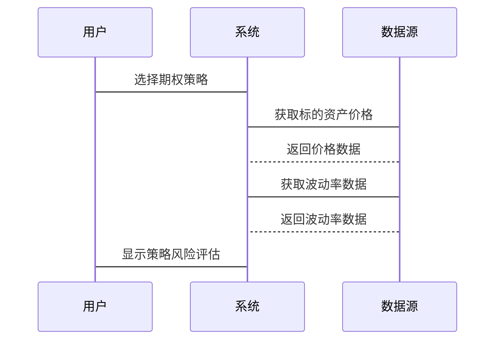

                 


# 期权策略：利用衍生品管理投资风险

> 关键词：期权，风险管理，Black-Scholes模型，投资策略，衍生品

> 摘要：本文深入探讨了期权作为金融衍生品的基本概念、定价模型、策略类型及其在风险管理中的应用。通过详细分析Black-Scholes模型的数学原理，结合实际案例，讲解了如何利用期权策略进行投资风险管理。文章还讨论了期权策略的风险指标和管理方法，为投资者提供了实用的指导。

---

# 第一部分: 期权策略基础

## 第1章: 期权的基本概念与类型

### 1.1 期权的定义与特点

期权是一种金融衍生品，赋予持有者在特定时间内以特定价格买入或卖出标的资产的权利，而非义务。与股票等其他金融工具相比，期权具有灵活性和杠杆效应，可以在多种市场条件下帮助投资者实现风险管理或收益增强。

**期权的特点：**
- **杠杆性**：较小的资金可以控制较大的标的资产。
- **非线性收益**：期权的收益不是线性的，而是基于标的资产价格的波动。
- **有限风险**：买入期权的最大损失为期权费，而卖出期权的风险理论上是无限的。

### 1.2 期权的主要类型

期权主要分为看涨期权和看跌期权，同时根据执行时间的不同，可以分为欧式期权和美式期权。

**表格对比：**

| 类型         | 看涨期权         | 看跌期权         |
|--------------|-----------------|-----------------|
| 定义         | 有权以行权价买入标的资产 | 有权以行权价卖出标的资产 |
| 风险         | 买入风险有限，卖出风险无限 | 买入风险有限，卖出风险有限 |
| 适用场景     | 投机或对冲上涨风险 | 投机或对冲下跌风险 |

### 1.3 期权市场的基本运作机制

期权市场的参与者包括投资者、做市商和经纪商。期权交易涉及标的资产的买卖，以及期权的报价和结算流程。

---

## 第2章: 期权定价基础

### 2.1 期权定价的基本原理

期权的价格由内在价值和时间价值组成。内在价值是期权到期时的执行价格与标的资产价格的差异，时间价值则反映了期权剩余期限内的波动可能性。

**公式：**
$$ C = C_{intrinsic} + C_{time} $$

### 2.2 Black-Scholes期权定价模型

Black-Scholes模型是期权定价的经典模型，适用于无分红的欧式期权。

**模型假设：**
- 标的资产价格服从几何布朗运动。
- 无风险利率和波动率是常数。
- 市场无摩擦，可以无限分割。

**公式推导：**
$$ C = S_0 N(d_1) - K e^{-rT} N(d_2) $$

其中：
$$ d_1 = \frac{\ln(S_0/K) + (r + \frac{\sigma^2}{2})T}{\sigma \sqrt{T}} $$
$$ d_2 = d_1 - \sigma \sqrt{T} $$

### 2.3 期权定价的数学公式

使用Black-Scholes模型计算期权价格时，需要考虑标的资产价格、执行价格、波动率、时间、无风险利率和股息率等因素。

---

## 第3章: 期权策略的基本类型

### 3.1 单一期权策略

- **买入认购期权**：支付期权费，获得以行权价买入标的资产的权利。
- **卖出认购期权**：收取期权费，承担以行权价卖出标的资产的义务。

### 3.2 期权组合策略

- **保护性认购组合**：买入标的资产和认购期权，锁定最低收益。
- **保护性认沽组合**：卖出标的资产和认沽期权，保护资产免受下跌影响。

### 3.3 价差策略

- **跨式策略**：同时买入看涨和看跌期权，收益与标的资产价格波动幅度相关。
- **宽跨式策略**：买入行权价较高的看涨和看跌期权，风险较低，收益较高。

---

## 第4章: 期权策略的风险管理

### 4.1 期权策略的风险指标

- **Delta**：期权价格对标的资产价格变化的敏感度。
- **Gamma**：Delta的变化率，衡量Delta的敏感性。
- **Vega**：期权价格对波动率变化的敏感度。
- **Theta**：期权价格随时间衰减的速度。

### 4.2 风险管理的原理与方法

通过调整期权组合的Delta、Gamma等指标，可以有效对冲市场波动带来的风险。

### 4.3 期权策略的风险评估与控制

- **风险分散**：通过组合不同类型的期权降低风险。
- **风险对冲**：利用其他金融工具对冲特定风险。

---

# 第二部分: 期权策略的高级应用

## 第5章: 期权策略的数学模型与系统架构

### 5.1 系统分析与架构设计方案

- **项目介绍**：构建一个基于期权策略的投资管理系统。
- **系统功能设计**：包括数据采集、策略执行、风险监控等功能。
- **系统架构设计**：采用分层架构，包括数据层、业务逻辑层和用户界面层。

### 5.2 系统接口设计

- **API接口**：与金融市场数据源对接，获取实时价格和波动率数据。
- **用户接口**：提供直观的期权策略选择和风险评估功能。

### 5.3 系统交互流程

通过Mermaid序列图展示系统交互流程：



---

## 第6章: 项目实战

### 6.1 环境安装

- **工具安装**：安装Python和相关金融分析库（如Pandas、NumPy、Plotly）。

### 6.2 系统核心实现源代码

```python
import numpy as np
from scipy.stats import norm

def black_scholes(S, K, r, T, sigma):
    d1 = (np.log(S/K) + (r + sigma**2/2)*T) / (sigma*np.sqrt(T))
    d2 = d1 - sigma*np.sqrt(T)
    C = S * norm.cdf(d1) - K * np.exp(-r*T) * norm.cdf(d2)
    return C

# 示例计算
S = 100
K = 105
r = 0.05
T = 1
sigma = 0.3

price = black_scholes(S, K, r, T, sigma)
print(f"期权价格为：{price}")
```

### 6.3 代码应用解读与分析

上述代码实现了Black-Scholes模型，计算了欧式期权的价格。通过调整参数，可以分析不同波动率和时间对期权价格的影响。

### 6.4 实际案例分析

假设当前标的资产价格为100元，执行价为105元，无风险利率为5%，时间到期为1年，波动率为30%。计算得到的期权价格为：

$$ C = 100 \times N(d_1) - 105 \times e^{-0.05 \times 1} \times N(d_2) $$

其中：
$$ d_1 = \frac{\ln(100/105) + (0.05 + 0.3^2/2) \times 1}{0.3 \times \sqrt{1}} = 0.8221 $$
$$ d_2 = 0.8221 - 0.3 = 0.5221 $$
$$ N(d_1) = 0.7939 $$
$$ N(d_2) = 0.6985 $$
$$ C = 100 \times 0.7939 - 105 \times e^{-0.05} \times 0.6985 \approx 79.39 - 69.85 \times 0.9512 \approx 79.39 - 66.42 = 12.97 $$

---

## 第7章: 总结与展望

### 7.1 总结

期权策略是管理投资风险的重要工具。通过合理选择和组合期权策略，投资者可以在不同市场条件下有效对冲风险或增强收益。

### 7.2 展望

未来，随着金融市场的不断发展，期权策略将更加多样化和复杂化。投资者需要结合市场情况和个人风险承受能力，灵活运用期权策略，实现投资目标。

---

# 作者：AI天才研究院 & 禅与计算机程序设计艺术

---

以上是《期权策略：利用衍生品管理投资风险》的完整目录和内容概要，涵盖了从基础到高级的期权策略分析，结合数学模型和实际案例，为读者提供了一套系统的学习和实践指南。

