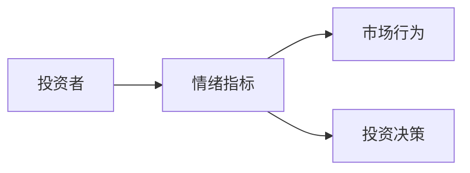
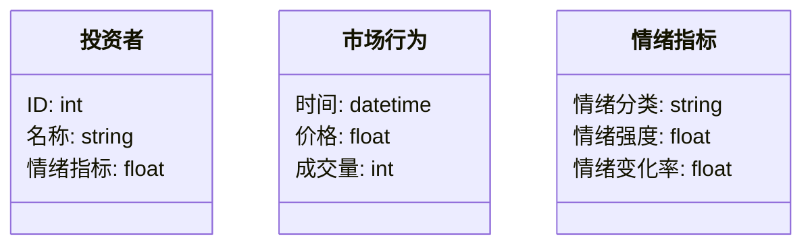
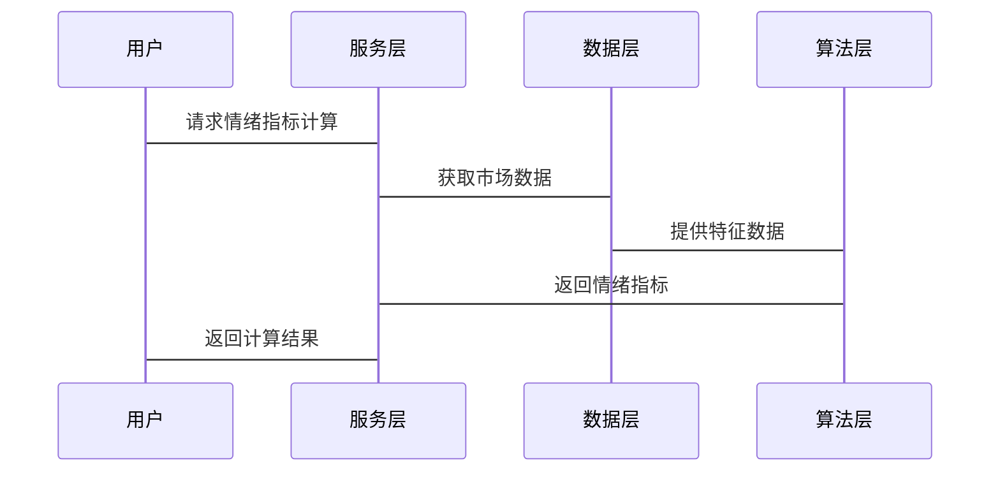

                 


# 本杰明·格雷厄姆的投资者情绪指标

## 关键词
- 投资者情绪指标
- 本杰明·格雷厄姆
- 市场情绪分析
- 投资决策
- 价值投资

## 摘要
本杰明·格雷厄姆是价值投资的鼻祖，他提出的投资者情绪指标为理解和预测市场行为提供了重要的理论基础。本文详细解析了投资者情绪指标的定义、核心概念、算法原理、系统架构以及实际应用。通过对比其他投资指标，分析了情绪指标在投资决策中的独特价值，并结合实际案例展示了其在投资组合管理中的应用。本文适合对投资分析和市场情绪感兴趣的读者阅读。

---

# 第一部分: 投资者情绪指标的背景与核心概念

## 第1章: 投资者情绪指标的定义与背景

### 1.1 投资者情绪指标的定义
#### 1.1.1 投资者情绪指标的核心概念
投资者情绪指标是衡量市场参与者情绪状态的量化工具，通过分析投资者的心理行为，预测市场趋势。其核心概念包括情绪分类、情绪强度和情绪变化率。

#### 1.1.2 情绪指标在投资决策中的作用
情绪指标能够帮助投资者识别市场的过度乐观或悲观情绪，避免盲目跟风，优化投资组合。

#### 1.1.3 情绪指标与市场周期的关系
市场周期中的情绪指标表现出周期性波动，例如在牛市中情绪指标偏高，在熊市中偏低。

### 1.2 投资者情绪指标的发展历史
#### 1.2.1 早期情绪指标的提出
情绪指标的概念可以追溯到20世纪初，本杰明·格雷厄姆在其投资理论中首次提出。

#### 1.2.2 格雷厄姆对情绪指标的贡献
格雷厄姆将情绪指标与价值投资相结合，强调情绪指标在评估市场合理性和潜在风险中的重要性。

#### 1.2.3 现代情绪指标的发展
随着大数据和机器学习技术的发展，现代情绪指标更加精准，应用场景也更加广泛。

### 1.3 情绪指标与市场行为分析
#### 1.3.1 情绪指标与投资者行为的关系
投资者情绪直接影响市场行为，例如过度买入或卖出行为会导致市场价格偏离基本面。

#### 1.3.2 情绪指标在市场波动中的表现
情绪指标可以通过统计分析，预测市场波动的强度和方向。

#### 1.3.3 情绪指标与市场泡沫的形成
情绪指标能够帮助识别市场泡沫的形成，避免投资者在市场顶部被套牢。

### 1.4 情绪指标与其他投资指标的对比
#### 1.4.1 情绪指标与技术指标的区别
情绪指标侧重于市场心理，技术指标侧重于价格和成交量的变化。

#### 1.4.2 情绪指标与基本面指标的结合
结合基本面和技术分析，情绪指标能够提供更全面的投资决策依据。

#### 1.4.3 情绪指标在投资组合中的应用
情绪指标可以帮助投资者优化资产配置，降低投资风险。

---

## 第2章: 投资者情绪指标的核心概念与原理

### 2.1 情绪指标的分类与特征
#### 2.1.1 不同类型的情绪指标
情绪指标可以分为市场情绪指数、投资者信心指数和市场波动指数等。

#### 2.1.2 情绪指标的属性特征对比
| 情绪指标 | 特性         | 优点                   | 缺点                   |
|----------|--------------|------------------------|------------------------|
| 市场情绪指数 | 综合性       | 全面反映市场情绪       | 数据复杂，难以快速分析 |
| 投资者信心指数 | 灵活性       | 灵敏反映市场变化       | 易受短期因素影响       |
| 市场波动指数 | 稳定性       | 抗干扰能力强           | 反应滞后             |

#### 2.1.3 情绪指标的核心要素组成
情绪指标通常包括投资者情绪分类、情绪强度和情绪变化率三个核心要素。

### 2.2 情绪指标的实体关系架构
#### 2.2.1 实体关系图（Mermaid）


### 2.3 情绪指标的计算方法
#### 2.3.1 基本计算公式
$$
\text{情绪指标} = \frac{\text{市场参与者情绪总和}}{\text{市场参与者总数}}
$$

#### 2.3.2 情绪指标的权重分配
$$
\text{权重} = \frac{\text{情绪指标的重要性}}{\sum \text{所有指标的重要性}}
$$

#### 2.3.3 情绪指标的动态调整
动态调整情绪指标的权重，以反映市场的实时变化。

---

## 第3章: 投资者情绪指标的算法原理

### 3.1 情绪分类算法
#### 3.1.1 基于机器学习的情绪分类
使用分类算法对投资者情绪进行分类，例如决策树、随机森林和神经网络。

#### 3.1.2 常见的情绪分类算法对比
| 算法名称   | 优点                   | 缺点                   |
|------------|------------------------|------------------------|
| 决策树     | 易解释                 | 易受噪声影响           |
| 随机森林   | 高准确性               | 计算复杂               |
| 神经网络   | 高精度                 | 需大量数据             |

#### 3.1.3 情绪分类的数学模型
$$
P(\text{情绪类别} | \text{特征}) = \frac{P(\text{特征} | \text{情绪类别}) \cdot P(\text{情绪类别})}{\sum P(\text{特征} | \text{情绪类别}) \cdot P(\text{情绪类别})}
$$

### 3.2 情绪指标的计算流程
#### 3.2.1 数据预处理
清洗数据，去除异常值，标准化数据。

#### 3.2.2 特征提取
提取与情绪相关的特征，例如成交量、价格波动和投资者行为数据。

#### 3.2.3 情绪指标计算
根据特征数据计算情绪指标，例如使用均值、中位数或加权平均方法。

### 3.3 情绪指标的验证与优化
#### 3.3.1 算法验证方法
使用交叉验证和回测分析验证算法的准确性。

#### 3.3.2 情绪指标的优化策略
通过调整算法参数和优化数据处理流程，提高情绪指标的计算效率和准确性。

#### 3.3.3 算法性能评估
评估算法的准确率、召回率和F1分数，确保算法性能稳定。

---

## 第4章: 投资者情绪指标的系统分析与架构设计

### 4.1 问题场景介绍
#### 4.1.1 投资者情绪指标的应用场景
在股票交易、基金投资和市场预测中广泛应用。

#### 4.1.2 系统目标与功能需求
系统目标是实时计算和分析情绪指标，功能需求包括数据采集、情绪指标计算和投资决策支持。

#### 4.1.3 系统边界与外延
系统边界包括数据源、计算模块和用户界面，外延包括与其他投资系统的集成。

### 4.2 系统功能设计
#### 4.2.1 领域模型（Mermaid）


### 4.3 系统架构设计
#### 4.3.1 系统架构图（Mermaid）


#### 4.3.2 系统接口设计
定义API接口，实现数据获取和情绪指标计算功能。

#### 4.3.3 系统交互流程（Mermaid）


---

## 第5章: 投资者情绪指标的项目实战

### 5.1 环境安装与配置
安装必要的Python库，例如Pandas、NumPy和Scikit-learn。

### 5.2 系统核心实现
#### 5.2.1 核心代码
```python
import pandas as pd
from sklearn.tree import DecisionTreeClassifier

# 数据加载
data = pd.read_csv('market_data.csv')

# 特征提取
features = data[['成交量', '价格波动', '投资者行为']]
target = data['情绪分类']

# 模型训练
model = DecisionTreeClassifier()
model.fit(features, target)

# 情绪指标计算
def calculate_emotion_index(features):
    return model.predict(features)
```

#### 5.2.2 代码解读
加载数据，提取特征，训练模型，计算情绪指标。

### 5.3 实际案例分析
#### 5.3.1 案例分析
分析某段时间的市场数据，计算情绪指标，预测市场趋势。

#### 5.3.2 案例解读
解读分析结果，评估情绪指标的有效性和准确性。

### 5.4 项目小结
总结项目成果，提出改进建议，展望未来的研究方向。

---

## 第6章: 投资者情绪指标的最佳实践与总结

### 6.1 最佳实践
#### 6.1.1 情绪指标的应用技巧
结合多种指标，灵活调整投资策略。

#### 6.1.2 情绪指标的局限性
情绪指标无法完全预测市场波动，需与其他指标结合使用。

### 6.2 小结
投资者情绪指标是价值投资的重要工具，能够帮助投资者更好地理解市场行为，优化投资决策。

### 6.3 注意事项
情绪指标的应用需谨慎，避免过度依赖情绪指标，忽略基本面分析。

### 6.4 拓展阅读
推荐相关书籍和文章，深入学习投资者情绪分析和价值投资理论。

---

## 作者：AI天才研究院/AI Genius Institute & 禅与计算机程序设计艺术/Zen And The Art of Computer Programming

---

以上是《本杰明·格雷厄姆的投资者情绪指标》的完整目录大纲，内容涵盖从理论到实践的各个方面，结合技术分析和实际案例，帮助读者深入理解投资者情绪指标的核心原理和应用方法。

