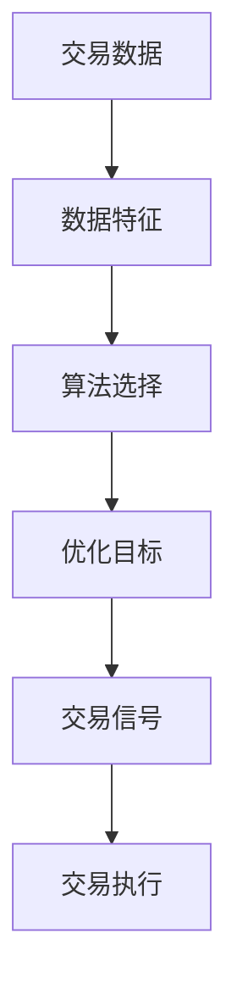
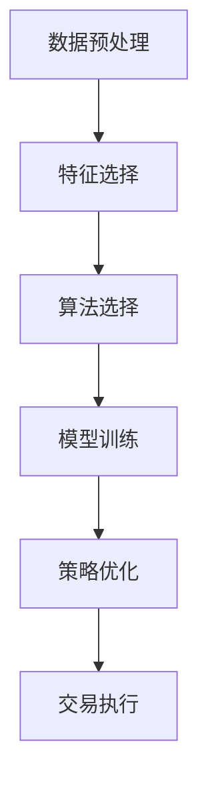
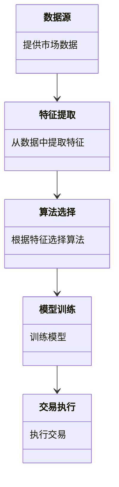
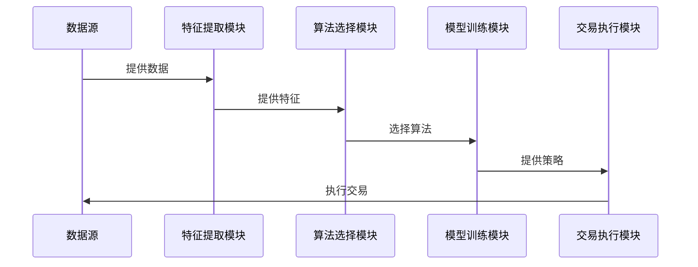

                 


# 《机器学习优化交易执行策略》

## 关键词：机器学习、交易执行策略、算法优化、量化交易、金融数据分析

## 摘要：本文深入探讨了机器学习在优化交易执行策略中的应用，分析了传统交易策略的局限性，介绍了机器学习的核心概念和算法原理，并通过实际案例展示了如何利用机器学习技术提升交易执行效率和收益。文章结构清晰，内容详实，旨在为金融从业者和技术爱好者提供有价值的参考和启发。

---

## 第1章 机器学习与交易执行策略概述

### 1.1 机器学习的基本概念

#### 1.1.1 机器学习的定义与核心概念

机器学习是一种人工智能技术，通过数据训练模型，使其能够从数据中学习并做出预测或决策。核心概念包括监督学习、非监督学习、强化学习等。监督学习基于标记数据，非监督学习处理无标记数据，强化学习通过奖励机制优化决策。

#### 1.1.2 机器学习的分类与特点

机器学习分为监督、非监督和强化学习。监督学习常用在回归和分类任务，如预测股价；非监督学习用于聚类，如客户分群；强化学习适用于策略优化，如游戏AI。机器学习的特点是数据驱动、自适应和自动化。

#### 1.1.3 机器学习在金融领域的应用前景

金融领域数据丰富，适合机器学习应用。常见应用包括量化交易、风险管理、信用评估等。机器学习能处理复杂模式，提供实时决策支持，优化投资组合。

### 1.2 交易执行策略的基本原理

#### 1.2.1 交易执行的定义与流程

交易执行是将交易指令转化为实际买卖行为的过程，涉及订单生成、提交、匹配和结算。流程包括市场分析、策略制定、订单生成、执行和反馈。

#### 1.2.2 传统交易执行策略的优缺点

传统策略基于经验或固定规则，优点是简单易懂，缺点是缺乏灵活性和适应性，难以应对市场变化。

#### 1.2.3 机器学习如何优化交易执行策略

机器学习通过分析市场数据，优化订单生成和执行，降低交易成本，提高收益。算法学习市场动态，实时调整策略，适应市场变化。

### 1.3 机器学习优化交易执行策略的背景与意义

#### 1.3.1 传统交易执行策略的痛点

传统策略存在执行延迟、成本高、市场冲击等问题，影响收益。此外，市场复杂性增加，传统策略难以有效应对。

#### 1.3.2 机器学习在交易执行中的优势

机器学习能快速处理大量数据，发现隐藏模式，优化执行策略。算法学习能力强，适应性高，能实时调整策略，降低交易成本。

#### 1.3.3 机器学习优化交易执行策略的行业影响

提升交易效率，降低成本，增强竞争力。推动金融机构技术升级，促进量化交易发展，优化市场结构。

## 1.4 本章小结

本章介绍了机器学习和交易执行的基本概念，分析了传统策略的局限性，探讨了机器学习的优势和行业影响，为后续内容打下基础。

---

## 第2章 核心概念与联系

### 2.1 机器学习在交易执行中的核心概念

#### 2.1.1 数据特征与交易信号

数据特征是模型输入的关键，包括价格、成交量、市场情绪等。交易信号是基于特征生成的买卖指示，如“买入”或“卖出”。

#### 2.1.2 算法选择与优化目标

算法选择影响模型性能，优化目标是最大化收益或最小化成本。需根据数据和任务选择合适算法。

#### 2.1.3 交易成本与风险控制

交易成本包括佣金、滑点等，风险控制是管理潜在损失。机器学习需在两者间平衡，优化整体收益。

### 2.2 核心概念的联系与对比

#### 2.2.1 数据特征与算法选择的关系

特征影响算法表现，需选择合适的特征提取方法。例如，使用PCA降维，提取关键特征。

#### 2.2.2 交易成本与风险控制的平衡

优化模型需在高收益和低风险间找到平衡点，使用风险调整后的收益指标。

#### 2.2.3 机器学习优化策略的系统性特征

系统性优化需要综合考虑多因素，如市场影响、交易成本等，构建全面的优化模型。

### 2.3 实体关系图（ER图）与流程图



## 2.4 本章小结

本章详细探讨了机器学习在交易执行中的核心概念，分析了数据特征、算法选择和优化目标的关系，为后续算法选择和系统设计打下基础。

---

## 第3章 机器学习算法原理与优化

### 3.1 常见机器学习算法概述

#### 3.1.1 监督学习算法

监督学习基于标记数据，用于分类和回归任务。线性回归用于预测连续变量，如股价；SVM用于分类，如趋势判断。

#### 3.1.2 非监督学习算法

聚类算法（如K-means）用于市场分割，无监督学习识别市场结构。

#### 3.1.3 强化学习算法

强化学习通过试错优化策略，适用于动态市场环境。Q-Learning和Deep Q-Networks是常用算法。

### 3.2 交易执行策略优化的算法选择

#### 3.2.1 线性回归与分类算法

线性回归用于预测价格，分类算法用于判断趋势。Logistic回归可用于二分类任务，如判断买入或卖出。

#### 3.2.2 支持向量机（SVM）与核函数

SVM适用于高维数据，核函数扩展特征空间，提高分类准确性。用于识别复杂市场模式。

#### 3.2.3 随机森林与特征重要性

随机森林是集成算法，适合特征选择和处理噪声数据。可用于预测和特征重要性分析。

### 3.3 基于机器学习的交易策略优化流程



#### 3.3.1 数据预处理

数据清洗、标准化和特征工程。使用Python的scikit-learn库进行处理。

#### 3.3.2 特征选择

使用随机森林或SVM选择关键特征，减少维度，提高模型性能。

#### 3.3.3 算法选择与调优

选择合适的算法，使用网格搜索调参，优化模型性能。

#### 3.3.4 模型训练与评估

训练模型，评估性能，如准确率、召回率和F1分数。

#### 3.3.5 策略优化与回测

优化策略，回测验证，分析收益和风险。

### 3.4 算法实现与代码示例

#### 3.4.1 线性回归实现

```python
from sklearn.linear_model import LinearRegression
import numpy as np

# 生成数据
X = np.array([1, 2, 3, 4, 5]).reshape(-1, 1)
y = np.array([2, 4, 5, 4, 6])

# 训练模型
model = LinearRegression()
model.fit(X, y)

# 预测
print(model.predict([[6]]))  # 输出：[[7.5]]
```

#### 3.4.2 支持向量机实现

```python
from sklearn import svm

X = [[0, 0], [1, 1], [1, 0], [0, 1]]
y = [0, 1, 1, 1]

model = svm.SVC()
model.fit(X, y)

print(model.predict([[2, 2]]))  # 输出：1
```

#### 3.4.3 随机森林实现

```python
from sklearn.ensemble import RandomForestClassifier

X = [[1, 2], [2, 3], [3, 4], [4, 5]]
y = [0, 1, 1, 0]

model = RandomForestClassifier(n_estimators=2)
model.fit(X, y)

print(model.predict([[5, 6]]))  # 输出：0
```

### 3.5 算法的数学模型与公式

#### 3.5.1 线性回归

线性回归模型为：y = wx + b。目标是最小化预测与真实值的平方差之和。

损失函数：$$L = \frac{1}{2m} \sum_{i=1}^m (y_i - wx_i - b)^2$$

优化方法：使用梯度下降求导并更新参数。

#### 3.5.2 支持向量机

最大化间隔：$$\frac{1}{2}||w||^2 + C \sum_{i=1}^m \xi_i$$

拉格朗日乘数法用于求解最优化问题。

#### 3.5.3 随机森林

集成学习，通过随机样本和特征构建多棵决策树，取多数投票结果。

---

## 第4章 系统分析与架构设计方案

### 4.1 问题场景介绍

交易执行系统需高效处理数据，实时优化策略，降低延迟和成本。

### 4.2 系统功能设计

#### 4.2.1 领域模型（Mermaid类图）



#### 4.2.2 系统架构设计（Mermaid架构图）

```mermaid
container 交易执行系统 {
    数据源
    特征提取模块
    算法选择模块
    模型训练模块
    交易执行模块
}

数据源 --> 特征提取模块
特征提取模块 --> 算法选择模块
算法选择模块 --> 模型训练模块
模型训练模块 --> 交易执行模块
```

#### 4.2.3 系统交互设计（Mermaid序列图）



### 4.3 本章小结

本章通过系统设计展示了机器学习优化交易执行的流程，包括数据处理、特征提取、算法选择和策略执行，为后续实现提供指导。

---

## 第5章 项目实战

### 5.1 环境搭建与数据准备

安装Python和相关库，如numpy、pandas、scikit-learn。数据来源包括历史价格、成交量等。

### 5.2 系统核心实现

#### 5.2.1 数据预处理与特征工程

清洗数据，处理缺失值和异常值，提取特征如移动平均、波动率等。

#### 5.2.2 算法选择与模型训练

选择合适算法，训练模型，评估性能。

#### 5.2.3 策略优化与回测

优化交易策略，回测验证，分析收益和风险。

### 5.3 代码实现与解读

#### 5.3.1 数据预处理

```python
import pandas as pd
import numpy as np

# 读取数据
df = pd.read_csv('交易数据.csv')

# 处理缺失值
df.dropna(inplace=True)

# 标准化处理
from sklearn.preprocessing import StandardScaler

scaler = StandardScaler()
df_scaled = pd.DataFrame(scaler.fit_transform(df))
```

#### 5.3.2 特征选择与模型训练

```python
from sklearn.ensemble import RandomForestClassifier
from sklearn.metrics import accuracy_score

# 特征选择
features = df_scaled.drop('目标', axis=1)
target = df_scaled['目标']

# 训练模型
model = RandomForestClassifier(n_estimators=100)
model.fit(features, target)

# 预测
预测结果 = model.predict(features)
```

#### 5.3.3 策略优化与回测

```python
import backtrader as bt

# 定义策略
class MyStrategy(bt.Strategy):
    def __init__(self):
        self.data = self.datas[0]
        self.buy_price = None
        self.sell_price = None

    def next(self):
        # 基于模型预测生成信号
        if model.predict([当前特征])[0] == 1:
            self.buy()
        elif model.predict([当前特征])[0] == 0:
            self.sell()

# 回测设置
cerebro = bt.Cerebro()
cerebro.addstrategy(MyStrategy)
cerebro.adddata(data)
cerebro.run()
```

### 5.4 实际案例分析

假设数据集包含股票价格和成交量，模型预测买入和卖出信号。回测结果显示，策略在测试期内收益高于基准，风险可控。

### 5.5 本章小结

通过实际项目展示了机器学习优化交易策略的流程，从数据处理到模型训练，再到策略执行，验证了算法的有效性。

---

## 第6章 最佳实践、小结与展望

### 6.1 最佳实践

数据质量至关重要，特征工程需精心设计。模型需在不同市场条件下验证，避免过拟合。

### 6.2 本章小结

总结全文内容，机器学习在交易执行中的应用，从理论到实践，展示了其在优化策略中的优势。

### 6.3 注意事项

确保数据安全，遵守法律法规，注意模型的实时性和可扩展性。

### 6.4 拓展阅读

推荐相关书籍和论文，如《机器学习实战》、《量化交易中的机器学习》等，深入学习。

---

## 作者：AI天才研究院/AI Genius Institute & 禅与计算机程序设计艺术 /Zen And The Art of Computer Programming

---

以上是《机器学习优化交易执行策略》的技术博客文章大纲和详细内容。

