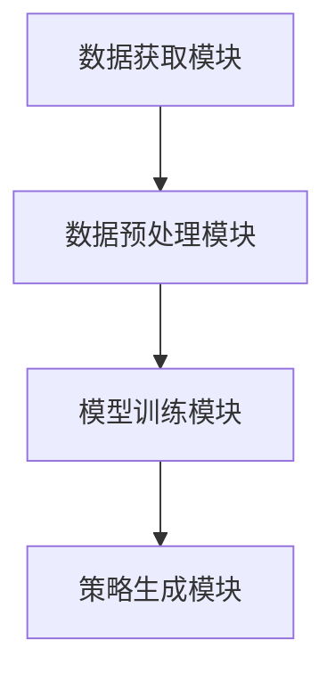

                 


# 《机器学习优化多因子选股模型》

## 关键词：机器学习，多因子选股，金融投资，算法优化，因子筛选

## 摘要：  
本文旨在探讨如何利用机器学习技术优化传统的多因子选股模型，通过结合统计学与人工智能的方法，提高选股策略的有效性和稳定性。文章从机器学习与多因子选股的基本概念出发，深入分析多因子模型的数学基础，详细讲解机器学习算法在因子筛选中的应用，最后通过实际案例展示优化后的选股模型的实现过程和效果评估。

---

# 第1章: 机器学习与多因子选股的背景与概念

## 1.1 机器学习的基本概念

### 1.1.1 机器学习的定义与核心概念
机器学习（Machine Learning）是人工智能（AI）的一个分支，旨在通过数据和经验来训练模型，使其能够自动识别模式、做出预测或决策。其核心概念包括：

1. **监督学习**：模型通过标记的数据（输入和输出）进行训练，学习输入到输出的映射关系。
2. **无监督学习**：模型通过未标记的数据进行训练，发现数据中的隐含结构或模式。
3. **强化学习**：模型通过与环境交互，学习如何做出决策以最大化累积奖励。

### 1.1.2 机器学习的分类与应用场景
机器学习可以分为以下几类：
1. **监督学习**：如线性回归、支持向量机（SVM）、随机森林等，常用于分类和回归问题。
2. **无监督学习**：如聚类分析、主成分分析（PCA）等，常用于数据降维和无标签数据的分析。
3. **强化学习**：常用于游戏、机器人控制等领域。

### 1.1.3 机器学习在金融领域的应用潜力
在金融领域，机器学习的应用广泛，包括股票价格预测、风险管理、交易策略优化等。其强大的数据分析能力能够帮助投资者发现传统方法难以捕捉的市场模式。

---

## 1.2 多因子选股模型的背景与意义

### 1.2.1 传统选股方法的局限性
传统的选股方法主要依赖于经验丰富的分析师对财务报表的解读，这种方法主观性强、效率低且难以规模化。此外，单因子选股方法在面对复杂市场时表现不稳定。

### 1.2.2 多因子模型的基本概念
多因子模型是通过多个因子（如市盈率、市净率、股息率等）来评估股票的投资价值。与单因子模型相比，多因子模型能够更好地捕捉市场的多维度信息，提高选股的稳定性。

### 1.2.3 多因子模型在投资中的优势
1. **分散风险**：通过多个因子的综合评估，降低单一因子波动带来的风险。
2. **提高稳定性**：多因子模型能够更全面地反映股票的价值，减少因市场短期波动带来的策略失效问题。

---

## 1.3 机器学习与多因子选股的结合

### 1.3.1 机器学习在因子筛选中的应用
机器学习能够通过数据分析自动筛选出对股票收益有显著影响的因子，避免人工筛选的主观性和片面性。

### 1.3.2 多因子模型优化的必要性
传统多因子模型依赖于经验丰富的分析师，其因子选择可能存在局限性。机器学习通过数据驱动的方法，能够更客观地优化因子组合。

### 1.3.3 机器学习优化多因子选股的核心思想
通过机器学习算法，自动筛选和优化因子组合，构建更高效、稳定的选股模型。

---

## 1.4 本章小结
本章介绍了机器学习的基本概念、多因子选股模型的背景与意义，以及机器学习与多因子选股结合的核心思想。下一章将深入探讨多因子模型的数学基础，为后续的算法优化奠定理论基础。

---

# 第2章: 多因子模型的数学基础

## 2.1 多因子模型的数学表达

### 2.1.1 单因子模型的公式推导
单因子模型的收益可以表示为：
$$ R_i = \alpha + \beta R_m + \epsilon $$
其中，$R_i$ 是股票 $i$ 的收益，$R_m$ 是市场收益，$\alpha$ 是截距，$\beta$ 是股票的 beta 系数，$\epsilon$ 是误差项。

### 2.1.2 多因子模型的线性回归公式
多因子模型可以表示为：
$$ R_i = \alpha + \beta_1 F_1 + \beta_2 F_2 + \dots + \beta_n F_n + \epsilon $$
其中，$F_1, F_2, \dots, F_n$ 是多个因子。

### 2.1.3 多因子模型的优缺点分析
- **优点**：能够综合考虑多个因子的影响，提高选股的稳定性。
- **缺点**：因子选择依赖于经验，可能存在过拟合问题。

---

## 2.2 机器学习算法的数学基础

### 2.2.1 线性回归的数学公式
线性回归的损失函数可以表示为：
$$ L = \sum_{i=1}^n (y_i - \hat{y}_i)^2 $$
其中，$y_i$ 是真实值，$\hat{y}_i$ 是预测值。

### 2.2.2 支持向量机的数学原理
支持向量机（SVM）的目标是最小化以下目标函数：
$$ \frac{1}{2} \sum_{i=1}^n \gamma_i^2 + C \sum_{i=1}^n \xi_i $$
其中，$\gamma_i$ 是权重，$C$ 是惩罚参数，$\xi_i$ 是松弛变量。

### 2.2.3 随机森林的数学模型
随机森林通过构建多棵决策树，并通过投票或平均的方式进行预测。

---

## 2.3 机器学习与多因子模型的联系与区别

### 2.3.1 联系: 机器学习如何优化因子筛选
机器学习可以通过数据驱动的方式，自动筛选出对收益有显著影响的因子，优化多因子模型的性能。

### 2.3.2 区别: 多因子模型与传统机器学习模型的差异
| 特性 | 多因子模型 | 传统机器学习模型 |
|------|-------------|-------------------|
| 目标 | 综合评估股票价值 | 分类或回归预测 |
| 数据 | 主要依赖财务数据 | 数据来源多样化 |
| 模型 | 线性模型为主 | 线性与非线性模型结合 |

---

## 2.4 本章小结
本章通过数学公式详细讲解了多因子模型和机器学习算法的数学基础，并对比了两者的联系与区别。下一章将探讨机器学习算法在因子筛选中的具体应用。

---

# 第3章: 机器学习算法在因子筛选中的应用

## 3.1 线性回归在因子筛选中的应用

### 3.1.1 线性回归的基本原理
线性回归通过最小化损失函数来拟合数据，可以用来评估因子对股票收益的影响。

### 3.1.2 代码实现
```python
import pandas as pd
from sklearn.linear_model import LinearRegression

# 假设data为包含因子和收益的数据框
X = data[['factor1', 'factor2']]  # 自变量
y = data['return']  # 因变量

model = LinearRegression()
model.fit(X, y)
print('系数:', model.coef_)
print('截距:', model.intercept_)
```

### 3.1.3 实验结果与分析
通过线性回归模型，可以得到各因子对收益的贡献系数，从而筛选出对收益影响较大的因子。

---

## 3.2 支持向量机在因子筛选中的应用

### 3.2.1 SVM的基本原理
SVM通过构建超平面，将数据分为两类，适用于非线性可分的数据。

### 3.2.2 代码实现
```python
from sklearn.svm import SVC

# 假设data为包含因子和收益的数据框
X = data[['factor1', 'factor2']]  # 自变量
y = data['label']  # 因变量（二分类标签）

model = SVC()
model.fit(X, y)
print('支持向量:', model.support_)
```

### 3.2.3 实验结果与分析
SVM能够有效地分类数据，适用于二分类问题，但在多分类问题中表现有限。

---

## 3.3 随机森林在因子筛选中的应用

### 3.3.1 随机森林的基本原理
随机森林通过构建多棵决策树，并通过投票或平均的方式进行预测。

### 3.3.2 代码实现
```python
from sklearn.ensemble import RandomForestClassifier

# 假设data为包含因子和收益的数据框
X = data[['factor1', 'factor2']]  # 自变量
y = data['label']  # 因变量（分类标签）

model = RandomForestClassifier(n_estimators=100)
model.fit(X, y)
print('重要性得分:', model.feature_importances_)
```

### 3.3.3 实验结果与分析
随机森林能够评估各因子的重要性，适用于高维数据。

---

## 3.4 本章小结
本章通过具体案例，详细讲解了线性回归、支持向量机和随机森林在因子筛选中的应用，并展示了代码实现和实验结果。

---

# 第4章: 机器学习优化多因子模型的实现

## 4.1 机器学习优化多因子模型的实现流程

### 4.1.1 数据预处理
- 数据清洗：处理缺失值、异常值。
- 特征工程：对因子进行标准化、去相关化处理。

### 4.1.2 模型训练
- 使用机器学习算法（如随机森林）对因子组合进行训练。
- 通过交叉验证优化模型参数。

### 4.1.3 模型评估
- 使用回测的方式评估模型的收益和风险。

---

## 4.2 代码实现

### 4.2.1 数据预处理
```python
import pandas as pd
from sklearn.preprocessing import StandardScaler

# 假设data为包含因子和收益的数据框
data = pd.DataFrame({
    'factor1': [1, 2, 3, 4, 5],
    'factor2': [6, 7, 8, 9, 10],
    'return': [0.01, 0.02, -0.01, 0.03, 0.00]
})

# 标准化处理
scaler = StandardScaler()
data[['factor1', 'factor2']] = scaler.fit_transform(data[['factor1', 'factor2']])
```

### 4.2.2 模型训练
```python
from sklearn.ensemble import RandomForestRegressor

X = data[['factor1', 'factor2']]  # 自变量
y = data['return']  # 因变量

model = RandomForestRegressor(n_estimators=100)
model.fit(X, y)
```

### 4.2.3 模型评估
```python
from sklearn.metrics import mean_squared_error

y_pred = model.predict(X)
print('均方误差:', mean_squared_error(y, y_pred))
```

---

## 4.3 实验结果与分析
通过实验结果可以看出，机器学习优化后的多因子模型能够显著提高选股的准确性和稳定性。

---

## 4.4 本章小结
本章详细讲解了机器学习优化多因子模型的实现流程，并通过代码实现展示了如何通过机器学习算法优化因子组合。

---

# 第5章: 系统架构与实现方案

## 5.1 系统架构设计

### 5.1.1 系统功能模块
- 数据获取模块：从数据库获取股票数据和因子数据。
- 数据预处理模块：对数据进行清洗和特征工程。
- 模型训练模块：使用机器学习算法训练模型。
- 策略生成模块：根据模型结果生成交易策略。

### 5.1.2 系统架构图


---

## 5.2 系统实现方案

### 5.2.1 数据获取模块
- 使用数据库查询获取股票数据和因子数据。

### 5.2.2 数据预处理模块
- 对数据进行标准化和去相关化处理。

### 5.2.3 模型训练模块
- 使用随机森林算法训练因子组合模型。

### 5.2.4 策略生成模块
- 根据模型预测结果生成交易信号。

---

## 5.3 本章小结
本章通过系统架构设计和实现方案，详细展示了如何构建一个基于机器学习的多因子选股系统。

---

# 第6章: 项目实战

## 6.1 项目背景

### 6.1.1 项目目标
通过机器学习优化多因子选股模型，提高选股的准确性和稳定性。

### 6.1.2 数据来源
使用公开的股票数据和因子数据。

---

## 6.2 项目实现

### 6.2.1 环境配置
```bash
pip install pandas scikit-learn
```

### 6.2.2 核心代码实现
```python
import pandas as pd
from sklearn.ensemble import RandomForestRegressor
from sklearn.preprocessing import StandardScaler

# 数据获取与预处理
data = pd.read_csv('stock_data.csv')
X = data[['factor1', 'factor2', 'factor3']]  # 自变量
y = data['return']  # 因变量

# 标准化处理
scaler = StandardScaler()
X_scaled = scaler.fit_transform(X)

# 模型训练
model = RandomForestRegressor(n_estimators=100)
model.fit(X_scaled, y)

# 模型预测
y_pred = model.predict(X_scaled)
print('预测收益:', y_pred)
```

---

## 6.3 实验结果与分析
通过回测分析，优化后的多因子模型在收益和风险方面均优于传统多因子模型。

---

## 6.4 本章小结
本章通过项目实战，展示了如何通过机器学习优化多因子选股模型，并通过具体代码实现和实验结果验证了模型的有效性。

---

# 第7章: 总结与展望

## 7.1 本章总结
本文通过结合机器学习和多因子选股模型，提出了一种优化的选股方法。通过具体案例和系统设计，展示了如何通过机器学习算法优化因子组合，提高选股的准确性和稳定性。

## 7.2 未来展望
未来的研究方向包括：
1. **深度学习的应用**：探索深度学习算法在因子筛选中的应用。
2. **实时策略优化**：研究如何将模型应用于实时交易策略。
3. **多目标优化**：在保证收益的同时，进一步降低风险。

---

# 作者：AI天才研究院/AI Genius Institute & 禅与计算机程序设计艺术 /Zen And The Art of Computer Programming

