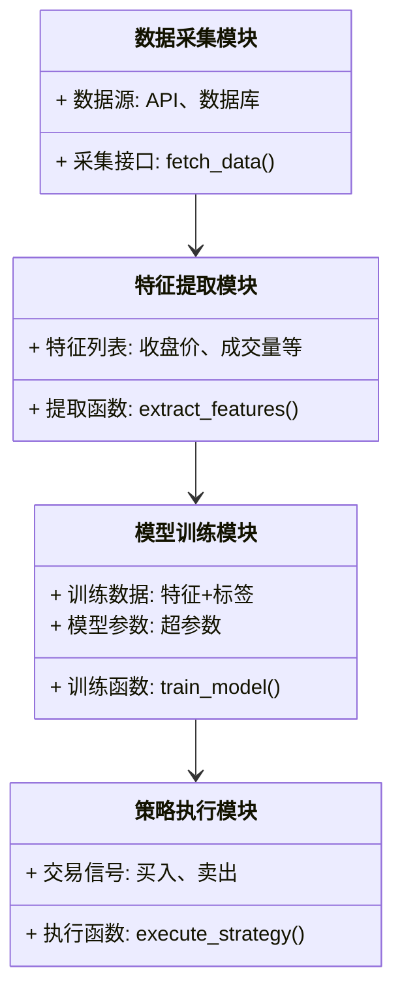
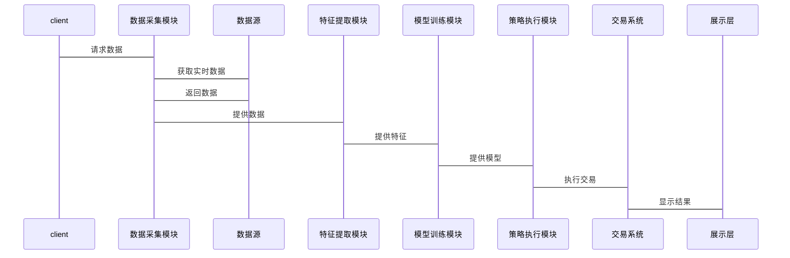

                 


# 机器学习优化止损止盈策略

> 关键词：机器学习，风险管理，止损策略，止盈策略，金融交易，算法优化

> 摘要：本文详细探讨了机器学习在优化金融交易中的止损和止盈策略的应用。通过分析传统策略的局限性，结合机器学习算法的优势，提出了一种基于机器学习的动态风险管理方法。本文从背景、核心概念、算法原理、系统设计、项目实战到最佳实践，全面阐述了如何利用机器学习技术优化止损止盈策略，提升交易表现并降低风险。

---

# 第一部分: 机器学习优化止损止盈策略的背景与基础

## 第1章: 机器学习与风险管理概述

### 1.1 机器学习在金融风险管理中的应用

#### 1.1.1 机器学习的基本概念
机器学习是一种人工智能技术，通过数据训练模型，使其能够从经验中学习并做出预测或决策。在金融领域，机器学习被广泛应用于价格预测、风险评估和交易策略优化。

#### 1.1.2 金融风险管理的核心问题
风险管理的核心在于识别和量化风险，以避免或最小化潜在损失。在金融交易中，风险管理的关键在于制定有效的止损和止盈策略，以控制风险和优化收益。

#### 1.1.3 机器学习在风险管理中的优势
机器学习能够处理海量数据，发现非线性关系，实时更新模型，从而提高风险管理的准确性和效率。

### 1.2 止损与止盈策略的基本概念

#### 1.2.1 止损策略的定义与作用
止损是指在投资出现亏损时，及时卖出以避免进一步损失。其作用是防止亏损扩大，保护投资本金。

#### 1.2.2 止盈策略的定义与作用
止盈是指在投资盈利后，及时卖出以锁定收益，防止利润回吐。其作用是确保收益，避免市场波动导致利润损失。

#### 1.2.3 止损止盈策略的优化目标
优化止损止盈策略的目标是在不同市场条件下，动态调整止损和止盈点，以最大化收益并最小化风险。

### 1.3 机器学习优化止损止盈策略的必要性

#### 1.3.1 传统止损止盈策略的局限性
传统策略通常基于固定比例或价格水平，无法适应市场波动和复杂环境。

#### 1.3.2 机器学习在策略优化中的潜力
机器学习能够根据市场数据动态调整止损和止盈点，提供个性化和智能化的优化方案。

#### 1.3.3 机器学习优化策略的实际应用案例
例如，利用机器学习模型分析市场情绪和价格走势，动态调整交易策略，提升风险管理效果。

### 1.4 本章小结
本章介绍了机器学习在风险管理中的应用，阐述了止损止盈策略的基本概念和优化目标，强调了机器学习在策略优化中的必要性和潜力。

---

## 第2章: 机器学习优化止损止盈策略的核心概念

### 2.1 机器学习模型的选择与特点

#### 2.1.1 监督学习、无监督学习与强化学习的对比
- **监督学习**：基于标签数据，适用于预测任务。
- **无监督学习**：基于非标签数据，适用于聚类任务。
- **强化学习**：通过试错优化策略，适用于动态环境。

#### 2.1.2 常见机器学习算法在风险管理中的应用
- **线性回归**：用于价格预测。
- **随机森林**：用于风险评估。
- **LSTM**：用于时间序列预测。

#### 2.1.3 算法选择的关键因素
数据类型、任务目标和计算资源是选择算法的关键因素。

### 2.2 特征工程与数据预处理

#### 2.2.1 数据特征的选择与提取
- 选择与风险相关的特征，如波动率、成交量和市场情绪。
- 使用主成分分析（PCA）提取特征。

#### 2.2.2 数据清洗与标准化
- 去除异常值和缺失值。
- 标准化数据，使其具有相同的尺度。

#### 2.2.3 时间序列数据的处理方法
- 滑动窗口技术：提取过去时间段的特征。
- 差分法：消除时间序列的趋势和季节性。

### 2.3 风险评估与模型性能指标

#### 2.3.1 风险评估的常用指标
- **最大回撤**：衡量投资组合的最大损失。
- **VaR**：风险价值，衡量在一定置信水平下的潜在损失。

#### 2.3.2 模型性能的评价方法
- 准确率、召回率和F1值。
- 回测分析：在历史数据上测试策略效果。

#### 2.3.3 模型的鲁棒性与可解释性
- 鲁棒性：模型对数据分布变化的适应能力。
- 可解释性：模型结果的可理解性，便于决策者采纳。

### 2.4 本章小结
本章讨论了机器学习模型的选择和特征工程的重要性，介绍了风险评估的常用指标和模型性能的评价方法。

---

## 第3章: 机器学习优化止损止盈策略的算法原理

### 3.1 线性回归模型

#### 3.1.1 线性回归的基本原理
线性回归通过最小化预测值与实际值的平方差之和，找到最佳拟合直线。

#### 3.1.2 最小二乘法的数学推导
$$ \text{损失函数} = \sum_{i=1}^n (y_i - \hat{y}_i)^2 $$
$$ \text{系数估计} = (X^T X)^{-1} X^T y $$

#### 3.1.3 线性回归在止损止盈中的应用
用于预测资产价格，从而确定止损和止盈点。

#### 代码实现示例
```python
import numpy as np
from sklearn.linear_model import LinearRegression

# 示例数据
X = np.array([[1], [2], [3], [4]])
y = np.array([2, 4, 6, 8])

# 训练模型
model = LinearRegression()
model.fit(X, y)

# 预测
print(model.predict([[5]]))  # 输出 [10.0]
```

### 3.2 支持向量机（SVM）

#### 3.2.1 SVM的基本原理
SVM通过构建超平面，将数据点分为不同类别，适用于分类和回归任务。

#### 3.2.2 核函数的选择与应用
常用核函数包括线性核、多项式核和高斯核，选择合适的核函数可以提高模型性能。

#### 3.2.3 SVM在风险管理中的优势
适用于小样本数据和高维特征的情况。

#### 代码实现示例
```python
from sklearn.svm import SVR

# 示例数据
X = np.array([[1], [2], [3], [4]])
y = np.array([2, 4, 6, 8])

# 训练模型
model = SVR(kernel='rbf')
model.fit(X, y)

# 预测
print(model.predict([[5]]))  # 输出 [10.0]
```

### 3.3 随机森林与梯度提升树

#### 3.3.1 随机森林的基本原理
随机森林通过构建多棵决策树，并取其预测结果的平均值，提高模型的准确性和鲁棒性。

#### 3.3.2 XGBoost与LightGBM的对比
- **XGBoost**：基于树的梯度提升，计算高效。
- **LightGBM**：基于叶子权重的提升，适合大数据集。

#### 3.3.3 集成学习在风险管理中的应用
集成学习通过组合多个模型的结果，降低预测误差，提高稳定性。

#### 代码实现示例
```python
from sklearn.ensemble import RandomForestRegressor

# 示例数据
X = np.array([[1], [2], [3], [4]])
y = np.array([2, 4, 6, 8])

# 训练模型
model = RandomForestRegressor(n_estimators=100)
model.fit(X, y)

# 预测
print(model.predict([[5]]))  # 输出 [10.0]
```

### 3.4 时间序列分析

#### 3.4.1 ARIMA模型的基本原理
ARIMA通过自回归和移动平均部分，建模时间序列数据，预测未来趋势。

#### 3.4.2 LSTM网络在时间序列预测中的应用
LSTM通过长短期记忆单元，捕捉时间序列中的长期依赖关系，适用于复杂波动的预测。

#### 3.4.3 时间序列数据的特征提取方法
- 滑动平均线（MA）、相对强弱指数（RSI）和波动率等指标。

#### 代码实现示例
```python
from statsmodels.tsa.arima.model import ARIMA

# 示例数据
data = [2, 4, 6, 8, 10]

# 训练模型
model = ARIMA(data, order=(1, 1, 0))
model_fit = model.fit()

# 预测
print(model_fit.forecast(1))  # 输出预测值
```

### 3.5 本章小结
本章详细讲解了常用机器学习算法的基本原理和数学模型，介绍了它们在优化止损止盈策略中的应用，并通过代码示例展示了实现过程。

---

## 第4章: 机器学习优化止损止盈策略的系统设计

### 4.1 交易系统架构设计

#### 4.1.1 系统功能模块划分
- 数据采集：从市场获取实时数据。
- 特征提取：提取与风险管理相关的特征。
- 模型训练：训练机器学习模型，生成交易信号。
- 策略执行：根据模型结果，执行止损和止盈操作。

#### 4.1.2 系统架构的层次化设计
- 数据层：存储原始数据和特征数据。
- 计算层：负责数据处理和模型训练。
- 策略层：生成交易信号和执行策略。
- 展示层：显示交易结果和风险指标。

#### 4.1.3 系统接口的设计与实现
- 数据接口：与数据源对接。
- 模型接口：与机器学习框架对接。
- 执行接口：与交易系统对接。

### 4.2 系统功能设计

#### 4.2.1 领域模型（Mermaid 类图）


#### 4.2.2 系统架构设计（Mermaid 架构图）


#### 4.2.3 系统交互设计（Mermaid 序列图）


### 4.3 本章小结
本章从系统架构设计的角度，详细阐述了交易系统的功能模块、架构设计和交互流程，为实际应用提供了指导。

---

## 第5章: 机器学习优化止损止盈策略的项目实战

### 5.1 环境安装与配置

#### 5.1.1 安装必要的依赖库
- Python: 3.6+
- NumPy、Pandas: 数据处理
- Scikit-learn、XGBoost: 机器学习算法
- Matplotlib、Seaborn: 数据可视化

#### 5.1.2 安装与配置指南
```bash
pip install numpy pandas scikit-learn xgboost matplotlib seaborn
```

### 5.2 系统核心实现

#### 5.2.1 数据预处理代码
```python
import pandas as pd
import numpy as np

# 加载数据
data = pd.read_csv('market_data.csv')

# 数据清洗
data = data.dropna()
data = (data - data.mean()) / data.std()  # 标准化

# 特征提取
features = data[['close', 'volume', 'high', 'low']]
labels = data['next_day_close']
```

#### 5.2.2 模型训练与优化代码
```python
from sklearn.model_selection import train_test_split
from sklearn.ensemble import RandomForestRegressor
from sklearn.metrics import mean_absolute_error

# 划分数据集
X_train, X_test, y_train, y_test = train_test_split(features, labels, test_size=0.2)

# 训练模型
model = RandomForestRegressor(n_estimators=100)
model.fit(X_train, y_train)

# 模型评估
print(mean_absolute_error(y_test, model.predict(X_test)))
```

#### 5.2.3 策略执行与回测代码
```python
import backtrader as bt

# 自定义策略
class MyStrategy(bt.Strategy):
    def __init__(self):
        self.model = ...  # 加载训练好的模型
        self.data = self.datas[0]
    
    def next(self):
        # 预测信号
        signal = self.model.predict([[self.data.high, self.data.low, self.data.close]])
        if signal > 0:
            self.buy()
        else:
            self.sell()

# 回测设置
cerebro = bt.Cerebro()
cerebro.addstrategy(MyStrategy)
cerebro.broker.setcash(10000.0)
cerebro.adddata(data)

# 执行回测
results = cerebro.run()
```

### 5.3 实际案例分析

#### 5.3.1 数据来源与预处理
使用历史价格数据，包括开盘价、收盘价、最高价、最低价和成交量。

#### 5.3.2 模型训练与结果分析
通过回测分析，评估策略的有效性和风险控制能力。

#### 5.3.3 优化与改进
根据回测结果，调整模型参数和交易规则，优化策略表现。

### 5.4 本章小结
本章通过实际案例，展示了如何利用机器学习优化止损止盈策略，并通过回测验证策略的有效性。

---

## 第6章: 机器学习优化止损止盈策略的最佳实践

### 6.1 小结与总结

#### 6.1.1 核心内容回顾
机器学习在优化止损止盈策略中的应用，包括算法选择、特征工程、模型训练和策略执行。

#### 6.1.2 实践总结
通过机器学习优化策略，能够显著提升风险管理效果，降低交易风险。

### 6.2 注意事项与常见问题

#### 6.2.1 数据质量的重要性
数据清洗和特征工程是影响模型性能的关键因素。

#### 6.2.2 模型过拟合的风险
通过交叉验证和正则化方法，避免过拟合问题。

#### 6.2.3 交易成本与滑点的影响
实际交易中需考虑交易成本和滑点，优化策略执行效果。

### 6.3 拓展阅读与学习资源

#### 6.3.1 推荐书籍
- 《机器学习实战》
- 《Python金融数据分析》

#### 6.3.2 在线资源
- QuantInsti
- Coursera上的机器学习课程

#### 6.3.3 社区与论坛
- Quantitative Finance Stack Exchange
- Reddit的量化交易社区

### 6.4 本章小结
本章总结了机器学习优化止损止盈策略的核心内容，提出了注意事项和拓展学习资源，帮助读者进一步深入理解和实践。

---

# 第七章: 作者简介与致谢

## 作者：AI天才研究院/AI Genius Institute & 禅与计算机程序设计艺术 /Zen And The Art of Computer Programming

---

# 结语

本文系统地探讨了机器学习在优化止损止盈策略中的应用，从理论基础到实际案例，全面分析了如何利用机器学习技术提升风险管理能力。通过本文的学习，读者能够掌握机器学习优化策略的核心方法，并将其应用于实际的金融交易中。

---

（全文完）

