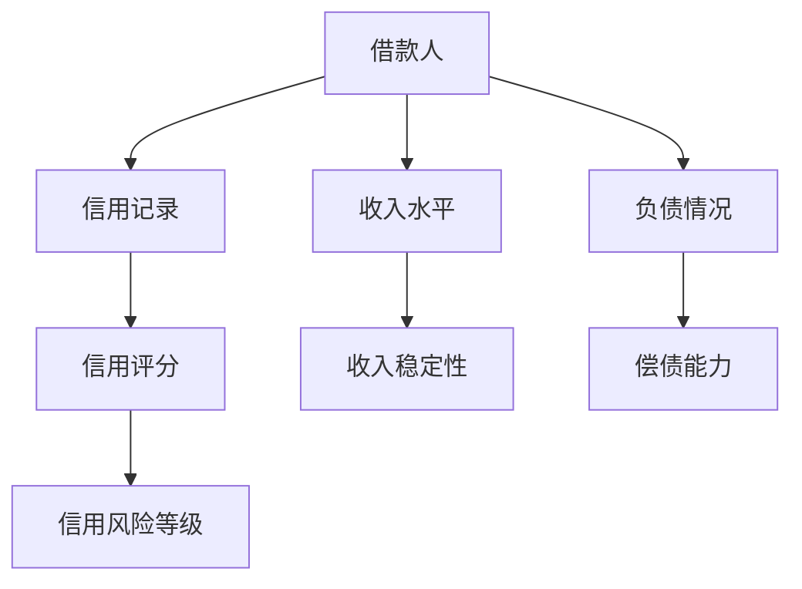
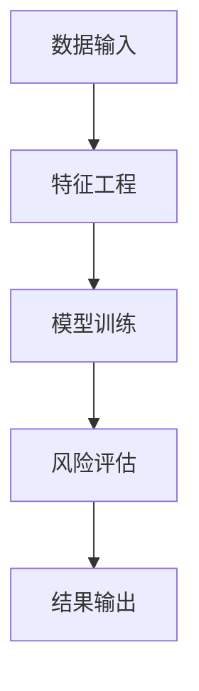

                 


# 《机器学习在信用风险评估中的应用》

---

## 关键词：机器学习、信用风险评估、特征工程、模型优化、系统架构设计

---

## 摘要：  
机器学习在信用风险评估中的应用是当前金融领域的重要研究方向。本文从信用风险评估的基本概念出发，结合机器学习的核心算法和应用场景，系统性地探讨了如何利用机器学习技术优化信用风险评估过程。通过分析特征工程、模型选择、调参优化等关键步骤，本文详细讲解了机器学习在信用风险评估中的实际应用，并通过案例分析展示了其在金融领域的巨大潜力。最后，本文总结了机器学习在信用风险评估中的优势与挑战，并展望了未来的研究方向。

---

# 第1章: 机器学习与信用风险评估概述

## 1.1 机器学习的基本概念  
### 1.1.1 机器学习的定义与特点  
机器学习是一种人工智能技术，通过数据训练模型，使其能够从经验中学习并做出预测或决策。其特点包括数据驱动、自动学习、泛化能力等。  

### 1.1.2 机器学习的核心概念与分类  
机器学习主要分为监督学习、无监督学习、半监督学习和强化学习。监督学习是最常用的类型，适用于信用风险评估中的分类任务。  

### 1.1.3 机器学习在金融领域的应用  
机器学习在金融领域的应用广泛，包括股票预测、欺诈检测、信用评分等。  

## 1.2 信用风险评估的基本概念  
### 1.2.1 信用风险的定义与分类  
信用风险是指借款人或交易对手未能履行其合同义务，导致债权人或投资者遭受损失的风险。信用风险可以分为系统性风险和非系统性风险。  

### 1.2.2 信用风险评估的主要方法  
信用风险评估的主要方法包括信用评分模型、违约概率模型和信用评级模型。  

### 1.2.3 信用风险评估的挑战与意义  
信用风险评估的挑战包括数据稀疏性、模型解释性不足等。其意义在于帮助金融机构降低风险、优化资产配置。  

## 1.3 机器学习在信用风险评估中的作用  
### 1.3.1 机器学习与传统信用风险评估的对比  
传统信用风险评估方法依赖于经验法则和人工分析，而机器学习能够通过数据自动学习，提高预测精度。  

### 1.3.2 机器学习在信用风险评估中的优势  
机器学习的优势包括高精度、自动化、适应性强等。  

### 1.3.3 机器学习在信用风险评估中的应用场景  
应用场景包括客户信用评分、风险预警、欺诈检测等。  

## 1.4 本章小结  
本章介绍了机器学习的基本概念和信用风险评估的核心概念，重点探讨了机器学习在信用风险评估中的作用和应用场景。

---

# 第2章: 信用风险评估的核心概念与联系

## 2.1 信用风险评估的核心要素  
### 2.1.1 借款人信用状况的评估维度  
借款人信用状况的评估维度包括收入、负债、信用历史、职业等。  

### 2.1.2 信用评分模型的关键指标  
信用评分模型的关键指标包括违约概率、信用评分、风险敞口等。  

### 2.1.3 信用风险的量化方法  
信用风险的量化方法包括VaR（Value at Risk）和CVaR（Conditional Value at Risk）。  

## 2.2 机器学习与信用风险评估的核心联系  
### 2.2.1 数据特征与模型选择的关系  
数据特征直接影响模型的性能，特征工程是机器学习的核心步骤。  

### 2.2.2 算法性能与信用风险评估效果的关联  
算法性能直接影响信用风险评估的准确性和可靠性。  

### 2.2.3 信用风险评估的可解释性与模型复杂度的平衡  
模型的可解释性是信用风险评估的重要要求，但复杂的模型往往难以解释。  

## 2.3 信用风险评估的ER实体关系图  


## 2.4 本章小结  
本章通过ER实体关系图展示了信用风险评估的核心要素及其相互关系，强调了数据特征和模型选择的重要性。

---

# 第3章: 机器学习算法基础

## 3.1 监督学习与无监督学习  
### 3.1.1 监督学习的定义与特点  
监督学习是一种基于标注数据训练模型的方法，适用于分类和回归任务。  

### 3.1.2 无监督学习的定义与特点  
无监督学习是一种基于无标注数据训练模型的方法，适用于聚类和降维任务。  

### 3.1.3 监督学习与无监督学习在信用风险评估中的应用  
监督学习适用于信用评分任务，无监督学习适用于欺诈检测任务。  

## 3.2 常见机器学习算法概述  
### 3.2.1 线性回归  
线性回归是一种简单的回归算法，适用于连续型变量的预测。  

### 3.2.2 支持向量机（SVM）  
SVM是一种分类算法，适用于高维数据的分类任务。  

### 3.2.3 随机森林  
随机森林是一种集成算法，适用于分类和回归任务。  

### 3.2.4 神经网络  
神经网络是一种深度学习算法，适用于复杂的非线性任务。  

## 3.3 算法选择与信用风险评估  
### 3.3.1 算法选择的依据  
算法选择的依据包括数据特征、任务类型、计算资源等。  

### 3.3.2 常见算法的优缺点比较  
| 算法 | 优点 | 缺点 |
|------|------|------|
| 线性回归 | 简单、高效 | 无法处理非线性关系 |
| SVM | 高精度 | 数据预处理复杂 |
| 随机森林 | 鲁棒性好 | 计算资源消耗大 |
| 神经网络 | 表现力强 | 需要大量数据和计算资源 |

## 3.4 本章小结  
本章介绍了常见机器学习算法及其在信用风险评估中的应用，强调了算法选择的重要性。

---

# 第4章: 信用风险评估中的特征工程

## 4.1 特征工程的基本概念  
### 4.1.1 特征工程的定义与作用  
特征工程是通过数据预处理和特征提取，提高模型性能的过程。  

### 4.1.2 特征工程的核心步骤  
特征工程的核心步骤包括数据清洗、特征提取、特征选择和特征变换。  

## 4.2 信用风险评估中的特征工程实践  
### 4.2.1 数据清洗  
数据清洗包括处理缺失值、异常值和重复值。  

### 4.2.2 特征提取  
特征提取包括从文本、图像等数据中提取有用信息。  

### 4.2.3 特征选择  
特征选择包括基于统计的方法和基于模型的方法。  

### 4.2.4 特征变换  
特征变换包括标准化、归一化和降维。  

## 4.3 本章小结  
本章详细讲解了信用风险评估中的特征工程实践，强调了特征工程对模型性能的重要影响。

---

# 第5章: 机器学习模型训练与优化

## 5.1 模型训练的核心步骤  
### 5.1.1 数据分割  
数据分割包括训练集、验证集和测试集的划分。  

### 5.1.2 模型训练  
模型训练包括选择算法、参数调优和模型训练。  

## 5.2 模型优化的关键技巧  
### 5.2.1 参数调优  
参数调优包括网格搜索和随机搜索。  

### 5.2.2 模型评估  
模型评估包括准确率、召回率、F1分数和AUC-ROC曲线。  

### 5.2.3 模型优化  
模型优化包括正则化、集成学习和超参数优化。  

## 5.3 本章小结  
本章介绍了模型训练与优化的关键步骤和技巧，强调了参数调优和模型评估的重要性。

---

# 第6章: 信用风险评估系统的架构设计

## 6.1 系统功能设计  
### 6.1.1 系统功能模块  
系统功能模块包括数据输入、特征工程、模型训练、风险评估和结果输出。  

### 6.1.2 系统功能流程  
系统功能流程包括数据预处理、模型训练、风险评估和结果输出。  

## 6.2 系统架构设计  
### 6.2.1 系统架构图  


### 6.2.2 系统架构优势  
系统架构优势包括模块化设计、可扩展性和可维护性。  

## 6.3 本章小结  
本章通过系统架构设计展示了信用风险评估的完整流程，强调了模块化设计的重要性。

---

# 第7章: 机器学习在信用风险评估中的项目实战

## 7.1 项目背景与目标  
### 7.1.1 项目背景  
项目背景是利用机器学习技术优化信用风险评估过程。  

### 7.1.2 项目目标  
项目目标包括建立信用评分模型、实现风险预警和优化模型性能。  

## 7.2 项目实施步骤  
### 7.2.1 环境安装  
环境安装包括安装Python、Scikit-learn、XGBoost和Jupyter Notebook。  

### 7.2.2 数据清洗与特征工程  
数据清洗包括处理缺失值和异常值，特征工程包括特征选择和特征变换。  

### 7.2.3 模型训练与优化  
模型训练包括选择算法、参数调优和模型训练，模型优化包括集成学习和超参数优化。  

### 7.2.4 模型部署与监控  
模型部署包括模型保存和接口设计，模型监控包括实时监控和模型更新。  

## 7.3 项目代码实现  
### 7.3.1 数据清洗代码  
```python
import pandas as pd
import numpy as np

# 读取数据
data = pd.read_csv('credit_data.csv')

# 处理缺失值
data = data.dropna()

# 处理异常值
data = data[(data['income'] > 0) & (data['debt'] > 0)]
```

### 7.3.2 模型训练代码  
```python
from sklearn.model_selection import train_test_split
from sklearn.ensemble import RandomForestClassifier
from sklearn.metrics import accuracy_score

# 数据分割
X_train, X_test, y_train, y_test = train_test_split(data.drop('label', axis=1), data['label'], test_size=0.2)

# 模型训练
model = RandomForestClassifier(n_estimators=100, max_depth=5)
model.fit(X_train, y_train)

# 模型评估
print(accuracy_score(model.predict(X_test), y_test))
```

## 7.4 本章小结  
本章通过一个完整的项目流程展示了机器学习在信用风险评估中的应用，强调了代码实现和项目管理的重要性。

---

# 第8章: 机器学习在信用风险评估中的实际案例

## 8.1 案例背景与数据来源  
### 8.1.1 案例背景  
案例背景是某银行的信用风险评估项目。  

### 8.1.2 数据来源  
数据来源包括银行内部数据和外部数据。  

## 8.2 案例分析与结果解读  
### 8.2.1 数据预处理  
数据预处理包括处理缺失值和异常值。  

### 8.2.2 模型选择  
模型选择包括随机森林和XGBoost。  

### 8.2.3 模型评估  
模型评估包括准确率、召回率和AUC-ROC曲线。  

## 8.3 案例总结与经验分享  
### 8.3.1 案例总结  
案例总结包括模型性能和项目经验。  

### 8.3.2 经验分享  
经验分享包括数据预处理的重要性、模型选择的策略和模型优化的技巧。  

## 8.4 本章小结  
本章通过实际案例展示了机器学习在信用风险评估中的应用，总结了项目经验。

---

# 第9章: 机器学习在信用风险评估中的未来展望

## 9.1 模型可解释性的提升  
### 9.1.1 模型可解释性的定义与重要性  
模型可解释性是指模型的决策过程可以被人类理解。  

### 9.1.2 提升模型可解释性的方法  
提升模型可解释性的方法包括使用线性模型、特征重要性分析和模型解释工具。  

## 9.2 机器学习与多模态数据的融合  
### 9.2.1 多模态数据的定义与特点  
多模态数据是指多种类型的数据，如文本、图像和音频。  

### 9.2.2 多模态数据在信用风险评估中的应用  
多模态数据在信用风险评估中的应用包括社交媒体数据和交易数据的融合。  

## 9.3 机器学习与强化学习的结合  
### 9.3.1 强化学习的定义与特点  
强化学习是一种通过与环境交互学习策略的方法。  

### 9.3.2 强化学习在信用风险评估中的应用  
强化学习在信用风险评估中的应用包括动态风险管理和自适应模型优化。  

## 9.4 本章小结  
本章展望了机器学习在信用风险评估中的未来发展方向，强调了模型可解释性和多模态数据的重要性。

---

## 作者：AI天才研究院/AI Genius Institute & 禅与计算机程序设计艺术/Zen And The Art of Computer Programming

