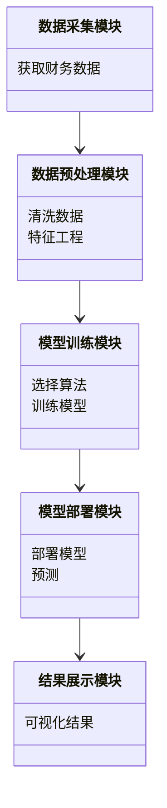
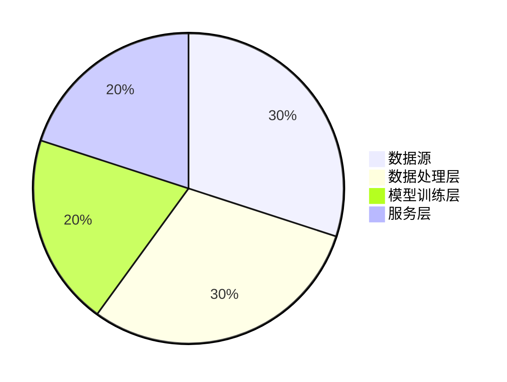

                 


# 机器学习在公司财务预测中的应用研究

> 关键词：机器学习，财务预测，算法，系统架构，项目实战

> 摘要：本文探讨了机器学习在公司财务预测中的应用，详细分析了传统方法的局限性，介绍了机器学习的核心算法及其在财务预测中的优势。通过系统架构设计和项目实战，展示了如何构建高效的财务预测系统，并总结了实际应用中的最佳实践和未来发展方向。

---

## 第一章：背景介绍

### 1.1 核心概念与术语说明

| 概念       | 定义                                                                 |
|------------|----------------------------------------------------------------------|
| 机器学习   | 通过数据训练模型，使其能够从数据中学习并做出预测或决策的技术。      |
| 财务预测    | 使用历史数据和模型预测公司未来的财务状况，如销售额、利润、现金流等。 |
| 监督学习    | 算法根据带标签的数据进行训练，预测新的数据标签。                   |
| 无监督学习  | 算法从无标签数据中发现结构或模式。                                   |

### 1.2 问题背景与描述

财务预测对于企业决策至关重要，但传统统计方法在面对复杂数据时显得力不从心。机器学习通过处理大量非结构化数据，提供了更精准的预测能力。

### 1.3 问题解决与边界

- **问题解决**：机器学习通过复杂算法捕捉数据中的隐藏模式，提高预测准确性。
- **边界**：适用于有足够数据支撑的情况，对实时性要求不高的场景。

### 1.4 核心要素组成

- 数据：财务数据、市场数据、行业趋势。
- 模型：选择合适的算法，如线性回归、随机森林。
- 工具：编程语言（Python）、数据处理库（Pandas）、机器学习库（Scikit-learn、XGBoost）。

---

## 第二章：机器学习算法原理

### 2.1 线性回归算法

#### 2.1.1 算法原理

线性回归通过建立自变量与因变量之间的线性关系进行预测。其数学模型为：

$$ y = \beta_0 + \beta_1x + \epsilon $$

其中，$\beta_0$和$\beta_1$是模型参数，$\epsilon$是误差项。

#### 2.1.2 算法步骤

1. 数据预处理：标准化或归一化。
2. 训练模型：使用最小二乘法求解参数。
3. 预测与评估：计算R²值评估模型拟合度。

#### 2.1.3 优缺点对比

| 特性    | 优点           | 缺点           |
|---------|----------------|----------------|
| 简单性  | 易实现         | 模型假设严格    |
| 解释性  | 易解释         | 适合线性关系   |

#### 2.1.4 应用场景

适用于简单线性关系的预测，如销售与广告投入的关系。

### 2.2 随机森林算法

#### 2.2.1 算法原理

随机森林是集成学习的一种，通过构建多个决策树并进行投票或平均来提高预测准确性。其优势在于减少过拟合，适合高维数据。

#### 2.2.2 算法步骤

1. 数据采样：使用袋装法（Bagging）抽取样本。
2. 特征采样：随机选择部分特征构建决策树。
3. 集成预测：对所有树的结果进行集成。

#### 2.2.3 优缺点对比

| 特性    | 优点           | 缺点           |
|---------|----------------|----------------|
| 抗过拟合 | 鲁棒性高         | 需大量计算资源  |
| 解释性  | 较低           |                |

#### 2.2.4 应用场景

适用于复杂非线性关系的预测，如信用评分、客户 churn 预测。

---

## 第三章：系统架构设计

### 3.1 系统功能设计

#### 3.1.1 功能模块

- 数据采集模块：从数据库中获取财务数据。
- 数据预处理模块：清洗、特征工程。
- 模型训练模块：选择算法，训练模型。
- 模型部署模块：将模型部署到生产环境。
- 结果展示模块：可视化预测结果。

#### 3.1.2 领域模型（Mermaid 类图）



### 3.2 系统架构设计

#### 3.2.1 系统架构（Mermaid 架构图）



#### 3.2.2 数据流（Mermaid 流程图）


---

## 第四章：项目实战

### 4.1 环境安装

安装Python和相关库：

```bash
pip install numpy pandas scikit-learn xgboost matplotlib
```

### 4.2 核心实现

#### 4.2.1 数据预处理

```python
import pandas as pd
from sklearn.model_selection import train_test_split
from sklearn.preprocessing import StandardScaler

# 加载数据
data = pd.read_csv('financial_data.csv')

# 分割特征与标签
X = data.drop('profit', axis=1)
y = data['profit']

# 数据分割
X_train, X_test, y_train, y_test = train_test_split(X, y, test_size=0.2)

# 标准化
scaler = StandardScaler()
X_train_scaled = scaler.fit_transform(X_train)
X_test_scaled = scaler.transform(X_test)
```

#### 4.2.2 模型训练

```python
from sklearn.ensemble import RandomForestRegressor
from sklearn.metrics import mean_squared_error

# 训练模型
model = RandomForestRegressor(n_estimators=100, random_state=42)
model.fit(X_train_scaled, y_train)

# 预测
y_pred = model.predict(X_test_scaled)

# 评估
mse = mean_squared_error(y_test, y_pred)
print(f'MSE: {mse}')
```

### 4.3 案例分析

以某公司为例，预测未来一年的利润。通过数据清洗、特征工程和模型训练，最终模型预测利润增长10%，为公司制定策略提供支持。

---

## 第五章：结论与展望

### 5.1 结论

机器学习在财务预测中表现出色，尤其在处理复杂数据和非线性关系方面。随机森林和神经网络等算法提供了更高的准确性。

### 5.2 未来研究方向

- 提高模型解释性。
- 结合时间序列分析。
- 应用深度学习模型如LSTM。

### 5.3 最佳实践 tips

- 数据质量至关重要，需仔细清洗和特征工程。
- 选择合适的算法，避免过度依赖单一模型。
- 定期更新模型，以适应市场变化。

---

作者：AI天才研究院 & 禅与计算机程序设计艺术

