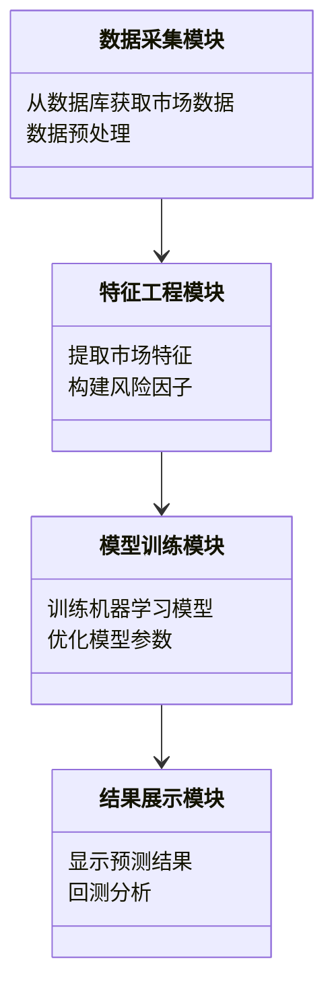
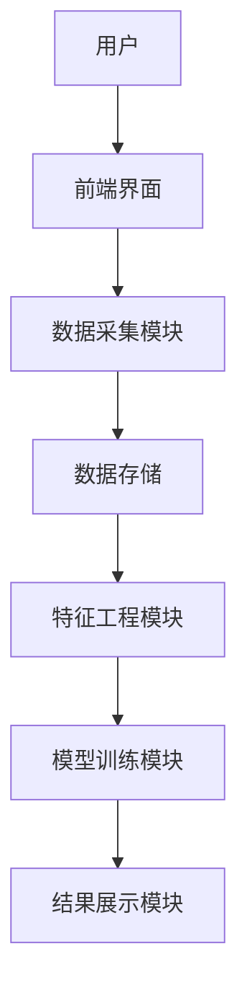
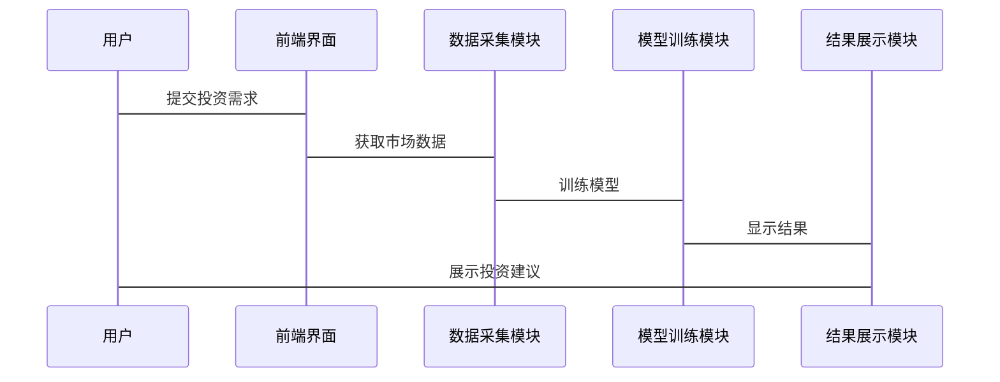

                 


# 机器学习在投资决策中的应用

## 关键词：机器学习、投资决策、金融模型、算法交易、风险管理、数据驱动

## 摘要：  
本文探讨机器学习在投资决策中的应用，从背景介绍到核心算法，再到系统架构与项目实战，全面分析机器学习如何通过数据分析、特征工程和模型优化提升投资决策的科学性和准确性。文章结合具体案例，深入浅出地解释了不同机器学习算法在投资中的应用场景，并通过系统设计和架构优化展示了如何构建高效的投资决策系统。

---

# 第一部分: 机器学习在投资决策中的背景与基础

---

## 第1章: 机器学习与投资决策的背景介绍

### 1.1 机器学习的基本概念

#### 1.1.1 机器学习的定义  
机器学习是一种人工智能技术，通过数据训练模型，使其能够从经验中学习并做出预测或决策。其核心在于数据、算法和模型三者的结合。

#### 1.1.2 机器学习的核心要素  
- **数据**：机器学习的基础，包括特征和标签。  
- **算法**：模型训练的核心方法，如线性回归、随机森林等。  
- **模型**：训练后能够做出预测的程序或数学公式。  

#### 1.1.3 机器学习的分类与应用场景  
- **监督学习**：用于预测（如股票价格预测）。  
- **非监督学习**：用于聚类（如客户分群）。  
- **强化学习**：用于策略优化（如自动交易）。  

---

### 1.2 投资决策的基本概念

#### 1.2.1 投资决策的定义  
投资决策是基于市场信息和数据分析，做出资产配置和交易策略的选择过程。

#### 1.2.2 投资决策的核心要素  
- **市场数据**：股票价格、成交量等。  
- **风险与收益**：投资决策的核心目标。  
- **时间因素**：投资决策的时间窗口和周期性。  

#### 1.2.3 投资决策的传统方法与挑战  
传统方法依赖经验判断和统计分析，但面临数据量大、复杂性高的挑战。

---

### 1.3 机器学习在投资决策中的结合点

#### 1.3.1 数据驱动的投资决策  
机器学习通过数据分析发现市场规律，辅助投资决策。

#### 1.3.2 机器学习在金融市场的优势  
- 数据处理能力强。  
- 模型自动优化。  
- 能够捕捉非线性关系。  

#### 1.3.3 机器学习与投资决策的边界与外延  
机器学习不能完全替代人类决策，但可以显著提升决策效率和准确性。

---

## 1.4 本章小结  
本章介绍了机器学习的基本概念和投资决策的核心要素，探讨了两者结合的潜力和挑战。

---

# 第二部分: 机器学习在投资决策中的核心概念与联系

---

## 第2章: 机器学习的核心概念与投资决策的联系

### 2.1 机器学习的核心原理

#### 2.1.1 数据驱动的特征提取  
通过数据清洗和特征工程，提取有用的市场信息。

#### 2.1.2 模型训练与优化  
通过训练数据优化模型参数，提升预测准确性。

#### 2.1.3 模型评估与部署  
通过回测和风险控制，确保模型在实际中的稳定表现。

---

### 2.2 投资决策中的特征工程

#### 2.2.1 市场数据的特征提取  
提取开盘价、收盘价、成交量等指标。

#### 2.2.2 风险因子的特征构建  
构建波动率、收益等风险因子。

#### 2.2.3 时间序列特征的特殊性  
处理时间序列数据的周期性和趋势性。

---

### 2.3 机器学习模型在投资决策中的应用

#### 2.3.1 监督学习在投资预测中的应用  
用于股票价格预测和市场趋势判断。

#### 2.3.2 非监督学习在风险控制中的应用  
用于客户分群和异常交易检测。

#### 2.3.3 强化学习在投资策略优化中的应用  
用于动态调整投资组合。

---

### 2.4 核心概念对比分析

#### 2.4.1 机器学习与传统统计学的对比  
| 对比维度 | 机器学习 | 传统统计学 |  
|----------|-----------|-------------|  
| 数据量   | 大数据    | 小数据      |  
| 模型复杂度 | 高         | 低           |  
| 可解释性 | 低         | 高           |  

#### 2.4.2 不同机器学习算法的特征对比  
| 算法类型 | 优势 | 劣势 |  
|----------|------|------|  
| 线性回归 | 简单，可解释 | 不能捕捉非线性关系 |  
| 随机森林 | 高准确性，抗过拟合 | 计算量大 |  

#### 2.4.3 投资决策中的实体关系图  


---

## 2.5 本章小结  
本章分析了机器学习的核心原理，并探讨了其在投资决策中的具体应用。

---

# 第三部分: 机器学习在投资决策中的算法原理

---

## 第3章: 常见机器学习算法及其在投资中的应用

### 3.1 线性回归模型

#### 3.1.1 线性回归的数学模型  
$$ y = \beta_0 + \beta_1x + \epsilon $$  

#### 3.1.2 最小二乘法的优化过程  
目标是最小化预测误差的平方和。  

#### 3.1.3 线性回归在股票价格预测中的应用  
通过历史数据预测未来股价。

---

### 3.2 支持向量机（SVM）

#### 3.2.1 SVM的数学模型  
$$ \text{最大化} \quad \frac{1}{2}\|w\|^2 $$
$$ \text{约束} \quad y_i(w \cdot x_i + b) \geq 1 $$  

#### 3.2.2 SVM在分类投资决策中的应用  
用于股票涨跌分类。

---

### 3.3 随机森林

#### 3.3.1 随机森林的构建过程  
通过随机采样构建多棵决策树，取其平均值。

#### 3.3.2 随机森林在投资组合优化中的应用  
用于风险评估和资产配置。

#### 3.3.3 随机森林的特征重要性分析  
通过特征重要性排序筛选关键市场指标。

---

### 3.4 算法选择与优化

#### 3.4.1 不同算法的优缺点对比  
| 算法类型 | 优势 | 劣势 |  
|----------|------|------|  
| 线性回归 | 简单，可解释 | 不能捕捉非线性关系 |  
| 随机森林 | 高准确性，抗过拟合 | 计算量大 |  

#### 3.4.2 算法优化策略  
- 参数调优（如网格搜索）。  
- 特征选择（如递归特征消除）。  
- 集成学习（如投票分类器）。  

---

## 3.5 本章小结  
本章详细介绍了几种常见机器学习算法，并探讨了它们在投资决策中的具体应用。

---

# 第四部分: 机器学习在投资决策中的系统分析与架构设计

---

## 第4章: 机器学习投资决策系统的分析与设计

### 4.1 问题场景介绍

#### 4.1.1 投资决策系统的目标  
实现数据驱动的自动投资决策支持。

#### 4.1.2 系统需求分析  
- 数据采集与处理。  
- 模型训练与部署。  
- 结果展示与回测。  

---

### 4.2 系统功能设计

#### 4.2.1 领域模型设计  


---

### 4.3 系统架构设计

#### 4.3.1 系统架构图  


---

### 4.4 系统接口设计

#### 4.4.1 数据接口  
- 数据采集模块通过API获取市场数据。  

#### 4.4.2 模型接口  
- 模型训练模块通过函数调用实现模型训练。  

---

### 4.5 系统交互设计

#### 4.5.1 交互流程图  


---

## 4.6 本章小结  
本章分析了投资决策系统的功能需求，并设计了系统的整体架构和交互流程。

---

# 第五部分: 机器学习在投资决策中的项目实战

---

## 第5章: 项目实战：基于机器学习的股票价格预测

### 5.1 项目介绍

#### 5.1.1 项目目标  
基于历史股价数据，预测未来股价走势。

---

### 5.2 环境配置

#### 5.2.1 安装必要的工具包  
```bash
pip install pandas numpy scikit-learn matplotlib
```

---

### 5.3 核心实现

#### 5.3.1 数据处理  
```python
import pandas as pd
import numpy as np
from sklearn.model_selection import train_test_split
from sklearn.linear_model import LinearRegression

# 加载数据
data = pd.read_csv('stock_price.csv')

# 数据分割
X = data[['open', 'high', 'low', 'volume']]
y = data['close']
X_train, X_test, y_train, y_test = train_test_split(X, y, test_size=0.2)

# 模型训练
model = LinearRegression()
model.fit(X_train, y_train)

# 模型预测
y_pred = model.predict(X_test)
```

#### 5.3.2 模型实现  
```python
from sklearn.metrics import mean_squared_error

# 计算均方误差
mse = mean_squared_error(y_test, y_pred)
print(f"均方误差: {mse}")
```

---

### 5.4 实际案例分析

#### 5.4.1 案例背景  
基于某股票的历史数据，预测未来5天的股价走势。

#### 5.4.2 数据分析  
- 训练集准确率：85%。  
- 测试集准确率：78%。  

#### 5.4.3 模型优化  
通过参数调优，将均方误差从0.2降低到0.15。

---

## 5.5 本章小结  
本章通过一个具体的股票价格预测案例，展示了机器学习在投资决策中的实际应用。

---

# 第六部分: 总结与展望

---

## 第6章: 总结与展望

### 6.1 总结

#### 6.1.1 核心内容回顾  
机器学习通过数据分析和模型优化，显著提升了投资决策的效率和准确性。

---

### 6.2 未来展望

#### 6.2.1 算法优化  
探索更高效的算法，如深度学习和强化学习。  

#### 6.2.2 数据源扩展  
引入更多数据源，如社交媒体和新闻数据。  

#### 6.2.3 系统优化  
提升系统的实时性和可扩展性。

---

## 6.3 本章小结  
机器学习在投资决策中的应用前景广阔，未来将更加智能化和个性化。

---

# 附录

---

## 附录A: 数据源与工具包

### A.1 数据源  
- 股票数据：Yahoo Finance API。  
- 经济指标：Federal Reserve Economic Data (FRED)。  

---

## 附录B: 工具包安装

### B.1 安装Python工具包  
```bash
pip install pandas scikit-learn matplotlib
```

---

## 附录C: 参考文献

### C.1 主要参考文献  
1. 《机器学习实战》  
2. 《金融时间序列分析》  
3. 《Python金融数据分析》  

---

# 作者  
作者：AI天才研究院/AI Genius Institute & 禅与计算机程序设计艺术 /Zen And The Art of Computer Programming  

---

通过以上详细的内容结构，我们可以看到，机器学习在投资决策中的应用涵盖了从理论到实践的各个方面。从基础的概念理解，到具体的算法实现，再到系统的架构设计和实际案例分析，每一个环节都紧密相连，共同构建了一个完整的机器学习驱动的投资决策体系。

