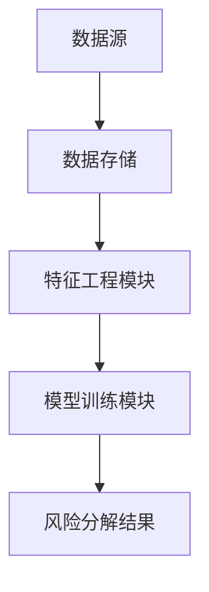
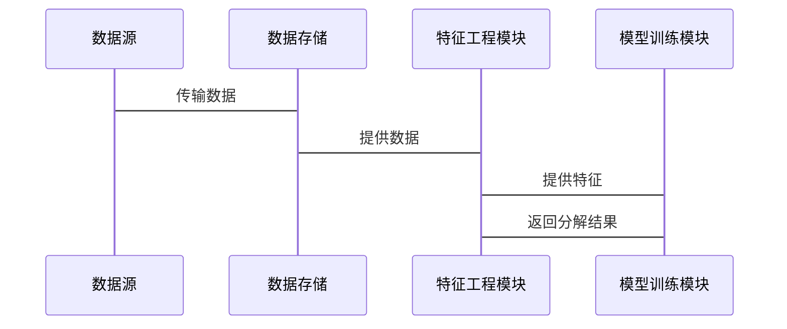

                 


# 机器学习在投资组合风险分解中的应用

## 关键词：机器学习，投资组合，风险分解，金融风险管理，算法，数学模型

## 摘要：本文深入探讨了机器学习在投资组合风险分解中的应用，分析了传统方法的局限性，介绍了机器学习算法的优势，详细讲解了特征工程、数学模型、系统架构设计以及项目实战，最后总结了最佳实践和未来方向。

---

## 第1章：机器学习与投资组合风险管理概述

### 1.1 机器学习的基本概念

- **1.1.1 机器学习的定义与分类**
  机器学习是一种人工智能技术，通过数据训练模型，使其能够从经验中学习并进行预测或决策。主要分为监督学习、无监督学习、半监督学习和强化学习。

- **1.1.2 投资组合管理的基本概念**
  投资组合是指将资金分配到不同资产以实现收益和风险的平衡。投资组合管理涉及资产配置、风险管理和绩效评估。

- **1.1.3 机器学习在投资组合管理中的作用**
  机器学习能够处理大量数据，识别复杂模式，优化投资决策，提高风险管理的准确性。

### 1.2 投资组合风险分解的背景

- **1.2.1 风险管理的重要性**
  风险管理是投资组合管理的核心，旨在降低潜在损失，确保投资目标的实现。

- **1.2.2 投资组合风险分解的目标**
  分解投资组合风险，识别各资产的风险贡献，优化资产配置。

- **1.2.3 传统风险分解方法的局限性**
  传统方法如方差分解难以捕捉非线性关系和复杂市场动态。

### 1.3 机器学习在风险分解中的优势

- **1.3.1 数据驱动的优势**
  机器学习能够处理和分析大量数据，发现传统方法难以捕捉的模式。

- **1.3.2 高维数据处理能力**
  机器学习擅长处理高维数据，适用于多资产投资组合的风险分解。

- **1.3.3 模型的自适应性**
  机器学习模型能够自适应市场变化，提供动态风险评估。

---

## 第2章：投资组合风险分解的理论基础

### 2.1 风险分解的基本概念

- **2.1.1 风险的定义与分类**
  风险包括市场风险、流动性风险、信用风险等，投资组合风险分解旨在量化各风险来源的影响。

- **2.1.2 投资组合风险的来源**
  包括资产价格波动、市场波动、经济周期变化等。

- **2.1.3 风险分解的目标与方法**
  目标是量化各资产对整体风险的贡献，方法包括方差分解、主成分分析等。

### 2.2 传统风险分解方法

- **2.2.1 方差分解法**
  通过计算各资产对投资组合方差的贡献，识别风险来源。

- **2.2.2 主成分分析（PCA）**
  用于识别数据中的主要波动来源，帮助分解风险。

- **2.2.3 资本资产定价模型（CAPM）**
  用于评估资产的系统性风险，指导投资组合优化。

### 2.3 机器学习在风险分解中的应用前景

- **2.3.1 机器学习的优势**
  能够处理非线性关系，提高风险分解的准确性。

- **2.3.2 现有挑战与解决方案**
  数据质量、模型解释性等问题需要通过特征工程和解释性分析解决。

- **2.3.3 未来发展趋势**
  结合深度学习和强化学习，提升风险分解的深度和广度。

---

## 第3章：机器学习算法在风险分解中的应用

### 3.1 常见机器学习算法概述

- **3.1.1 监督学习算法**
  线性回归、支持向量机（SVM）、随机森林等，适用于风险预测和分类。

- **3.1.2 无监督学习算法**
  K均值聚类、DBSCAN适用于风险因子的识别和群组分析。

- **3.1.3 回归与分类算法**
  线性回归用于风险预测，随机森林用于复杂模式识别。

### 3.2 机器学习算法在风险分解中的具体应用

- **3.2.1 算法选择**
  根据数据特征和任务需求选择合适的算法，如使用XGBoost处理高维金融数据。

- **3.2.2 算法流程**
  数据预处理、特征选择、模型训练、风险分解。

- **3.2.3 实例分析**
  使用随机森林对资产风险贡献进行分解，展示其在复杂场景下的优势。

### 3.3 算法实现与优化

- **3.3.1 数据预处理**
  包括标准化、缺失值处理、异常值剔除。

- **3.3.2 模型调优**
  使用网格搜索优化超参数，提升模型性能。

- **3.3.3 性能评估**
  采用准确率、召回率等指标评估模型效果。

---

## 第4章：特征工程与数据处理

### 4.1 特征工程的重要性

- **4.1.1 特征工程的概念**
  通过构建和选择特征，提高模型性能和解释性。

- **4.1.2 金融数据特征**
  包括资产回报率、波动率、相关系数等。

### 4.2 数据预处理

- **4.2.1 数据清洗**
  处理缺失值和异常值，确保数据质量。

- **4.2.2 特征变换**
  使用标准化、归一化等方法处理特征。

### 4.3 特征选择

- **4.3.1 过滤法**
  通过统计检验筛选重要特征。

- **4.3.2 包装法**
  通过模型性能评估选择特征。

- **4.3.3 嵌入法**
  利用模型内部权重评估特征重要性。

---

## 第5章：数学模型与公式

### 5.1 投资组合风险分解的数学模型

- **5.1.1 方差分解公式**
  $$ \text{Var}(p) = \sum_{i=1}^{n} w_i^2 \text{Var}(a_i) + \sum_{i=1}^{n} \sum_{j \neq i} w_i w_j \text{Cov}(a_i, a_j) $$
  其中，$w_i$是资产i的权重，$\text{Var}(a_i)$是资产i的方差，$\text{Cov}(a_i, a_j)$是资产i和j的协方差。

- **5.1.2 资本资产定价模型（CAPM）**
  $$ R_i = \beta_i (R_m - R_f) + R_f $$
  其中，$R_i$是资产i的预期收益，$\beta_i$是资产i的贝塔系数，$R_m$是市场预期收益，$R_f$是无风险利率。

### 5.2 机器学习模型的数学表示

- **5.2.1 线性回归**
  $$ y = \beta_0 + \beta_1 x_1 + \beta_2 x_2 + \dots + \beta_n x_n + \epsilon $$
  用于预测资产的收益或风险。

- **5.2.2 支持向量机（SVM）**
  通过最大-margin分类器，将数据映射到高维空间，用于分类或回归。

---

## 第6章：系统架构设计

### 6.1 系统功能设计

- **6.1.1 数据收集模块**
  从金融数据库获取历史数据，包括资产回报率、市场指数等。

- **6.1.2 特征工程模块**
  处理数据，提取特征，构建特征集。

- **6.1.3 模型训练模块**
  使用机器学习算法训练模型，进行风险分解。

### 6.2 系统架构图



### 6.3 系统接口设计

- 数据接口：接收外部数据源输入，处理并存储数据。
- 模型接口：与训练模块交互，返回风险分解结果。

### 6.4 系统交互流程



---

## 第7章：项目实战

### 7.1 环境安装

- 安装Python、Pandas、Scikit-learn、XGBoost等库。

### 7.2 核心代码实现

```python
import pandas as pd
import numpy as np
from sklearn.ensemble import RandomForestRegressor
from sklearn.metrics import mean_squared_error

# 数据预处理
data = pd.read_csv('portfolio.csv')
features = data.drop('return', axis=1)
target = data['return']

# 特征选择
selected_features = features[['volatility', 'market_return', 'interest_rate']]

# 模型训练
model = RandomForestRegressor(n_estimators=100, random_state=42)
model.fit(selected_features, target)

# 风险分解
portfolio_weights = np.array([0.3, 0.4, 0.3])
risk_contributions = model.predict(selected_features)
```

### 7.3 案例分析

- 使用随机森林模型分析三个资产的风险贡献，优化投资组合配置。

### 7.4 实战小结

- 展示机器学习在实际项目中的应用效果，总结经验教训。

---

## 第8章：总结与展望

### 8.1 全文总结

- 机器学习在投资组合风险分解中具有显著优势，能够处理复杂数据和非线性关系。

### 8.2 最佳实践 tips

- 数据质量至关重要，需仔细清洗和处理。
- 模型解释性需重视，确保风险分解结果可解读。
- 持续监控和更新模型，适应市场变化。

### 8.3 未来研究方向

- 结合深度学习，探索更复杂的市场动态。
- 研究实时风险分解方法，提升响应速度。

### 8.4 小结

- 机器学习为投资组合风险管理提供了新思路，未来将发挥更大作用。

---

## 作者：AI天才研究院 & 禅与计算机程序设计艺术

---

**感谢您的耐心阅读，希望本文对您理解机器学习在投资组合风险分解中的应用有所帮助。**

