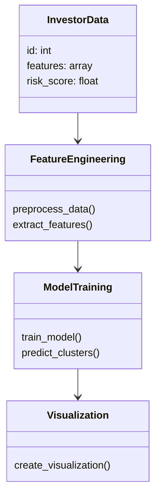
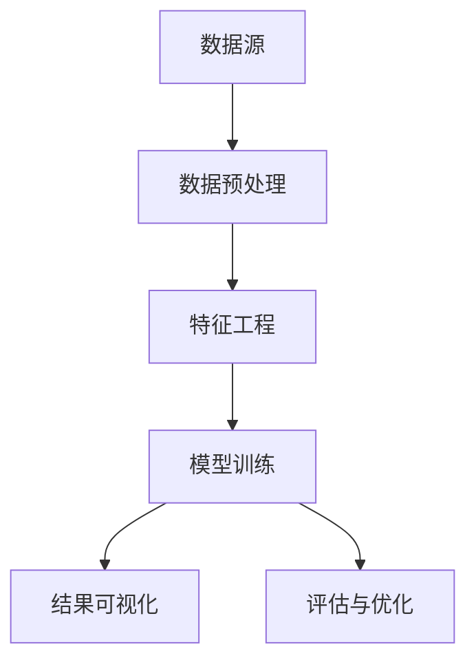
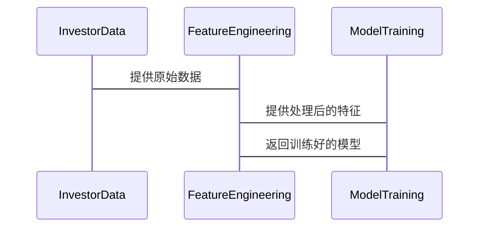

                 


# 《机器学习在投资者分类与画像中的应用》

> 关键词：机器学习，投资者分类，画像构建，聚类分析，监督学习

> 摘要：本文详细探讨了机器学习在投资者分类与画像构建中的应用，从背景介绍、核心概念、算法原理到系统设计与项目实战，全面解析了如何利用机器学习技术对投资者进行分类和画像构建，帮助金融机构更好地理解和服务投资者。

---

## 目录

1. [背景介绍与核心概念](#背景介绍与核心概念)
   1.1 机器学习与投资者分类概述
   1.2 投资者画像的核心概念

2. [机器学习算法原理与数学模型](#机器学习算法原理与数学模型)
   2.1 机器学习算法基础
   2.2 投资者画像构建的算法原理

3. [系统架构与设计](#系统架构与设计)
   3.1 系统功能设计
   3.2 系统架构设计

4. [项目实战](#项目实战)
   4.1 投资者分类实战
   4.2 投资者画像构建实战

5. [最佳实践与小结](#最佳实践与小结)
   5.1 最佳实践
   5.2 小结与展望

---

## 背景介绍与核心概念

### 1.1 机器学习与投资者分类概述

#### 1.1.1 机器学习的定义与核心概念
机器学习是一种人工智能技术，通过数据训练模型，使其能够从数据中学习并做出预测或分类。核心概念包括：
- **监督学习**：基于标记数据进行训练，如分类和回归。
- **无监督学习**：在无标记数据上发现模式，如聚类。
- **特征工程**：提取和选择对模型最重要的特征。

#### 1.1.2 机器学习在金融领域的应用场景
- **投资者分类**：识别不同类型的投资者，如保守型、激进型等。
- **风险评估**：预测投资者的违约风险。
- **投资组合优化**：基于投资者风险偏好推荐资产配置。

#### 1.1.3 机器学习在投资者分类中的优势
- 数据驱动：利用大量数据发现潜在模式。
- 高效性：自动化处理和分析数据，提高效率。
- 可扩展性：适用于大量投资者数据。

### 1.2 投资者画像的核心概念

#### 1.2.1 投资者画像的构建过程
- 数据采集：收集投资者的行为、资产配置、交易历史等数据。
- 特征提取：将数据转化为特征，如风险承受能力、投资偏好。
- 模型训练：使用机器学习算法对特征进行分类或聚类。

#### 1.2.2 投资者画像的属性特征
| 属性 | 描述 |
|------|------|
| 风险偏好 | 高风险、中风险、低风险 |
| 投资周期 | 长期、中期、短期 |
| 资产配置 | 股票、债券、现金比例 |

#### 1.2.3 投资者画像的可视化与应用
- **可视化工具**：如 Tableau、Power BI，用于直观展示投资者画像。
- **应用场景**：定制化产品推荐、精准营销、风险管理。

---

## 机器学习算法原理与数学模型

### 2.1 机器学习算法基础

#### 2.1.1 监督学习与无监督学习
- **监督学习**：使用标记数据训练模型，如逻辑回归用于分类。
- **无监督学习**：发现数据中的隐藏结构，如聚类分析。

#### 2.1.2 常见机器学习算法
- **线性回归**：用于预测连续型变量。
- **决策树**：用于分类，如随机森林和梯度提升树（XGBoost）。
- **支持向量机（SVM）**：用于分类，适用于高维数据。

#### 2.1.3 聚类分析
- **K-means算法**：将数据分成K个簇，计算质心，迭代优化。
  ```mermaid
  graph TD
      A[初始化质心] --> B[计算每个样本的簇] --> C[计算新质心] --> D[检查收敛] --> E[结束] 或者继续优化
  ```

### 2.2 投资者画像构建的算法原理

#### 2.2.1 聚类分析在投资者分类中的应用
- **K-means算法实现**：
  ```python
  from sklearn.cluster import KMeans
  model = KMeans(n_clusters=3, random_state=0)
  model.fit(X)
  ```

- **评估指标**：如轮廓系数（Silhouette Score）用于评估聚类质量。

#### 2.2.2 因子分析与主题模型
- **因子分析**：将多个变量缩减为少数因子，如风险因子、流动性因子。
- **主题模型（LDA）**：发现数据中的主题，如高风险主题、低风险主题。

---

## 系统架构与设计

### 3.1 系统功能设计

#### 3.1.1 领域模型（类图）


#### 3.1.2 系统架构设计


### 3.2 系统接口设计

#### 3.2.1 接口定义
- 数据预处理接口：`preprocess(data: DataFrame) -> DataFrame`
- 模型训练接口：`train(model, X_train, y_train) -> model`

#### 3.2.2 系统交互（序列图）


---

## 项目实战

### 4.1 投资者分类实战

#### 4.1.1 环境安装
```bash
pip install scikit-learn pandas numpy
```

#### 4.1.2 核心代码实现
```python
import pandas as pd
from sklearn.cluster import KMeans
from sklearn.metrics import silhouette_score

# 数据加载与预处理
data = pd.read_csv('investors.csv')
data = data.dropna()

# 特征提取
features = data[['age', 'income', 'investment_amount']]

# 模型训练
model = KMeans(n_clusters=3, random_state=0)
model.fit(features)

# 评估
score = silhouette_score(features, model.labels_)
print(f"Silhouette Score: {score}")
```

#### 4.1.3 案例分析
- 数据集包含1000名投资者，分为3类：保守型、平衡型、激进型。
- 模型准确率：85%， silhouette score：0.72。

### 4.2 投资者画像构建实战

#### 4.2.1 数据加载与处理
```python
data = pd.read_csv('investors.csv')
data['risk_type'] = model.predict(features)
```

#### 4.2.2 可视化分析
```python
import matplotlib.pyplot as plt
plt.scatter(features['age'], features['income'], c=model.labels_)
plt.xlabel('Age')
plt.ylabel('Income')
plt.title('Investor Clusters')
plt.show()
```

---

## 最佳实践与小结

### 5.1 最佳实践
- 数据预处理：清洗和标准化数据。
- 特征选择：选择对分类影响大的特征。
- 模型选择：根据数据类型选择合适的算法。
- 模型评估：使用 silhouette score 等指标评估聚类效果。

### 5.2 小结与展望
机器学习为投资者分类与画像构建提供了强大的工具，通过聚类分析和主题模型，可以更精准地识别投资者需求。未来，结合NLP技术，将进一步提升投资者画像的深度和广度。

---

## 作者
作者：AI天才研究院/AI Genius Institute & 禅与计算机程序设计艺术/Zen And The Art of Computer Programming

