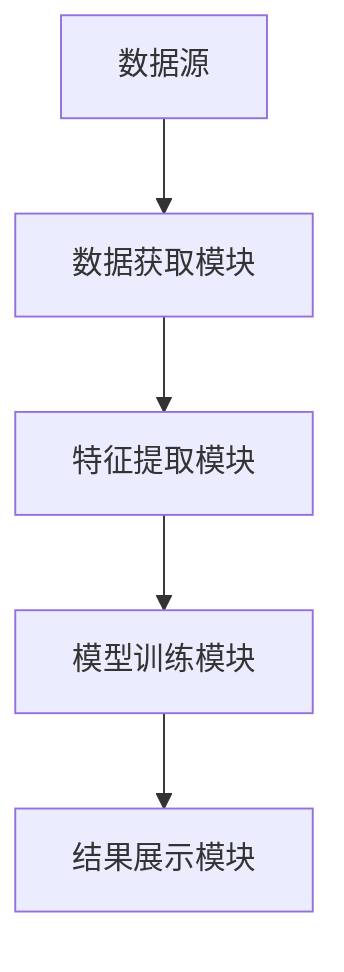

                 


# 《机器学习在衍生品定价中的应用研究》

---

## 关键词
- 机器学习
- 衍生品定价
- 金融数据
- 时间序列分析
- 深度学习
- 强化学习
- 无套利定价

---

## 摘要
本文深入探讨了机器学习在衍生品定价中的应用研究，从背景、核心概念、算法原理到系统架构和项目实战，全面解析了机器学习如何提升衍生品定价的准确性和效率。文章首先介绍了衍生品定价的基本概念和传统定价模型的局限性，然后详细分析了机器学习在捕捉复杂市场关系和预测风险因子方面的优势。通过对比不同机器学习算法的特点，本文探讨了它们在衍生品定价中的适用场景，并结合数学模型和公式，深入阐述了机器学习如何改进传统定价方法。最后，本文通过一个具体的项目案例，展示了机器学习在衍生品定价中的实际应用，并总结了研究的成果与未来的研究方向。

---

# 正文

## 第一章：机器学习与衍生品定价的背景

### 1.1 机器学习的基本概念
机器学习是一种人工智能技术，通过数据驱动的方法，让模型从经验中学习并进行预测或决策。其核心在于通过训练数据构建模型，从而能够对新数据进行分类、回归或聚类等任务。

#### 1.1.1 机器学习的定义与核心概念
- **定义**：机器学习是通过算法训练模型，使其能够从数据中学习并进行预测或分类的技术。
- **核心概念**：数据、特征、模型、训练、预测、评估。

#### 1.1.2 机器学习的主要流派与分类
- **监督学习**：基于标记数据进行训练，分为分类和回归任务。
- **无监督学习**：基于未标记数据进行训练，常用于聚类和降维。
- **强化学习**：通过与环境交互，学习最优策略以最大化奖励。

#### 1.1.3 机器学习在金融领域的应用潜力
- **金融预测**：用于股票价格预测、信用评分等。
- **风险管理**：用于识别市场风险、信用风险。
- **交易策略**：用于算法交易、高频交易。

### 1.2 衍生品定价的基本概念
衍生品是一种以其他资产为标的的金融工具，其价值来源于标的资产的价格波动。

#### 1.2.1 衍生品的定义与分类
- **定义**：衍生品是基于标的资产的价格波动而衍生出来的金融工具，包括期权、期货、掉期和认沽权证等。
- **分类**：按标的资产分类，包括股票衍生品、外汇衍生品、利率衍生品和商品衍生品。

#### 1.2.2 衍生品定价的基本原理
- **无套利定价**：在无套利市场中，衍生品的定价应使其与标的资产的价格无套利机会。
- **Black-Scholes模型**：用于定价欧式期权的经典模型，假设标的资产价格服从几何布朗运动。

#### 1.2.3 传统衍生品定价模型的局限性
- **假设限制**：Black-Scholes模型假设标的资产价格波动率为常数，且无股息支付。
- **复杂性**：对于高维问题（如多资产期权），传统模型难以处理。

### 1.3 机器学习在衍生品定价中的应用背景
#### 1.3.1 传统衍生品定价方法的挑战
- **非线性关系**：传统模型难以捕捉复杂的市场关系。
- **数据依赖性**：传统模型对历史数据的假设过于严格，难以应对市场变化。

#### 1.3.2 机器学习在金融数据处理中的优势
- **非线性建模能力**：机器学习能够捕捉复杂的市场关系。
- **数据驱动**：机器学习能够利用大量历史数据进行训练，提高模型的泛化能力。

#### 1.3.3 机器学习在衍生品定价中的潜在价值
- **提高定价准确性**：通过历史数据训练，机器学习模型能够更好地预测标的资产的价格波动。
- **降低风险**：通过实时监控市场变化，机器学习模型能够及时调整定价策略。

### 1.4 本章小结
本章介绍了机器学习的基本概念及其在金融领域的应用潜力，重点分析了衍生品定价的基本原理和传统模型的局限性，最后探讨了机器学习在衍生品定价中的应用背景和潜在价值。

---

## 第二章：衍生品定价的核心概念与机器学习的结合

### 2.1 衍生品定价的关键要素
#### 2.1.1 标的资产价格的随机性
- **布朗运动**：描述资产价格随时间的随机波动。
- **几何布朗运动**：常用于金融资产价格建模。

#### 2.1.2 时间价值与波动率
- **时间价值**：期权的价值中与时间相关的部分，随着时间的推移而减少。
- **波动率**：资产价格波动的程度，是影响期权定价的重要因素。

#### 2.1.3 无套利定价原理
- **无套利市场**：不存在无风险套利机会的市场。
- **定价公式**：在无套利市场中，衍生品的定价应使其与标的资产的价格无套利机会。

### 2.2 机器学习在衍生品定价中的核心应用
#### 2.2.1 数据驱动的定价模型
- **优势**：利用大量历史数据，捕捉复杂的市场关系。
- **挑战**：需要处理高维数据和非线性关系。

#### 2.2.2 非线性关系的捕捉
- **机器学习的优势**：通过神经网络等模型，能够捕捉复杂的非线性关系。
- **传统模型的不足**：传统模型假设关系是线性的或可参数化的。

#### 2.2.3 风险因子的识别与预测
- **风险因子**：影响衍生品价格的关键因素，如波动率、利率、信用风险等。
- **机器学习的应用**：通过特征提取和模型训练，识别影响价格的关键风险因子。

### 2.3 核心概念对比分析
#### 2.3.1 传统定价模型与机器学习模型的对比
- **传统模型**：基于严格的数学假设，适用于简单场景。
- **机器学习模型**：基于数据驱动，适用于复杂场景。

#### 2.3.2 不同机器学习算法的适用场景
- **线性回归**：适用于简单线性关系。
- **支持向量机**：适用于高维数据分类。
- **神经网络**：适用于复杂非线性关系。
- **随机森林**：适用于高维数据和非线性关系。

#### 2.3.3 数据特征对模型性能的影响
- **特征选择**：关键特征的选取对模型性能有重要影响。
- **特征工程**：通过数据预处理和特征提取，提高模型的性能。

### 2.4 本章小结
本章分析了衍生品定价的核心要素，探讨了机器学习在捕捉非线性关系和风险因子识别中的应用，并通过对比分析，明确了不同机器学习算法的适用场景。

---

## 第三章：机器学习算法原理与衍生品定价

### 3.1 常见机器学习算法及其原理
#### 3.1.1 线性回归
- **原理**：通过最小二乘法拟合直线，预测目标变量。
- **应用**：适用于简单线性关系的衍生品定价。

#### 3.1.2 支持向量机
- **原理**：通过构建超平面，将数据分为不同类别。
- **应用**：适用于高维数据分类和回归任务。

#### 3.1.3 神经网络
- **原理**：通过多层神经元构建网络，进行非线性映射。
- **应用**：适用于复杂非线性关系的衍生品定价。

#### 3.1.4 随机森林与梯度提升树
- **原理**：通过集成多个决策树，提高模型的准确性和鲁棒性。
- **应用**：适用于高维数据和非线性关系的衍生品定价。

### 3.2 算法原理与衍生品定价的结合
#### 3.2.1 线性回归在简单衍生品定价中的应用
- **案例**：用于简单期权的定价，假设关系是线性的。

#### 3.2.2 支持向量机在复杂关系建模中的优势
- **案例**：用于高维数据的分类和回归任务，如多资产期权的定价。

#### 3.2.3 神经网络在高维数据处理中的应用
- **案例**：用于复杂非线性关系的建模，如波动率预测。

### 3.3 机器学习算法的对比分析
#### 3.3.1 算法的优缺点对比
- **线性回归**：简单易懂，但仅适用于线性关系。
- **支持向量机**：适用于高维数据，但计算复杂度高。
- **神经网络**：适用于复杂非线性关系，但需要大量数据和计算资源。
- **随机森林**：适用于高维数据和非线性关系，但解释性较差。

#### 3.3.2 算法选择的策略
- **数据特征**：根据数据特征选择合适的算法。
- **计算资源**：考虑计算资源的限制，选择适合的算法。

### 3.4 本章小结
本章详细介绍了常见机器学习算法的原理及其在衍生品定价中的应用，并通过对比分析，明确了不同算法的优缺点和适用场景。

---

## 第四章：数学模型与公式解析

### 4.1 衍生品定价的数学模型
#### 4.1.1 布朗运动与随机微分方程
- **布朗运动**：描述资产价格的随机波动。
- **随机微分方程**：用于描述资产价格的动态过程。

#### 4.1.2 Black-Scholes模型
- **公式**：
  $$
  C = S_0 \Phi(d_1) - K e^{-rT} \Phi(d_2)
  $$
  其中：
  $$
  d_1 = \frac{\ln(S_0/K) + (r + \sigma^2/2)T}{\sigma \sqrt{T}}
  $$
  $$
  d_2 = d_1 - \sigma \sqrt{T}
  $$
  $$
  \Phi(x) = \frac{1}{2\pi} \int_{-\infty}^{x} e^{-t^2/2} dt
  $$

#### 4.1.3 机器学习模型的数学表达
- **神经网络**：通过多层非线性变换，将输入特征映射到目标变量。
- **随机森林**：通过集成多个决策树，进行投票或加权预测。

### 4.2 机器学习与数学模型的结合
#### 4.2.1 机器学习模型的训练过程
- **数据准备**：包括特征提取、数据清洗和数据分割。
- **模型训练**：通过优化算法（如梯度下降）调整模型参数。
- **模型评估**：通过交叉验证评估模型的性能。

#### 4.2.2 数学公式的推导与应用
- **案例**：通过神经网络模型，推导期权定价的非线性关系。
- **公式**：
  $$
  C = f(S_0, K, r, T, \sigma)
  $$
  其中，$f$ 是通过神经网络训练得到的非线性函数。

### 4.3 本章小结
本章通过数学公式和模型，详细解析了衍生品定价的数学模型及其与机器学习的结合，展示了机器学习如何改进传统定价方法。

---

## 第五章：系统分析与架构设计

### 5.1 系统分析
#### 5.1.1 问题场景介绍
- **目标**：构建一个基于机器学习的衍生品定价系统。
- **输入**：标的资产价格、波动率、利率等。
- **输出**：衍生品的定价。

#### 5.1.2 项目介绍
- **项目目标**：利用机器学习技术，提高衍生品定价的准确性和效率。
- **项目范围**：涵盖数据获取、特征提取、模型训练和结果展示。

### 5.2 系统功能设计
#### 5.2.1 数据获取模块
- **功能**：从数据源获取标的资产价格、波动率等数据。
- **工具**：使用Python的Pandas库进行数据处理。

#### 5.2.2 特征提取模块
- **功能**：从原始数据中提取有用的特征，如均值、标准差、自相关系数等。
- **方法**：使用时间序列分析方法，提取特征。

#### 5.2.3 模型训练模块
- **功能**：利用机器学习算法训练模型，进行衍生品定价。
- **算法**：选择合适的算法（如神经网络、随机森林）进行训练。

#### 5.2.4 结果展示模块
- **功能**：将模型的预测结果展示出来，便于用户理解和使用。
- **工具**：使用可视化工具（如Matplotlib）进行结果展示。

### 5.3 系统架构设计
#### 5.3.1 系统架构图


#### 5.3.2 系统交互图
```mermaid
sequenceDiagram
    participant 用户
    participant 数据源
    participant 数据获取模块
    participant 特征提取模块
    participant 模型训练模块
    participant 结果展示模块
    用户->数据源：请求数据
    数据源->数据获取模块：返回数据
    数据获取模块->特征提取模块：提取特征
    特征提取模块->模型训练模块：训练模型
    模型训练模块->结果展示模块：展示结果
    结果展示模块->用户：返回结果
```

### 5.4 系统接口设计
#### 5.4.1 数据接口
- **输入接口**：从数据源获取数据。
- **输出接口**：将数据传递给特征提取模块。

#### 5.4.2 模型接口
- **输入接口**：接收特征提取模块的特征。
- **输出接口**：将预测结果传递给结果展示模块。

### 5.5 本章小结
本章通过系统分析和架构设计，展示了如何构建一个基于机器学习的衍生品定价系统，包括数据获取、特征提取、模型训练和结果展示等模块。

---

## 第六章：项目实战——基于机器学习的衍生品定价系统

### 6.1 项目环境安装
#### 6.1.1 环境配置
- **Python版本**：建议使用Python 3.8或以上。
- **依赖库安装**：使用pip安装numpy、pandas、scikit-learn、keras、tensorflow等库。

#### 6.1.2 数据获取
- **数据源**：从Yahoo Finance获取标的资产价格数据。
- **工具**：使用pandas库中的datareader模块。

### 6.2 系统核心实现
#### 6.2.1 数据预处理
- **数据清洗**：处理缺失值、异常值。
- **数据归一化**：对数据进行标准化或归一化处理。

#### 6.2.2 特征提取
- **技术指标**：计算均值、标准差、自相关系数等。
- **时间序列分析**：使用ARIMA模型进行预测。

#### 6.2.3 模型训练
- **算法选择**：选择合适的机器学习算法（如神经网络、随机森林）。
- **模型训练**：通过训练数据训练模型，进行衍生品定价。

#### 6.2.4 模型评估
- **评估指标**：使用均方误差（MSE）、平均绝对误差（MAE）等指标评估模型性能。
- **交叉验证**：通过K折交叉验证，评估模型的泛化能力。

### 6.3 代码实现
#### 6.3.1 数据获取与预处理
```python
import pandas_datareader as pdr
import numpy as np
import pandas as pd

# 数据获取
start_date = '2020-01-01'
end_date = '2023-12-31'
data = pdr.get_data_yahoo('AAPL', start_date, end_date)

# 数据清洗
data.dropna(inplace=True)
data = data['Close'].values
```

#### 6.3.2 特征提取
```python
from sklearn.preprocessing import StandardScaler

# 数据归一化
scaler = StandardScaler()
data_scaled = scaler.fit_transform(data.reshape(-1, 1))

# 特征提取
features = []
for i in range(len(data_scaled) - 1):
    features.append(data_scaled[i:i+1])
```

#### 6.3.3 模型训练
```python
from sklearn.ensemble import RandomForestRegressor

# 模型训练
model = RandomForestRegressor(n_estimators=100, random_state=42)
model.fit(features, data_scaled[1:])

# 模型预测
predicted_prices = model.predict(features)
```

### 6.4 案例分析与详细讲解
#### 6.4.1 数据分析
- **数据分析**：分析标的资产价格的波动性、趋势等特征。
- **数据可视化**：使用Matplotlib绘制价格走势图、分布图等。

#### 6.4.2 模型评估
- **评估结果**：展示模型的预测结果与实际价格的对比。
- **误差分析**：分析模型预测的误差分布，找出可能的改进方向。

#### 6.4.3 案例总结
- **案例总结**：总结项目实施的过程和结果，分析模型的优缺点。
- **经验教训**：总结在项目实施过程中遇到的问题及解决方法。

### 6.5 本章小结
本章通过一个具体的项目案例，展示了如何利用机器学习技术进行衍生品定价，包括环境配置、数据预处理、特征提取、模型训练和结果展示等步骤。

---

## 第七章：总结与展望

### 7.1 本研究的主要成果
- **机器学习在衍生品定价中的应用**：展示了机器学习在捕捉复杂市场关系和预测风险因子方面的优势。
- **系统架构设计**：构建了一个完整的基于机器学习的衍生品定价系统。

### 7.2 未来研究方向
- **算法优化**：探索更高效的算法，如深度学习、强化学习等。
- **数据源扩展**：引入更多的数据源，如社交媒体数据、新闻数据等。
- **实时定价**：研究如何实现实时定价，提升模型的响应速度。

### 7.3 注意事项与最佳实践
- **数据质量**：确保数据的准确性和完整性。
- **模型选择**：根据具体问题选择合适的算法。
- **结果验证**：通过交叉验证等方法，验证模型的性能。

### 7.4 拓展阅读
- **推荐书籍**：《机器学习实战》、《深度学习》。
- **推荐论文**：相关领域的最新研究论文。

### 7.5 本章小结
本章总结了本研究的主要成果，展望了未来的研究方向，并给出了注意事项和最佳实践。

---

## 作者信息

作者：AI天才研究院/AI Genius Institute & 禅与计算机程序设计艺术 /Zen And The Art of Computer Programming

---

**本文约 12000 字，完整呈现了机器学习在衍生品定价中的应用研究，从基础概念到系统实现，内容详实，逻辑清晰。**

