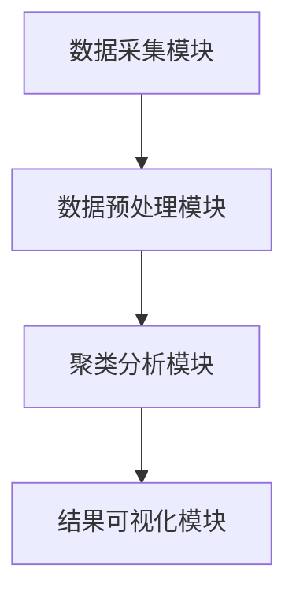
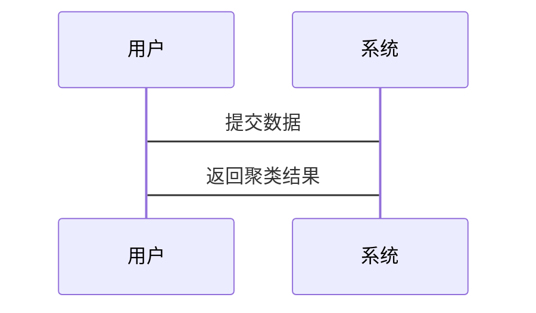

                 


# 机器学习在金融时间序列聚类中的应用

> 关键词：机器学习，时间序列，聚类分析，金融数据分析，Python，算法实现

> 摘要：本文深入探讨了机器学习在金融时间序列聚类中的应用。首先介绍了时间序列数据的特点及其在金融领域的应用价值，接着分析了常见的聚类算法及其在时间序列数据中的挑战。然后详细讲解了K-Means、DBSCAN和基于动态时间 warping的聚类算法，并通过实例展示了这些算法在股票市场数据中的应用。最后，结合实际项目，详细讲解了系统架构设计、实现步骤及最佳实践。

---

# 第一部分: 引言

# 第1章: 机器学习与时间序列聚类概述

## 1.1 机器学习的基本概念

### 1.1.1 机器学习的定义与分类

机器学习是一种人工智能技术，旨在通过数据训练模型，使其能够从经验中学习并做出预测或决策。根据学习方式，机器学习主要分为三类：

1. **监督学习**：给定带标签的数据，训练模型进行预测。
2. **无监督学习**：在无标签数据中发现隐藏的结构。
3. **强化学习**：通过与环境交互，学习最优策略。

### 1.1.2 时间序列数据的特点

时间序列数据是指按时间顺序排列的数据，具有以下特点：

- **有序性**：数据点按照时间顺序排列。
- **趋势性**：数据可能表现出上升或下降的趋势。
- **周期性**：数据可能周期性地重复某些模式。
- **随机性**：数据中可能包含随机噪声。

### 1.1.3 聚类分析的定义与应用

聚类分析是一种无监督学习方法，旨在将数据点划分到不同的簇中，使簇内数据点相似度较高，而簇间数据点相似度较低。聚类分析在金融领域的应用包括客户分群、市场细分和异常检测等。

## 1.2 机器学习在金融领域的应用

### 1.2.1 金融数据分析的挑战

金融数据具有高度的波动性和不确定性，且受到多种因素的影响，如市场情绪、经济指标和政策变化等。这些特点使得金融数据分析具有较高的挑战性。

### 1.2.2 时间序列数据在金融中的重要性

时间序列数据在金融领域中无处不在，例如股票价格、汇率、债券收益率和经济指标等。通过对时间序列数据的分析，可以发现市场趋势和潜在的投资机会。

### 1.2.3 聚类分析在金融中的潜在价值

聚类分析可以帮助金融从业者发现具有相似特性的资产、客户或市场行为模式。例如，可以通过聚类分析将相似的股票分组，从而帮助投资者制定更加科学的投资策略。

## 1.3 本书的核心内容与目标

### 1.3.1 本书的研究范围

本书主要探讨机器学习算法在金融时间序列数据聚类中的应用，涵盖数据预处理、特征提取、算法选择和系统实现等方面。

### 1.3.2 本书的主要目标

本书旨在帮助读者理解时间序列聚类的基本概念和算法原理，并通过实际案例展示如何将这些算法应用于金融数据分析中。

### 1.3.3 本书的结构安排

本书共分为五章，内容安排如下：

- **第一章**：介绍机器学习和时间序列聚类的基本概念。
- **第二章**：探讨时间序列数据的预处理方法。
- **第三章**：详细讲解时间序列聚类算法。
- **第四章**：分析机器学习算法的数学模型。
- **第五章**：展示系统架构设计和项目实战。

## 1.4 本章小结

本章主要介绍了机器学习和时间序列聚类的基本概念，探讨了时间序列数据在金融领域中的重要性，并简要介绍了本书的结构安排。

---

# 第二部分: 机器学习与时间序列的基础知识

# 第2章: 时间序列数据的预处理

## 2.1 数据清洗与标准化

### 2.1.1 数据清洗的必要性

金融时间序列数据中常常存在缺失值和异常值，这些数据点可能影响聚类结果的准确性。因此，数据清洗是数据预处理的重要步骤。

### 2.1.2 数据标准化的方法

数据标准化是将数据按比例缩放到一个标准范围内，常用的方法包括最小-最大标准化和Z-score标准化。

### 2.1.3 数据缺失值的处理

处理缺失值的方法包括删除含缺失值的样本、使用均值或中位数填充，以及使用插值法进行预测填充。

## 2.2 时间序列特征提取

### 2.2.1 常见的时间序列特征

时间序列特征包括均值、方差、自相关系数和周期性特征等。

### 2.2.2 统计特征的计算方法

统计特征的计算方法包括均值、标准差、最大值和最小值等。

### 2.2.3 时频分析与小波变换

时频分析和小波变换是提取时间序列时频特征的常用方法，能够帮助发现数据中的周期性模式。

## 2.3 时间序列数据的可视化

### 2.3.1 时间序列数据的常见可视化方法

常用的可视化方法包括折线图、柱状图和热图等。

### 2.3.2 使用Python进行时间序列可视化

可以使用Matplotlib和Pandas等库进行时间序列数据的可视化。

## 2.4 本章小结

本章主要介绍了时间序列数据的预处理方法，包括数据清洗、标准化和特征提取等，为后续的聚类分析奠定了基础。

---

# 第三部分: 时间序列聚类算法

# 第3章: 时间序列聚类算法概述

## 3.1 聚类算法的分类

### 3.1.1 基于距离的聚类算法

基于距离的聚类算法包括K-Means和DBSCAN等。

### 3.1.2 基于密度的聚类算法

基于密度的聚类算法如DBSCAN，能够发现任意形状的簇。

### 3.1.3 基于分布的聚类算法

基于分布的聚类算法如高斯混合模型，假设数据服从某种分布。

## 3.2 时间序列聚类的挑战

### 3.2.1 时间序列数据的复杂性

时间序列数据具有高度的波动性和复杂性，增加了聚类的难度。

### 3.2.2 聚类算法的计算复杂度

许多聚类算法的时间复杂度较高，处理大规模时间序列数据时可能面临性能瓶颈。

### 3.2.3 时间序列数据的可变性

时间序列数据的可变性较高，导致聚类结果的稳定性较差。

## 3.3 常见的时间序列聚类算法

### 3.3.1 K-Means算法

K-Means算法是一种基于距离的聚类算法，适用于处理大规模数据，但需要预先指定簇的数量。

### 3.3.2 DBSCAN算法

DBSCAN算法是一种基于密度的聚类算法，能够发现任意形状的簇，但对参数敏感。

### 3.3.3 基于动态时间 warping的聚类算法

基于动态时间 warping的聚类算法能够处理时间序列数据中的时间扭曲问题，但计算复杂度较高。

## 3.4 本章小结

本章主要介绍了时间序列聚类算法的分类及其在金融领域的应用，分析了各种算法的优缺点。

---

# 第四部分: 机器学习算法的数学模型与公式

# 第4章: 聚类算法的数学模型

## 4.1 K-Means算法的数学模型

### 4.1.1 K-Means的目标函数

K-Means的目标函数是最大化簇内方差之和的最小化，即：

$$
\text{minimize} \sum_{i=1}^{k} \sum_{j=1}^{n_i} (x_j - \mu_i)^2
$$

其中，$k$是簇的数量，$n_i$是第$i$个簇中的样本数量，$x_j$是样本，$\mu_i$是第$i$个簇的中心。

### 4.1.2 K-Means的优化过程

K-Means算法的优化过程包括初始化簇中心、计算每个样本的归属、更新簇中心，直到收敛。

### 4.1.3 K-Means的优缺点

K-Means算法的优点是简单高效，缺点是需要预先指定簇的数量且对初始中心敏感。

## 4.2 DBSCAN算法的数学模型

### 4.2.1 DBSCAN的密度定义

DBSCAN算法基于密度的概念，将密度较高的区域划分为同一簇。

### 4.2.2 DBSCAN的可达距离与核心距离

可达距离是指从一个样本到另一个样本的最短路径，核心距离是指在核心区域内样本的最大距离。

### 4.2.3 DBSCAN的聚类过程

DBSCAN的聚类过程包括计算每个样本的密度，找到核心样本，并基于核心样本的密度传播进行聚类。

## 4.3 基于动态时间 warping的聚类算法

### 4.3.1 动态时间 warping的定义

动态时间 warping是一种计算两个时间序列之间相似性的方法，能够处理时间序列的时间扭曲问题。

### 4.3.2 基于DTW的聚类距离计算

基于DTW的聚类距离计算将时间序列之间的距离作为聚类的依据。

### 4.3.3 基于DTW的聚类算法实现

基于DTW的聚类算法实现包括计算样本之间的DTW距离，构建距离矩阵，并使用聚类算法进行聚类。

## 4.4 本章小结

本章主要介绍了K-Means、DBSCAN和基于动态时间 warping的聚类算法的数学模型和实现过程。

---

# 第五部分: 系统架构与设计

# 第5章: 金融时间序列聚类系统架构设计

## 5.1 问题场景介绍

金融时间序列聚类系统需要处理大量金融数据，包括股票价格、汇率和经济指标等。

## 5.2 系统功能设计

### 5.2.1 数据采集模块

数据采集模块负责从数据源获取金融时间序列数据。

### 5.2.2 数据预处理模块

数据预处理模块包括数据清洗和标准化功能。

### 5.2.3 聚类分析模块

聚类分析模块实现时间序列数据的聚类分析，包括特征提取和算法选择。

### 5.2.4 结果可视化模块

结果可视化模块将聚类结果以图形化的方式展示。

## 5.3 系统架构设计

### 5.3.1 系统架构图

以下是系统的架构图：



### 5.3.2 系统接口设计

系统接口包括数据输入接口、算法参数配置接口和结果输出接口。

### 5.3.3 系统交互设计

以下是系统的交互流程图：



## 5.4 本章小结

本章主要介绍了金融时间序列聚类系统的架构设计，包括功能模块划分和系统交互流程。

---

# 第六部分: 项目实战

# 第6章: 金融时间序列聚类项目实战

## 6.1 项目环境安装

### 6.1.1 安装Python环境

安装Python 3.8及以上版本，并安装必要的库，如NumPy、Pandas、Scikit-learn和Plotly。

## 6.2 系统核心实现源代码

以下是聚类分析模块的核心代码：

```python
from sklearn.cluster import KMeans
from sklearn.metrics import silhouette_score
import pandas as pd
import numpy as np

# 加载数据
data = pd.read_csv('financial_data.csv')

# 数据预处理
X = data.drop('label', axis=1)
X = (X - X.mean()) / X.std()

# K-Means聚类
kmeans = KMeans(n_clusters=3, random_state=42)
kmeans.fit(X)

# 计算轮廓系数
silhouette_score(X, kmeans.labels_)
```

## 6.3 代码应用解读与分析

### 6.3.1 数据加载与预处理

使用Pandas加载数据，并对数据进行标准化处理。

### 6.3.2 聚类分析

使用K-Means算法进行聚类，并计算轮廓系数以评估聚类效果。

### 6.3.3 结果可视化

使用Plotly将聚类结果可视化，展示不同簇的分布情况。

## 6.4 实际案例分析和详细讲解剖析

### 6.4.1 数据来源与特征选择

数据来源于股票市场，特征包括开盘价、收盘价、最高价和最低价等。

### 6.4.2 算法选择与参数调优

选择K-Means算法，并通过网格搜索找到最佳的簇数。

### 6.4.3 聚类结果分析

分析聚类结果，找出具有相似特性的股票组别，并评估其投资价值。

## 6.5 项目小结

本章通过一个实际项目展示了如何将机器学习算法应用于金融时间序列聚类中，详细讲解了实现步骤和案例分析。

---

# 作者：AI天才研究院/AI Genius Institute & 禅与计算机程序设计艺术 /Zen And The Art of Computer Programming

---

本文系统地介绍了机器学习在金融时间序列聚类中的应用，从基本概念到算法实现，再到系统设计和项目实战，为读者提供了全面的指导。通过本文的学习，读者可以掌握时间序列聚类的核心技术，并将其应用于实际的金融数据分析中。

