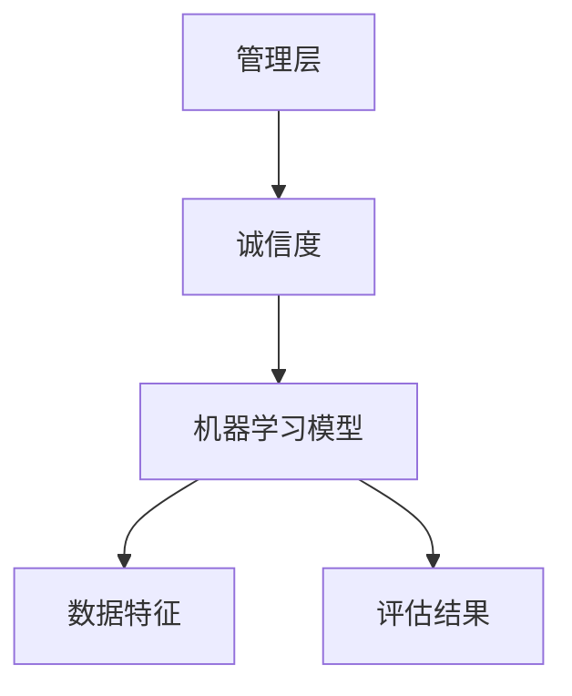
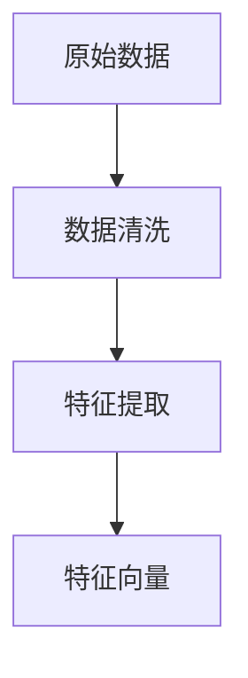
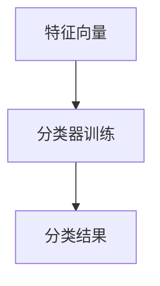
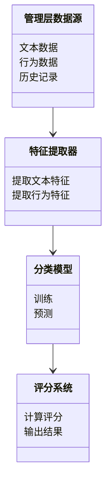
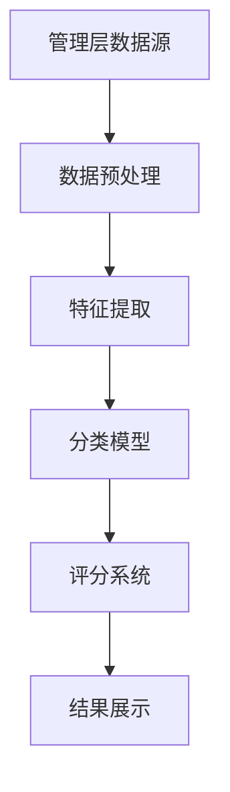
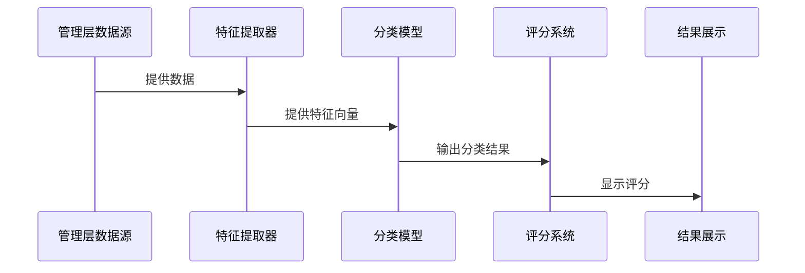

                 


# 《机器学习模型评估管理层诚信度》

---

## 关键词：
- 机器学习
- 诚信度评估
- 管理层
- 模型构建
- 数据特征
- 评估系统
- 伦理风险

---

## 摘要：
本文探讨了利用机器学习模型评估管理层诚信度的方法，结合数据分析、特征工程和模型构建，提出了一种基于多维度数据的评估框架。通过分析管理层的行为数据、决策记录和历史表现，构建了特征提取和分类模型，提出了评分系统的设计与实现，并探讨了系统的架构与实现细节。本文还通过实际案例分析，展示了模型的应用效果，并提出了伦理与隐私保护的注意事项，为管理层诚信度评估提供了新的思路。

---

## 目录大纲

---

# 第1章: 背景介绍与核心概念

## 1.1 问题背景
### 1.1.1 管理层诚信度的重要性
在企业治理中，管理层的诚信度直接影响企业的长期发展和声誉。然而，传统的诚信度评估方法通常依赖于主观判断，缺乏客观性和数据支持。

### 1.1.2 传统诚信度评估的局限性
- 依赖个人主观判断
- 数据来源单一
- 缺乏量化标准

### 1.1.3 机器学习在诚信度评估中的潜力
- 数据驱动的客观性
- 大数据分析能力
- 高效的模式识别

---

## 1.2 问题描述
### 1.2.1 管理层诚信度的定义与维度
- 行为规范性
- 决策透明度
- 利益冲突
- 历史表现

### 1.2.2 机器学习模型在诚信度评估中的应用范围
- 数据特征提取
- 分类与评分
- 预测与预警

### 1.2.3 问题解决的目标与意义
- 提供量化评估标准
- 发现潜在风险
- 优化企业治理

---

## 1.3 核心概念与联系
### 1.3.1 核心概念的定义与属性特征对比
| 概念       | 属性特征 |
|------------|----------|
| 管理层诚信度 | 主观性、可量化性、动态性 |
| 机器学习模型 | 数据驱动性、可解释性、泛化能力 |

### 1.3.2 实体关系图


---

## 1.4 本章小结

---

# 第2章: 核心概念与联系

## 2.1 核心概念的原理
### 2.1.1 管理层诚信度的多维度特征
- 行为特征
- 决策特征
- 社交特征

### 2.1.2 机器学习模型的分类与选择
- 监督学习
- 无监督学习
- 混合模型

---

## 2.2 核心概念的联系
### 2.2.1 数据特征与诚信度的关系
- 正相关性
- 负相关性
- 非线性关系

### 2.2.2 模型选择与评估目标的匹配
- 分类模型的适用场景
- 回归模型的适用场景

---

## 2.3 本章小结

---

# 第3章: 算法原理与实现

## 3.1 算法原理
### 3.1.1 特征提取
- 文本特征提取
- 行为特征提取
- 数据预处理

### 3.1.2 分类模型
- 支持向量机 (SVM)
- 随机森林 (Random Forest)
- 神经网络

### 3.1.3 评分系统
- 分数计算
- 风险评估

---

## 3.2 算法实现
### 3.2.1 特征提取流程


### 3.2.2 分类模型实现


---

## 3.3 本章小结

---

# 第4章: 系统分析与架构设计

## 4.1 系统分析
### 4.1.1 问题场景介绍
- 数据来源
- 系统功能需求

### 4.1.2 系统功能设计
- 数据采集模块
- 特征提取模块
- 模型评估模块

---

## 4.2 系统架构设计
### 4.2.1 领域模型


### 4.2.2 系统架构图


---

## 4.3 系统交互设计
### 4.3.1 交互流程图


---

## 4.4 本章小结

---

# 第5章: 项目实战与应用

## 5.1 项目实战
### 5.1.1 环境安装
```bash
pip install scikit-learn
pip install pandas
pip install numpy
```

### 5.1.2 系统核心实现
```python
import pandas as pd
from sklearn.svm import SVC
from sklearn.metrics import accuracy_score

# 数据加载
data = pd.read_csv('manager_data.csv')

# 数据预处理
X = data.drop(columns=['诚信度评分'])
y = data['诚信度评分']

# 特征提取
X_train, X_test, y_train, y_test = train_test_split(X, y, test_size=0.2)

# 模型训练
model = SVC()
model.fit(X_train, y_train)

# 模型评估
y_pred = model.predict(X_test)
print("准确率:", accuracy_score(y_test, y_pred))
```

### 5.1.3 代码解读与分析
- 数据加载与预处理
- 特征提取与训练
- 模型评估

---

## 5.2 实际案例分析
### 5.2.1 数据分析
- 数据特征展示
- 模型表现分析

### 5.2.2 案例解读
- 模型输出结果解读
- 可能的原因分析

---

## 5.3 本章小结

---

# 第6章: 最佳实践与总结

## 6.1 最佳实践
### 6.1.1 伦理与隐私保护
- 数据脱敏
- 模型可解释性
- 使用场景的伦理审查

### 6.1.2 模型优化建议
- 特征工程优化
- 模型调优
- 多模型融合

---

## 6.2 总结与展望
### 6.2.1 本文总结
- 核心内容回顾
- 系统架构与实现总结

### 6.2.2 未来研究方向
- 更加复杂的模型
- 数据隐私保护技术
- 模型的实时性优化

---

## 6.3 本章小结

---

# 第7章: 附录

## 7.1 参考文献
- 文献1
- 文献2
- 文献3

---

## 7.2 工具推荐
- Python
- Scikit-learn
- Pandas
- Mermaid
- Jupyter Notebook

---

## 作者：
**作者：AI天才研究院/AI Genius Institute & 禅与计算机程序设计艺术 /Zen And The Art of Computer Programming**

---

通过以上目录大纲，文章将详细探讨机器学习模型在管理层诚信度评估中的应用，从理论到实践，层层深入，确保读者能够全面理解和掌握相关知识。

