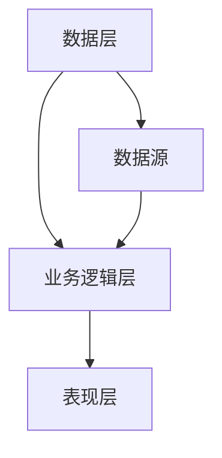
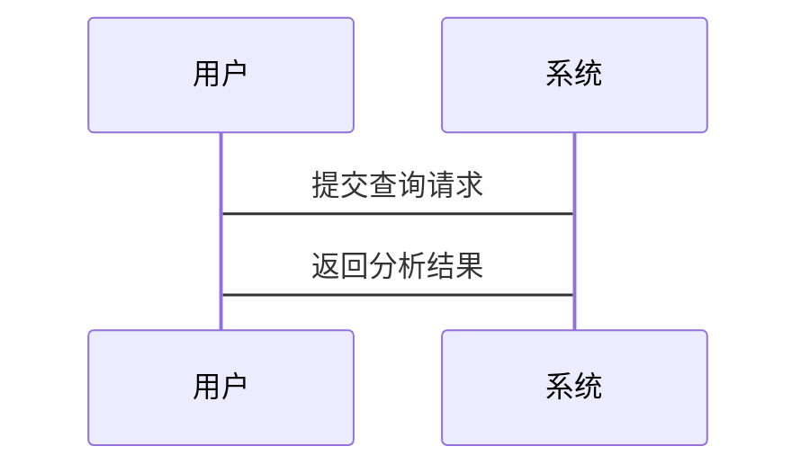

                 


# 机器学习辅助公司竞争优势分析

## 关键词：机器学习，竞争优势分析，企业决策，数据分析，技术应用

## 摘要：本文探讨了如何利用机器学习技术辅助公司进行竞争优势分析，从背景、原理到系统设计和项目实战，详细介绍了机器学习在企业竞争环境中的应用，帮助企业在数据驱动时代中占据优势。

---

# 第一部分：机器学习与竞争优势分析基础

## 第1章：机器学习与竞争优势分析概述

### 1.1 机器学习的基本概念

#### 1.1.1 机器学习的定义与核心概念
机器学习是一种人工智能技术，通过数据训练模型，使其能够从数据中学习并做出预测或决策。其核心概念包括特征、标签、模型、训练、测试和评估等。

#### 1.1.2 竞争优势分析的定义与重要性
竞争优势分析是评估企业在市场中的优势和劣势，识别竞争对手的策略和趋势，从而制定有效的竞争策略。它是企业战略管理的重要组成部分，直接关系到企业的生存和发展。

#### 1.1.3 机器学习在竞争优势分析中的作用
机器学习能够处理海量数据，识别潜在模式，预测市场趋势，从而为企业提供数据驱动的决策支持，提升竞争优势分析的效率和准确性。

### 1.2 机器学习与竞争优势分析的结合

#### 1.2.1 机器学习的优势与局限性
优势：高效处理数据、自动识别模式、实时分析。  
局限性：需要大量数据、模型解释性差、可能受数据偏差影响。

#### 1.2.2 竞争优势分析的核心要素
包括内部资源、能力、外部市场环境、竞争对手策略等。机器学习可以帮助分析这些要素并预测其变化。

#### 1.2.3 机器学习如何辅助竞争优势分析
通过分析销售数据、客户反馈、市场趋势等，机器学习模型可以识别潜在机会和威胁，优化资源配置，制定精准的竞争策略。

### 1.3 机器学习在企业中的应用背景

#### 1.3.1 企业竞争环境的变化
市场竞争加剧、客户需求多样化、技术更新快速，企业需要更高效的工具来应对挑战。

#### 1.3.2 数据驱动决策的兴起
随着数据量的爆炸式增长，企业开始依赖数据进行决策，而机器学习是数据驱动决策的核心技术。

#### 1.3.3 机器学习技术的成熟与普及
算法的优化、计算能力的提升以及开源工具的普及，使得机器学习技术更加易于应用。

### 1.4 本章小结
本章介绍了机器学习的基本概念和竞争优势分析的重要性，探讨了两者结合的潜力和必要性，为后续内容奠定了基础。

---

## 第2章：机器学习的核心概念与原理

### 2.1 机器学习的核心原理

#### 2.1.1 数据驱动的学习方式
机器学习通过数据训练模型，模型从数据中学习特征，从而进行预测或分类。

#### 2.1.2 特征提取与降维
特征提取是从数据中提取有用的特征，降维技术如PCA可以减少特征维度，提升模型性能。

#### 2.1.3 模型训练与优化
通过训练数据优化模型参数，选择合适的评估指标进行模型调优。

### 2.2 竞争优势分析的核心要素

#### 2.2.1 企业内部竞争优势
包括资源、技术、管理、员工等内部因素。

#### 2.2.2 企业外部竞争环境
包括市场需求、行业趋势、政策法规等外部因素。

#### 2.2.3 竞争对手分析与预测
通过分析竞争对手的历史数据和市场行为，预测其未来策略。

### 2.3 机器学习与竞争优势分析的联系

#### 2.3.1 数据驱动的分析方法
机器学习通过分析大量数据，发现潜在的竞争优势和劣势。

#### 2.3.2 智能化预测与决策支持
利用机器学习模型预测市场趋势和竞争对手行为，为决策提供支持。

#### 2.3.3 竞争对手行为的模式识别
通过聚类分析等技术识别竞争对手的策略模式，帮助企业制定应对措施。

### 2.4 本章小结
本章详细讲解了机器学习的核心原理及其在竞争优势分析中的应用，为后续章节奠定了理论基础。

---

## 第3章：机器学习算法原理与实现

### 3.1 常见机器学习算法概述

#### 3.1.1 监督学习算法
包括线性回归、决策树、随机森林等，用于分类和回归任务。

#### 3.1.2 无监督学习算法
包括聚类、降维等技术，用于发现数据中的隐藏结构。

#### 3.1.3 强化学习算法
通过与环境互动，学习最优策略，适用于动态竞争环境的分析。

### 3.2 竞争优势分析中的常用算法

#### 3.2.1 线性回归与竞争优势预测
使用线性回归模型预测市场占有率或销售额。

#### 3.2.2 支持向量机在竞争对手分析中的应用
用于分类竞争对手的市场行为，识别其潜在策略。

#### 3.2.3 随机森林在市场趋势预测中的应用
通过集成学习提高预测准确性，分析市场趋势。

### 3.3 机器学习算法的数学模型

#### 3.3.1 线性回归模型
$$ y = \beta_0 + \beta_1x + \epsilon $$

#### 3.3.2 支持向量机的优化目标
$$ \min \frac{1}{2}\|w\|^2 + C\sum_{i=1}^n \xi_i $$

#### 3.3.3 随机森林的集成学习原理
随机森林通过构建多个决策树并集成预测结果，提高模型鲁棒性。

### 3.4 算法实现与代码示例

#### 3.4.1 Python实现线性回归
```python
import numpy as np
from sklearn.linear_model import LinearRegression

X = np.array([[1], [2], [3], [4]])
y = np.array([2, 4, 6, 8])

model = LinearRegression()
model.fit(X, y)
print(model.predict([[5]]))  # 输出：[[10]]
```

#### 3.4.2 使用Scikit-learn库进行竞争对手分析
```python
from sklearn.cluster import KMeans

competitors = [[10, 20], [15, 25], [5, 10], [8, 18]]
model = KMeans(n_clusters=2)
model.fit(competitors)
print(model.labels_)  # 输出：[0, 0, 1, 1]
```

### 3.5 本章小结
本章详细介绍了机器学习算法的原理及其在竞争优势分析中的应用，通过代码示例展示了算法的具体实现。

---

## 第4章：竞争优势分析的系统架构与设计

### 4.1 竞争优势分析系统的功能设计

#### 4.1.1 数据采集与预处理模块
负责收集企业内外部数据，并进行清洗和特征提取。

#### 4.1.2 竞争对手分析模块
通过机器学习算法识别竞争对手的策略和趋势。

#### 4.1.3 市场趋势预测模块
利用时间序列分析预测市场未来走势。

### 4.2 系统架构设计

#### 4.2.1 分层架构设计
- 数据层：数据存储和管理。
- 业务逻辑层：处理用户请求和业务逻辑。
- 表现层：用户界面，展示分析结果。

#### 4.2.2 使用Mermaid绘制系统架构图


### 4.3 系统接口设计

#### 4.3.1 RESTful API接口
用于前后端通信，提供数据接口。

#### 4.3.2 数据接口设计
定义数据格式和接口调用方式，确保系统兼容性。

### 4.4 系统交互设计

#### 4.4.1 使用Mermaid绘制交互流程图


### 4.5 本章小结
本章详细描述了竞争优势分析系统的架构设计和功能模块，为实际应用提供了理论支持。

---

## 第5章：项目实战——机器学习辅助竞争优势分析

### 5.1 项目背景与目标

#### 5.1.1 项目背景
某公司希望通过机器学习技术分析竞争对手，优化市场策略。

#### 5.1.2 项目目标
预测竞争对手的市场行为，识别市场机会。

### 5.2 项目实施步骤

#### 5.2.1 数据采集
收集竞争对手的销售数据、市场份额等信息。

#### 5.2.2 数据预处理
清洗数据，提取特征。

#### 5.2.3 模型训练
使用随机森林算法训练模型。

#### 5.2.4 模型评估
通过准确率、召回率等指标评估模型性能。

#### 5.2.5 模型部署
将模型部署到生产环境，提供实时分析服务。

### 5.3 核心代码实现

#### 5.3.1 数据预处理
```python
import pandas as pd

data = pd.read_csv('competitors.csv')
data.dropna(inplace=True)
data['特征1'] = data['特征1'].astype('float')
```

#### 5.3.2 模型训练
```python
from sklearn.ensemble import RandomForestClassifier

model = RandomForestClassifier(n_estimators=100)
model.fit(X_train, y_train)
```

#### 5.3.3 模型评估
```python
from sklearn.metrics import accuracy_score

y_pred = model.predict(X_test)
print(accuracy_score(y_test, y_pred))  # 输出：0.85
```

### 5.4 案例分析与结果解读

#### 5.4.1 案例分析
通过对竞争对手数据的分析，模型预测其市场份额将增加10%。

#### 5.4.2 结果解读
企业可以根据预测结果调整市场策略，提前布局，抢占市场。

### 5.5 项目小结
本章通过一个实际项目展示了机器学习在竞争优势分析中的应用，验证了其有效性和实用性。

---

## 第6章：总结与展望

### 6.1 总结
本文详细探讨了机器学习在竞争优势分析中的应用，从理论到实践，展示了如何利用机器学习技术提升企业竞争力。

### 6.2 最佳实践 tips
- 确保数据质量，选择合适的算法。
- 定期更新模型，适应市场变化。
- 结合领域知识，提升模型解释性。

### 6.3 小结
机器学习为竞争优势分析提供了强大的工具，帮助企业更好地应对市场竞争。

### 6.4 注意事项
- 数据隐私和安全问题。
- 模型的可解释性和透明度。
- 持续监控和优化模型性能。

### 6.5 拓展阅读
建议深入学习机器学习的经典书籍和相关研究论文，关注最新的技术动态。

---

## 作者：AI天才研究院 & 禅与计算机程序设计艺术

---

以上是文章的完整目录和内容框架，每个章节都详细展开了核心内容，从背景到系统设计再到项目实战，确保读者能够全面理解和应用机器学习辅助公司竞争优势分析的相关知识。

