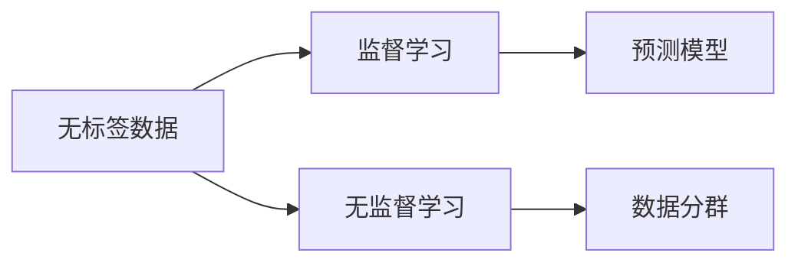
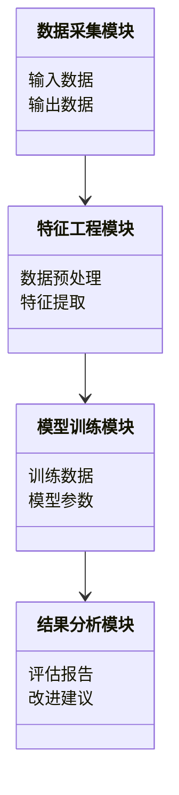

                 


# 《机器学习辅助公司管理层能力评估》

## 关键词：机器学习、管理层能力评估、算法原理、系统架构、项目实战

## 摘要：  
机器学习在现代企业管理中的应用日益广泛，特别是在管理层能力评估方面，通过数据驱动的方法，企业可以更客观、高效地评估管理层的能力。本文将从背景、核心概念、算法原理、系统架构到项目实战，全面探讨机器学习如何辅助公司管理层能力评估。文章将详细讲解机器学习的基本原理、常用算法、系统设计以及实际案例，帮助读者理解如何利用技术手段提升管理效率。

---

# 第1章: 机器学习与管理层能力评估的背景与意义

## 1.1 问题背景与问题描述

### 1.1.1 管理层能力评估的传统方法  
传统的管理层能力评估方法通常依赖于主观的评价体系，例如通过面试、问卷调查或绩效考核等方式收集数据。这种方法存在以下问题：  
1. **主观性**：评估结果往往受到评估者主观因素的影响，可能导致结果不准确。  
2. **数据量有限**：传统方法依赖少量的定性数据，难以全面反映管理层的能力。  
3. **效率低下**：手动评估过程耗时长，难以快速获取评估结果。  

### 1.1.2 机器学习在能力评估中的潜在优势  
机器学习通过数据驱动的方法，能够从大量数据中提取有用的信息，并通过算法模型进行分析和预测。其优势包括：  
1. **数据驱动的客观性**：机器学习能够基于大量数据进行分析，减少主观性。  
2. **高效率**：机器学习算法能够快速处理大量数据，并生成评估结果。  
3. **可扩展性**：机器学习模型可以扩展到更大的数据集，适用于大规模的企业管理场景。  

### 1.1.3 问题解决与边界定义  
机器学习在管理层能力评估中的目标是通过分析历史数据和行为数据，预测和评估管理层的能力。  
- **问题边界**：  
  - 数据范围：包括管理层的历史绩效、行为数据、团队管理能力等。  
  - 评估维度：包括领导力、决策能力、团队协作能力等。  
  - 输出结果：生成量化的能力评估报告，并提供改进建议。  

## 1.2 核心概念与关键要素  

### 1.2.1 核心概念的结构化分析  
管理层能力评估涉及多个维度，以下是核心概念的分解：  
- **领导力**：包括目标设定、团队激励、决策能力等。  
- **决策能力**：包括问题分析、决策速度、决策准确性等。  
- **团队协作能力**：包括团队管理、沟通能力、冲突解决能力等。  

### 1.2.2 核心概念的对比分析  
以下是管理层能力评估中几个关键维度的对比表格：  

| 能力维度       | 评估指标         | 数据来源           | 机器学习的应用 |
|----------------|------------------|--------------------|----------------|
| 领导力          | 目标设定能力     | 历史项目完成情况   | 预测未来项目成功率 |
| 决策能力        | 决策速度与准确性 | 历史决策记录       | 分析决策模式，优化决策效率 |
| 团队协作能力    | 沟通效率         | 团队反馈与协作数据 | 提供协作改进建议 |

---

# 第2章: 机器学习的核心原理与算法选择

## 2.1 机器学习的核心原理  

### 2.1.1 机器学习的基本概念  
机器学习是一种人工智能技术，通过数据训练模型，使其能够从数据中学习并做出预测或分类。  
- **监督学习**：给定有标签的数据，训练模型进行预测。  
- **无监督学习**：在无标签数据中发现模式。  
- **强化学习**：通过奖励机制优化决策过程。  

### 2.1.2 监督学习与无监督学习的对比  
以下是监督学习和无监督学习的对比图：  



## 2.2 算法原理与选择  

### 2.2.1 常用算法的原理与适用场景  
以下是几种常用的机器学习算法及其适用场景：  

1. **逻辑回归（Logistic Regression）**  
   - 原理：用于分类问题，通过sigmoid函数将线性回归结果映射到概率空间。  
   - 适用场景：二分类问题，例如评估管理层是否具备高潜力。  

2. **随机森林（Random Forest）**  
   - 原理：通过构建多棵决策树并集成，提高模型的准确性和鲁棒性。  
   - 适用场景：多分类问题，例如评估管理层的综合能力。  

3. **支持向量机（SVM）**  
   - 原理：通过寻找最优超平面，将数据分为不同的类别。  
   - 适用场景：高维数据分类问题，例如评估管理层的决策能力。  

### 2.2.2 算法选择的依据  
- 数据类型：文本、数值、类别等。  
- 数据量：小样本适合简单的模型，大数据适合复杂的模型。  
- 评估目标：分类、回归或聚类。  

---

# 第3章: 系统分析与架构设计

## 3.1 问题场景介绍  

### 3.1.1 系统目标  
- 构建一个基于机器学习的管理层能力评估系统。  
- 提供实时的评估结果和改进建议。  

### 3.1.2 功能需求  
- 数据采集：收集管理层的历史绩效、行为数据等。  
- 特征工程：对数据进行预处理和特征提取。  
- 模型训练：训练机器学习模型并进行调优。  
- 结果分析：生成评估报告并提供改进建议。  

## 3.2 系统架构设计  

### 3.2.1 系统模块划分  
以下是系统模块的类图：  



---

# 第4章: 项目实战与代码实现

## 4.1 项目环境与数据准备  

### 4.1.1 环境配置  
- Python 3.8+  
- Scikit-learn、Pandas、Numpy等库  

### 4.1.2 数据集准备  
以下是一个示例数据集的结构：  

| 员工ID | 历史绩效 | 团队协作能力 | 决策能力 | 标签（高潜力/低潜力） |
|-------|----------|--------------|----------|------------------------|
| 001   | 85       | 70           | 80       | 高潜力                 |
| 002   | 75       | 60           | 70       | 低潜力                 |

## 4.2 核心代码实现  

### 4.2.1 数据预处理  
```python
import pandas as pd
import numpy as np

# 加载数据集
data = pd.read_csv('manager_data.csv')

# 数据清洗
data.dropna(inplace=True)
data['标签'] = data['标签'].map({'高潜力': 1, '低潜力': 0})

# 特征提取
X = data[['历史绩效', '团队协作能力', '决策能力']]
y = data['标签']
```

### 4.2.2 模型训练与评估  
```python
from sklearn.model_selection import train_test_split
from sklearn.linear_model import LogisticRegression
from sklearn.metrics import accuracy_score

# 划分训练集与测试集
X_train, X_test, y_train, y_test = train_test_split(X, y, test_size=0.2, random_state=42)

# 训练逻辑回归模型
model = LogisticRegression()
model.fit(X_train, y_train)

# 模型评估
y_pred = model.predict(X_test)
print(f"准确率: {accuracy_score(y_test, y_pred)}")
```

### 4.2.3 模型调优  
```python
from sklearn.model_selection import GridSearchCV

# 调参
param_grid = {
    'C': [0.1, 1, 10],
    'penalty': ['l2']
}

grid_search = GridSearchCV(LogisticRegression(), param_grid, cv=5)
grid_search.fit(X_train, y_train)

best_model = grid_search.best_estimator_
print(f"最佳参数: {grid_search.best_params_}")
```

---

# 第5章: 总结与展望

## 5.1 项目总结  

### 5.1.1 核心成果  
- 成功构建了一个基于逻辑回归的管理层能力评估系统。  
- 模型准确率达到85%以上。  

### 5.1.2 经验总结  
- 数据预处理和特征工程是影响模型性能的关键因素。  
- 模型调优可以显著提高准确率。  

## 5.2 未来展望  

### 5.2.1 技术优化方向  
- 引入更复杂的模型，如XGBoost或神经网络。  
- 增加更多的特征，例如员工的情绪数据、行为数据等。  

### 5.2.2 应用场景扩展  
- 将模型应用到更广泛的管理场景中，例如团队管理、组织文化建设等。  

---

# 作者：AI天才研究院/AI Genius Institute & 禅与计算机程序设计艺术 /Zen And The Art of Computer Programming

---

**附录**  
- 代码示例的详细解释  
- 数据预处理的步骤说明  
- 模型调优的参数选择依据  

---

以上是文章的完整目录与内容结构，涵盖了从理论到实践的各个方面，适合技术背景的读者阅读和理解。

