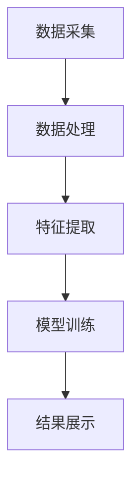
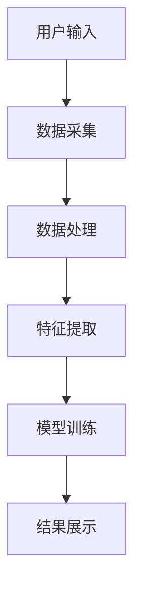

                 


# 机器学习预测公司长期竞争力变化

> 关键词：机器学习，公司竞争力，长期预测，算法实现，案例分析

> 摘要：本文探讨了如何利用机器学习技术预测公司长期竞争力的变化。通过分析机器学习算法的原理、竞争力指标的设计以及实际案例的应用，本文为读者提供了从理论到实践的全面指导。

---

## 第1章 机器学习与公司长期竞争力概述

### 1.1 机器学习的核心概念

#### 1.1.1 机器学习的定义与特点
机器学习是一种人工智能技术，通过数据训练模型，使其能够从经验中学习并做出预测或决策。其特点包括数据驱动、模型训练、自动优化和适应性。

#### 1.1.2 公司长期竞争力的定义与维度
公司长期竞争力是指企业在市场中长期维持和发展自身能力的能力。主要维度包括财务表现、市场份额、技术创新、品牌影响力和管理能力。

#### 1.1.3 机器学习在竞争力分析中的应用前景
机器学习能够处理大量数据，提取复杂模式，帮助预测公司未来的表现，提供数据支持的决策依据。

### 1.2 问题背景与研究意义

#### 1.2.1 传统公司竞争力分析的局限性
传统方法依赖主观判断，缺乏数据支持，难以量化和预测。

#### 1.2.2 机器学习在竞争力分析中的优势
机器学习能够处理非结构化数据，发现隐藏模式，提供精准预测。

#### 1.2.3 研究目标与意义
目标是构建一个基于机器学习的模型，预测公司竞争力的变化，为企业提供科学决策支持。

---

## 第2章 核心概念原理与对比分析

### 2.1 机器学习算法原理

#### 2.1.1 监督学习、无监督学习与强化学习对比
- 监督学习：基于标记数据，预测目标变量。
- 无监督学习：发现数据中的隐藏结构。
- 强化学习：通过奖励机制优化决策。

#### 2.1.2 常见算法的原理与特点
- 线性回归：简单，适用于线性关系。
- 随机森林：高准确率，鲁棒性强。
- 神经网络：处理复杂非线性关系。

#### 2.1.3 算法选择与数据类型的关系
数据类型（结构化或非结构化）影响算法选择，结构化数据适合线性回归，非结构化数据适合深度学习。

### 2.2 公司竞争力分析的实体关系图

#### 2.2.1 实体关系图（ER图）设计
- 实体：公司、财务指标、市场份额、技术创新。
- 关系：公司具有财务指标，财务指标影响市场份额。

#### 2.2.2 竞争力分析的核心实体与关系
公司通过财务指标、市场份额和技术创新体现竞争力。

#### 2.2.3 Mermaid 实体关系图展示
```mermaid
erd
    company (公司编号, 公司名称, 成立时间)
    financial_indicator (财务指标编号, 指标名称, 指标值)
    market_share (市场份额编号, 市场份额, 行业)
    technology_innovation (技术创新编号, 技术类型, 创新水平)
    company --> financial_indicator: 具有
    company --> market_share: 影响
    company --> technology_innovation: 依赖
```

---

## 第3章 核心概念的数学模型与公式

### 3.1 机器学习模型的数学基础

#### 3.1.1 线性回归模型的数学公式
$$ y = \beta_0 + \beta_1x + \epsilon $$
其中，$y$ 是目标变量，$x$ 是自变量，$\beta_0$ 和 $\beta_1$ 是模型参数，$\epsilon$ 是误差项。

#### 3.1.2 随机森林的数学模型概述
随机森林通过集成学习，将多个决策树的预测结果进行投票或平均，提高准确率。

#### 3.1.3 神经网络的基本结构与数学表达
神经网络由输入层、隐藏层和输出层组成，通过激活函数和权重参数进行数据变换。

### 3.2 竞争力分析的指标体系

#### 3.2.1 财务指标的数学表达
$$ 营业收入 = 收入 - 成本 $$
$$ 净利润 = 收入 - 成本 - 税费 $$

#### 3.2.2 市场指标的数学模型
$$ 市场份额 = \frac{公司收入}{行业总收入} \times 100 $$

#### 3.2.3 技术指标的量化方法
$$ 技术创新指数 = \frac{专利数量 + 新产品研发数量}{公司规模} $$

---

## 第4章 机器学习算法的实现

### 4.1 线性回归算法的实现

#### 4.1.1 线性回归的损失函数
$$ L = \frac{1}{2m}\sum_{i=1}^{m}(y_i - \hat{y}_i)^2 $$$
其中，$m$ 是样本数量，$y_i$ 是真实值，$\hat{y}_i$ 是预测值。

#### 4.1.2 最小二乘法的优化过程
通过最小化损失函数，求解最优参数 $\beta_0$ 和 $\beta_1$。

#### 4.1.3 线性回归的Python实现代码
```python
import numpy as np
from sklearn.linear_model import LinearRegression

# 数据准备
X = np.array([i for i in range(100)]).reshape(-1, 1)
y = 2 * X + 1 + np.random.randn(100)

# 模型训练
model = LinearRegression()
model.fit(X, y)

# 预测
y_pred = model.predict(X)
print("Coefficients:", model.coef_)
print("Intercept:", model.intercept_)
```

### 4.2 随机森林算法的实现

#### 4.2.1 随机森林的投票机制
通过多棵决策树的预测结果进行投票，最终结果为多数投票结果。

#### 4.2.2 随机森林的Python实现代码
```python
from sklearn.ensemble import RandomForestRegressor

# 数据准备
X = np.array([i for i in range(100)]).reshape(-1, 1)
y = 2 * X + 1 + np.random.randn(100)

# 模型训练
model = RandomForestRegressor(n_estimators=100)
model.fit(X, y)

# 预测
y_pred = model.predict(X)
print("Feature importances:", model.feature_importances_)
```

---

## 第5章 系统分析与架构设计

### 5.1 问题场景描述

#### 5.1.1 数据来源与特征分析
数据来源包括公司财务报表、市场报告和专利数据库，特征包括营业收入、净利润率和市场份额。

#### 5.1.2 竞争力预测的目标与范围
目标是预测未来3-5年的竞争力变化，范围包括主要行业和上市公司。

### 5.2 系统功能设计

#### 5.2.1 数据采集模块
负责从数据库中获取公司数据，包括财务和市场指标。

#### 5.2.2 特征提取模块
从原始数据中提取有用特征，如营业收入增长率和市场份额变化率。

#### 5.2.3 模型训练模块
使用机器学习算法训练模型，评估模型性能。

#### 5.2.4 结果展示模块
将预测结果以可视化形式展示，帮助用户理解。

### 5.3 系统架构设计

#### 5.3.1 系统架构图（Mermaid）


#### 5.3.2 模块交互流程图（Mermaid）


---

## 第6章 项目实战与案例分析

### 6.1 环境安装与配置

#### 6.1.1 安装Python与相关库
安装Python和必要的库，如`scikit-learn`和`numpy`。

### 6.2 核心代码实现

#### 6.2.1 线性回归模型实现
```python
import numpy as np
from sklearn.linear_model import LinearRegression

# 数据准备
X = np.array([i for i in range(100)]).reshape(-1, 1)
y = 2 * X + 1 + np.random.randn(100)

# 模型训练
model = LinearRegression()
model.fit(X, y)

# 预测
y_pred = model.predict(X)
print("预测值:", y_pred)
```

#### 6.2.2 随机森林模型实现
```python
from sklearn.ensemble import RandomForestRegressor

# 数据准备
X = np.array([i for i in range(100)]).reshape(-1, 1)
y = 2 * X + 1 + np.random.randn(100)

# 模型训练
model = RandomForestRegressor(n_estimators=100)
model.fit(X, y)

# 预测
y_pred = model.predict(X)
print("预测值:", y_pred)
```

### 6.3 实际案例分析

#### 6.3.1 案例背景
分析科技公司过去5年的财务数据和市场份额变化。

#### 6.3.2 模型训练与预测
使用随机森林模型训练，预测未来3年的竞争力变化。

#### 6.3.3 结果解读
预测结果显示公司竞争力将稳步提升，市场份额将扩大。

### 6.4 项目小结

---

## 第7章 总结与展望

### 7.1 最佳实践 tips
- 数据预处理是关键，确保数据质量。
- 选择合适的算法，结合业务需求。
- 模型评估与调优，提高预测精度。

### 7.2 小结
机器学习为预测公司长期竞争力提供了有效工具，通过合理选择算法和数据，能够帮助企业做出更明智的决策。

### 7.3 注意事项
- 数据隐私与安全问题。
- 模型的可解释性，确保决策透明。
- 持续监控与更新模型，适应市场变化。

### 7.4 拓展阅读
- 《机器学习实战》
- 《深入理解机器学习》

---

作者：AI天才研究院/AI Genius Institute & 禅与计算机程序设计艺术 /Zen And The Art of Computer Programming

