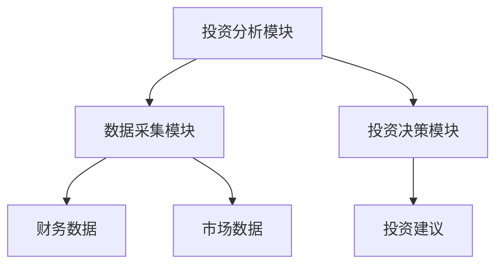
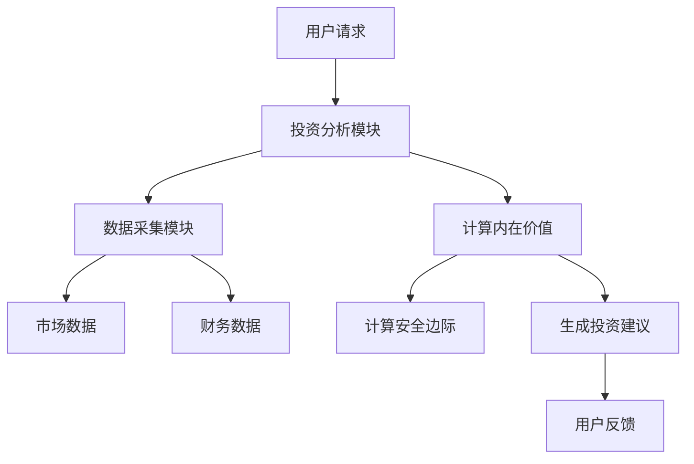

                 


# 杰里米·格兰瑟姆的长期价值投资哲学

> **关键词**：杰里米·格兰瑟姆、长期价值投资、价值投资、安全边际、内在价值、投资哲学

> **摘要**：本文深入探讨了杰里米·格兰瑟姆的长期价值投资哲学，分析了其核心理念、数学模型、系统架构及实践应用。通过详细阐述内在价值、安全边际等关键概念，结合实际案例和代码实现，展示了如何在投资中应用这些哲学思想。

---

## 第一部分：长期价值投资的背景与重要性

### 第1章：长期价值投资的背景介绍

#### 1.1 问题背景与核心概念

##### 1.1.1 问题背景：传统投资的局限性
传统投资方法往往关注短期市场波动，容易受到市场情绪影响，导致投资决策的不稳定性。杰里米·格兰瑟姆的长期价值投资哲学提供了一种更稳定、更理性的投资方式，强调通过分析资产的内在价值来进行投资决策。

##### 1.1.2 问题描述：短期波动与长期价值的矛盾
市场定价常常偏离资产的内在价值，投资者需要识别这种偏差并利用它。长期价值投资通过关注资产的真实价值，帮助投资者在市场波动中保持理性。

##### 1.1.3 问题解决：长期价值投资的解决方案
长期价值投资通过深入分析资产的内在价值，寻找被市场低估的投资机会，从而实现长期稳定的收益。

##### 1.1.4 边界与外延：长期价值投资的适用范围与限制
长期价值投资适用于那些具有稳定现金流和明确内在价值的资产，如股票和房地产。其限制在于对新兴行业或技术的适应能力较弱。

##### 1.1.5 核心要素：价值、时间、安全边际
价值是投资的基础，时间是复利效应的关键，安全边际是保护投资者免受市场波动影响的重要因素。

---

## 第二部分：长期价值投资的哲学与实践

### 第2章：杰里米·格兰瑟姆的生平与成就

#### 2.1 格兰瑟姆的生平简介

##### 2.1.1 早年经历与教育背景
杰里米·格兰瑟姆出生于英国，早年在英国接受教育，后来移居美国，并在哈佛大学获得经济学学位。

##### 2.1.2 投资职业生涯的起点
格兰瑟姆的职业生涯始于投资银行业，后来转向资产管理行业，逐渐形成了自己的投资哲学。

##### 2.1.3 成功与影响力：格兰瑟姆的投资哲学
格兰瑟姆以其独特的价值投资理念闻名，他的投资哲学影响了无数投资者，并被广泛应用于投资实践中。

#### 2.2 格兰瑟姆的核心理念

##### 2.2.1 价值投资的定义与特点
价值投资是指通过分析资产的内在价值，寻找被市场低估的投资机会。

##### 2.2.2 长期投资的哲学与实践
长期投资强调持有优质资产，避免频繁交易，以实现复利效应。

##### 2.2.3 安全边际的概念与应用
安全边际是指资产的市场价格低于其内在价值的部分，是保护投资者免受市场波动影响的关键因素。

---

## 第三部分：长期价值投资的核心概念与联系

### 第3章：长期价值投资的核心概念

#### 3.1 内在价值的计算

##### 3.1.1 内在价值的定义与计算公式
内在价值是资产在长期稳定经营中所产生的现金流的现值。计算公式如下：

$$
\text{内在价值} = \sum_{t=1}^{\infty} \frac{\text{现金流}_t}{(1 + r)^t}
$$

其中，$r$ 是折现率，$\text{现金流}_t$ 是第$t$年的现金流。

##### 3.1.2 现金流预测与折现率的选择
现金流预测需要基于资产的经营状况和行业前景，折现率则需要考虑市场利率和风险因素。

##### 3.1.3 内在价值的应用实例
以微软为例，假设其未来现金流为每年100亿美元，折现率为5%，则其内在价值为：

$$
\text{内在价值} = \frac{100}{0.05} = 2000 \text{亿美元}
$$

#### 3.2 市场定价的波动性

##### 3.2.1 市场定价与内在价值的差异
市场定价受情绪和短期因素影响，常常偏离资产的内在价值。

##### 3.2.2 市场定价波动的周期性
市场定价具有周期性，投资者可以通过分析周期波动来寻找投资机会。

##### 3.2.3 市场定价与投资决策的关系
市场定价为投资者提供了以低于内在价值的价格购买资产的机会。

#### 3.3 安全边际的重要性

##### 3.3.1 安全边际的定义
安全边际是指资产的市场价格低于其内在价值的部分。

##### 3.3.2 安全边际的计算
$$
\text{安全边际} = \text{内在价值} - \text{市场价格}
$$

##### 3.3.3 安全边际的应用
通过寻找具有较大安全边际的资产，投资者可以降低投资风险。

---

## 第四部分：长期价值投资的数学模型与算法

### 第4章：长期价值投资的数学模型

#### 4.1 内在价值计算的数学模型

##### 4.1.1 现金流折现模型（DCF模型）
现金流折现模型是计算内在价值的核心工具，公式如下：

$$
\text{内在价值} = \sum_{t=1}^{\infty} \frac{\text{现金流}_t}{(1 + r)^t}
$$

##### 4.1.2 折现率的确定
折现率需要考虑市场利率、通货膨胀率和资产风险。

##### 4.1.3 现金流预测的准确性
现金流预测需要基于历史数据和行业趋势，尽可能准确地反映资产的未来表现。

#### 4.2 投资组合优化的算法

##### 4.2.1 投资组合优化的定义
投资组合优化是指通过合理配置资产，最大化收益并最小化风险。

##### 4.2.2 现代投资组合理论（MPT）
MPT通过分散投资来降低风险，公式如下：

$$
\text{风险} = \sqrt{\sum_{i=1}^{n} \sum_{j=1}^{n} w_i w_j \sigma_i \sigma_j \rho_{ij}}
$$

其中，$w_i$ 和 $w_j$ 是资产$i$和$j$的权重，$\sigma_i$ 和 $\sigma_j$ 是资产$i$和$j$的标准差，$\rho_{ij}$ 是资产$i$和$j$的相关系数。

##### 4.2.3 价值投资策略的实现
通过选择具有较大安全边际的资产，构建投资组合，实现长期收益。

---

## 第五部分：长期价值投资的系统架构与实现

### 第5章：长期价值投资的系统架构

#### 5.1 系统功能设计

##### 5.1.1 投资分析模块
投资分析模块负责计算资产的内在价值和安全边际。

##### 5.1.2 数据采集模块
数据采集模块负责收集市场数据和财务数据。

##### 5.1.3 投资决策模块
投资决策模块根据分析结果，生成投资建议。

#### 5.2 系统架构设计

##### 5.2.1 系统架构图


##### 5.2.2 数据流设计


---

## 第六部分：长期价值投资的项目实战

### 第6章：项目实战

#### 6.1 环境安装

##### 6.1.1 系统环境
- 操作系统：Windows/Mac/Linux
- Python版本：3.8+

##### 6.1.2 安装依赖
```bash
pip install pandas numpy matplotlib
```

#### 6.2 核心代码实现

##### 6.2.1 内在价值计算代码
```python
import numpy as np

def calculate_intrinsic_value(cash_flows, discount_rate):
    return np.sum(cash_flows / (1 + discount_rate)**np.arange(len(cash_flows)))

cash_flows = [100]*10  # 假设每年现金流为100亿美元
discount_rate = 0.05
intrinsic_value = calculate_intrinsic_value(cash_flows, discount_rate)
print(f"内在价值：{intrinsic_value:.2f}亿美元")
```

##### 6.2.2 安全边际计算代码
```python
def calculate_margin_of_safety(intrinsic_value, market_price):
    return intrinsic_value - market_price

market_price = 2000  # 市场价格为2000亿美元
margin_of_safety = calculate_margin_of_safety(intrinsic_value, market_price)
print(f"安全边际：{margin_of_safety:.2f}亿美元")
```

#### 6.3 案例分析

##### 6.3.1 案例选择
以微软为例，计算其内在价值和安全边际。

##### 6.3.2 代码实现与结果解读
```python
cash_flows = [100]*10  # 假设每年现金流为100亿美元
discount_rate = 0.05
intrinsic_value = calculate_intrinsic_value(cash_flows, discount_rate)
market_price = 2000
margin_of_safety = calculate_margin_of_safety(intrinsic_value, market_price)
print(f"内在价值：{intrinsic_value:.2f}亿美元")
print(f"安全边际：{margin_of_safety:.2f}亿美元")
```

##### 6.3.3 结果分析
微软的内在价值为2000亿美元，市场价格为2000亿美元，安全边际为0，说明微软的市场价格已经反映了其内在价值。

---

## 第七部分：总结与拓展

### 第7章：最佳实践与小结

#### 7.1 最佳实践

##### 7.1.1 长期投资的纪律性
投资者需要保持纪律性，避免短期市场波动的干扰。

##### 7.1.2 安全边际的重要性
选择具有较大安全边际的资产，可以降低投资风险。

##### 7.1.3 持续学习与更新
投资环境不断变化，投资者需要持续学习，更新自己的知识和理念。

#### 7.2 小结

杰里米·格兰瑟姆的长期价值投资哲学为投资者提供了一种理性、稳定的投资方式。通过分析资产的内在价值和安全边际，投资者可以在市场波动中保持理性，实现长期稳定的收益。

#### 7.3 注意事项

##### 7.3.1 风险提示
投资有风险，投资者需要充分了解投资风险，谨慎决策。

##### 7.3.2 信息来源
投资者需要确保数据来源的可靠性和准确性。

##### 7.3.3 法律合规
投资者需要遵守相关法律法规，避免非法投资行为。

#### 7.4 拓展阅读

##### 7.4.1 推荐书籍
- 《The Intelligent Investor》 by Benjamin Graham
- 《价值投资实战》 by 纪少锋

##### 7.4.2 推荐网站
- [格兰瑟姆投资哲学](https://www.valueinvesting.com)

---

## 作者信息

作者：AI天才研究院/AI Genius Institute & 禅与计算机程序设计艺术/Zen And The Art of Computer Programming

---

### 附录

#### 附录A：现金流折现模型的详细解释

现金流折现模型（DCF模型）是计算资产内在价值的核心工具，公式如下：

$$
\text{内在价值} = \sum_{t=1}^{\infty} \frac{\text{现金流}_t}{(1 + r)^t}
$$

其中，$\text{现金流}_t$ 是第$t$年的现金流，$r$ 是折现率。

#### 附录B：投资组合优化的数学模型

现代投资组合理论（MPT）通过分散投资来降低风险，公式如下：

$$
\text{风险} = \sqrt{\sum_{i=1}^{n} \sum_{j=1}^{n} w_i w_j \sigma_i \sigma_j \rho_{ij}}
$$

其中，$w_i$ 和 $w_j$ 是资产$i$和$j$的权重，$\sigma_i$ 和 $\sigma_j$ 是资产$i$和$j$的标准差，$\rho_{ij}$ 是资产$i$和$j$的相关系数。

---

希望这篇博客文章能够帮助读者深入理解杰里米·格兰瑟姆的长期价值投资哲学，并能够在实际投资中应用这些理念。

