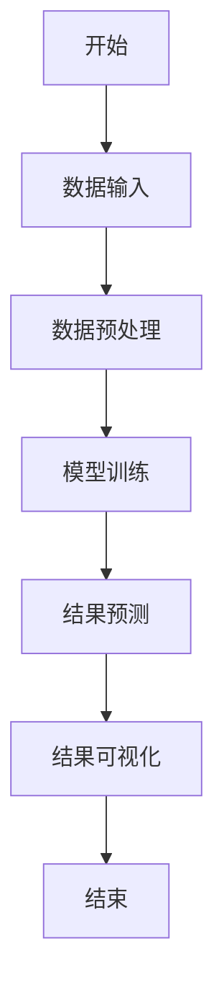
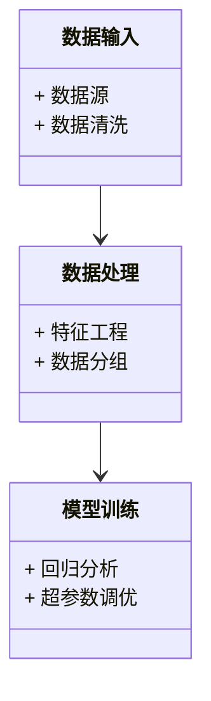
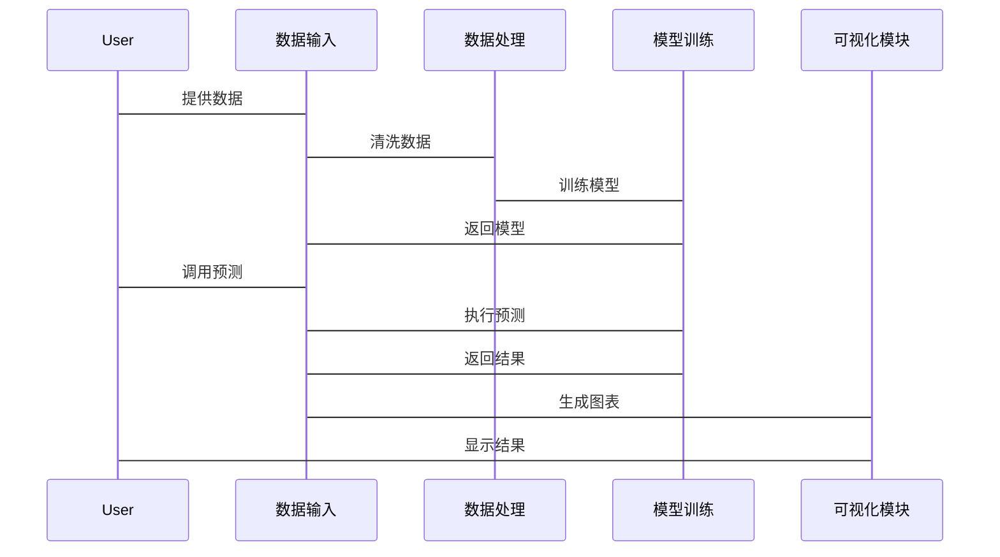

                 


# 杰里米格兰瑟姆的均值回归理论

> **关键词**：均值回归，杰里米·格兰瑟姆，统计学，回归分析，机器学习  
> **摘要**：本文深入探讨杰里米·格兰瑟姆的均值回归理论，从理论基础到数学模型，从系统设计到项目实战，全面解析均值回归的应用与实践。

---

## 第一部分: 杰里米格兰瑟姆的均值回归理论概述

### 第1章: 均值回归理论的背景与基础

#### 1.1 均值回归的核心概念

##### 1.1.1 均值回归的定义
均值回归（Mean Reversion）是一种统计学概念，认为任何偏离均值的现象最终会回归到其长期平均值。这一理论在金融、经济、科学等领域广泛应用。

##### 1.1.2 均值回归的基本原理
均值回归的核心假设是：极端事件是暂时的，系统会趋向于长期均衡状态。例如，在股票市场中，高价股会回落，低价股会反弹。

##### 1.1.3 均值回归的统计学基础
均值回归基于概率论和统计分布，假设数据服从正态分布。我们可以通过计算偏离均值的程度来预测回归趋势。

##### 1.1.4 均值回归的边界与外延
均值回归的有效性取决于数据的平稳性和分布特性。如果数据存在结构性变化，均值回归可能失效。

##### 1.1.5 均值回归的核心要素组成
- 数据集
- 均值计算
- 偏离度分析
- 回归预测

#### 1.2 均值回归的历史与发展

##### 1.2.1 均值回归的起源
均值回归的概念可以追溯到19世纪，用于解释遗传学中的性状遗传现象。

##### 1.2.2 均值回归在统计学中的发展
20世纪初，统计学家将其系统化，成为回归分析的重要组成部分。

##### 1.2.3 均值回归在经济学中的应用
在金融领域，均值回归被广泛用于资产定价和风险管理。

##### 1.2.4 均值回归的现代发展
随着大数据和机器学习的兴起，均值回归被赋予新的解释和应用。

#### 1.3 均值回归与其他相关概念的联系

##### 1.3.1 均值回归与回归分析的比较
回归分析是更广泛的概念，均值回归是其特例，关注数据点对均值的回归。

##### 1.3.2 均值回归与时间序列分析的联系
时间序列分析中，均值回归常用于预测未来趋势。

##### 1.3.3 均值回归与机器学习的关系
机器学习算法可以结合均值回归，提高预测准确性。

##### 1.3.4 均值回归与贝叶斯统计的对比
贝叶斯统计强调概率更新，均值回归更关注确定性回归趋势。

---

### 第2章: 均值回归的数学模型与算法原理

#### 2.1 均值回归的数学模型

##### 2.1.1 均值回归的线性模型
均值回归的数学表达式为：
$$
\hat{y} = \mu_y + \beta (x - \mu_x)
$$
其中，$\mu_y$ 和 $\mu_x$ 分别是 $y$ 和 $x$ 的均值，$\beta$ 是回归系数。

##### 2.1.2 均值回归的非线性模型
非线性回归模型可以表示为：
$$
\hat{y} = f(x) + \epsilon
$$
其中，$\epsilon$ 是误差项。

##### 2.1.3 均值回归的参数估计方法
参数估计通常采用最小二乘法：
$$
\hat{\beta} = \frac{\sum (x_i - \mu_x)(y_i - \mu_y)}{\sum (x_i - \mu_x)^2}
$$

##### 2.1.4 均值回归的假设检验
通过t检验和F检验验证回归系数的显著性。

#### 2.2 均值回归的算法实现

##### 2.2.1 均值回归的基本算法
以下是Python中的实现示例：
```python
import numpy as np
from sklearn.linear_model import LinearRegression

x = np.array([1, 2, 3, 4, 5])
y = np.array([2, 3, 4, 5, 6])

model = LinearRegression()
model.fit(x.reshape(-1, 1), y)
print(model.coef_)
```

##### 2.2.2 均值回归的优化算法
使用正规方程优化：
$$
\hat{\beta} = (X^T X)^{-1} X^T y
$$

##### 2.2.3 均值回归的并行计算
利用并行计算库（如Dask）加速大规模数据的回归分析。

##### 2.2.4 均值回归的模型评估
通过R平方值评估模型拟合优度：
$$
R^2 = 1 - \frac{\sum (y_i - \hat{y}_i)^2}{\sum (y_i - \bar{y})^2}
$$

#### 2.3 均值回归的公式推导

##### 2.3.1 均值回归的最小二乘法推导
通过求导找到使误差平方和最小的参数：
$$
\frac{d}{d\beta} \sum (y_i - \beta x_i - \alpha)^2 = 0
$$

##### 2.3.2 均值回归的正态性假设
假设误差项服从正态分布：
$$
\epsilon \sim N(0, \sigma^2)
$$

##### 2.3.3 均值回归的F统计量计算
$$
F = \frac{(R^2 / k)}{(1 - R^2) / (n - k - 1)}
$$
其中，$k$ 是回归系数个数，$n$ 是样本数。

##### 2.3.4 均值回归的R平方解释
R平方值表示解释变量对因变量的解释比例。

---

### 第3章: 均值回归的系统分析与架构设计

#### 3.1 均值回归的系统功能设计

##### 3.1.1 系统需求分析
- 数据输入与预处理
- 模型训练与预测
- 结果可视化与报告

##### 3.1.2 系统功能模块划分
- 数据模块
- 训练模块
- 可视化模块

##### 3.1.3 系统功能流程图


##### 3.1.4 系统功能的实现方式
使用Python的Scikit-learn库实现回归分析。

#### 3.2 均值回归的系统架构设计

##### 3.2.1 系统架构图


##### 3.2.2 系统接口设计
- 数据接口：输入数据格式与处理函数
- 模型接口：训练函数与预测函数
- 可视化接口：图表生成与展示

##### 3.2.3 系统交互流程图


---

## 第四部分: 项目实战

### 第4章: 项目实战与案例分析

#### 4.1 环境安装与配置

##### 4.1.1 安装Python与相关库
```bash
pip install numpy pandas scikit-learn matplotlib
```

##### 4.1.2 配置开发环境
使用Jupyter Notebook或VS Code进行开发。

#### 4.2 核心代码实现

##### 4.2.1 数据预处理
```python
import pandas as pd
import numpy as np
from sklearn.linear_model import LinearRegression
import matplotlib.pyplot as plt

data = pd.read_csv('data.csv')
X = data[['x1', 'x2']].values
y = data['y'].values

# 数据标准化
from sklearn.preprocessing import StandardScaler
scaler = StandardScaler()
X_scaled = scaler.fit_transform(X)
```

##### 4.2.2 回归模型训练
```python
model = LinearRegression()
model.fit(X_scaled, y)
```

##### 4.2.3 模型预测与可视化
```python
y_pred = model.predict(X_scaled)
plt.scatter(y, y_pred)
plt.xlabel('真实值')
plt.ylabel('预测值')
plt.show()
```

#### 4.3 案例分析与结果解读

##### 4.3.1 案例背景
分析股票价格的均值回归特性。

##### 4.3.2 数据分析
使用历史股价数据，训练回归模型预测未来价格。

##### 4.3.3 模型评估
计算均方误差（MSE）和R平方值，评估模型性能。

#### 4.4 项目总结

##### 4.4.1 项目小结
均值回归是一种简单有效的预测方法，适用于平稳数据。

##### 4.4.2 项目经验
- 数据预处理至关重要
- 模型选择影响结果
- 可视化帮助理解数据

##### 4.4.3 项目改进方向
结合机器学习算法，如随机森林，提高预测精度。

---

## 第五部分: 最佳实践与小结

### 第5章: 最佳实践与注意事项

#### 5.1 最佳实践

##### 5.1.1 数据质量的重要性
确保数据的完整性和代表性。

##### 5.1.2 模型选择的策略
根据数据特征选择合适回归方法。

##### 5.1.3 模型评估的全面性
结合多种指标（如MSE、R平方）评估模型性能。

##### 5.1.4 模型监控的持续性
实时监控模型表现，及时调整。

#### 5.2 小结

##### 5.2.1 理论回顾
均值回归是一种简单但强大的统计工具。

##### 5.2.2 实践总结
通过项目实战，掌握了均值回归的应用方法。

##### 5.2.3 经验教训
数据预处理和模型调优对结果影响显著。

---

## 作者：AI天才研究院 & 禅与计算机程序设计艺术

---

**总结**：本文从理论到实践，全面解析了杰里米格兰瑟姆的均值回归理论，帮助读者理解其原理和应用。通过实际案例，展示了均值回归在项目中的具体实施方法，为技术人员提供了有价值的参考。

