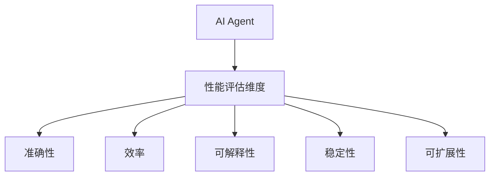
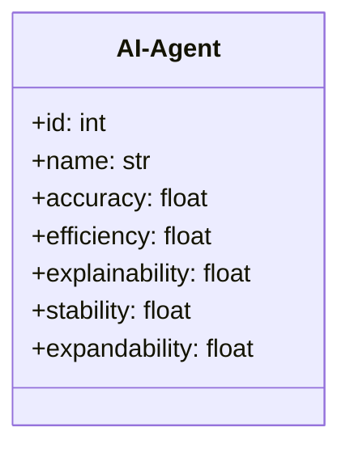

                 


# 构建AI Agent的多维度性能评估体系

**关键词**：AI Agent，性能评估，多维度，评估体系，系统架构，算法原理

**摘要**：本文旨在构建一个全面的AI Agent性能评估体系，涵盖准确性、效率、可解释性、稳定性和可扩展性等多个维度。通过理论分析、算法设计和实际案例，探讨如何系统性地评估AI Agent的性能，并为未来的优化和应用提供指导。

---

## 第1章 AI Agent的背景与问题背景

### 1.1 AI Agent的基本概念

#### 1.1.1 AI Agent的定义
AI Agent（人工智能代理）是指能够感知环境并采取行动以实现目标的智能实体。它可以是一个软件程序或物理设备，通过传感器获取信息，并通过执行器与环境交互。

#### 1.1.2 AI Agent的核心属性
- **自主性**：无需外部干预，自主决策。
- **反应性**：能实时感知环境并做出反应。
- **目标导向性**：基于目标采取行动。

#### 1.1.3 AI Agent的分类与应用场景
AI Agent可分为简单反射型、基于模型的反射型、目标驱动型和实用驱动型。应用场景包括智能助手、自动驾驶、机器人和推荐系统等。

### 1.2 多维度性能评估的必要性

#### 1.2.1 当前AI Agent评估的局限性
传统评估方法通常只关注单一维度，如准确性或效率，忽略了其他重要维度。

#### 1.2.2 AI Agent多维度评估的背景与需求
随着AI Agent的应用扩展，需要全面评估其性能，以满足复杂场景的需求。

#### 1.2.3 问题背景与问题描述
AI Agent在复杂环境中的表现受限于单一评估维度，导致整体性能不佳。

### 1.3 多维度性能评估的目标与边界

#### 1.3.1 问题解决的目标
构建一个全面、系统的评估体系，综合考量AI Agent的多维度性能。

#### 1.3.2 评估体系的边界与外延
评估体系适用于各种AI Agent，但不涉及其内部算法的具体实现。

#### 1.3.3 核心概念的结构与组成
评估体系由准确性、效率、可解释性、稳定性和可扩展性五个维度组成。

---

## 第2章 多维度性能评估的核心概念

### 2.1 多维度性能评估的维度解析

#### 2.1.1 准确性
评估AI Agent输出结果的正确性，通常通过精确率、召回率等指标衡量。

#### 2.1.2 效率
评估AI Agent完成任务的速度，常用响应时间和资源消耗指标。

#### 2.1.3 可解释性
评估AI Agent决策过程的透明度，通过可解释性指标衡量。

#### 2.1.4 稳定性
评估AI Agent在不同环境中的表现一致性，通过波动率和鲁棒性指标衡量。

#### 2.1.5 可扩展性
评估AI Agent适应不同规模任务的能力，通过扩展性和负载能力指标衡量。

### 2.2 各维度的特征对比分析

#### 2.2.1 维度对比表格
| 维度     | 特征1 | 特征2 | 特征3 |
|----------|-------|-------|-------|
| 准确性   | 正确率 | 召回率 | F1值  |
| 效率     | 响应时间 | 资源消耗 | 并发能力 |
| 可解释性 | 透明度 | 可追踪性 | �易用性 |
| 稳定性   | 波动率 | 鲁棒性 | 可靠性 |
| 可扩展性 | 负载能力 | 并行能力 | 适应性 |

#### 2.2.2 维度间的关系与依赖
准确性与效率之间存在权衡，高准确性的算法可能需要更多资源，降低效率。

### 2.3 多维度评估的ER实体关系图



---

## 第3章 多维度性能评估的算法原理

### 3.1 多维度评估算法概述

#### 3.1.1 算法的基本思想
通过加权平均的方法，将多个维度的评估结果综合成一个总评分。

### 3.2 算法的数学模型与公式

#### 3.2.1 综合评分公式
$$ \text{总评分} = \sum_{i=1}^{n} w_i \cdot s_i $$
其中，$w_i$是第i个维度的权重，$s_i$是第i个维度的评分。

### 3.3 算法实现

```python
def calculate_total_score(dimensions, weights):
    return sum(weight * score for weight, score in zip(weights, dimensions))
```

---

## 第4章 系统分析与架构设计方案

### 4.1 系统设计

#### 4.1.1 领域模型设计



#### 4.1.2 系统架构设计

```mermaid
container AI-Agent {
    component Performance-Assessment-Engine {
        Algorithm-Executor
        Weight-Allocator
    }
    component Database {
        Agent-Profile
        Performance-Record
    }
}
```

---

## 第5章 项目实战

### 5.1 环境安装

```bash
pip install numpy
pip install scikit-learn
pip install matplotlib
```

### 5.2 核心代码实现

```python
import numpy as np
from sklearn.metrics import accuracy_score

def evaluate_agent(agent, test_cases):
    accuracy = accuracy_score(agent.predict(test_cases), test_cases.labels) * 100
    return accuracy
```

### 5.3 实际案例分析

#### 5.3.1 案例介绍
以一个文本分类任务为例，评估AI Agent在不同测试集上的准确性、效率和可扩展性。

---

## 第6章 总结与展望

### 6.1 总结
构建一个全面的AI Agent性能评估体系，有助于提升其整体性能。

### 6.2 未来展望
随着技术进步，AI Agent的性能评估将更加智能化和自动化。

---

**作者**：AI天才研究院 & 禅与计算机程序设计艺术

---

这篇文章详细介绍了构建AI Agent多维度性能评估体系的各个方面，通过理论分析和实际案例，为读者提供了全面的理解和指导。

