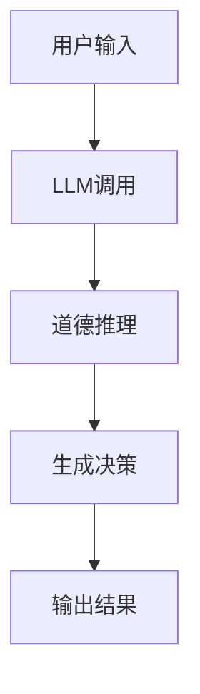
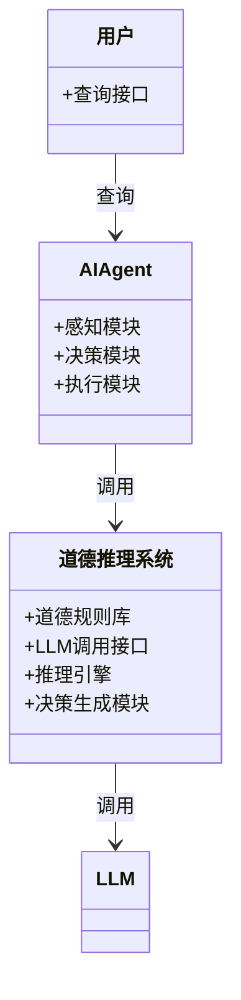
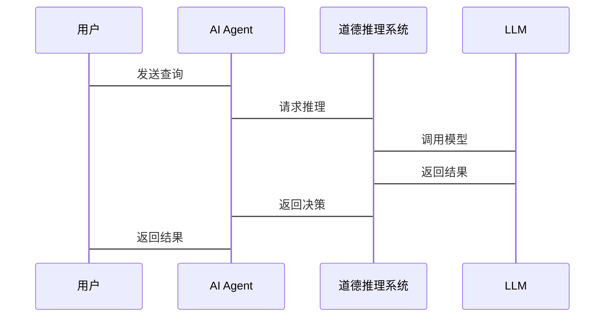

                 


# 构建LLM支持的AI Agent道德推理系统

> 关键词：LLM、AI Agent、道德推理、系统架构、算法原理

> 摘要：本文详细探讨了如何构建一个基于大语言模型（LLM）支持的AI Agent道德推理系统，从背景介绍、核心概念、算法原理、系统架构到项目实战，全面解析了该系统的构建过程和实现细节。

---

# 第一部分: 背景介绍

## 第1章: 问题背景与描述

### 1.1 问题背景

随着AI技术的飞速发展，AI Agent在各个领域的应用越来越广泛。然而，AI Agent在决策过程中往往缺乏对道德和伦理的考虑，导致可能出现违背伦理或社会规范的情况。为了弥补这一不足，构建一个基于LLM的道德推理系统显得尤为重要。

#### 1.1.1 当前AI Agent的发展现状

AI Agent已广泛应用于智能客服、自动驾驶、智能助手等领域。然而，这些系统在决策时往往依赖预设的规则或简单的逻辑推理，缺乏对复杂道德问题的处理能力。

#### 1.1.2 LLM在AI Agent中的应用挑战

大语言模型（LLM）具有强大的自然语言理解和生成能力，但在处理复杂道德问题时，仍存在诸多挑战，如如何确保生成决策的道德正确性，如何处理模糊的道德边界等。

#### 1.1.3 道德推理在AI系统中的重要性

在AI系统中引入道德推理，可以帮助系统在面对复杂问题时做出符合伦理的决策，提升系统的可信度和用户接受度。

### 1.2 问题描述

#### 1.2.1 AI Agent道德推理的核心问题

如何将LLM与AI Agent结合，构建一个能够处理复杂道德问题的推理系统，是当前研究的重点。

#### 1.2.2 LLM支持的道德推理系统的必要性

通过LLM的强大能力，AI Agent可以更好地理解和处理道德问题，从而在决策中考虑更多的人文因素。

#### 1.2.3 当前系统的主要痛点与局限性

现有系统在道德推理方面的能力有限，难以应对复杂的伦理问题，且缺乏灵活性和可解释性。

### 1.3 问题解决与边界

#### 1.3.1 道德推理系统的解决方案

通过结合LLM和AI Agent，构建一个能够进行道德推理的系统，帮助AI Agent在决策时考虑道德因素。

#### 1.3.2 系统的边界与外延

该系统专注于道德推理，不直接涉及AI Agent的其他功能，如感知和执行。但可以通过接口与现有系统集成。

#### 1.3.3 核心要素与组成结构

系统的核心要素包括LLM、道德规则库、推理引擎和决策生成模块。

## 第2章: 核心概念与联系

### 2.1 核心概念原理

#### 2.1.1 LLM的基本原理

大语言模型通过大量数据训练，能够理解和生成人类语言，具有强大的上下文理解和生成能力。

#### 2.1.2 AI Agent的定义与功能

AI Agent是能够感知环境、自主决策并执行任务的智能实体，通常具有目标导向性。

#### 2.1.3 道德推理的实现机制

通过LLM对道德规则的解析和应用，结合具体情境生成符合伦理的决策。

### 2.2 核心概念对比

#### 2.2.1 LLM与传统AI算法的对比

| 对比维度 | LLM | 传统AI算法 |
|----------|-----|------------|
| 数据需求 | 高 | 较低 |
| 处理能力 | 强大 | 较弱 |
| 可解释性 | 低 | 较高 |

#### 2.2.2 道德推理与传统推理的对比

| 对比维度 | 道德推理 | 传统推理 |
|----------|---------|----------|
| 目标 | 道德正确性 | 逻辑正确性 |
| 复杂性 | 高 | 中等 |
| 可量化 | 低 | 高 |

#### 2.2.3 AI Agent与传统决策系统的对比

| 对比维度 | AI Agent | 传统决策系统 |
|----------|----------|--------------|
| 自主性 | 高 | 低 |
| 学习能力 | 强 | 弱 |
| 适应性 | 高 | 中等 |

### 2.3 实体关系图

```mermaid
er
    actor: 用户
    system: 道德推理系统
    llm: 大语言模型
    agent: AI Agent
    decision: 决策
    rules: 道德规则库
    user_query: 用户查询
    system
    actor --> system: 提交查询
    system --> llm: 调用LLM进行推理
    llm --> system: 返回推理结果
    system --> agent: 生成决策
    agent --> actor: 返回决策结果
```

---

# 第二部分: 算法原理讲解

## 第3章: 算法原理

### 3.1 算法流程



### 3.2 算法实现

```python
def 道德推理系统（输入）:
    LLM调用（输入）
    道德规则匹配（LLM输出）
    决策生成（规则匹配结果）
    返回决策结果
```

### 3.3 数学模型与公式

#### 3.3.1 概率分布模型

$$P(\text{决策}|x) = \frac{\exp(f(x))}{\sum_{x'} \exp(f(x'))}$$

其中，$f(x)$ 是模型的输出值，用于计算概率分布。

---

# 第三部分: 系统分析与架构设计方案

## 第4章: 系统分析与架构设计

### 4.1 问题场景介绍

系统需要在医疗、法律等领域提供道德推理支持，帮助AI Agent做出符合伦理的决策。

### 4.2 项目介绍

#### 4.2.1 系统功能设计



### 4.3 系统架构设计

#### 4.3.1 系统架构图


### 4.4 系统接口设计

#### 4.4.1 API接口

```http
POST /api/moral_reasoning
Content-Type: application/json

{
    "input": "..."
}
```

#### 4.4.2 返回结果

```json
{
    "decision": "...",
    "reasoning": "..."
}
```

### 4.5 系统交互设计



---

# 第四部分: 项目实战

## 第5章: 项目实战

### 5.1 环境安装

安装必要的依赖：

```bash
pip install transformers torch
```

### 5.2 系统核心实现

#### 5.2.1 核心代码实现

```python
import torch
from transformers import AutoModelForCausalLM, AutoTokenizer

class MoralReasoningSystem:
    def __init__(self, model_name):
        self.model = AutoModelForCausalLM.from_pretrained(model_name)
        self.tokenizer = AutoTokenizer.from_pretrained(model_name)
    
    def moral_inference(self, input_text):
        inputs = self.tokenizer(input_text, return_tensors="pt")
        outputs = self.model.generate(**inputs, max_length=100)
        return self.tokenizer.decode(outputs[0], skip_special_tokens=True)
```

#### 5.2.2 代码应用解读

上述代码定义了一个道德推理系统，使用预训练的LLM模型进行推理，返回生成的决策结果。

### 5.3 实际案例分析

#### 5.3.1 案例分析

假设用户询问在自动驾驶中遇到危险情况时的决策，系统会调用LLM进行推理，生成符合伦理的决策。

#### 5.3.2 案例解读

通过分析不同场景下的决策，验证系统的有效性和合理性。

### 5.4 项目小结

本项目展示了如何将LLM与AI Agent结合，构建一个能够进行道德推理的系统，为未来的AI应用提供了新的思路。

---

# 第五部分: 总结与最佳实践

## 第6章: 总结与最佳实践

### 6.1 小结

本文详细介绍了构建LLM支持的AI Agent道德推理系统的各个方面，从背景到实现，为读者提供了全面的指导。

### 6.2 注意事项

在实际应用中，需注意系统的可解释性和灵活性，确保道德推理的准确性和合理性。

### 6.3 拓展阅读

推荐阅读相关领域的最新研究，如LLM的伦理研究、AI Agent的决策理论等。

---

# 作者

作者：AI天才研究院/AI Genius Institute & 禅与计算机程序设计艺术 /Zen And The Art of Computer Programming

---

本文详细探讨了构建LLM支持的AI Agent道德推理系统的各个方面，从背景介绍到算法实现，再到系统架构和项目实战，为读者提供了全面的指导。希望本文能为相关领域的研究和实践提供有价值的参考。

