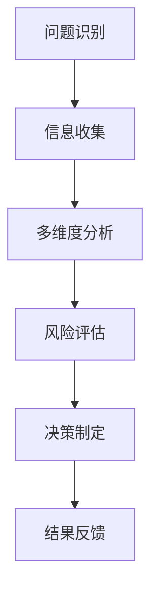
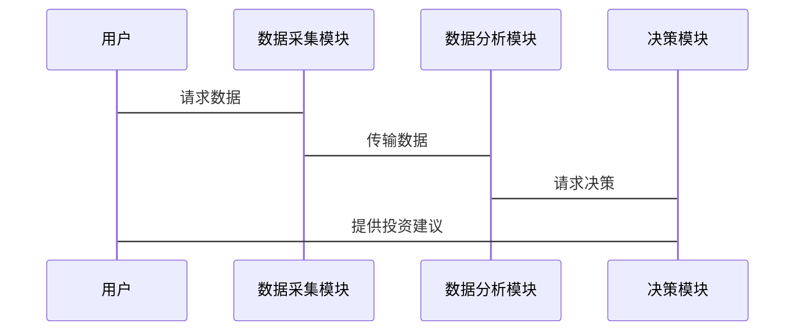

                 

# 查理·芒格的逆向思维：远离人群的投资智慧

---

## 关键词

- 查理·芒格
- 逆向思维
- 投资智慧
- 多元思维模型
- 价值投资
- 风险管理

---

## 摘要

查理·芒格作为投资界的思想巨擘，以其独特的逆向思维和多元思维模型闻名。本文将深入探讨芒格的投资哲学、决策模型以及如何将逆向思维应用于现代投资中。通过分析芒格的多元思维模型、安全边际概念、决策流程，结合实际案例，揭示芒格投资智慧的核心思想，并探讨其在科技投资中的未来应用。

---

## 第1章：查理·芒格的生平与投资哲学

### 1.1 查理·芒格的生平简介

查理·芒格，全名查尔斯·埃里克·芒格（Charles Eric芒格），1924年1月29日出生于美国密苏里州堪萨斯市。他是著名投资者沃伦·巴菲特的长期合作伙伴，共同创立了伯克希尔哈撒韦公司，并使其成为全球最具价值的上市公司之一。

芒格的教育背景深厚，毕业于哈佛大学法学院，拥有法律博士学位。他不仅是投资家，还是成功的律师和商人。芒格的多元思维模型和逆向思维策略使他在投资界独树一帜。

---

### 1.2 芒格的投资哲学核心思想

芒格的投资哲学以价值投资为核心，强调安全边际、竞争优势和长期主义。

#### 1.2.1 价值投资的核心理念

价值投资强调购买低于内在价值的股票，芒格将其发扬光大，提出“价格是市场的价，价值是内在的价”。他通过分析企业的基本面，寻找具有持续竞争优势和良好管理团队的企业。

#### 1.2.2 安全边际的概念

安全边际是指股票价格与内在价值之间的差距，确保在市场波动中不会遭受重大损失。芒格认为，安全边际是投资成功的关键。

#### 1.2.3 长期主义与耐心资本

芒格强调长期投资，避免短期波动的干扰。他认为，投资是时间的朋友，耐心资本能够带来更丰厚的回报。

---

## 第2章：芒格的多元思维模型与决策框架

### 2.1 多元思维模型的构建

芒格的多元思维模型整合了多个学科的知识，包括心理学、经济学、物理学等，帮助投资者全面分析问题。

#### 2.1.1 多元思维模型的核心概念

多元思维模型认为，任何问题都可以从多个角度分析，从而避免单一视角的局限性。例如，物理学中的能量守恒定律可以用来理解市场的供需关系。

#### 2.1.2 多元思维模型的整合与应用

芒格将多元思维模型应用于投资决策中，通过分析企业的财务状况、行业竞争格局、宏观经济环境等多个维度，制定投资策略。

---

### 2.2 芒格的决策流程

芒格的决策流程以逆向思维为核心，强调避免从众心理和市场噪声。

#### 2.2.1 问题识别与分析阶段

芒格首先识别问题的本质，分析问题的背景和相关因素。例如，在投资决策中，他会分析企业的财务状况、管理层能力和行业前景。

#### 2.2.2 多元思维模型的应用步骤

1. 收集信息：芒格会广泛收集与问题相关的数据，包括财务报表、行业报告、管理层访谈等。
2. 多维度分析：利用多元思维模型，从多个角度分析问题，例如经济、法律、心理学等。
3. 风险评估：评估可能的风险因素，包括市场风险、行业风险、企业风险等。
4. 决策制定：基于分析结果，制定最优的投资策略。

#### 2.2.3 决策流程图

---

## 第3章：芒格的逆向思维与投资策略

### 3.1 逆向思维的定义与特点

逆向思维是一种从反方向思考问题的方法，芒格认为逆向思维能够帮助投资者发现市场的机会。

#### 3.1.1 逆向思维与正向思维的对比

| 方面       | 逆向思维                     | 正向思维                     |
|------------|------------------------------|------------------------------|
| 思考方向   | 从反面寻找机会               | 从正面寻找机会               |
| 风险管理   | 降低风险，避免损失           | 降低风险，避免损失           |
| 应用场景   | 寻找市场低估的机会           | 寻找市场高估的机会           |

---

### 3.2 逆向思维在投资中的应用

#### 3.2.1 寻找市场的非共识机会

芒格认为，市场中的非共识机会往往被忽视，而这些机会可能是投资的黄金点。例如，在市场低迷时寻找被低估的企业。

#### 3.2.2 避免从众心理与市场噪声

芒格强调避免从众心理，不被市场噪声干扰。他认为，市场中的情绪波动往往会导致错误的决策。

#### 3.2.3 逆向思维与安全边际的关系

逆向思维与安全边际密切相关，芒格通过寻找安全边际，确保投资的稳健性。

---

### 3.3 芒格逆向思维的案例分析

#### 3.3.1 投资中的逆向决策案例

例如，当市场恐慌时，芒格会选择买入优质企业股票，因为此时股票价格往往低于内在价值。

#### 3.3.2 逆向思维在风险管理中的应用

芒格通过逆向思维，评估可能的风险因素，制定风险管理策略，确保投资组合的稳健性。

---

## 第4章：芒格的多元思维模型与现代投资

### 4.1 多元思维模型的现代应用

#### 4.1.1 多元思维模型在量化投资中的应用

量化投资通过数学模型分析市场数据，芒格的多元思维模型可以与量化投资相结合，提高投资效率。

#### 4.1.2 多元思维模型与人工智能的结合

人工智能可以通过大数据分析，帮助投资者构建多元思维模型，辅助决策。

#### 4.1.3 多元思维模型在风险管理中的创新应用

芒格的多元思维模型可以帮助投资者更好地识别和管理风险，例如通过分析宏观经济数据和行业趋势，制定风险管理策略。

---

### 4.2 芒格思想与现代投资理论的对比

#### 4.2.1 现代投资组合理论与芒格思想的异同

现代投资组合理论强调分散投资，而芒格的思想更注重个股选择和长期投资。

#### 4.2.2 芒格思想对主动投资策略的影响

芒格的逆向思维和多元思维模型对主动投资策略有重要影响，强调选择优质企业进行长期投资。

#### 4.2.3 芒格思想与行为金融学的结合

行为金融学研究投资者心理，芒格的思想与行为金融学有相似之处，例如强调避免从众心理和市场噪声。

---

### 4.3 芒格思想的未来发展趋势

#### 4.3.1 芒格思想在科技投资中的应用前景

随着科技的发展，芒格的逆向思维和多元思维模型在科技投资中将发挥重要作用，例如在人工智能、区块链等领域寻找投资机会。

---

## 第5章：芒格的多元思维模型与项目实战

### 5.1 项目介绍

以科技投资为例，介绍如何利用芒格的多元思维模型进行投资决策。

### 5.2 系统功能设计

构建一个基于多元思维模型的科技投资系统，包括数据采集、分析、决策三个模块。

#### 5.2.1 数据采集

通过网络爬虫获取科技企业的财务数据、行业报告等。

#### 5.2.2 数据分析

利用多元思维模型，从多个维度分析企业的基本面和行业前景。

#### 5.2.3 决策模块

基于分析结果，制定投资策略，例如买入优质企业股票。

### 5.3 系统架构设计

使用分层架构，包括数据层、业务逻辑层和用户界面层。

#### 5.3.1 数据层

存储科技企业的财务数据、行业报告等。

#### 5.3.2 业务逻辑层

实现数据分析和投资决策逻辑。

#### 5.3.3 用户界面层

提供用户友好的界面，展示分析结果和投资建议。

### 5.4 系统交互序列图

---

## 第6章：芒格思想的总结与展望

### 6.1 总结

芒格的逆向思维和多元思维模型为投资者提供了独特的投资智慧，强调安全边际、长期主义和耐心资本。

### 6.2 展望

随着科技的发展，芒格的思想在科技投资中的应用前景广阔，多元思维模型将帮助投资者更好地应对复杂的投资环境。

---

## 结语

查理·芒格的逆向思维和多元思维模型是投资界的重要思想，本文通过详细分析芒格的投资哲学、决策模型和逆向思维策略，揭示了其投资智慧的核心思想，并探讨了其在现代投资中的应用。芒格的思想不仅适用于传统投资，还可以在科技投资中发挥重要作用。

---

## 作者

作者：AI天才研究院/AI Genius Institute & 禅与计算机程序设计艺术 /Zen And The Art of Computer Programming

