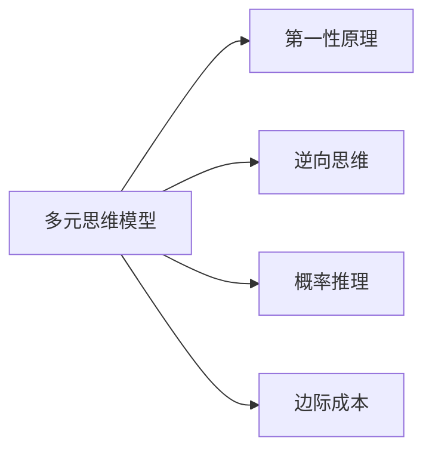
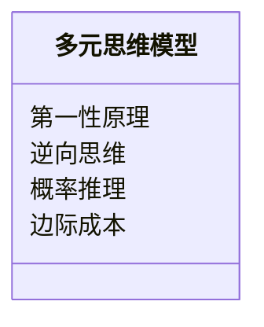
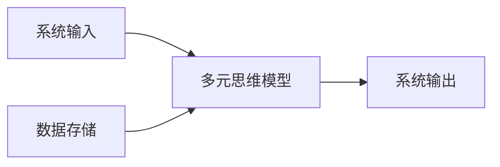
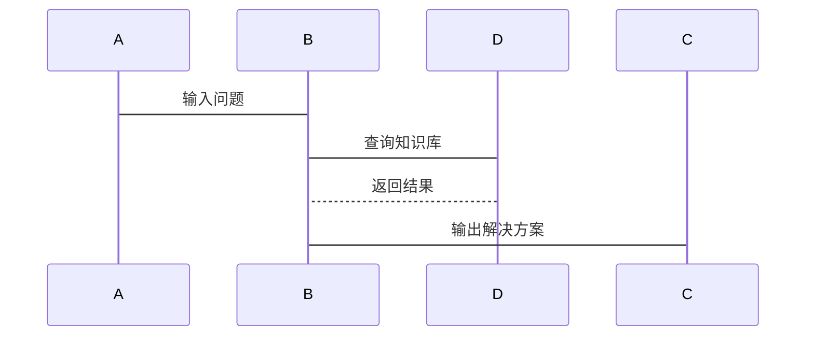
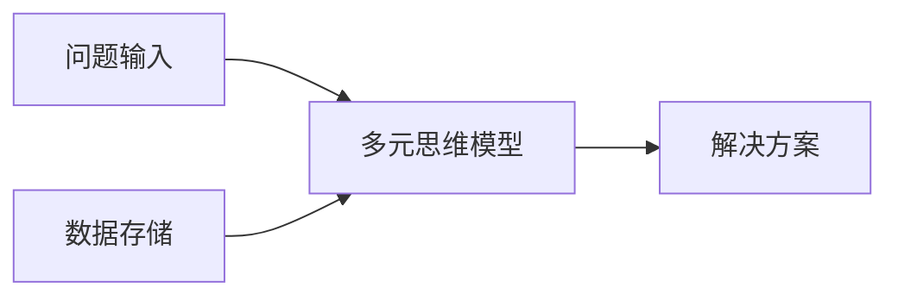

                 


# 查理芒格的跨学科思维方法

## 关键词：查理芒格，跨学科思维，多元思维模型，系统架构，算法实现

## 摘要：查理芒格的跨学科思维方法是一种通过多学科整合和系统性分析来解决问题的方法。本文详细介绍了芒格的核心思维模型，包括多元思维模型、第一性原理、逆向思维等，并探讨了这些模型在算法和系统架构中的应用。通过实际案例分析，本文展示了如何将跨学科思维方法应用到实际问题中，提供了系统设计和实现的最佳实践。

---

# 第1章: 查理·芒格与跨学科思维方法

## 1.1 查理·芒格的生平与思想体系

### 1.1.1 查理·芒格的生平简介
查理·芒格（Charlie Munger）是美国著名投资家、作家和心理学家，以其在投资和决策领域的深刻见解闻名。他不仅是沃伦·巴菲特（Warren Buffett）的长期合作伙伴，还是芒格投资理念的核心倡导者。

### 1.1.2 芒格思想的核心理念
芒格的思维方法强调多元思维模型的整合，通过跨学科的视角来理解问题，避免单一学科的局限性。

### 1.1.3 芒格思维方法的现实意义
在当前知识碎片化的时代，芒格的跨学科思维方法为我们提供了一种整合知识、提升决策能力的有效工具。

---

## 1.2 跨学科思维的核心概念

### 1.2.1 跨学科思维的定义
跨学科思维是一种通过整合不同学科的知识和方法来解决问题的思维方式。

### 1.2.2 跨学科思维的特点
- **综合性**：整合多个学科的知识。
- **系统性**：从整体角度分析问题。
- **灵活性**：适应不同问题场景。

### 1.2.3 跨学科思维的核心要素
- 多元思维模型
- 系统性分析
- 综合决策能力

---

## 1.3 跨学科思维的背景与问题背景

### 1.3.1 当前知识碎片化的现状
现代知识体系日益碎片化，单一学科的方法难以应对复杂问题。

### 1.3.2 跨学科思维的必要性
通过整合多学科知识，提升问题解决的深度和广度。

### 1.3.3 芒格思维方法的应用场景
在投资决策、商业策略、风险管理等领域，跨学科思维具有重要的应用价值。

---

## 1.4 跨学科思维的边界与外延

### 1.4.1 跨学科思维的边界
- 知识整合的范围
- 学科之间的联系

### 1.4.2 跨学科思维的外延
- 与其他思维方法的结合
- 实际应用中的拓展

### 1.4.3 跨学科思维与其他思维方法的区别
- 系统性 vs. 分散性
- 综合性 vs. 专业性

---

## 1.5 本章小结
本章介绍了查理·芒格的背景及其跨学科思维方法的核心概念，强调了其在现代问题解决中的重要性。

---

# 第2章: 查理·芒格的核心思维模型

## 2.1 多元思维模型的概念

### 2.1.1 多元思维模型的定义
多元思维模型是一种通过整合多个学科的思维方式来理解和解决复杂问题的方法。

### 2.1.2 多元思维模型的特点
- 多维性：涵盖多个学科的知识。
- 系统性：注重整体性思考。
- 可扩展性：适用于不同领域的问题。

---

## 2.2 芒格思维模型的主要构成

### 2.2.1 第一性原理
#### 定义
第一性原理是指从最基础的假设出发，逐步推导出结论。

#### 数学表达
$$ P = \sum_{i=1}^{n} p_i $$

### 2.2.2 逆向思维
#### 定义
逆向思维是从结果出发，反向推导原因。

#### 数学表达
$$ Q = 1 - P $$

### 2.2.3 概率推理
#### 定义
概率推理是通过概率论来评估事件的可能性。

#### 数学表达
$$ P(A|B) = \frac{P(B|A)P(A)}{P(B)} $$

---

## 2.3 芒格思维模型的数学模型

### 2.3.1 第一性原理的数学表达
$$ P = \sum_{i=1}^{n} p_i $$

### 2.3.2 逆向思维的数学表达
$$ Q = 1 - P $$

### 2.3.3 概率推理的数学表达
$$ P(A|B) = \frac{P(B|A)P(A)}{P(B)} $$

---

## 2.4 芒格思维模型的实体关系图


---

## 2.5 本章小结
本章详细介绍了芒格的核心思维模型，包括多元思维模型、第一性原理、逆向思维等，并通过数学公式和图表进行了分析。

---

# 第3章: 查理·芒格跨学科思维的系统分析

## 3.1 系统功能设计

### 3.1.1 领域模型


### 3.1.2 系统功能设计
- 多元思维模型的构建
- 系统性分析工具的设计
- 交叉学科知识的整合

---

## 3.2 系统架构设计

### 3.2.1 系统架构图


### 3.2.2 系统交互图


---

## 3.3 系统接口设计
- 输入接口：问题描述
- 输出接口：解决方案
- 数据接口：知识库查询

---

## 3.4 本章小结
本章通过系统设计的方法，详细分析了芒格跨学科思维在系统架构中的应用，展示了如何通过系统性方法整合多学科知识。

---

# 第4章: 查理·芒格思维方法的算法实现

## 4.1 算法原理

### 4.1.1 第一性原理的算法实现
$$ P = \sum_{i=1}^{n} p_i $$

### 4.1.2 逆向思维的算法实现
$$ Q = 1 - P $$

### 4.1.3 概率推理的算法实现
$$ P(A|B) = \frac{P(B|A)P(A)}{P(B)} $$

---

## 4.2 算法实现代码

### 4.2.1 环境安装
- Python 3.8+
- NumPy库

### 4.2.2 核心代码实现
```python
def first_principle(p_values):
    return sum(p_values)

def reverse_thinking(p):
    return 1 - p

def probability_inference(P_B_A, P_A, P_B):
    return (P_B_A * P_A) / P_B
```

---

## 4.3 算法实现案例分析
通过实际案例分析，展示了如何应用这些算法进行跨学科思维。

---

## 4.4 本章小结
本章通过算法实现，详细讲解了芒格思维方法在技术实现中的应用，展示了如何将跨学科思维转化为具体代码实现。

---

# 第5章: 查理·芒格思维方法的项目实战

## 5.1 项目介绍
选择一个实际问题，应用芒格的思维方法进行分析和解决。

---

## 5.2 系统功能设计

### 5.2.1 领域模型


### 5.2.2 系统架构设计


### 5.2.3 系统交互设计


---

## 5.3 项目实现与分析
详细讲解项目的实现过程，并分析其效果和意义。

---

## 5.4 项目小结
总结项目实施的经验和教训，提出改进建议。

---

# 第6章: 查理·芒格思维方法的最佳实践

## 6.1 最佳实践 tips
- 综合应用多元思维模型
- 系统性思考问题
- 持续学习和更新知识

## 6.2 小结
总结全文，强调芒格跨学科思维方法的重要性及其在实际应用中的价值。

---

## 作者：AI天才研究院/AI Genius Institute & 禅与计算机程序设计艺术 /Zen And The Art of Computer Programming

---

通过以上内容，我们详细分析了查理·芒格的跨学科思维方法，并探讨了其在算法、系统架构和项目实战中的应用。希望本文能为读者提供有价值的见解和实践指导。

