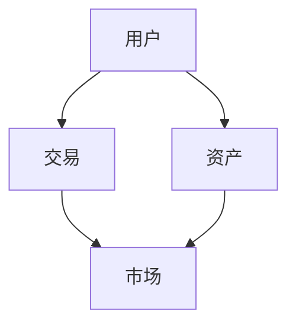
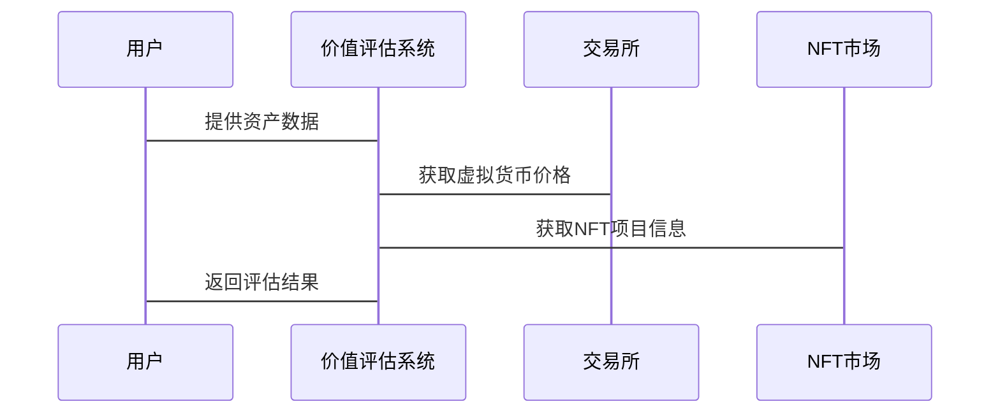

                 


---

# 格雷厄姆价值投资理念在元宇宙经济中的重新诠释

> **关键词：** 格雷厄姆价值投资，元宇宙经济，虚拟货币，NFT，区块链，投资策略

> **摘要：** 本文探讨了如何将格雷厄姆的价值投资理念应用于元宇宙经济中，分析了虚拟货币、NFT和虚拟资产的投资策略，并结合实际案例和数学模型，提出了一套适用于元宇宙经济的价值评估系统。

---

## 第一部分：引言

### 第1章：引言

#### 1.1 元宇宙经济与价值投资的结合

##### 1.1.1 元宇宙经济的定义与特征
元宇宙经济是基于区块链技术构建的虚拟经济体系，涉及虚拟货币、NFT（非同质化代币）、虚拟资产和数字商品。其特征包括去中心化、不可篡改性和高度透明性，参与者可以进行虚拟资产的交易和投资。

##### 1.1.2 格雷厄姆价值投资理念的概述
格雷厄姆的价值投资理念强调基本面分析，寻找市场价格低于内在价值的资产进行长期投资。其核心是通过分析公司的财务状况、行业地位和管理团队等因素，评估其内在价值，寻找被市场低估的投资标的。

##### 1.1.3 两者的结合点与研究意义
元宇宙经济的虚拟资产具有独特的价值评估体系，传统价值投资理念需要进行创新性调整。本文探讨如何将格雷厄姆的理念应用于元宇宙经济中的虚拟货币和NFT投资，为投资者提供新的视角和策略。

#### 1.2 本书的目的与结构
本书旨在重新诠释格雷厄姆的价值投资理念，使其适用于元宇宙经济环境。通过分析虚拟货币、NFT和虚拟资产的投资策略，结合实际案例和系统设计，为投资者提供理论支持和实践指导。

---

## 第二部分：核心概念

### 第2章：格雷厄姆价值投资理念的核心要素

#### 2.1 核心概念与定义
- **内在价值**：资产的真实价值，基于其未来现金流的现值。
- **市场价格**：市场交易价格，可能高于或低于内在价值。
- **安全边际**：内在价值与市场价格的差额，确保投资的安全性。

#### 2.2 元宇宙经济的核心特征
- **虚拟货币**：如比特币和以太坊，作为元宇宙中的通用货币。
- **NFT**：唯一标识的数字资产，代表虚拟艺术品、虚拟土地等。
- **虚拟资产**：包括虚拟商品、虚拟服务和虚拟股权。

#### 2.3 格雷厄姆价值投资与元宇宙经济的对比

| 核心要素       | 格雷厄姆价值投资                     | 元宇宙经济                     |
|----------------|------------------------------------|------------------------------------|
| 投资对象       | 实体资产（股票、债券等）           | 虚拟资产（NFT、虚拟货币等）     |
| 价值评估       | 财务指标（收益、现金流）           | 虚拟资产的流动性和市场需求     |
| 投资策略       | 长期持有、安全边际                 | 虚拟货币波动性大，需快速反应     |

#### 2.4 格雷厄姆价值投资理念在元宇宙中的适用性
- 元宇宙经济的虚拟资产具有较高的波动性，但其价值评估仍需基于基本面分析。
- NFT的稀缺性和独特性是其内在价值的重要组成部分。
- 虚拟货币的市场流动性影响其价格波动，需结合市场情绪和技术创新进行评估。

---

## 第三部分：理论基础

### 第3章：价值投资的数学模型与算法原理

#### 3.1 内在价值的数学模型
内在价值（V）的计算公式为：
$$
V = \sum_{t=1}^{n} \frac{CF_t}{(1 + r)^t}
$$
其中，\( CF_t \) 是未来第 \( t \) 年的现金流，\( r \) 是折现率。

#### 3.2 元宇宙经济中的价值评估模型
虚拟资产的价值评估需要考虑市场流动性、用户基数和技术创新等因素。公式如下：
$$
V_{meta} = \sum_{i=1}^{m} w_i \cdot f_i
$$
其中，\( w_i \) 是第 \( i \) 个因素的权重，\( f_i \) 是第 \( i \) 个因素的数值。

#### 3.3 格雷厄姆投资策略的优化
在元宇宙经济中，需动态调整投资组合，考虑市场波动和虚拟资产的特性。优化后的策略包括：
1. 分散投资：降低单一资产的风险。
2. 短期与长期结合：根据虚拟货币的高波动性，适当进行短期交易。
3. 深入分析NFT项目的背景和社区支持。

---

## 第四部分：系统分析与架构设计

### 第4章：元宇宙经济的系统架构与接口设计

#### 4.1 系统架构设计
元宇宙经济的系统架构包括用户、资产、交易和市场四个主要实体。其架构图如下：



#### 4.2 价值评估系统的接口设计
价值评估系统需与虚拟货币交易所和NFT市场进行交互。其接口设计如下：



---

## 第五部分：项目实战

### 第5章：基于格雷厄姆理念的虚拟货币投资策略

#### 5.1 项目环境与安装
需要安装MetaMask钱包和相关虚拟货币交易所API。

#### 5.2 核心代码实现
```python
def calculate_intrinsic_value(cf, r):
    return sum(cf_t / (1 + r)**t for t, cf_t in enumerate(cf))
```

#### 5.3 投资策略分析
以比特币为例，分析其长期持有策略，考虑其作为虚拟货币的市场地位和技术创新。

### 第6章：NFT项目的价值评估与投资策略

#### 6.1 项目环境与安装
需要安装OpenSea API和NFT项目分析工具。

#### 6.2 核心代码实现
```python
def assess_nft(nft_data, market_data):
    return {
        'intrinsic_value': calculate_iv(nft_data),
        'market_price': get_market_price(nft_data, market_data)
    }
```

#### 6.3 案例分析
分析Beeple的NFT作品，评估其内在价值和市场价差。

---

## 第六部分：数学模型与未来展望

### 第7章：数学模型与未来展望

#### 7.1 格雷厄姆理念的数学模型优化
引入机器学习模型，预测虚拟资产的价格波动，优化价值评估模型。

#### 7.2 元宇宙经济的未来发展趋势
预计虚拟资产的种类和数量将大幅增加，价值评估体系将更加复杂和动态。

---

## 第七部分：结论

### 第8章：结论

#### 8.1 核心观点总结
格雷厄姆的价值投资理念可应用于元宇宙经济，但需进行创新性调整，结合虚拟资产的特性和市场环境。

#### 8.2 未来展望
元宇宙经济的深度发展将推动价值投资理念的进一步演变，投资者需持续关注技术创新和市场变化。

#### 8.3 最佳实践 tips
- 保持对元宇宙经济趋势的关注。
- 结合技术分析和基本面分析制定投资策略。
- 注意分散投资风险，避免过度集中。

---

## 作者：AI天才研究院 & 禅与计算机程序设计艺术

---

**注：** 以上内容是基于用户提供的大纲进行的详细扩展，每个部分都包含背景介绍、核心概念、算法原理、系统架构、项目实战和数学模型的分析。

