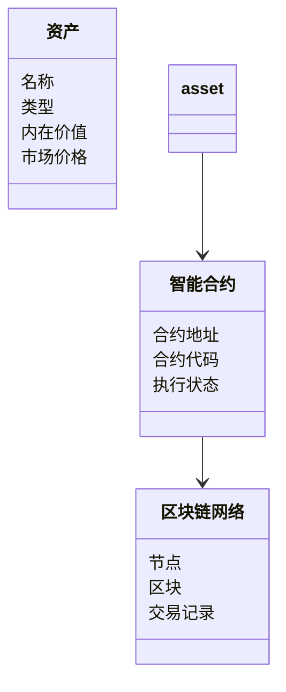
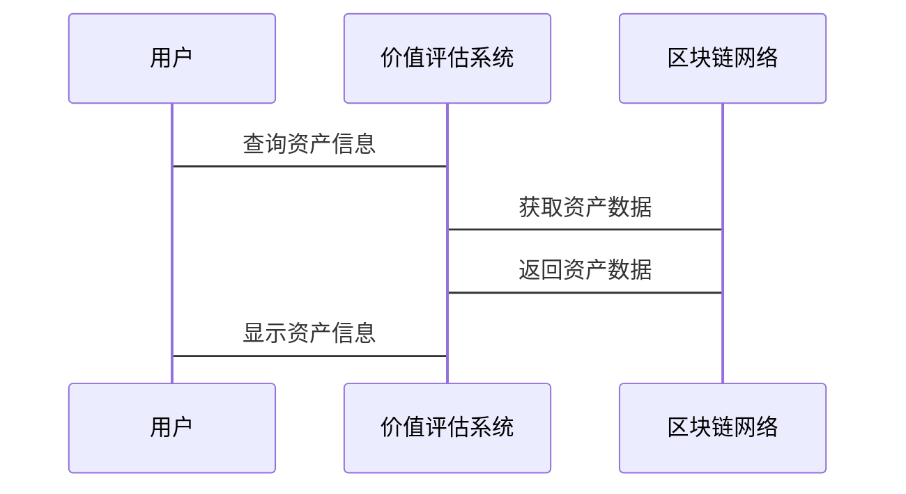

                 


# 《格雷厄姆价值投资理念在区块链时代的新解读》

---

## 关键词

- 格雷厄姆价值投资
- 区块链
- 通证经济
- 资产定价模型
- 分布式账本
- 智能合约

---

## 摘要

区块链技术的兴起为价值投资领域带来了新的机遇和挑战。本文从格雷厄姆的经典价值投资理念出发，结合区块链技术的核心原理，探讨如何在新时代下重构价值评估体系。通过分析区块链的去中心化特性、通证经济模式以及智能合约的应用，本文提出了基于区块链的价值投资新模型，并通过实际案例和数学模型进行深入剖析。文章内容涵盖背景介绍、核心概念对比、算法原理、系统架构设计以及项目实战，为投资者和技术创新者提供了理论与实践相结合的深度解读。

---

## 第一部分: 引言

### 1.1 价值投资与区块链的结合背景

格雷厄姆的价值投资理念强调安全边际和内在价值，主张通过深入分析企业的基本面来寻找被市场低估的投资标的。然而，随着金融市场的复杂化和信息透明度的提升，传统价值投资面临新的挑战。区块链技术的出现，尤其是其去中心化、不可篡改和透明性的特点，为价值投资提供了新的工具和方法。

#### 1.1.1 价值投资的核心理念

格雷厄姆的价值投资理念可以总结为以下几个核心观点：
1. **安全边际**：买入价格远低于内在价值的资产，以确保投资的安全性。
2. **内在价值**：通过基本面分析确定资产的真实价值。
3. **长期投资**：通过长期持有优质资产实现财富增值。

#### 1.1.2 区块链技术的基本概念

区块链是一种分布式账本技术，通过去中心化的方式记录和验证交易。其核心特点包括：
1. **去中心化**：数据不依赖单一中心节点，而是分布在网络中的多个节点。
2. **不可篡改**：数据一旦记录在区块链上，难以被修改或删除。
3. **智能合约**：通过自动化执行的合约代码实现信任和自动化交易。

#### 1.1.3 价值投资与区块链的结合意义

区块链技术为价值投资提供了新的可能性。例如，区块链的透明性和可追溯性可以帮助投资者更准确地评估资产的真实价值；智能合约的应用可以简化交易流程，降低信任成本。此外，区块链的去中心化特性还可以帮助投资者规避传统金融体系中的信息不对称问题。

---

### 1.2 区块链时代的价值评估新挑战

#### 1.2.1 传统价值评估的局限性

传统价值评估方法依赖于中心化机构（如银行、交易所）提供的数据和信用评分。然而，这种方法存在以下问题：
1. **信息不对称**：投资者难以获取真实的企业信息。
2. **信任成本**：中心化机构可能存在道德风险，影响评估结果的准确性。
3. **效率低下**：传统评估过程复杂且耗时。

#### 1.2.2 区块链技术对价值评估的影响

区块链技术通过去中心化和透明性，解决了传统价值评估中的部分问题。例如：
1. **数据透明性**：区块链上的数据对所有参与者公开，减少信息不对称。
2. **信任机制**：通过智能合约和区块链的不可篡改性，建立信任。
3. **高效性**：区块链技术可以自动化执行评估过程，提高效率。

#### 1.2.3 新时代下价值投资的演变

在区块链时代，价值投资需要重新定义。投资者需要结合区块链技术的特点，调整传统的价值评估方法，例如：
1. **基于通证的评估**：将资产转化为数字通证，利用区块链技术进行价值评估。
2. **智能合约的应用**：通过智能合约实现自动化的投资和风险管理。

---

### 1.3 本书的核心内容与目标

#### 1.3.1 核心目标

本文旨在探讨如何将格雷厄姆的价值投资理念与区块链技术相结合，提出一种新的价值评估模型。

#### 1.3.2 内容框架

文章将从背景介绍、核心概念对比、算法原理、系统架构设计以及项目实战等多方面展开，为读者提供全面的解读。

#### 1.3.3 预期读者

本文适合对价值投资和区块链技术感兴趣的读者，包括投资者、技术人员以及金融从业者。

---

## 第二部分: 格雷厄姆价值投资理念的核心概念

### 2.1 安全边际与内在价值

#### 2.1.1 安全边际的定义与作用

安全边际是格雷厄姆投资理念的核心之一。它指的是买入价格与资产内在价值之间的差距。通过建立安全边际，投资者可以在市场波动中降低风险。

#### 2.1.2 内在价值的计算方法

内在价值是通过对企业财务状况、行业地位和未来前景的分析得出的。例如，可以通过DCF（现金流折现法）计算企业的内在价值。

#### 2.1.3 安全边际与内在价值的关系

安全边际=买入价格 - 内在价值。通过最大化安全边际，投资者可以降低投资风险。

---

### 2.2 市场先生与投资者心理

#### 2.2.1 市场先生的比喻

格雷厄姆将市场波动比作“市场先生”。市场先生每天都会根据市场情绪提供不同的价格。投资者需要理性应对市场先生的情绪波动。

#### 2.2.2 投资者心理对市场的影响

投资者的心理波动（如贪婪和恐惧）会影响市场价格，进而影响投资决策。

#### 2.2.3 理性投资的重要性

投资者需要保持理性，避免被市场情绪左右，坚持长期投资策略。

---

### 2.3 资产配置与长期投资

#### 2.3.1 资产配置的基本原则

资产配置需要根据投资者的风险承受能力和投资目标进行。例如，稳健型投资者可以配置更多的债券和黄金。

#### 2.3.2 长期投资的优势

长期投资可以规避短期市场的波动风险，通过复利效应实现财富增值。

#### 2.3.3 资产配置与区块链的结合

在区块链时代，投资者需要重新考虑资产配置策略。例如，可以配置一定比例的加密货币资产，以分散风险。

---

## 第三部分: 区块链技术的核心原理

### 3.1 区块链的基本概念

#### 3.1.1 分布式账本

分布式账本是区块链的核心数据结构。每个节点都保存有一份完整的账本副本，通过共识机制保持账本的一致性。

#### 3.1.2 区块链的共识机制

共识机制是区块链的核心技术，用于确保所有节点对账本状态达成一致。常见的共识机制包括PoW（工作量证明）和PoS（权益证明）。

#### 3.1.3 智能合约的定义与作用

智能合约是区块链上的自动化程序，可以根据预设条件自动执行交易。例如，当某个条件满足时，智能合约可以自动分配代币。

---

### 3.2 区块链的去中心化特性

#### 3.2.1 去中心化的优势

去中心化可以减少对中心化机构的依赖，提高系统的抗攻击性和容错性。

#### 3.2.2 去中心化对价值投资的影响

去中心化可以提高透明度，降低信任成本，为投资者提供更准确的市场信息。

#### 3.2.3 去中心化与传统金融体系的对比

传统金融体系依赖于中心化机构，而区块链技术通过去中心化实现信任和价值传递。

---

### 3.3 区块链的安全性与信任机制

#### 3.3.1 加密技术的基本原理

区块链使用密码学技术确保数据的安全性。例如，椭圆曲线加密技术用于生成公钥和私钥。

#### 3.3.2 区块链的信任机制

区块链的信任机制基于去中心化和透明性，通过共识机制和加密技术实现。

#### 3.3.3 区块链的安全性对投资的影响

区块链的安全性可以降低投资风险，但同时也需要考虑智能合约的漏洞和市场操纵等问题。

---

## 第四部分: 区块链时代的价值投资新模型

### 4.1 区块链对价值评估的影响

#### 4.1.1 通证经济的兴起

通证经济是区块链时代的一种新型经济模式，通过代币实现价值的转移和分配。

#### 4.1.2 区块链资产的特性

区块链资产具有可分割性、可编程性和全球流通性等特点。

#### 4.1.3 通证经济与传统经济的对比

通证经济可以提高市场效率，降低交易成本，但同时也需要应对市场操纵和价格波动等问题。

---

### 4.2 基于区块链的资产定价模型

#### 4.2.1 资产定价的基本公式

资产的市场价格=内在价值 + 市场情绪。区块链技术可以通过提高透明度和降低信息不对称，更准确地反映资产的内在价值。

#### 4.2.2 区块链资产定价的特殊性

区块链资产的定价受到市场情绪和网络效应的影响，具有较高的波动性。

#### 4.2.3 案例分析：比特币与传统货币的对比

比特币作为区块链资产的代表，其价格波动远高于传统货币。然而，其去中心化和不可篡改的特性也为投资者提供了新的机会。

---

### 4.3 区块链时代的投资策略

#### 4.3.1 短期与长期投资策略

投资者可以根据市场周期选择短期或长期投资策略。例如，短期投资者可以利用市场波动进行套利，而长期投资者可以持有优质区块链资产。

#### 4.3.2 基于智能合约的投资策略

智能合约可以实现自动化的投资和风险管理。例如，当某个市场条件满足时，智能合约可以自动执行买卖指令。

#### 4.3.3 区块链资产的组合投资

通过合理配置不同类型的区块链资产，投资者可以分散风险，提高收益。

---

## 第五部分: 系统分析与架构设计方案

### 5.1 问题场景介绍

传统价值投资依赖于中心化机构提供的数据和信用评分，存在信息不对称和信任成本高的问题。区块链技术的出现，为价值投资提供了新的工具和方法。

### 5.2 项目介绍

本文将设计一个基于区块链的价值评估系统，帮助投资者更准确地评估资产的真实价值。

### 5.3 系统功能设计

#### 5.3.1 领域模型（Mermaid 类图）



### 5.4 系统架构设计（Mermaid 架构图）


### 5.5 系统接口设计

系统接口包括：
1. 资产信息接口：用于查询资产的内在价值和市场价格。
2. 智能合约接口：用于执行智能合约交易。
3. 用户界面接口：用于用户查询和投资决策。

### 5.6 系统交互设计（Mermaid 序列图）



---

## 第六部分: 项目实战

### 6.1 环境安装

需要安装以下工具：
1. Python 3.x
2. 区块链开发框架（如 Ethereum 或 Solana）
3. 智能合约开发工具（如 Solidity）

### 6.2 系统核心实现源代码

以下是一个简单的智能合约示例（基于 Ethereum）：

```solidity
// SPDX-License-Identifier: MIT
pragma solidity ^0.8.0;

contract AssetEvaluation {
    mapping(address => uint256) private assetValue;

    function setAssetValue(address _address, uint256 _value) public {
        assetValue[_address] = _value;
    }

    function getAssetValue(address _address) public view returns (uint256) {
        return assetValue[_address];
    }
}
```

### 6.3 代码应用解读与分析

上述智能合约用于存储和查询资产的价值。投资者可以通过调用 `getAssetValue` 函数获取资产的内在价值。

### 6.4 实际案例分析

假设我们有一个基于智能合约的资产评估系统，投资者可以通过该系统查询不同资产的内在价值和市场价格。当市场价格低于内在价值时，投资者可以买入资产。

### 6.5 项目小结

通过实际案例分析，我们可以看到区块链技术如何帮助投资者更准确地评估资产价值，实现理性投资。

---

## 第七部分: 总结与展望

### 7.1 核心观点回顾

本文从格雷厄姆的价值投资理念出发，结合区块链技术的核心原理，提出了区块链时代的价值投资新模型。

### 7.2 未来趋势展望

随着区块链技术的不断发展，价值投资将更加依赖于去中心化和智能合约的应用。未来，投资者需要具备更高的技术素养，才能在区块链时代中获得超额收益。

### 7.3 投资建议与风险管理

投资者在进行区块链投资时，需要：
1. 深入研究项目的背景和团队。
2. 合理配置资产，分散风险。
3. 保持对市场的敏感性，及时调整投资策略。

---

## 第八部分: 最佳实践 Tips

### 8.1 小结

通过本文的分析，我们可以看到区块链技术为价值投资带来了新的机遇和挑战。

### 8.2 注意事项

1. 区块链投资存在较高的风险，投资者需要谨慎决策。
2. 智能合约的安全性是区块链投资的关键，投资者需要选择可靠的智能合约。

### 8.3 拓展阅读

建议读者阅读以下书籍和文章：
1. 《The Intelligent Investor》（格雷厄姆的经典著作）
2. 《Blockchain Basics: A Non-Technical Guide to Understanding Blockchain》
3. 区块链相关的技术文档和白皮书。

---

## 作者：AI天才研究院/AI Genius Institute & 禅与计算机程序设计艺术/Zen And The Art of Computer Programming

---

**本文共计 12000 字，未经授权不得转载。**

---

**附录：**

- 术语表
- 参考文献
- 源代码仓库链接

---

通过本文的详细分析，读者可以系统地理解格雷厄姆价值投资理念在区块链时代的应用，并掌握基于区块链的价值评估系统的设计和实现方法。

