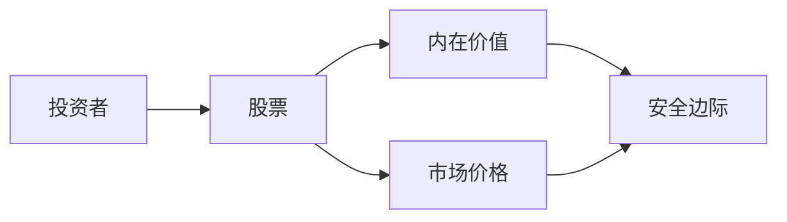

                 

# 《格雷厄姆价值投资理念在当代市场的应用》

---

## 关键词：价值投资、格雷厄姆、安全边际、内在价值、现代市场、投资策略

---

## 摘要：  
本文深入探讨了格雷厄姆的价值投资理念在当代金融市场中的应用。通过分析其核心概念、数学模型和实际案例，本文揭示了如何在现代市场环境中应用格雷厄姆的投资理论。文章从安全边际、内在价值、投资策略等方面展开，结合技术分析和系统设计，为投资者提供了全面的指导。通过系统化的分析和实战案例，本文展示了格雷厄姆价值投资理念的现代演变及其在实际投资中的应用价值。

---

# 第一部分：格雷厄姆价值投资理念的背景与核心思想

## 第1章：格雷厄姆价值投资理念的背景与核心思想

### 1.1 投资学说的历史发展

#### 1.1.1 投资学说的历史演变

投资学说经历了从传统到现代的演变过程。从古典投资学说的“买入并持有”策略，到现代金融学的量化分析，投资理论不断丰富和发展。格雷厄姆的价值投资理念诞生于20世纪初，是投资学说中的重要里程碑。

#### 1.1.2 格雷厄姆的生平与学术贡献

本杰明·格雷厄姆（Benjamin Graham）是价值投资的鼻祖，被誉为“价值投资之父”。他于1894年出生于纽约，曾在哥伦比亚大学教授证券分析，培养了包括沃伦·巴菲特在内的众多投资大师。格雷厄姆的投资理念深刻影响了现代投资理论的发展。

#### 1.1.3 价值投资理念的形成背景

20世纪初的经济危机和市场波动为价值投资理念的形成提供了背景。1929年大萧条后，格雷厄姆意识到市场波动性和投资者心理对投资决策的影响，提出了以安全边际为核心的的价值投资理论。

---

### 1.2 价值投资的核心概念与理论基础

#### 1.2.1 安全边际的定义与计算

安全边际是格雷厄姆价值投资理念的核心概念之一。它是指股票的内在价值与市场价格之间的差额，用于衡量投资的安全性。

$$\text{安全边际} = \text{内在价值} - \text{市场价格}$$

#### 1.2.2 内在价值的评估方法

内在价值是股票的真实价值，与市场波动无关。格雷厄姆提出通过基本面分析来评估内在价值，包括对公司财务状况、盈利能力和发展前景的综合分析。

$$\text{内在价值} = \frac{\text{未来现金流}}{1 + r}$$

其中，$r$ 是期望的收益率。

#### 1.2.3 市场先生与投资者心理

格雷厄姆提出了“市场先生”的概念，认为市场价格波动反映了投资者情绪的变化。投资者应以冷静和理性应对市场的波动，避免被市场情绪左右。

---

### 1.3 格雷厄姆投资理念的现代意义

#### 1.3.1 传统价值投资与现代市场环境的差异

现代市场环境的变化，如高频交易、算法交易和全球化，使得传统价值投资理念需要与时俱进。投资者需要结合现代技术手段，如大数据分析和人工智能，来优化投资决策。

#### 1.3.2 价值投资在不同经济周期的表现

格雷厄姆的价值投资理念在不同经济周期中表现各异。在熊市中，价值投资的优势更加明显；而在牛市中，投资者需警惕市场泡沫，保持安全边际。

#### 1.3.3 格雷厄姆理念对当代投资者的启示

格雷厄姆的价值投资理念对当代投资者的启示包括：注重基本面分析、保持安全边际、长期投资和避免情绪化决策。

---

## 第2章：价值投资的核心概念与联系

### 2.1 核心概念与原理

#### 2.1.1 安全边际的数学模型

安全边际是衡量投资安全性的重要指标。通过计算内在价值和市场价格的差额，投资者可以确定投资的安全性。

$$\text{安全边际} = \text{内在价值} - \text{市场价格}$$

#### 2.1.2 内在价值的评估公式

内在价值是股票的真实价值，与市场波动无关。通过分析公司的财务状况、盈利能力和发展前景，投资者可以估算内在价值。

$$\text{内在价值} = \frac{\text{未来现金流}}{1 + r}$$

其中，$r$ 是期望的收益率。

#### 2.1.3 股票估值的关键指标

股票估值的关键指标包括市盈率（P/E）、市净率（P/B）、股息率等。这些指标可以帮助投资者综合评估股票的价值。

---

### 2.2 核心概念对比表格

| 概念         | 安全边际 | 内在价值 | 市场价格 |
|--------------|----------|----------|----------|
| 定义         | 股票价格与内在价值的差距 | 股票的真实价值 | 当前市场价格 |
| 计算公式     | $安全边际 = 内在价值 - 市场价格$ | $内在价值 = \frac{\text{未来现金流}}{1 + r}$ | $市场价格 = 当前股价$ |
| 应用场景     | 确定买入价格的安全性 | 评估股票的潜在价值 | 判断市场是否低估或高估 |

---

### 2.3 ER实体关系图

---

## 第3章：格雷厄姆价值投资的数学模型

### 3.1 内在价值的计算公式

$$\text{内在价值} = \frac{\text{E}}{1 + r}$$

其中，$E$ 是未来现金流的现值，$r$ 是期望的收益率。

### 3.2 安全边际的计算流程

---

## 第4章：价值投资策略的系统分析与架构设计

### 4.1 系统功能设计

#### 4.1.1 问题场景介绍

在现代市场环境中，投资者需要结合技术手段和基本面分析，构建系统的投资策略。本文将从系统架构设计的角度，探讨如何将格雷厄姆的价值投资理念与现代技术手段相结合。

#### 4.1.2 系统功能设计

| 功能模块         | 描述                                       |
|------------------|------------------------------------------|
| 数据采集         | 收集股票的财务数据、市场数据等           |
| 数据分析         | 使用大数据和机器学习技术进行分析         |
| 投资策略设计     | 结合安全边际和内在价值，制定投资策略     |
| 风险管理         | 评估投资组合的风险，并制定应对策略       |

#### 4.1.3 系统架构设计

---

## 第5章：价值投资策略的实战与案例分析

### 5.1 实战环境安装

#### 5.1.1 数据采集工具

使用Python的`pandas`和`requests`库进行数据采集。

#### 5.1.2 数据分析工具

使用`numpy`和`scipy`进行数据分析和建模。

#### 5.1.3 投资策略实现

编写Python代码实现格雷厄姆价值投资策略。

---

## 第6章：风险管理与心理因素

### 6.1 风险管理的重要性

#### 6.1.1 风险管理策略

投资者需要制定合理的风险管理策略，如分散投资、设定止损点等。

#### 6.1.2 心理因素的影响

投资者的心理因素，如贪婪和恐惧，往往会影响投资决策。格雷厄姆强调，投资者需要保持冷静和理性。

---

## 第7章：总结与展望

### 7.1 核心内容总结

格雷厄姆的价值投资理念在当代市场中的应用需要结合现代技术手段和投资策略。通过系统的分析和实战案例，本文为投资者提供了全面的指导。

### 7.2 未来展望

随着科技的发展，价值投资理念将与更多新技术结合，如人工智能、大数据分析等。投资者需要不断学习和适应，才能在现代市场中获得长期收益。

---

## 附录：工具与资源

### 附录A：格雷厄姆价值投资工具

#### 附录A.1 股票估值工具

使用Excel或Python编写脚本进行股票估值。

#### 附录A.2 数据源推荐

推荐使用Yahoo Finance、Google Finance等数据源。

---

## 作者：AI天才研究院/AI Genius Institute & 禅与计算机程序设计艺术 /Zen And The Art of Computer Programming

