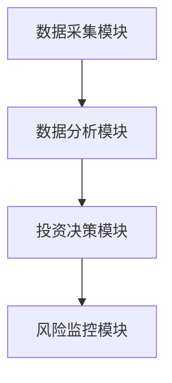

                 


```markdown
# 格雷厄姆价值投资理念在数字资产经济中的新解读

> 关键词：价值投资，数字资产，区块链，内在价值，安全边际，DeFi，加密货币

> 摘要：本文深入探讨了格雷厄姆的价值投资理念在数字资产经济中的应用，通过分析数字资产的市场结构、技术基础和投资策略，结合实际案例，展示了如何将传统价值投资原则应用于数字资产投资中。文章从理论到实践，系统地解读了数字资产经济的现状、价值评估框架、投资策略设计以及系统架构方案，为投资者提供了全面的指导和参考。

---

# 第一部分: 格雷厄姆价值投资理念的核心解读

## 第1章: 价值投资理念的背景与核心概念

### 1.1 价值投资的基本原理

#### 1.1.1 价值投资的定义与起源
价值投资是一种投资策略，由本杰明·格雷厄姆在其著作《证券分析》中提出。其核心理念是通过深入分析企业的基本面，寻找市场价格低于其内在价值的投资机会。格雷厄姆强调安全边际和长期投资，而非短期市场波动。

#### 1.1.2 格雷厄姆的价值投资理论
格雷厄姆的价值投资理论主要包括以下几点：
- **安全边际**：买入价格低于内在价值，以确保投资的安全性。
- **内在价值**：企业未来现金流的现值，反映了其真实的经济价值。
- **市场波动**：市场价格围绕内在价值波动，投资者应利用市场的非理性波动进行投资。

#### 1.1.3 价值投资的核心要素
- **内在价值**：通过基本面分析确定企业的价值。
- **安全边际**：买入价格低于内在价值，以降低投资风险。
- **长期视角**：关注企业的长期增长潜力，而非短期市场波动。

### 1.2 安全边际的概念与应用

#### 1.2.1 安全边际的定义
安全边际是格雷厄姆提出的一个重要概念，指买入价格与内在价值之间的差距。通过建立安全边际，投资者可以在市场价格波动时保护自己的投资。

#### 1.2.2 安全边际的计算方法
安全边际 = 内在价值 - 市场价格

#### 1.2.3 安全边际在投资决策中的作用
安全边际为投资者提供了缓冲区，避免因市场价格波动或估值误差导致的损失。在数字资产投资中，由于市场的高波动性，安全边际的重要性更加凸显。

### 1.3 内在价值的评估方法

#### 1.3.1 内在价值的定义
内在价值是企业未来现金流的现值，反映了其真实的经济价值。格雷厄姆强调，内在价值是投资决策的核心依据。

#### 1.3.2 内在价值的计算公式
$$
\text{内在价值} = \sum_{t=1}^{n} \frac{\text{现金流}_t}{(1 + r)^t}
$$
其中，r为折现率，n为投资期限。

#### 1.3.3 内在价值与市场价值的对比
- **内在价值**：反映企业的真实价值，需通过基本面分析确定。
- **市场价值**：反映市场的供需关系，受市场情绪影响较大。

---

## 第2章: 数字资产经济的背景与现状

### 2.1 数字资产的定义与分类

#### 2.1.1 数字资产的定义
数字资产是指以数字形式存在的资产，包括加密货币、代币、NFT等。数字资产基于区块链技术，具有去中心化、不可篡改等特点。

#### 2.1.2 数字资产的分类
- **加密货币**：如比特币、以太坊，用于价值转移和存储。
- **代币**：如ERC-20代币，用于特定应用场景。
- **NFT**：非同质化代币，用于表示独特数字资产。

#### 2.1.3 数字资产的市场结构
数字资产市场由交易所、钱包、矿池等组成，交易量巨大且波动性高。

### 2.2 区块链技术与数字资产的关系

#### 2.2.1 区块链技术的定义
区块链是一种分布式账本技术，通过去中心化的方式记录交易信息，确保数据的安全性和不可篡改性。

#### 2.2.2 区块链技术的核心特点
- **去中心化**：无需依赖中心机构，降低信任成本。
- **不可篡改**：数据一旦记录，难以修改。
- **透明性**：所有交易记录公开可查。

#### 2.2.3 区块链技术对数字资产的影响
区块链技术为数字资产提供了安全、透明的交易环境，使其成为一种新型的价值载体。

### 2.3 数字资产市场的特点与挑战

#### 2.3.1 数字资产市场的波动性
数字资产市场价格波动剧烈，受市场情绪和政策影响较大。

#### 2.3.2 数字资产市场的监管环境
不同国家对数字资产的监管政策差异较大，增加了市场的不确定性和风险。

#### 2.3.3 数字资产市场的投资风险
数字资产市场存在较高的市场风险和操作风险，投资者需谨慎评估。

---

# 第二部分: 价值投资理念在数字资产中的应用

## 第3章: 价值投资理念在数字资产中的核心要素

### 3.1 数字资产的价值评估框架

#### 3.1.1 数字资产的价值评估维度
- **技术维度**：包括区块链技术的成熟度、可扩展性等。
- **经济维度**：包括市场需求、供给机制等。
- **团队维度**：包括开发团队的能力、背景等。
- **社区维度**：包括社区活跃度、共识程度等。

#### 3.1.2 数字资产的价值评估指标
- **技术指标**：如TPS（每秒交易量）、可扩展性、安全性等。
- **经济指标**：如市场容量、流通市值、日交易量等。
- **团队指标**：如团队规模、开发历史、社区支持等。

#### 3.1.3 数字资产的价值评估流程
1. **市场调研**：了解数字资产的市场定位和应用场景。
2. **技术分析**：评估数字资产的技术实现和性能。
3. **经济分析**：分析数字资产的经济模型和市场前景。
4. **团队分析**：评估开发团队的能力和信誉。
5. **综合评估**：结合各项指标，确定数字资产的内在价值。

### 3.2 数字资产投资中的安全边际

#### 3.2.1 安全边际在数字资产中的应用
在数字资产投资中，安全边际尤为重要，因为市场价格波动剧烈。

#### 3.2.2 安全边际的计算方法
$$
\text{安全边际} = \text{内在价值} - \text{市场价格}
$$

#### 3.2.3 安全边际的影响因素
- **市场波动**：市场价格波动越大，安全边际越重要。
- **估值误差**：内在价值的估算可能存在误差，安全边际可弥补这种误差。

### 3.3 数字资产投资中的内在价值评估

#### 3.3.1 内在价值的评估方法
- **现金流折现法**：通过预测未来现金流，计算内在价值。
- **市场比较法**：通过比较同类资产的市场价格，估算内在价值。

#### 3.3.2 内在价值评估的挑战
- **数据不足**：数字资产市场数据较少，难以准确评估。
- **技术复杂性**：数字资产技术复杂，评估难度大。

---

## 第4章: 价值投资理念在数字资产中的策略与实践

### 4.1 数字资产投资策略的设计

#### 4.1.1 投资策略的核心原则
- **长期视角**：关注数字资产的长期增长潜力。
- **安全边际**：买入价格低于内在价值。
- **分散投资**：降低单一资产的风险。

#### 4.1.2 投资策略的实施步骤
1. **目标设定**：明确投资目标和风险承受能力。
2. **资产筛选**：通过基本面分析筛选潜在标的。
3. **价值评估**：计算内在价值和市场价格。
4. **投资决策**：根据安全边际决定是否买入。
5. **持续监控**：定期评估投资组合的表现。

### 4.2 数字资产投资中的风险管理

#### 4.2.1 风险管理的核心原则
- **分散投资**：降低单一资产的风险。
- **止损策略**：设定止损点，避免重大损失。
- **持续监控**：定期评估投资组合的风险。

#### 4.2.2 风险管理的实施步骤
1. **风险评估**：识别潜在风险因素。
2. **风险控制**：制定风险管理策略。
3. **风险监控**：定期评估风险控制效果。

---

## 第5章: 数字资产投资系统的架构与实现

### 5.1 数字资产投资系统的总体架构

#### 5.1.1 系统架构设计
- **数据采集模块**：采集数字资产的市场数据和项目信息。
- **数据分析模块**：对数据进行清洗、分析和建模。
- **投资决策模块**：基于分析结果，生成投资策略。
- **风险监控模块**：实时监控投资组合的风险。

#### 5.1.2 系统架构图


### 5.2 数字资产投资系统的实现细节

#### 5.2.1 数据采集模块
- **数据源**：包括交易所API、区块链浏览器等。
- **数据清洗**：去除异常数据，确保数据质量。

#### 5.2.2 数据分析模块
- **数据建模**：使用机器学习算法，预测市场价格。
- **价值评估**：计算数字资产的内在价值。

#### 5.2.3 投资决策模块
- **策略生成**：基于分析结果，生成投资策略。
- **决策执行**：通过API实现自动交易。

#### 5.2.4 风险监控模块
- **风险评估**：实时监控投资组合的风险。
- **风险预警**：当风险超过阈值时，触发预警。

### 5.3 数字资产投资系统的代码实现

#### 5.3.1 数据采集模块
```python
import requests

def get_price(symbol):
    url = f"https://api.binance.com/api/v3/klines?symbol={symbol}&interval=1d"
    response = requests.get(url)
    data = response.json()
    return float(data[-1][1])
```

#### 5.3.2 数据分析模块
```python
import pandas as pd

def calculate_intrinsic_value(data):
    # 假设data为DataFrame格式，包含现金流、折现率等信息
    return data['现金流'].sum() / (1 + data['折现率'].mean())
```

#### 5.3.3 投资决策模块
```python
def make_decision(symbol, price, intrinsic_value):
    margin = intrinsic_value - price
    if margin > 0:
        return "买入"
    else:
        return "卖出"
```

---

## 第6章: 数字资产投资的最佳实践与小结

### 6.1 最佳实践 tips

#### 6.1.1 风险管理
- 设置止损点，避免重大损失。
- 分散投资，降低风险。

#### 6.1.2 持续学习
- 关注行业动态，了解新技术和新趋势。
- 不断优化投资策略。

### 6.2 项目实战总结
通过实际案例分析，验证了格雷厄姆价值投资理念在数字资产中的可行性。投资系统的设计和实现，为投资者提供了有效的工具和方法。

### 6.3 未来展望
随着区块链技术的发展和数字资产市场的成熟，价值投资理念将在数字资产经济中发挥更重要的作用。未来的研究可以进一步探讨如何利用人工智能技术，提升数字资产的价值评估和投资决策能力。

---

# 作者：AI天才研究院/AI Genius Institute & 禅与计算机程序设计艺术 /Zen And The Art of Computer Programming
```

