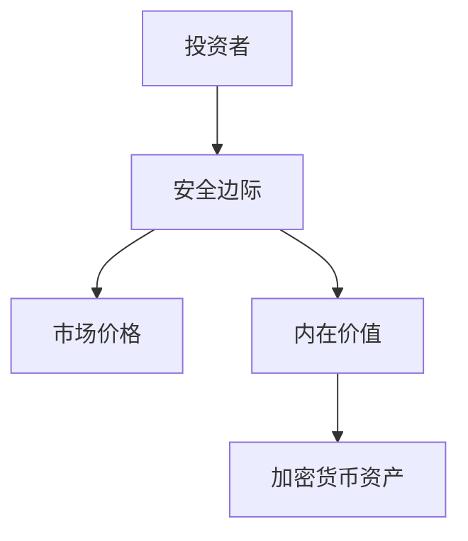
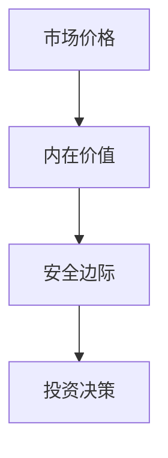
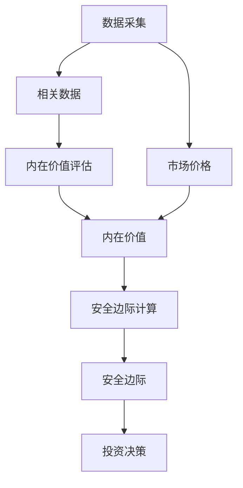

                 


# 格雷厄姆安全边际概念在加密货币市场中的应用

> 关键词：格雷厄姆安全边际，加密货币市场，价值投资，风险管理，内在价值

> 摘要：本文探讨了格雷厄姆安全边际概念在加密货币市场中的应用，分析了其核心原理、数学模型、算法实现以及在实际投资中的策略。通过案例分析和系统设计，本文展示了如何利用安全边际理论来优化加密货币投资决策，降低风险，提高收益。

---

# 第1章: 加密货币市场的现状与安全边际的重要性

## 1.1 加密货币市场的基本特征

### 1.1.1 加密货币市场的定义与特点

加密货币市场是以区块链技术为基础，交易加密货币（如比特币、以太坊等）的金融市场。与传统金融市场相比，加密货币市场具有以下特点：

1. **去中心化**：交易不受单一机构控制，基于区块链技术实现点对点交易。
2. **高波动性**：加密货币价格波动剧烈，受市场情绪和技术发展影响较大。
3. **24/7交易**：加密货币市场全天候运行，没有传统金融市场的交易时间限制。
4. **全球性**：市场参与者分布全球，交易量大且分散。

### 1.1.2 加密货币市场的参与者与交易机制

加密货币市场的参与者包括个人投资者、机构投资者、交易所、矿工和开发团队。交易机制主要通过加密货币交易所（如Binance、Coinbase等）完成，交易流程包括下单、撮合和结算。

### 1.1.3 加密货币市场的波动性与风险

加密货币市场的高波动性使其成为高风险投资领域。价格波动受多种因素影响，包括市场情绪、政策法规、技术升级和宏观经济环境等。这种高风险特性使得投资者需要更加谨慎，尤其是在选择投资标的和确定买入价格时。

## 1.2 格雷厄姆安全边际概念的背景介绍

### 1.2.1 格雷厄姆与价值投资的基本理念

本杰明·格雷厄姆是价值投资的鼻祖，他提出的核心理念是“价格是投资的结果，而价值是投资的基础”。他认为，投资者应以低于资产内在价值的价格买入，以确保投资的安全性。

### 1.2.2 安全边际的定义与核心要素

安全边际是指资产的市场价格低于其内在价值的部分。公式表示为：

$$ \text{安全边际} = \text{内在价值} - \text{市场价格} $$

安全边际的核心要素包括：

1. **内在价值**：资产的实际价值，基于未来现金流的折现值。
2. **市场价格**：资产在市场上的交易价格。
3. **安全空间**：安全边际的大小决定了投资的安全性，安全边际越大，投资风险越小。

### 1.2.3 安全边际在传统投资中的应用与局限

在传统投资中，安全边际常用于股票投资，帮助投资者避免因市场价格波动而造成损失。然而，传统市场的低波动性和相对成熟的市场环境使得安全边际的应用相对简单。加密货币市场的高波动性和不确定性为安全边际的应用带来了新的挑战。

## 1.3 加密货币市场中应用安全边际的必要性

### 1.3.1 加密货币市场的特殊性与投资风险

加密货币市场的波动性远高于传统市场，价格在短时间内可能出现大幅波动。这种特性使得投资者在选择标的和确定买入价格时需要更加谨慎。

### 1.3.2 安全边际在加密货币投资中的潜在价值

通过应用安全边际理论，投资者可以在加密货币市场中降低投资风险，提高投资决策的科学性。尤其是在市场波动剧烈的情况下，安全边际可以帮助投资者避免因价格波动而造成损失。

### 1.3.3 传统安全边际理论与加密货币市场的结合点

尽管加密货币市场具有特殊性，但其核心逻辑与传统市场相似。安全边际理论在加密货币市场中的应用，需要结合其特点进行调整和优化。

---

# 第2章: 格雷厄姆安全边际概念的核心要素与数学模型

## 2.1 安全边际的定义与计算方法

### 2.1.1 安全边际的定义

安全边际是指资产的市场价格低于其内在价值的部分，反映了资产的安全程度。公式表示为：

$$ \text{安全边际} = \text{内在价值} - \text{市场价格} $$

### 2.1.2 内在价值的评估方法

内在价值是资产的实际价值，基于未来现金流的折现值。常用的评估方法包括：

1. **DCF模型（Discounted Cash Flow）**：基于未来现金流的现值计算内在价值。
2. **相对估值法**：通过比较类似资产的市场价格确定内在价值。

### 2.1.3 安全边际与投资风险的关系

安全边际越大，投资风险越小。投资者应选择安全边际较高的资产进行投资，以降低市场波动带来的影响。

## 2.2 内在价值与市场价格的对比分析

### 2.2.1 内在价值的计算公式

$$ \text{内在价值} = \sum_{t=1}^{\infty} \frac{\text{现金流}_t}{(1 + r)^t} $$

其中，$r$ 是折现率，$\text{现金流}_t$ 是第$t$期的现金流。

### 2.2.2 安全边际的计算公式

$$ \text{安全边际} = \text{内在价值} - \text{市场价格} $$

### 2.2.3 安全边际的属性特征对比

| 特性      | 内在价值          | 市场价格          | 安全边际          |
|-----------|-------------------|-------------------|-------------------|
| 计算方式   | 基于未来现金流    | 市场交易价格      | 内在价值 - 市场价格 |
| 稳定性     | 较为稳定          | 易受市场波动影响  | 取决于内在价值和市场价格 |
| 影响因素   | 现金流、折现率     | 市场情绪、供需关系 | 内在价值和市场价格 |

## 2.3 格雷厄姆安全边际的ER实体关系图



---

# 第3章: 加密货币市场中安全边际的应用算法与数学模型

## 3.1 安全边际计算的算法原理

### 3.1.1 算法输入：市场价格与内在价值

- **市场价格**：加密货币当前的交易价格。
- **内在价值**：基于DCF模型计算的加密货币的实际价值。

### 3.1.2 算法输出：安全边际值

$$ \text{安全边际} = \text{内在价值} - \text{市场价格} $$

### 3.1.3 算法流程图



## 3.2 内在价值评估的数学模型

### 3.2.1 内在价值的公式表示

$$ \text{内在价值} = \sum_{t=1}^{\infty} \frac{\text{现金流}_t}{(1 + r)^t} $$

### 3.2.2 现金流的预测与贴现率的确定

- **现金流预测**：基于加密货币项目的未来收益预测。
- **贴现率**：通常基于市场风险溢价和无风险利率确定。

## 3.3 安全边际计算的Python实现

### 3.3.1 环境安装与依赖管理

```bash
pip install pandas numpy matplotlib
```

### 3.3.2 核心代码实现

```python
import numpy as np

def calculate_intrinsic_value(cash_flows, discount_rate):
    return np.sum(cash_flows / (1 + discount_rate) ** np.arange(len(cash_flows)))

def calculate_margin_of_safety(intrinsic_value, market_price):
    return intrinsic_value - market_price

# 示例数据
cash_flows = [100, 150, 200, 250]  # 简单的现金流预测
discount_rate = 0.05  # 贴现率
market_price = 100  # 当前市场价格

# 计算内在价值
intrinsic_value = calculate_intrinsic_value(cash_flows, discount_rate)

# 计算安全边际
margin_of_safety = calculate_margin_of_safety(intrinsic_value, market_price)

print(f"内在价值: {intrinsic_value:.2f}")
print(f"安全边际: {margin_of_safety:.2f}")
```

---

# 第4章: 加密货币市场中安全边际的应用策略与系统架构

## 4.1 应用策略

### 4.1.1 确定投资目标

投资者应根据自身的风险承受能力和收益目标选择合适的加密货币资产。

### 4.1.2 评估内在价值

基于DCF模型等方法评估加密货币的内在价值。

### 4.1.3 计算安全边际

根据市场价格和内在价值计算安全边际，选择安全边际为正的资产进行投资。

## 4.2 系统架构

### 4.2.1 系统功能设计

- **数据采集**：获取加密货币的市场价格和相关数据。
- **内在价值评估**：基于模型计算内在价值。
- **安全边际计算**：根据市场价格和内在价值计算安全边际。
- **投资决策**：基于安全边际结果制定投资策略。

### 4.2.2 系统架构图



## 4.3 系统接口设计

- **输入接口**：市场价格、现金流、贴现率等。
- **输出接口**：内在价值、安全边际、投资建议等。

---

# 第5章: 项目实战与案例分析

## 5.1 项目介绍

选择一个具体的加密货币项目（如比特币），分析其内在价值和市场价格，计算安全边际。

## 5.2 数据收集

收集比特币的历史价格数据和相关财务数据。

## 5.3 分析与计算

基于DCF模型计算比特币的内在价值，并计算其安全边际。

## 5.4 案例分析

通过具体案例分析，展示安全边际在实际投资中的应用。

---

# 第6章: 总结与展望

## 6.1 本章小结

本文探讨了格雷厄姆安全边际概念在加密货币市场中的应用，分析了其核心原理、数学模型和算法实现，并通过案例分析展示了其在实际投资中的应用价值。

## 6.2 未来展望

未来的研究可以进一步优化安全边际的计算模型，探索其在不同类型加密货币中的应用，以及结合其他投资策略（如对冲策略）进一步降低投资风险。

---

# 参考文献

1. 格雷厄姆, 本杰明. 《证券分析》.
2. 加密货币相关学术文献与研究报告.

---

# 作者

作者：AI天才研究院/AI Genius Institute & 禅与计算机程序设计艺术 /Zen And The Art of Computer Programming

