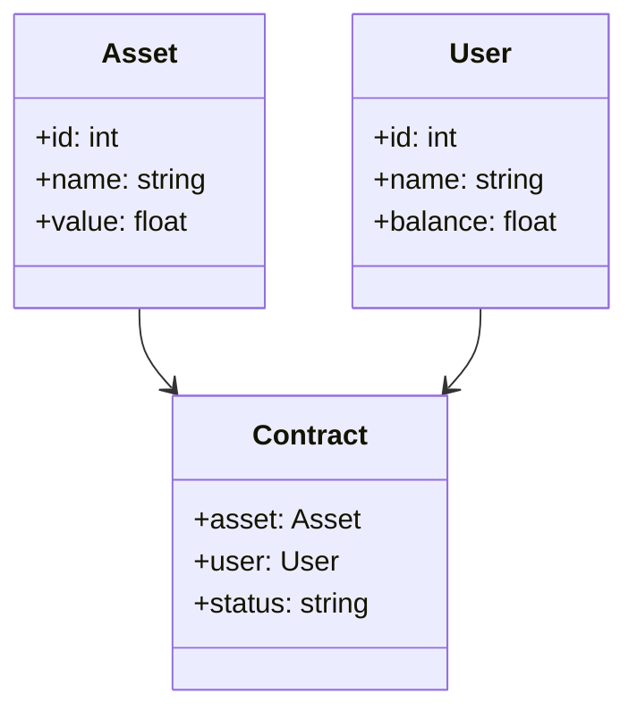
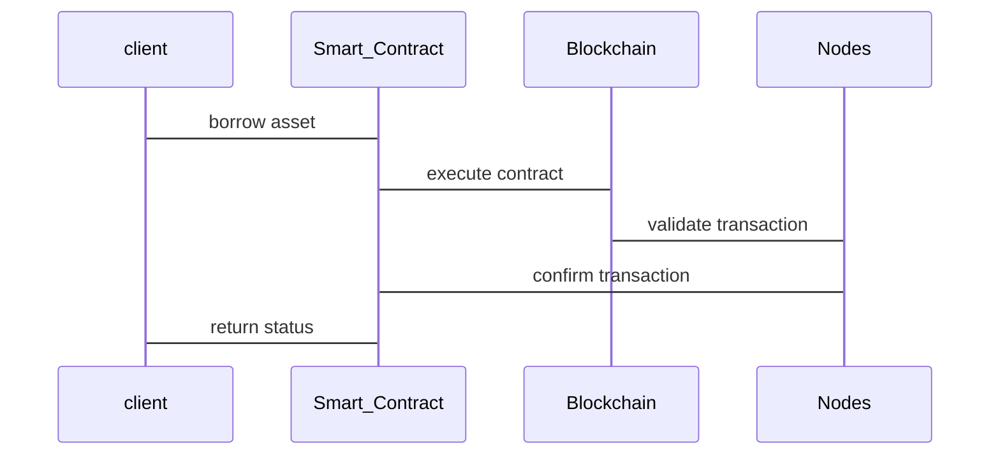

                 


# 《格雷厄姆安全边际概念在去中心化金融(DeFi)中的应用》

---

## 关键词：
- 格雷厄姆安全边际  
- 去中心化金融  
- DeFi  
- 投资理论  
- 智能合约  
- 区块链技术  

---

## 摘要：
本文系统地探讨了格雷厄姆安全边际概念在去中心化金融（DeFi）中的应用。首先，我们介绍了格雷厄姆安全边际的核心理论，包括其定义、历史演变及其在传统投资中的应用。接着，我们深入分析了DeFi的基本概念、体系结构及其与传统金融的区别。随后，我们探讨了安全边际与DeFi的共通性与差异性，特别是在DeFi借贷、流动性挖矿和风险管理中的应用。通过数学模型和实际案例，我们详细展示了如何将安全边际的概念应用于DeFi环境中的智能合约设计和风险管理。最后，我们总结了安全边际在DeFi中的重要性，并展望了未来的研究方向。

---

## 第一部分: 格雷厄姆安全边际概念的背景与基础

---

## 第1章: 安全边际概念的定义与核心要素

### 1.1 格雷厄姆安全边际的定义与历史演变

#### 1.1.1 格雷厄姆安全边际的定义
格雷厄姆的安全边际概念是投资学中的一个核心理论，由 Benjamin Graham 提出。安全边际是指资产的市场价格与其内在价值之间的差异，即市场价格低于内在价值的部分。这种差异为投资者提供了“安全空间”，以避免因市场价格波动带来的损失。

#### 1.1.2 安全边际概念的历史演变
安全边际的概念起源于20世纪初，Benjamin Graham 在其经典著作《The Intelligent Investor》中首次系统地提出了这一理论。随着金融市场的不断发展，安全边际的应用范围逐渐扩展到股票、债券等多种金融资产。

#### 1.1.3 安全边际在投资决策中的核心作用
安全边际在投资决策中起到了关键作用，它不仅帮助投资者降低风险，还能够提高投资组合的稳定性。通过安全边际，投资者可以在市场价格波动时保持稳健的投资策略。

---

### 1.2 安全边际的核心要素与属性

#### 1.2.1 格雷厄姆安全边际的核心要素
格雷厄姆的安全边际包括以下核心要素：
1. **内在价值**：资产的真实价值，基于其未来现金流的折现值。
2. **市场价格**：资产在市场上的交易价格。
3. **安全边际宽度**：内在价值与市场价格之间的差异。

#### 1.2.2 安全边际的属性特征对比表

| 属性         | 安全边际特征 |
|--------------|--------------|
| 计算基础     | 内在价值与市场价格的差值 |
| 作用         | 降低投资风险，提高投资收益 |
| 适用范围     | 股票、债券、房地产等金融资产 |

#### 1.2.3 安全边际与风险控制的关系
安全边际是风险控制的重要工具，通过确保市场价格低于内在价值，投资者能够有效降低因市场波动带来的风险。

---

### 1.3 安全边际在传统投资中的应用

#### 1.3.1 格雷厄姆安全边际在股票投资中的应用
在股票投资中，安全边际通过比较股票的内在价值和市场价格来确定投资机会。当市场价格低于内在价值时，股票具有投资价值。

#### 1.3.2 安全边际在债券投资中的应用
在债券投资中，安全边际用于评估债券的信用风险和市场风险，确保债券的市场价格低于其面值。

#### 1.3.3 安全边际在资产配置中的作用
在资产配置中，安全边际帮助投资者分散风险，优化投资组合的结构。

---

## 第2章: 去中心化金融（DeFi）的定义与体系

### 2.1 DeFi的定义与核心特点

#### 2.1.1 去中心化金融的定义
DeFi（Decentralized Finance）是基于区块链技术的去中心化金融体系，旨在通过智能合约和分布式账本技术实现金融交易的去信任化。

#### 2.1.2 DeFi的核心特点与优势
- **去中心化**：DeFi系统不依赖于传统金融机构，通过区块链技术实现去中心化。
- **透明性**：所有交易记录在区块链上，具有高度透明性。
- **可编程性**：通过智能合约实现自动化的金融交易。

#### 2.1.3 DeFi与传统金融的区别
DeFi与传统金融的主要区别在于去中心化、透明性和可编程性。DeFi通过区块链技术实现了金融交易的自动化和去信任化。

---

### 2.2 DeFi的主要组成部分

#### 2.2.1 智能合约
智能合约是DeFi的核心组件，通过预定义的代码实现金融交易的自动化。例如，智能合约可以自动执行借贷协议。

#### 2.2.2 去中心化交易所
去中心化交易所（DEX）是基于区块链的交易平台，允许用户直接进行资产交易，无需依赖传统金融机构。

#### 2.2.3 代币与通证经济
代币是DeFi生态中的价值载体，通过通证经济实现金融资产的数字化和可分割性。

---

### 2.3 DeFi的生态系统与应用场景

#### 2.3.1 借贷平台
DeFi借贷平台通过智能合约实现去中心化借贷，用户可以借入或借出资产，利率基于市场供需。

#### 2.3.2 流动性挖矿
流动性挖矿是通过提供流动性来获得奖励的过程，用户将资产存入去中心化交易所，获得挖矿奖励。

#### 2.3.3 去中心化支付与结算
DeFi通过区块链技术实现去中心化支付与结算，提高了交易效率和降低了成本。

---

## 第3章: 安全边际概念与DeFi的共通性与差异性

### 3.1 格雷厄姆安全边际的核心原理

#### 3.1.1 安全边际的数学模型
安全边际的计算公式为：
$$ \text{安全边际} = \text{内在价值} - \text{市场价格} $$

#### 3.1.2 安全边际的计算方法
通过分析资产的内在价值和市场价格，计算出安全边际的宽度。

#### 3.1.3 安全边际与资产价值的关系
安全边际与资产价值密切相关，当市场价格低于内在价值时，资产具有投资价值。

---

### 3.2 DeFi中的安全边际应用

#### 3.2.1 DeFi借贷中的安全边际
在DeFi借贷中，安全边际用于评估借款人的信用风险。通过智能合约实现自动化的风险控制。

#### 3.2.2 DeFi流动性挖矿中的安全边际
流动性挖矿中，安全边际用于评估用户提供的流动性资产的价值，确保市场价格低于内在价值。

#### 3.2.3 DeFi风险管理中的安全边际
DeFi风险管理通过安全边际确保金融交易的稳定性和可靠性。

---

### 3.3 格雷厄姆安全边际与DeFi的共通性与差异性

#### 3.3.1 共通性分析
- **风险控制**：两者都注重风险控制，通过安全边际降低投资风险。
- **价值评估**：两者都基于资产的内在价值进行评估。

#### 3.3.2 差异性分析
- **技术基础**：DeFi基于区块链技术，而安全边际基于传统金融理论。
- **应用场景**：DeFi应用于去中心化金融，而安全边际应用于传统投资。

#### 3.3.3 结合应用的可能性
通过结合安全边际和DeFi技术，可以实现更加智能化和自动化的金融风险管理。

---

## 第四部分: 系统分析与架构设计

### 第4章: DeFi系统的架构设计

#### 4.1 问题场景介绍
DeFi系统需要实现去中心化借贷、流动性挖矿等功能，同时确保系统的安全性和稳定性。

#### 4.2 项目介绍
本项目旨在设计一个基于DeFi的安全边际应用系统，通过智能合约实现金融交易的自动化。

#### 4.3 系统功能设计

##### 4.3.1 领域模型（Mermaid 类图）



##### 4.3.2 系统架构设计（Mermaid 架构图）

```mermaid
client
    client --> Smart_Contract: interact
    Smart_Contract --> Blockchain: deploy
    Blockchain --> Nodes: validate
    Nodes --> Smart_Contract: confirm
    Smart_Contract --> client: response
```

##### 4.3.3 系统接口设计
- **智能合约接口**：定义金融交易的规则和流程。
- **用户接口**：提供用户与系统交互的功能，如借贷、挖矿等。

##### 4.3.4 系统交互设计（Mermaid 序列图）



---

## 第五部分: 项目实战

### 第5章: 安全边际在DeFi中的项目实战

#### 5.1 环境安装
- **区块链环境**：安装以太坊或其他支持智能合约的区块链平台。
- **智能合约开发工具**：使用Solidity编写智能合约。

#### 5.2 系统核心实现源代码

##### 5.2.1 智能合约实现
以下是一个简单的DeFi借贷智能合约示例（Solidity）：

```solidity
// SPDX-License-Identifier: MIT
pragma solidity ^0.8.0;

contract SafeMargin {
    struct Asset {
        address owner;
        uint256 value;
    }

    function borrow(address asset, uint256 amount) public {
        Asset storage a = assets[asset];
        require(a.value >= amount, "Insufficient funds");
        a.value -= amount;
        a.owner = msg.sender;
    }

    function repay(address asset, uint256 amount) public {
        Asset storage a = assets[asset];
        require(msg.sender == a.owner, "Not authorized");
        a.value += amount;
    }
}
```

##### 5.2.2 应用程序实现
以下是一个DeFi借贷平台的前端界面设计（React）：

```javascript
import React, { useState } from 'react';
import { ethers } from 'ethers';

function DeFiPlatform() {
    const [borrowAmount, setBorrowAmount] = useState('');
    const [repayAmount, setRepayAmount] = useState('');

    const borrow = async () => {
        const amount = parseInt(borrowAmount);
        // 调用智能合约的borrow方法
        const tx = await contract.borrow(assetAddress, amount);
        await tx.wait();
        console.log('借入成功');
    };

    const repay = async () => {
        const amount = parseInt(repayAmount);
        // 调用智能合约的repay方法
        const tx = await contract.repay(assetAddress, amount);
        await tx.wait();
        console.log('还款成功');
    };

    return (
        <div>
            <input
                type="number"
                placeholder="借入金额"
                value={borrowAmount}
                onChange={(e) => setBorrowAmount(e.target.value)}
            />
            <button onClick={borrow}>借入</button>
            <input
                type="number"
                placeholder="还款金额"
                value={repayAmount}
                onChange={(e) => setRepayAmount(e.target.value)}
            />
            <button onClick={repay}>还款</button>
        </div>
    );
}

export default DeFiPlatform;
```

##### 5.2.3 案例分析与解读
通过上述代码，我们实现了DeFi借贷平台的基本功能，包括借入和还款操作。智能合约确保了交易的安全性和自动化。

---

## 第六部分: 总结与展望

### 6.1 总结

#### 6.1.1 核心内容回顾
本文系统地探讨了格雷厄姆安全边际概念在DeFi中的应用，分析了安全边际与DeFi的共通性与差异性，并通过实际案例展示了安全边际在DeFi中的应用。

#### 6.1.2 安全边际在DeFi中的重要性
安全边际在DeFi中的应用有助于降低投资风险，提高金融交易的稳定性和可靠性。

---

### 6.2 展望

#### 6.2.1 未来的研究方向
未来的研究可以进一步探讨安全边际在DeFi中的数学模型优化，以及在复杂金融场景中的应用。

#### 6.2.2 结合区块链技术的深入研究
通过结合区块链技术，进一步优化安全边际在DeFi中的应用，实现更加智能化和自动化的风险管理。

---

## 作者：AI天才研究院/AI Genius Institute & 禅与计算机程序设计艺术 /Zen And The Art of Computer Programming

