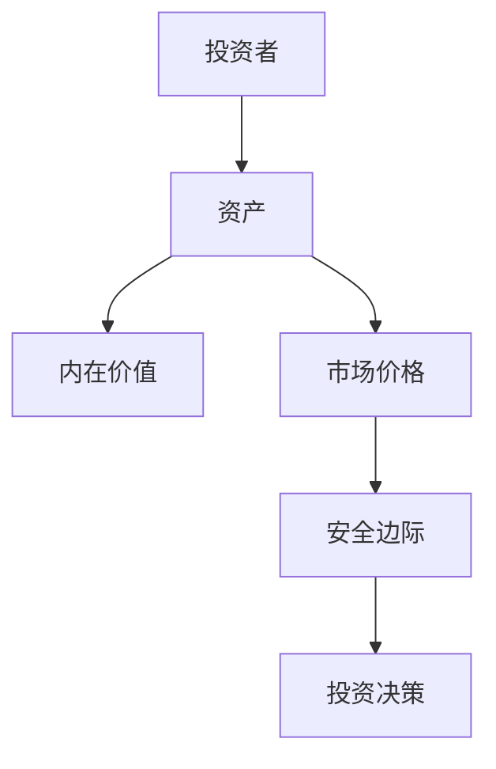
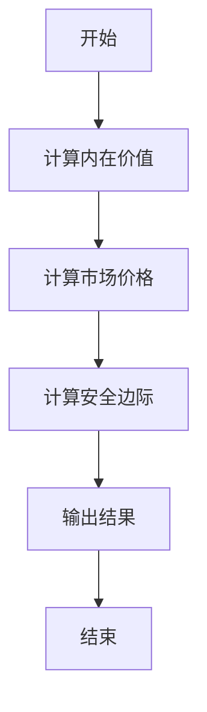
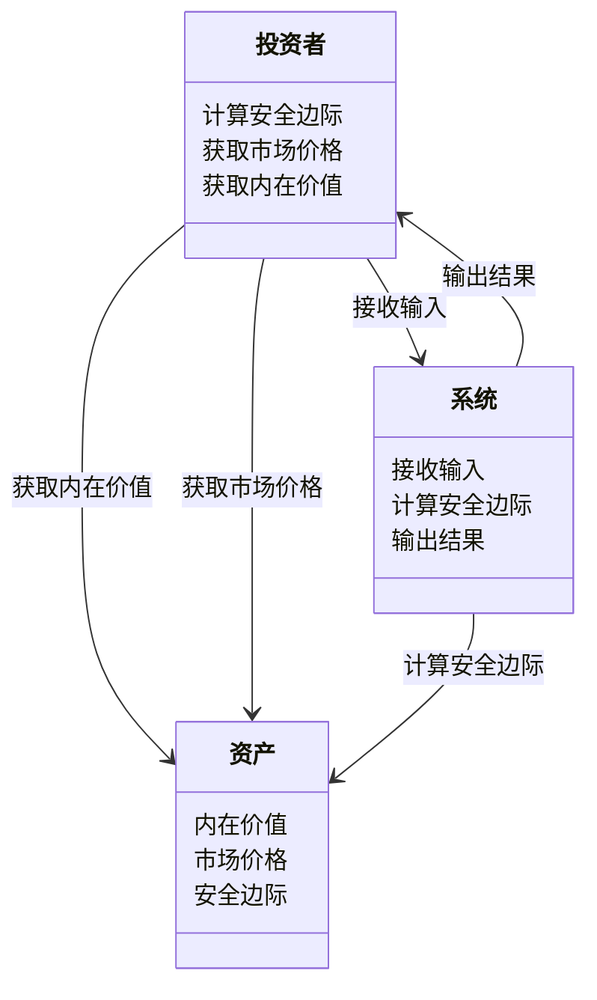
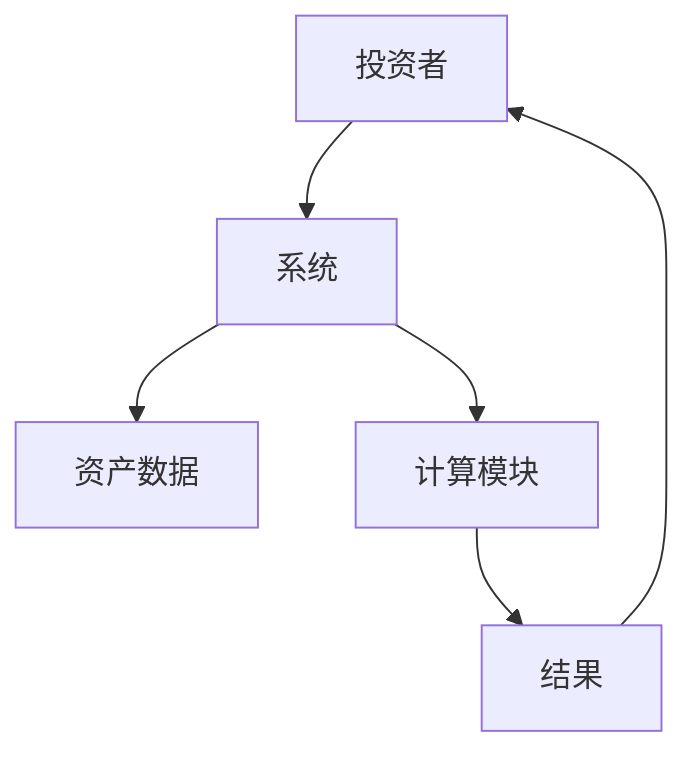
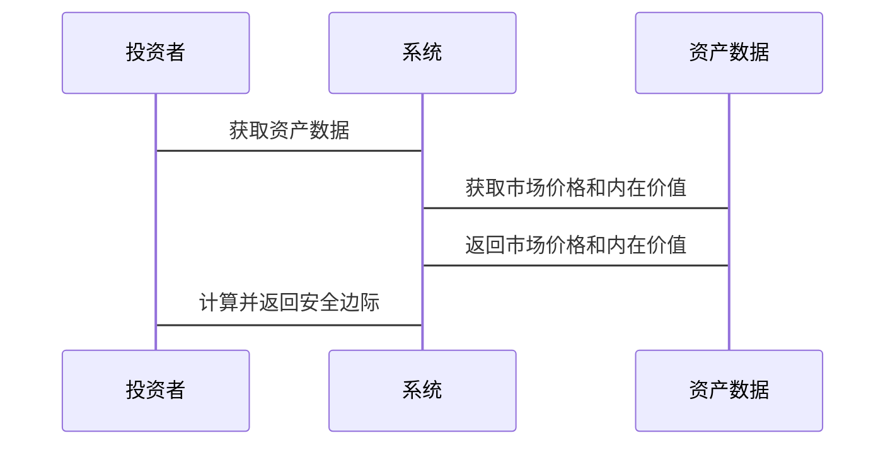

                 


# 格雷厄姆安全边际概念在市场剧烈波动中的应用

## 关键词：安全边际，市场波动，投资策略，风险管理，算法原理，数学模型，系统架构

## 摘要：
本文深入探讨了格雷厄姆提出的安全边际概念及其在市场剧烈波动中的应用。通过分析安全边际的核心原理、算法实现、数学模型以及系统架构，结合实际案例和项目实战，全面展示如何在波动的市场中利用安全边际进行稳健投资。文章内容涵盖安全边际的背景介绍、核心概念对比、算法原理、数学模型、系统架构设计、项目实战以及最佳实践，旨在为投资者和研究者提供理论与实践相结合的指导。

---

## 第一部分: 格雷厄姆安全边际概念的背景与基础

### 第1章: 安全边际的基本概念

#### 1.1 安全边际的定义与核心理念

##### 1.1.1 安全边际的定义
安全边际是投资学中的一个核心概念，由本杰明·格雷厄姆提出。它是指资产的市场价格低于其内在价值的部分，即 $ \text{安全边际} = \text{内在价值} - \text{市场价格} $。这个差额越大，投资的风险越小，收益的确定性越高。

##### 1.1.2 安全边际的核心理念
格雷厄姆认为，安全边际是投资者在面对市场波动时的“保护垫”。通过买入价格低于内在价值的资产，投资者能够在市场下跌时减少损失，并在市场上涨时获得超额收益。

##### 1.1.3 安全边际与投资决策的关系
安全边际直接影响投资者的买入决策。当市场价格远低于内在价值时，投资者可以以更高的确定性进行投资。反之，当市场价格接近或超过内在价值时，投资风险显著增加。

#### 1.2 格雷厄姆投资理论概述

##### 1.2.1 格雷厄姆投资理论的起源
格雷厄姆的投资理论起源于20世纪30年代，他在《证券分析》一书中首次系统阐述了安全边际的概念。他的理论强调价值投资，即以低于内在价值的价格买入优质资产。

##### 1.2.2 安全边际在格雷厄姆理论中的地位
安全边际是格雷厄姆理论的核心。他认为，内在价值是资产的真正价值，而市场价格受市场情绪影响波动。通过安全边际，投资者可以在市场波动中找到投资机会。

##### 1.2.3 格雷厄姆投资策略的特点
格雷厄姆的投资策略强调长期、稳健和价值导向。他建议投资者关注企业的基本面，尤其是其盈利能力、财务状况和竞争优势。

#### 1.3 市场波动与安全边际的应用场景

##### 1.3.1 市场波动的定义与特征
市场波动是指资产价格在短时间内大幅波动的现象。它通常由市场情绪、宏观经济因素或突发事件引发。市场波动的特征包括不确定性高、波动幅度大、影响范围广。

##### 1.3.2 安全边际在市场波动中的作用
在市场波动中，安全边际能够帮助投资者降低风险。当市场价格大幅下跌时，安全边际的存在使得投资者的损失有限，同时为后续的反弹提供了空间。

##### 1.3.3 市场波动对投资者决策的影响
市场波动会影响投资者的心理和决策。情绪化的决策可能导致投资者在市场高点买入或低点卖出，从而造成损失。安全边际的概念提醒投资者保持理性，避免被市场波动所左右。

---

### 第2章: 安全边际的核心概念与联系

#### 2.1 安全边际的核心原理

##### 2.1.1 安全边际的数学模型
安全边际的计算公式为：  
$$ \text{安全边际} = \text{内在价值} - \text{市场价格} $$  
其中，内在价值是资产的真实价值，市场价格是资产在市场上的交易价格。

##### 2.1.2 安全边际的计算方法
安全边际的计算需要先确定资产的内在价值，再减去其市场价格。计算内在价值的方法包括DCF模型、市盈率法等。

##### 2.1.3 安全边际与资产价值的关系
安全边际与资产价值呈负相关关系。当市场价格下降时，安全边际增加；当市场价格上升时，安全边际减少。

#### 2.2 核心概念对比分析

##### 2.2.1 安全边际与其他投资策略的对比
- **价值投资**：安全边际是价值投资的核心工具。  
- **成长投资**：更关注企业的成长潜力，而非价格与价值的差异。  
- **指数投资**：不依赖于个别资产的安全边际，而是通过分散投资降低风险。

##### 2.2.2 安全边际与风险控制的对比
安全边际通过降低买入价格来降低风险，而风险控制更多关注于资产的波动性和相关性。两者相辅相成，共同作用于投资组合的风险管理。

##### 2.2.3 安全边际与市场预测的对比
安全边际不依赖于市场预测，而是通过价格与价值的差异来确定投资机会。市场预测则试图通过预测市场走势来指导投资决策。

#### 2.3 ER实体关系图



---

### 第3章: 安全边际的算法原理

#### 3.1 安全边际的算法概述

##### 3.1.1 算法的基本原理
安全边际的算法基于资产的内在价值和市场价格的差异。通过计算安全边际，投资者可以确定资产的买入价格是否具有足够的安全空间。

##### 3.1.2 算法的输入与输出
- **输入**：资产的内在价值和市场价格。  
- **输出**：安全边际的数值。

##### 3.1.3 算法的实现步骤
1. 计算资产的内在价值。  
2. 确定资产的市场价格。  
3. 计算安全边际：$ \text{安全边际} = \text{内在价值} - \text{市场价格} $。  
4. 根据安全边际的数值，决定是否买入或卖出资产。

#### 3.2 算法的详细实现

##### 3.2.1 算法的数学模型
安全边际的数学模型可以表示为：  
$$ \text{安全边际} = \max(\text{内在价值} - \text{市场价格}, 0) $$  
其中，$\max$函数确保安全边际为非负数。

##### 3.2.2 算法的流程图



##### 3.2.3 算法的代码实现

```python
def calculate_margin(intrinsic_value, market_price):
    margin = intrinsic_value - market_price
    return max(margin, 0)

# 示例
intrinsic_value = 100
market_price = 80
margin = calculate_margin(intrinsic_value, market_price)
print(f"安全边际为: {margin}")
```

---

## 第四章: 数学模型与公式

#### 4.1 安全边际的数学公式

##### 4.1.1 内在价值的计算公式
内在价值可以通过多种方法计算，其中最常见的方法是DCF模型：  
$$ \text{内在价值} = \sum_{t=1}^{n} \frac{CF_t}{(1 + r)^t} + \frac{TV}{(1 + r)^n} $$  
其中，$CF_t$ 是第 $t$ 年的自由现金流，$r$ 是折现率，$TV$ 是终值。

##### 4.1.2 安全边际的计算公式
$$ \text{安全边际} = \text{内在价值} - \text{市场价格} $$

#### 4.2 案例分析

##### 4.2.1 案例一
假设某资产的内在价值为 $100，市场价格为 $80。  
计算安全边际：$100 - 80 = 20。  
结论：买入该资产，安全边际为20。

##### 4.2.2 案例二
假设某资产的内在价值为 $150，市场价格为 $120。  
计算安全边际：$150 - 120 = 30。  
结论：买入该资产，安全边际为30。

---

## 第五章: 系统分析与架构设计方案

### 第5章: 系统分析与架构设计

#### 5.1 问题场景介绍
在市场剧烈波动的情况下，投资者需要快速计算安全边际，以确定最佳的投资决策。系统需要能够实时获取资产的市场价格和内在价值，计算安全边际，并生成投资建议。

#### 5.2 系统功能设计

##### 5.2.1 领域模型类图



#### 5.3 系统架构设计

##### 5.3.1 架构图



#### 5.4 系统接口设计
- **输入接口**：接收资产的市场价格和内在价值。  
- **输出接口**：输出安全边际的数值和投资建议。

#### 5.5 系统交互序列图



---

## 第六章: 项目实战

### 第6章: 项目实战

#### 6.1 环境安装
需要安装Python和相关库（如pandas、numpy）。

#### 6.2 核心实现代码

##### 6.2.1 计算内在价值的代码

```python
def calculate_intrinsic_value(cash_flows, discount_rate, terminal_value):
    n = len(cash_flows)
    intrinsic_value = 0
    for t in range(n):
        intrinsic_value += cash_flows[t] / (1 + discount_rate) ** t
    intrinsic_value += terminal_value / (1 + discount_rate) ** n
    return intrinsic_value
```

##### 6.2.2 计算安全边际的代码

```python
def calculate_margin(intrinsic_value, market_price):
    return max(intrinsic_value - market_price, 0)
```

##### 6.2.3 示例代码

```python
# 示例数据
cash_flows = [100, 120, 130]
discount_rate = 0.1
terminal_value = 200
market_price = 90

# 计算内在价值
iv = calculate_intrinsic_value(cash_flows, discount_rate, terminal_value)
# 计算安全边际
margin = calculate_margin(iv, market_price)
print(f"内在价值: {iv}")
print(f"市场价格: {market_price}")
print(f"安全边际: {margin}")
```

#### 6.3 案例分析

##### 6.3.1 案例一

```python
# 数据
cash_flows = [80, 90, 100]
discount_rate = 0.1
terminal_value = 150
market_price = 70

# 计算
iv = calculate_intrinsic_value(cash_flows, discount_rate, terminal_value)
margin = calculate_margin(iv, market_price)
print(f"内在价值: {iv}")
print(f"市场价格: {market_price}")
print(f"安全边际: {margin}")
```

##### 6.3.2 案例二

```python
# 数据
cash_flows = [120, 130, 140]
discount_rate = 0.12
terminal_value = 180
market_price = 100

# 计算
iv = calculate_intrinsic_value(cash_flows, discount_rate, terminal_value)
margin = calculate_margin(iv, market_price)
print(f"内在价值: {iv}")
print(f"市场价格: {market_price}")
print(f"安全边际: {margin}")
```

---

## 第七章: 最佳实践、小结、注意事项和拓展阅读

### 7.1 最佳实践

#### 7.1.1 定期重新评估
市场波动频繁，内在价值和市场价格都会发生变化。投资者需要定期重新评估安全边际，以确保投资组合的健康。

#### 7.1.2 结合其他策略
安全边际是一种有效的风险管理工具，但可以与其他策略（如分散投资、风险对冲）结合使用，以进一步降低投资风险。

#### 7.1.3 关注长期价值
安全边际的核心在于长期价值。投资者应关注企业的基本面，而非短期的价格波动。

### 7.2 小结
安全边际是格雷厄姆提出的重要投资理念，其在市场波动中的应用为投资者提供了稳健的投资策略。通过计算安全边际，投资者可以在市场下跌时减少损失，在市场上涨时获得超额收益。

### 7.3 注意事项

#### 7.3.1 内在价值的准确性
内在价值的计算依赖于多种假设，包括现金流预测和折现率的选择。这些假设的准确性直接影响安全边际的计算结果。

#### 7.3.2 市场波动的不可预测性
市场波动往往具有不可预测性，投资者应保持理性，避免过度依赖市场预测。

#### 7.3.3 避免情绪化决策
安全边际的计算需要基于理性分析，避免情绪化决策。投资者应保持冷静，遵循安全边际的指引。

### 7.4 拓展阅读
- 格雷厄姆的《证券分析》  
- 巴菲特的《致股东的信》  
- 现代投资组合理论的相关文献  

---

## 作者信息

作者：AI天才研究院/AI Genius Institute & 禅与计算机程序设计艺术 /Zen And The Art of Computer Programming

