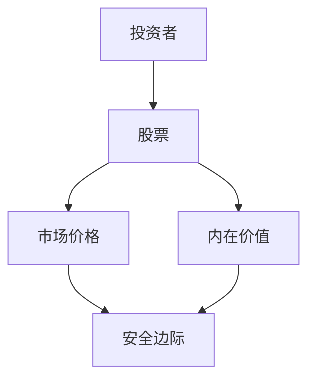
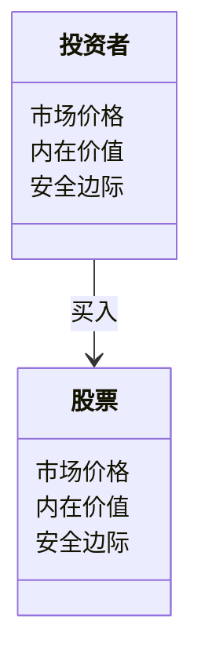

                 


# 格雷厄姆安全边际概念在极端市场事件中的应用

## 关键词：安全边际、极端市场、投资策略、格雷厄姆、风险管理

## 摘要：  
本文深入探讨了格雷厄姆的安全边际概念在极端市场事件中的应用，结合理论与实际案例，分析了安全边际在投资决策中的重要性。通过数学模型和系统架构的设计，详细阐述了如何在极端市场中利用安全边际进行风险管理，确保投资组合的稳健性。

---

# 第一部分: 格雷厄姆安全边际概念概述

## 第1章: 安全边际的核心概念

### 1.1 安全边际的定义与背景

#### 1.1.1 投资中的安全边际概念  
安全边际是格雷厄姆投资理论中的核心概念，指的是股票的市场价格与内在价值之间的差异。简单来说，安全边际 = 内在价值 - 市场价格。当市场价格低于内在价值时，投资该股票具有安全边际，即潜在的风险较低，回报较高。  

安全边际的计算公式为：  
$$ \text{安全边际} = \text{内在价值} - \text{市场价格} $$  

#### 1.1.2 格雷厄姆投资理论的起源  
本杰明·格雷厄姆是价值投资的鼻祖，他的投资理念强调以低于内在价值的价格买入股票，以确保投资的安全性。格雷厄姆认为，市场的波动性和投资者情绪会影响股票价格，但内在价值是基于公司基本面的长期稳定评估。  

#### 1.1.3 安全边际在投资中的重要性  
安全边际是投资者在面对市场波动时的重要保护机制。通过预留安全边际，投资者可以在市场下跌时减少损失，在市场上涨时获得超额收益。  

---

### 1.2 极端市场事件的定义与特征  

#### 1.2.1 什么是极端市场事件  
极端市场事件是指市场发生剧烈波动，通常由突发事件、金融危机或市场崩盘引发。这些事件会导致股票价格大幅偏离其内在价值，投资者面临巨大的风险和不确定性。  

#### 1.2.2 极端市场事件的典型特征  
- **价格波动剧烈**：股票价格短期内大幅下跌或上涨。  
- **市场流动性下降**：投资者难以迅速买卖资产。  
- **投资者情绪恐慌**：市场参与者往往做出非理性决策。  

#### 1.2.3 极端市场事件对投资者的影响  
极端市场事件可能导致投资者的本金损失，但也可能带来投资机会。格雷厄姆的安全边际概念在极端市场中尤为重要，因为它可以帮助投资者在市场恐慌时找到被低估的股票。  

---

### 1.3 安全边际与极端市场事件的关联  

#### 1.3.1 安全边际在极端市场中的作用  
在极端市场中，安全边际能够帮助投资者识别那些价格远低于内在价值的股票，从而在市场复苏时获得超额收益。  

#### 1.3.2 安全边际与投资风险的控制  
通过预留安全边际，投资者可以在市场下跌时减少损失，从而降低投资风险。  

#### 1.3.3 极端市场中安全边际的适用性  
在极端市场中，安全边际的计算需要更加谨慎，因为市场波动可能导致内在价值的重新评估。投资者需要结合市场环境和公司基本面，动态调整安全边际的计算方法。  

---

## 第2章: 安全边际的理论基础  

### 2.1 格雷厄姆安全边际的数学模型  

#### 2.1.1 安全边际的计算公式  
$$ \text{安全边际} = \text{内在价值} - \text{市场价格} $$  

#### 2.1.2 内在价值的评估方法  
内在价值是基于公司基本面的长期评估，通常包括以下因素：  
- **盈利能力**：如净利润、ROE（净资产收益率）。  
- **成长性**：如收入增长率、利润增长率。  
- **财务状况**：如资产负债表中的资产和负债情况。  

内在价值的计算公式可以简化为：  
$$ \text{内在价值} = \frac{\text{股息}}{\text{折现率} - \text{增长率}} $$  

---

### 2.2 安全边际的属性特征对比  

#### 2.2.1 不同市场环境下的安全边际对比  
| 市场环境       | 安全边际特征       |  
|----------------|--------------------|  
| 稳定市场       | 安全边际较小       |  
| 牛市            | 安全边际可能为负     |  
| 熊市            | 安全边际较大       |  

#### 2.2.2 安全边际与投资风险的关系  
- **安全边际越高**：投资风险越低。  
- **安全边际越低**：投资风险越高。  

#### 2.2.3 安全边际与投资收益的权衡  
高安全边际通常意味着较低的短期收益，但能够为投资者提供长期的稳定性。  

---

### 2.3 实体关系图（ER图）  



---

## 第3章: 极端市场事件中的安全边际应用  

### 3.1 极端市场事件的系统分析  

#### 3.1.1 市场崩盘的系统模型  
在极端市场中，市场崩盘可能导致股票价格大幅下跌，内在价值与市场价格的差异扩大。投资者可以通过计算安全边际，找到那些价格远低于内在价值的股票。  

#### 3.1.2 投资者行为分析  
在市场恐慌时，投资者可能因为情绪影响做出非理性决策。安全边际可以帮助投资者保持理性，避免盲目跟风。  

---

### 3.2 安全边际在极端市场中的风险管理  

#### 3.2.1 安全边际与风险管理策略  
- **防御性投资策略**：通过预留安全边际，降低投资风险。  
- **逆向投资策略**：在市场恐慌时，买入被低估的股票。  

#### 3.2.2 投资组合的动态调整  
在极端市场中，投资者需要动态调整投资组合，确保安全边际始终处于合理水平。  

---

### 3.3 安全边际的实战应用  

#### 3.3.1 2008年金融危机案例  
在2008年金融危机期间，许多股票的价格大幅下跌，内在价值与市场价格的差异显著扩大。投资者通过计算安全边际，找到了许多被低估的股票，最终在市场复苏时获得了超额收益。  

#### 3.3.2 安全边际的计算与投资决策  
投资者可以通过以下步骤计算安全边际：  
1. 评估股票的内在价值。  
2. 确定股票的市场价格。  
3. 计算安全边际：安全边际 = 内在价值 - 市场价格。  
4. 根据安全边际的高低，做出投资决策。  

---

## 第4章: 安全边际的系统架构设计  

### 4.1 系统功能设计  

#### 4.1.1 领域模型  


#### 4.1.2 系统架构  


---

## 第5章: 项目实战  

### 5.1 环境安装  

#### 5.1.1 Python环境安装  
- 安装Python：https://www.python.org/downloads/  
- 安装Pandas库：`pip install pandas`  

---

### 5.2 核心代码实现  

#### 5.2.1 计算内在价值的代码  

```python
import pandas as pd

def calculate_intrinsic_value(dividend, discount_rate, growth_rate):
    return dividend / (discount_rate - growth_rate)

# 示例数据
dividend = 1.0
discount_rate = 0.1
growth_rate = 0.05

intrinsic_value = calculate_intrinsic_value(dividend, discount_rate, growth_rate)
print(f"内在价值：{intrinsic_value}")
```

---

#### 5.2.2 计算安全边际的代码  

```python
def calculate_margin_of_safety(intrinsic_value, market_price):
    return intrinsic_value - market_price

# 示例数据
intrinsic_value = 50.0
market_price = 40.0

margin_of_safety = calculate_margin_of_safety(intrinsic_value, market_price)
print(f"安全边际：{margin_of_safety}")
```

---

### 5.3 案例分析  

#### 5.3.1 案例：2008年金融危机期间的股票投资  
假设某股票的内在价值为50美元，市场价格为40美元。计算安全边际为10美元。投资者可以买入该股票，因为安全边际较高，风险较低。  

#### 5.3.2 投资组合构建  
投资者可以根据安全边际的高低，动态调整投资组合，确保在极端市场中保持稳健。  

---

## 第6章: 总结与展望  

### 6.1 最佳实践 Tips  

- 在极端市场中，安全边际是投资者的重要保护机制。  
- 投资者应动态调整安全边际的计算，以适应市场环境的变化。  

### 6.2 小结  

通过本文的分析，我们可以看到，格雷厄姆的安全边际概念在极端市场中具有重要的应用价值。投资者可以通过计算安全边际，识别被低估的股票，降低投资风险，实现稳健的投资收益。  

### 6.3 注意事项  

- 安全边际的计算需要结合市场环境和公司基本面。  
- 投资者应避免过度依赖安全边际，还需考虑其他风险因素。  

### 6.4 拓展阅读  

- 《The Intelligent Investor》 by Benjamin Graham  
- 《价值投资实战指南》  

---

## 作者：AI天才研究院 & 禅与计算机程序设计艺术

