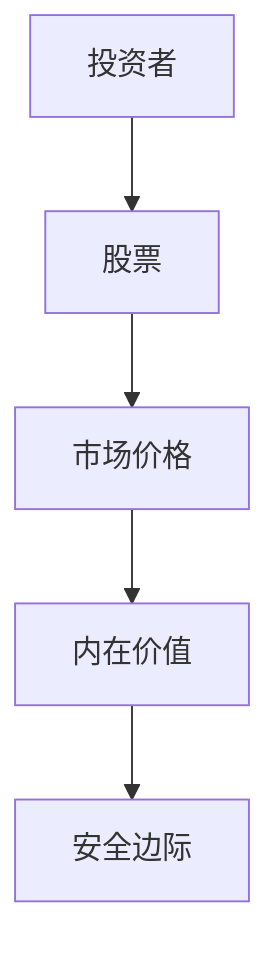
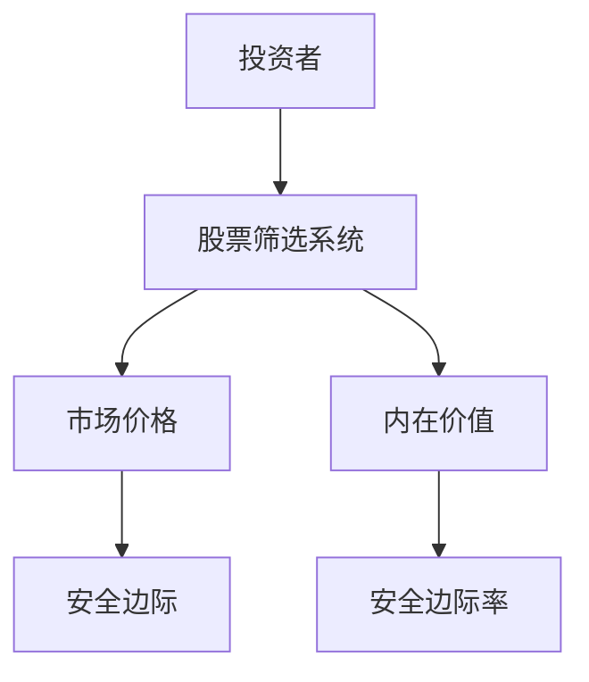
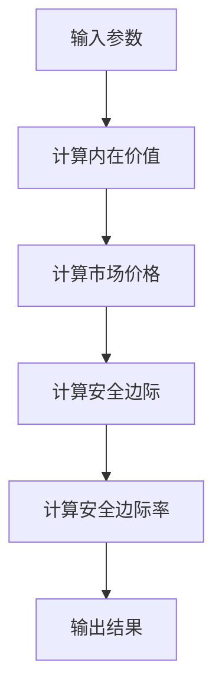
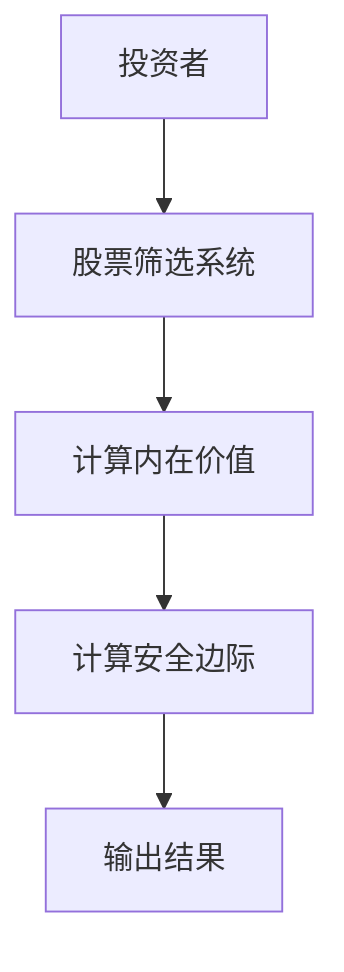

                 


# 格雷厄姆安全边际概念在特价股票选择中的应用

> 关键词：格雷厄姆安全边际，特价股票，价值投资，股票选择，投资策略

> 摘要：本文深入探讨了格雷厄姆安全边际概念在特价股票选择中的应用，从安全边际的定义与背景、核心概念与数学模型、算法原理与实现、系统架构设计、项目实战案例以及最佳实践等方面进行详细分析。通过理论与实践相结合的方式，帮助读者理解如何利用安全边际概念有效选择特价股票，降低投资风险，实现稳健收益。

---

# 第一部分: 格雷厄姆安全边际概念的背景与基础

## 第1章: 安全边际概念的定义与背景

### 1.1 安全边际的定义与核心理念

#### 1.1.1 安全边际的基本定义
安全边际是格雷厄姆投资理论中的核心概念，指股票的市场价格低于其内在价值的差额部分。这种差额为投资者提供了“安全空间”，即使在估值出现偏差的情况下，也能确保投资的稳健回报。

- **公式表示**：$$ \text{安全边际} = \text{内在价值} - \text{市场价格} $$

安全边际的核心理念是通过买入价格低于内在价值的股票，降低投资风险并提高投资的确定性。格雷厄姆强调，安全边际是价值投资中最重要的保护机制之一。

#### 1.1.2 格雷厄姆投资理念的核心要素
格雷厄姆的价值投资理念可以总结为以下几个核心要素：
1. **安全边际**：买入价格低于内在价值的股票。
2. **逆向思维**：在市场恐慌时买入，在市场狂热时卖出。
3. **长期视角**：关注企业的长期价值，而非短期市场波动。
4. **分散投资**：通过投资组合分散风险，避免过度集中。

#### 1.1.3 安全边际在股票选择中的重要性
安全边际是投资者在选择股票时的重要参考指标，它可以帮助投资者识别那些被市场低估的股票。以下是安全边际在股票选择中的重要性：
- **降低投资风险**：通过安全边际，投资者可以避免支付过高的价格，从而降低亏损的可能性。
- **提高投资回报**：买入价格低于内在价值的股票，长期来看，回报率更高。
- **筛选高质量股票**：安全边际高的股票通常具有较强的盈利能力和稳定的财务状况。

### 1.2 安全边际的历史发展与演变

#### 1.2.1 格雷厄姆安全边际理论的提出背景
格雷厄姆在20世纪初提出安全边际理论，当时正值全球经济大萧条时期。他通过研究市场周期和投资者行为，发现市场往往会出现非理性波动，导致股票价格偏离其内在价值。因此，他提出通过安全边际来选择被低估的股票，以在市场波动中获得稳健收益。

#### 1.2.2 理论发展与现代应用
随着金融理论的发展，安全边际概念逐渐被整合到现代投资组合理论中。当代投资者在应用安全边际理论时，通常结合基本面分析和量化模型，以适应市场的变化和复杂性。

#### 1.2.3 当代安全边际概念的扩展
当代的安全边际概念已经不仅仅局限于格雷厄姆最初提出的股票内在价值与市场价格的差额，还包括以下方面：
- **相对安全边际**：比较不同股票的安全边际，选择最高的。
- **动态安全边际**：根据市场环境和企业经营状况的变化，动态调整安全边际的计算。

### 1.3 安全边际与价值投资的关系

#### 1.3.1 价值投资的基本原理
价值投资的核心理念是寻找市场价格低于内在价值的股票。格雷厄姆的安全边际理论为价值投资提供了具体的实施方法，即通过计算安全边际来识别被低估的股票。

#### 1.3.2 安全边际在价值投资中的地位
安全边际是价值投资中最重要的工具之一。通过计算安全边际，投资者可以量化股票的潜在风险和回报，从而做出更明智的投资决策。

#### 1.3.3 安全边际与成长投资的区别与联系
虽然安全边际理论最初是为价值投资设计的，但其核心思想也可以应用于成长投资。成长投资者通常关注企业的成长潜力，但在买入股票时，仍需考虑安全边际，以避免支付过高的价格。

### 1.4 安全边际在股票选择中的应用边界

#### 1.4.1 安全边际的适用场景
安全边际适用于以下场景：
- **市场低迷时期**：市场恐慌时，股票价格通常被低估，安全边际较高。
- **成熟企业**：成熟企业的内在价值相对稳定，适合使用安全边际进行估值。
- **防御性投资**：投资者可以通过安全边际选择防御性股票，降低投资组合的风险。

#### 1.4.2 安全边际的局限性
尽管安全边际是一种有效的投资工具，但它也存在一些局限性：
- **内在价值估算难度**：内在价值的估算需要依赖财务数据和假设，存在主观性和不确定性。
- **市场波动的影响**：市场波动可能导致安全边际的变化，影响投资决策。
- **短期市场因素干扰**：短期市场因素可能影响股票价格，导致安全边际的计算出现偏差。

#### 1.4.3 理论与实践的结合
在实际投资中，投资者需要将安全边际理论与市场环境、企业基本面等因素结合起来，制定灵活的投资策略。例如，在市场上涨时，可以适当降低安全边际的要求；在市场下跌时，可以提高安全边际的要求。

---

## 第2章: 安全边际的核心概念与数学模型

### 2.1 安全边际的数学模型

#### 2.1.1 安全边际的计算公式
安全边际的计算公式如下：
$$ \text{安全边际} = \text{内在价值} - \text{市场价格} $$

其中，内在价值的计算方法通常包括以下步骤：
1. **预测企业未来现金流**：基于企业的财务数据和行业趋势，预测未来现金流。
2. **折现率确定**：选择合适的折现率，将未来现金流折现为现值。
3. **计算内在价值**：将折现后的现金流加总，得到企业的内在价值。

#### 2.1.2 内在价值的估算方法
内在价值的估算方法包括：
- **DCF模型**：通过现金流折现法（Discounted Cash Flow，DCF）估算企业价值。
- **相对估值法**：通过比较同行业公司的估值指标（如市盈率、市净率）来估算企业价值。

#### 2.1.3 安全边际率的计算公式
安全边际率的计算公式如下：
$$ \text{安全边际率} = \frac{\text{内在价值} - \text{市场价格}}{\text{市场价格}} \times 100\% $$

安全边际率越高，表示股票的市场价格越低于其内在价值，投资风险越小，回报潜力越大。

### 2.2 核心概念的属性对比

#### 2.2.1 安全边际与市盈率的对比
市盈率（P/E）是股票价格与每股收益的比值，反映了市场对公司盈利能力的评价。安全边际则关注股票价格与内在价值的差额，两者在投资决策中各有侧重。

| 对比维度 | 安全边际 | 市盈率 |
|----------|----------|--------|
| 定义     | 价格与内在价值的差额 | 价格与收益的比值 |
| 用途     | 评估投资风险与回报 | 评估盈利能力与市场估值 |
| 优势     | 提供安全空间，降低风险 | 反映市场对公司盈利能力的预期 |
| 局限性    | 内在价值估算难度大 | 受益于企业盈利波动影响 |

#### 2.2.2 安全边际与市净率的对比
市净率（P/B）是股票价格与每股净资产的比值，反映了市场对公司资产质量的评价。安全边际则关注股票价格与内在价值的差额。

| 对比维度 | 安全边际 | 市净率 |
|----------|----------|--------|
| 定义     | 价格与内在价值的差额 | 价格与净资产的比值 |
| 用途     | 评估投资风险与回报 | 评估资产质量与市场估值 |
| 优势     | 提供安全空间，降低风险 | 反映市场对公司资产质量的评价 |
| 局限性    | 内在价值估算难度大 | 受益于企业资产波动影响 |

#### 2.2.3 安全边际与股息率的对比
股息率（Dividend Yield）是股票的年股息与股价的比值，反映了市场对公司分红能力的评价。安全边际则关注股票价格与内在价值的差额。

| 对比维度 | 安全边际 | 股息率 |
|----------|----------|--------|
| 定义     | 价格与内在价值的差额 | 股息与股价的比值 |
| 用途     | 评估投资风险与回报 | 评估分红能力与市场估值 |
| 优势     | 提供安全空间，降低风险 | 反映市场对公司分红能力的预期 |
| 局限性    | 内在价值估算难度大 | 受益于企业分红政策变化影响 |

### 2.3 实体关系图与安全边际的系统架构

#### 2.3.1 实体关系图（ER图）



#### 2.3.2 系统架构图



---

## 第3章: 安全边际的算法原理与实现

### 3.1 安全边际算法的基本原理

#### 3.1.1 安全边际算法的输入参数
- 市场价格：股票的当前市场价格。
- 内在价值：基于DCF模型或其他估值方法计算的股票内在价值。

#### 3.1.2 安全边际算法的步骤分解
1. 计算股票的内在价值。
2. 计算股票的市场价格。
3. 计算安全边际：内在价值 - 市场价格。
4. 计算安全边际率：（内在价值 - 市场价格）/ 市场价格 × 100%。

#### 3.1.3 安全边际算法的输出结果
- 安全边际值。
- 安全边际率。

### 3.2 安全边际算法的 mermaid 流程图



### 3.3 安全边际算法的 Python 实现

```python
def calculate_intrinsic_value(enterprise_value, cash_flow):
    # 计算企业内在价值的简单示例
    # 假设折现率为10%
    discount_rate = 0.10
    present_value = cash_flow / (1 + discount_rate)
    return present_value

def calculate_margin_of_safety(intrinsic_value, market_price):
    margin_of_safety = intrinsic_value - market_price
    margin_of_safety_rate = (margin_of_safety / market_price) * 100
    return margin_of_safety, margin_of_safety_rate

# 示例计算
enterprise_value = 1000
cash_flow = 100
market_price = 50

intrinsic_value = calculate_intrinsic_value(enterprise_value, cash_flow)
margin_of_safety, margin_of_safety_rate = calculate_margin_of_safety(intrinsic_value, market_price)

print(f"内在价值: {intrinsic_value}")
print(f"安全边际: {margin_of_safety}")
print(f"安全边际率: {margin_of_safety_rate}%")
```

---

## 第4章: 数学模型与安全边际的深度分析

### 4.1 安全边际的数学模型

#### 4.1.1 内在价值的计算公式
$$ \text{内在价值} = \frac{\text{未来现金流}}{1 + r} $$
其中，r 是折现率。

#### 4.1.2 安全边际的计算公式
$$ \text{安全边际} = \text{内在价值} - \text{市场价格} $$

#### 4.1.3 安全边际率的计算公式
$$ \text{安全边际率} = \frac{\text{内在价值} - \text{市场价格}}{\text{市场价格}} \times 100\% $$

### 4.2 安全边际的数学模型应用

#### 4.2.1 示例计算
假设某股票的市场价格为 $50，内在价值为 $100，则：
$$ \text{安全边际} = 100 - 50 = 50 $$
$$ \text{安全边际率} = \frac{50}{50} \times 100\% = 100\% $$

#### 4.2.2 数学模型的局限性
数学模型的局限性主要体现在内在价值的估算难度上。由于内在价值的计算需要依赖未来现金流的预测和折现率的确定，存在较大的主观性和不确定性。

---

## 第5章: 系统架构与安全边际的应用

### 5.1 系统架构设计

#### 5.1.1 系统功能设计
- **数据输入**：输入股票的基本信息，包括市场价格、财务数据等。
- **内在价值计算**：基于DCF模型或其他估值方法计算股票的内在价值。
- **安全边际计算**：计算股票的安全边际和安全边际率。
- **结果输出**：输出安全边际和安全边际率。

#### 5.1.2 系统架构图


### 5.2 系统接口设计

#### 5.2.1 输入接口
- **市场价格**：股票的当前市场价格。
- **财务数据**：企业的财务数据，包括现金流、净资产等。

#### 5.2.2 输出接口
- **安全边际**：股票的安全边际值。
- **安全边际率**：股票的安全边际率。

### 5.3 系统交互流程

#### 5.3.1 交互流程图



---

## 第6章: 项目实战与安全边际的实现

### 6.1 环境安装

#### 6.1.1 安装 Python
需要安装 Python 3.8 或更高版本。

#### 6.1.2 安装依赖库
需要安装以下依赖库：
- `pandas`：数据处理库。
- `numpy`：数值计算库。
- `matplotlib`：数据可视化库。

安装命令：
```bash
pip install pandas numpy matplotlib
```

### 6.2 核心代码实现

#### 6.2.1 内在价值计算

```python
import numpy as np

def calculate_intrinsic_value(cash_flow, discount_rate):
    # 计算未来现金流的现值
    present_value = cash_flow / (1 + discount_rate)
    return present_value

# 示例计算
cash_flow = 100
discount_rate = 0.10

intrinsic_value = calculate_intrinsic_value(cash_flow, discount_rate)
print(f"内在价值: {intrinsic_value}")
```

#### 6.2.2 安全边际计算

```python
def calculate_margin_of_safety(intrinsic_value, market_price):
    margin_of_safety = intrinsic_value - market_price
    margin_of_safety_rate = (margin_of_safety / market_price) * 100
    return margin_of_safety, margin_of_safety_rate

# 示例计算
intrinsic_value = 100
market_price = 50

margin_of_safety, margin_of_safety_rate = calculate_margin_of_safety(intrinsic_value, market_price)
print(f"安全边际: {margin_of_safety}")
print(f"安全边际率: {margin_of_safety_rate}%")
```

### 6.3 案例分析与结果解读

#### 6.3.1 案例分析
假设某股票的市场价格为 $50，内在价值为 $100，则：
$$ \text{安全边际} = 100 - 50 = 50 $$
$$ \text{安全边际率} = \frac{50}{50} \times 100\% = 100\% $$

这意味着该股票的安全边际率为100%，即市场价格比内在价值低50%。这表明该股票被市场严重低估，具有较高的投资价值。

#### 6.3.2 项目小结
通过上述案例分析，我们可以看到安全边际在股票选择中的重要性。通过计算安全边际和安全边际率，投资者可以更好地识别被低估的股票，降低投资风险，提高投资回报。

---

## 第7章: 最佳实践与投资策略

### 7.1 最佳实践

#### 7.1.1 投资策略
- **分散投资**：通过投资多个具有较高安全边际的股票，分散投资风险。
- **长期持有**：安全边际高的股票通常具有较高的内在价值，适合长期持有。
- **定期复评**：定期重新评估股票的安全边际，根据市场变化调整投资组合。

#### 7.1.2 注意事项
- **内在价值估算的准确性**：内在价值的估算需要依赖财务数据和假设，存在主观性和不确定性。
- **市场环境的影响**：市场波动和经济周期可能会影响股票价格和安全边际。
- **企业基本面的变化**：企业的财务状况和经营环境的变化可能会影响内在价值。

### 7.2 小结

通过本文的分析，我们可以看到格雷厄姆安全边际概念在特价股票选择中的重要性。安全边际不仅为投资者提供了“安全空间”，还帮助投资者识别被低估的股票，降低投资风险，提高投资回报。在实际投资中，投资者需要结合市场环境、企业基本面和安全边际等因素，制定灵活的投资策略，以实现稳健的收益。

---

# 作者：AI天才研究院/AI Genius Institute & 禅与计算机程序设计艺术 /Zen And The Art of Computer Programming

