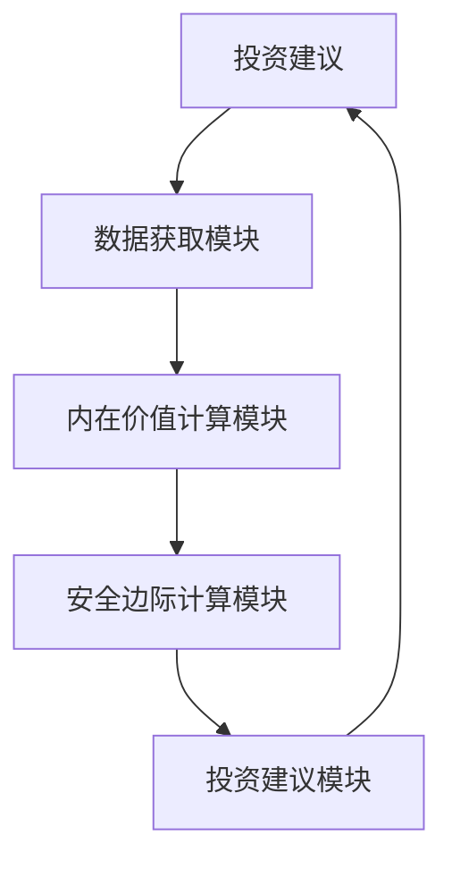

                 


---

# 格雷厄姆安全边际理念在特价股票中的应用

> 关键词：格雷厄姆安全边际理念，特价股票，投资策略，股票分析，数学模型

> 摘要：本文深入探讨了格雷厄姆的安全边际理念在特价股票投资中的应用，结合数学模型、算法原理和实际案例，详细讲解了如何利用安全边际理念进行股票分析和投资决策。文章通过系统分析和项目实战，展示了安全边际理念在特价股票中的具体应用方法，并提供了实用的建议和最佳实践。

---

# 第一部分: 格雷厄姆安全边际理念的背景与基础

## 第1章: 安全边际的基本概念

### 1.1 安全边际的定义与核心理念

#### 1.1.1 安全边际的定义
安全边际是投资学中的一个重要概念，由本杰明·格雷厄姆提出。它指的是市场价格与内在价值之间的差额，即市场价格低于内在价值的部分。安全边际的存在为投资者提供了保护，避免因市场价格波动而造成的损失。

#### 1.1.2 安全边际的核心理念
- 投资者应该以低于内在价值的价格购买股票。
- 安全边际越大，投资风险越小，潜在收益越高。
- 安全边际是价值投资的核心原则之一。

#### 1.1.3 安全边际与投资风险的关系
- 安全边际的存在可以降低投资风险。
- 通过计算安全边际，投资者可以选择那些市场价格显著低于内在价值的股票，从而在市场波动中更具抗风险能力。

### 1.2 格雷厄姆的投资理念

#### 1.2.1 格雷厄姆的投资哲学
- 价值投资的核心在于寻找那些市场价格低于内在价值的股票。
- 投资者应关注企业的内在价值，而非市场的短期波动。
- 安全边际是价值投资的基石。

#### 1.2.2 安全边际在格雷厄姆投资体系中的地位
- 安全边际是格雷厄姆投资体系的核心要素。
- 通过计算安全边际，投资者可以避免因市场价格波动而造成的损失。
- 安全边际为投资者提供了买入股票的保护屏障。

#### 1.2.3 格雷厄姆安全边际理念的现代应用
- 安全边际理念在现代投资中的应用依然广泛，尤其是在寻找特价股票时。
- 投资者可以通过计算安全边际，选择那些被市场低估的股票进行投资。

## 第2章: 特价股票的定义与特征

### 2.1 特价股票的定义

#### 2.1.1 特价股票的定义
特价股票是指市场价格显著低于内在价值的股票。这类股票通常被认为是被市场低估的，具有较大的上涨潜力。

#### 2.1.2 特价股票的分类
- 根据内在价值与市场价格的差异，特价股票可以分为深度特价股票和小幅特价股票。
- 深度特价股票是指市场价格与内在价值之间的差异较大，具有较大的上涨空间。

#### 2.1.3 特价股票与普通股票的区别
- 特价股票的市场价格低于内在价值，而普通股票的市场价格接近或高于内在价值。
- 特价股票通常具有较大的上涨潜力，而普通股票的上涨潜力较小。

### 2.2 特价股票的特征

#### 2.2.1 市场价格低于内在价值
- 特价股票的市场价格通常低于其内在价值，为投资者提供了安全边际。
- 内在价值是股票的真正价值，而市场价格是市场参与者行为的结果。

#### 2.2.2 低估值股票的识别方法
- 通过计算市盈率、市净率等指标，识别那些市场价格低于内在价值的股票。
- 选择那些具有稳定收益和良好财务状况的企业，作为潜在的特价股票。

#### 2.2.3 特价股票的市场周期性
- 特价股票的出现通常与市场周期性波动有关。
- 在市场低迷时期，更多的股票可能会出现市场价格低于内在价值的情况。

## 第3章: 安全边际与特价股票的关系

### 3.1 安全边际在特价股票中的应用

#### 3.1.1 安全边际与特价股票的核心联系
- 安全边际是特价股票投资的核心原则。
- 通过计算安全边际，投资者可以识别那些市场价格低于内在价值的股票。

#### 3.1.2 安全边际在特价股票投资中的作用
- 安全边际为投资者提供了买入股票的保护屏障。
- 通过计算安全边际，投资者可以避免因市场价格波动而造成的损失。

#### 3.1.3 安全边际理念对特价股票投资的指导意义
- 安全边际理念指导投资者选择那些具有较大安全边际的特价股票。
- 通过计算安全边际，投资者可以制定合理的买入和卖出策略。

### 3.2 格雷厄姆安全边际理念的核心要素

#### 3.2.1 内在价值的计算
- 内在价值是股票的真正价值，可以通过多种方法进行计算。
- 常用的计算方法包括股利折现法、现金流折现法等。

#### 3.2.2 市场价格与内在价值的差异
- 安全边际 = 内在价值 - 市场价格
- 安全边际越大，投资风险越小，潜在收益越高。

#### 3.2.3 安全边际的量化方法
- 通过计算安全边际，投资者可以量化股票的投资价值。
- 安全边际的量化方法包括相对安全边际和绝对安全边际。

---

# 第二部分: 格雷厄姆安全边际理念的数学模型与算法原理

## 第4章: 安全边际的数学模型与公式

### 4.1 内在价值的计算公式

#### 4.1.1 内在价值的计算公式
- 内在价值公式：
  $$ V = \frac{E}{k} $$
  其中，\( V \) 表示内在价值，\( E \) 表示企业的预期收益，\( k \) 表示折现率。

#### 4.1.2 企业预期收益的计算
- 企业预期收益 \( E \) 可以通过多种方法进行计算，包括股利折现法和现金流折现法。
- 股利折现法：
  $$ E = \sum_{t=1}^{n} \frac{D_t}{(1 + r)^t} $$
  其中，\( D_t \) 表示第 \( t \) 年的股利，\( r \) 表示折现率。

#### 4.1.3 折现率的确定
- 折现率 \( k \) 的确定通常基于市场的无风险利率和风险溢价。
- 折现率的计算公式：
  $$ k = r_f + r_p $$
  其中，\( r_f \) 表示无风险利率，\( r_p \) 表示风险溢价。

### 4.2 安全边际的计算公式

#### 4.2.1 安全边际的计算
- 安全边际公式：
  $$ \text{安全边际} = V - P $$
  其中，\( V \) 表示内在价值，\( P \) 表示市场价格。

#### 4.2.2 安全边际的相对指标
- 相对安全边际公式：
  $$ \text{相对安全边际} = \frac{V - P}{P} $$
  相对安全边际表示市场价格与内在价值之间的差异占市场价格的比例。

#### 4.2.3 安全边际的绝对指标
- 绝对安全边际公式：
  $$ \text{绝对安全边际} = V - P $$
  绝对安全边际表示内在价值与市场价格之间的绝对差异。

### 4.3 安全边际的实例计算

#### 4.3.1 实例背景
- 假设某股票的内在价值为 $50，市场价格为 $40。
- 计算安全边际：
  $$ \text{安全边际} = 50 - 40 = 10 $$

#### 4.3.2 安全边际的相对指标
- 相对安全边际：
  $$ \text{相对安全边际} = \frac{50 - 40}{40} = 0.25 = 25\% $$

#### 4.3.3 安全边际的绝对指标
- 绝对安全边际：
  $$ \text{绝对安全边际} = 50 - 40 = 10 $$

---

## 第5章: 格雷厄姆安全边际理念的算法实现

### 5.1 安全边际算法的步骤

#### 5.1.1 确定企业的内在价值
- 计算企业的预期收益 \( E \)。
- 确定折现率 \( k \)。
- 计算内在价值 \( V = E / k \)。

#### 5.1.2 确定股票的市场价格
- 获取股票的当前市场价格 \( P \)。

#### 5.1.3 计算安全边际
- 计算安全边际：
  $$ \text{安全边际} = V - P $$

#### 5.1.4 计算相对安全边际
- 计算相对安全边际：
  $$ \text{相对安全边际} = \frac{V - P}{P} $$

#### 5.1.5 判断是否为特价股票
- 如果安全边际为正，且相对安全边际大于等于5%，则该股票可能是特价股票。

### 5.2 算法实现的Python代码

```python
def calculate_intrinsic_value(enterprise_value, discount_rate):
    return enterprise_value / discount_rate

def calculate_market_price(stock ticker):
    # 获取股票的当前市场价格
    return get_market_price(stock_ticker)

def calculate_margin_of_safety(intrinsic_value, market_price):
    return intrinsic_value - market_price

def calculate_relative_margin_of_safety(intrinsic_value, market_price):
    return (intrinsic_value - market_price) / market_price

# 示例代码
stock_ticker = "AAPL"
discount_rate = 0.05
enterprise_value = 1000000  # 假设企业价值为100万美元

intrinsic_value = calculate_intrinsic_value(enterprise_value, discount_rate)
market_price = calculate_market_price(stock_ticker)
margin_of_safety = calculate_margin_of_safety(intrinsic_value, market_price)
relative_margin_of_safety = calculate_relative_margin_of_safety(intrinsic_value, market_price)

print(f"内在价值: {intrinsic_value}")
print(f"市场价格: {market_price}")
print(f"安全边际: {margin_of_safety}")
print(f"相对安全边际: {relative_margin_of_safety}")
```

---

### 5.3 算法实现的详细解读

#### 5.3.1 内在价值的计算
- 内在价值是股票的真正价值，可以通过多种方法进行计算，包括股利折现法和现金流折现法。
- 企业价值 \( E \) 是企业未来现金流的现值，折现率 \( k \) 通常基于市场的无风险利率和风险溢价。

#### 5.3.2 市场价格的获取
- 市场价格可以通过金融数据接口或API获取，例如Yahoo Finance或 Bloomberg。
- 在代码中，`calculate_market_price` 函数需要实现从指定的数据源获取股票的当前市场价格。

#### 5.3.3 安全边际的计算
- 安全边际是内在价值与市场价格之间的差异，表示投资者在购买股票时的安全空间。
- 相对安全边际表示安全边际占市场价格的比例，通常用于衡量安全边际的大小。

#### 5.3.4 判断是否为特价股票
- 如果安全边际为正，且相对安全边际大于等于5%，则该股票可能是特价股票。
- 投资者可以根据安全边际的大小，选择那些具有较大安全边际的股票进行投资。

---

## 第6章: 系统分析与架构设计方案

### 6.1 问题场景介绍

#### 6.1.1 投资者的需求
- 投资者需要找到那些市场价格低于内在价值的特价股票。
- 投资者需要计算股票的安全边际，评估投资风险。

#### 6.1.2 系统的目标
- 开发一个基于安全边际理念的投资系统，帮助投资者识别特价股票。
- 提供安全边际的计算功能，辅助投资者做出投资决策。

### 6.2 系统功能设计

#### 6.2.1 领域模型设计
- 领域模型包括股票、企业价值、市场价格等核心概念。
- 通过领域模型，系统可以计算内在价值和安全边际。

#### 6.2.2 功能模块设计
- 数据获取模块：从数据源获取股票的基本信息和财务数据。
- 内在价值计算模块：基于企业的财务数据，计算内在价值。
- 安全边际计算模块：计算安全边际，并判断是否为特价股票。
- 投资建议模块：根据安全边际的结果，提供投资建议。

### 6.3 系统架构设计

#### 6.3.1 系统架构图


#### 6.3.2 数据流设计
- 投资者输入股票 ticker。
- 数据获取模块从数据源获取股票的基本信息和财务数据。
- 内在价值计算模块基于企业价值和折现率，计算内在价值。
- 安全边际计算模块计算安全边际，并判断是否为特价股票。
- 投资建议模块根据安全边际的结果，提供投资建议。

### 6.4 接口设计

#### 6.4.1 数据获取接口
- API接口：`get_stock_data(ticker)`
- 返回值：股票的基本信息和财务数据。

#### 6.4.2 内在价值计算接口
- API接口：`calculate_intrinsic_value(enterprise_value, discount_rate)`
- 返回值：内在价值。

#### 6.4.3 安全边际计算接口
- API接口：`calculate_margin_of_safety(intrinsic_value, market_price)`
- 返回值：安全边际。

---

## 第7章: 项目实战

### 7.1 环境安装

#### 7.1.1 安装Python
- 安装Python 3.8或更高版本。
- 安装必要的Python包：`pandas`, `numpy`, `requests`.

#### 7.1.2 安装数据获取工具
- 使用Yahoo Finance API或Bloomberg API获取股票数据。

### 7.2 核心代码实现

#### 7.2.1 数据获取模块
```python
import requests

def get_stock_data(ticker):
    url = f"https://query1.finance.yahoo.com/v8/finance/chart/{ticker}"
    response = requests.get(url)
    data = response.json()
    return data
```

#### 7.2.2 内在价值计算模块
```python
def calculate_intrinsic_value(enterprise_value, discount_rate):
    return enterprise_value / discount_rate
```

#### 7.2.3 安全边际计算模块
```python
def calculate_margin_of_safety(intrinsic_value, market_price):
    return intrinsic_value - market_price
```

#### 7.2.4 投资建议模块
```python
def generate_investment_advice(margin_of_safety, relative_margin_of_safety):
    advice = ""
    if margin_of_safety > 0 and relative_margin_of_safety >= 0.05:
        advice = "建议买入该股票，安全边际充足。"
    elif margin_of_safety <= 0:
        advice = "不建议买入该股票，市场价格高于内在价值。"
    else:
        advice = "观察该股票，安全边际较小。"
    return advice
```

### 7.3 案例分析

#### 7.3.1 案例背景
- 假设我们要分析苹果公司（AAPL）的股票。
- 折现率 \( k \) 设为5%。

#### 7.3.2 数据获取
```python
data = get_stock_data("AAPL")
print(data)
```

#### 7.3.3 内在价值计算
```python
enterprise_value = 1000000  # 假设企业价值为100万美元
discount_rate = 0.05
intrinsic_value = calculate_intrinsic_value(enterprise_value, discount_rate)
print(f"内在价值: {intrinsic_value}")
```

#### 7.3.4 安全边际计算
```python
market_price = data['market_price']  # 假设数据中包含市场价格
margin_of_safety = calculate_margin_of_safety(intrinsic_value, market_price)
relative_margin_of_safety = margin_of_safety / market_price
print(f"安全边际: {margin_of_safety}")
print(f"相对安全边际: {relative_margin_of_safety}")
```

#### 7.3.5 投资建议
```python
advice = generate_investment_advice(margin_of_safety, relative_margin_of_safety)
print(f"投资建议: {advice}")
```

---

## 第8章: 最佳实践与小结

### 8.1 最佳实践

#### 8.1.1 选择合适的折现率
- 折现率的确定应基于市场的无风险利率和风险溢价。
- 通常情况下，折现率可以设为5%至10%。

#### 8.1.2 定期更新数据
- 市场价格和企业价值会随着市场变化而变化，投资者需要定期更新数据。
- 建议每周或每月更新股票的数据。

#### 8.1.3 结合多种指标进行分析
- 除了安全边际外，投资者还应结合市盈率、市净率等指标进行综合分析。
- 通过多种指标的结合，可以更准确地评估股票的投资价值。

### 8.2 小结

- 格雷厄姆的安全边际理念是价值投资的核心原则之一。
- 通过计算安全边际，投资者可以识别那些市场价格低于内在价值的特价股票。
- 本文结合数学模型和算法原理，详细讲解了如何在实际投资中应用安全边际理念。

### 8.3 注意事项

- 投资者在应用安全边际理念时，应结合市场的实际情况进行分析。
- 安全边际的计算需要基于准确的企业价值和市场价格数据。
- 投资者应具备一定的财务分析能力，才能正确应用安全边际理念。

### 8.4 拓展阅读

- 格雷厄姆的《证券分析》是价值投资的经典著作，值得投资者深入阅读。
- 《巴菲特的投资组合》一书详细介绍了安全边际理念的实际应用。
- 读者可以通过阅读相关书籍和参加投资研讨会，进一步提高自己的投资能力。

---

# 结语

通过本文的详细介绍，读者可以全面了解格雷厄姆安全边际理念在特价股票中的应用。从基本概念到数学模型，再到实际案例，本文为投资者提供了丰富的知识和实用的工具。希望本文能帮助读者在投资中更好地应用安全边际理念，实现稳健的投资收益。

---

作者：AI天才研究院/AI Genius Institute & 禅与计算机程序设计艺术 /Zen And The Art of Computer Programming

