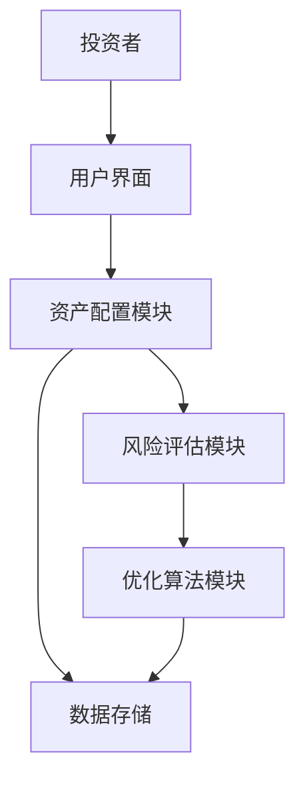

                 


# 格雷厄姆投资理念：分散风险的重要性

## 关键词：
- 分散投资
- 现代投资组合理论
- 资产配置
- 风险管理
- 投资组合优化
- 格雷厄姆投资策略

## 摘要：
本文深入探讨了格雷厄姆的投资理念，特别是分散风险的重要性。通过分析投资组合管理的核心概念、现代投资组合理论（MPT）的数学模型、系统设计与架构，以及实际案例分析，本文详细讲解了如何通过科学的资产配置和风险分散策略来优化投资回报并降低潜在风险。文章结合理论与实践，为读者提供了一套系统化的分散投资方法，帮助投资者在复杂多变的市场环境中实现稳健的投资收益。

---

## 第一部分：投资理念概述

### 第1章：投资的基本概念

#### 1.1 投资的定义与核心要素
投资是指将资金投入到特定资产中，以期望在未来获得收益或资本增值的行为。投资的核心要素包括：
- **资产**：可投资的金融资产（如股票、债券、基金等）和实物资产（如房地产、黄金等）。
- **收益**：投资资产所产生的回报，包括资本收益和利息收益。
- **风险**：投资过程中可能面临的本金损失或收益波动。

#### 1.2 市场波动与投资风险
市场波动是投资过程中不可避免的现象，其主要来源包括经济周期、政策变化、公司基本面变化等。投资风险可以分为以下几类：
- **系统性风险**：影响整个市场的风险，如经济衰退、通货膨胀等。
- **非系统性风险**：特定资产或行业面临的风险，如公司违约、行业政策变化等。

#### 1.3 分散风险的重要性
分散风险是格雷厄姆投资策略的核心理念之一。通过将资金分配到不同类型的资产中，投资者可以降低特定资产或行业带来的风险，从而实现整体投资组合的稳定性。

---

## 第二部分：分散风险的核心概念与原理

### 第2章：投资组合管理

#### 2.1 投资组合的定义与特点
投资组合是指将多种资产按照一定比例组合在一起的投资集合。其特点包括：
- **分散性**：通过多样化投资降低风险。
- **流动性**：资产易于变现的能力。
- **收益性**：投资组合的整体回报率。

#### 2.2 资产配置与分散风险
资产配置是投资组合管理的关键步骤，包括以下内容：
- **资产类别选择**：根据风险承受能力和收益目标选择股票、债券、现金等资产。
- **资产比例分配**：确定各类资产在投资组合中的比例。
- **动态调整**：根据市场变化和个人投资目标调整资产配置。

#### 2.3 投资组合的数学模型
投资组合的收益与风险可以通过数学模型进行量化分析。以下是两个关键公式：
1. **投资组合的期望收益**：
   $$ E(r_p) = \sum_{i=1}^n w_i E(r_i) $$
   其中，$w_i$ 是资产 $i$ 的权重，$E(r_i)$ 是资产 $i$ 的期望收益。
2. **投资组合的风险（方差）**：
   $$ \sigma_p^2 = \sum_{i=1}^n \sum_{j=1}^n w_i w_j \sigma_i \sigma_j \rho_{ij} $$
   其中，$\sigma_i$ 和 $\sigma_j$ 是资产 $i$ 和 $j$ 的标准差，$\rho_{ij}$ 是两者之间的相关系数。

---

## 第三部分：分散风险的数学模型与算法

### 第3章：现代投资组合理论（MPT）

#### 3.1 MPT的核心原理
现代投资组合理论（MPT）由哈里·马科维茨提出，其核心思想是通过优化投资组合的收益与风险比例来实现最优配置。以下是MPT的几个关键点：
1. **有效前沿**：在给定风险水平下，能够提供最高收益的投资组合构成的曲线。
2. **风险调整后的收益**：通过夏普比率衡量投资组合的收益与风险之间的关系。
3. **均值-方差优化**：通过数学优化算法找到最优投资组合。

#### 3.2 数学公式与实现
以下是均值-方差优化的数学公式：
$$\text{目标函数：} \min_w \sigma^2 = w^T \Sigma w$$
$$\text{约束条件：} \sum_{i=1}^n w_i = 1$$
其中，$w$ 是投资权重向量，$\Sigma$ 是资产之间的协方差矩阵。

以下是实现均值-方差优化的Python代码示例：

```python
import numpy as np
import matplotlib.pyplot as plt

# 示例数据：资产的期望收益和协方差矩阵
mu = np.array([0.1, 0.08, 0.05])
Sigma = np.array([[0.16, 0.05, 0], [0.05, 0.04, 0], [0, 0, 0.01]])

# 定义优化问题
n = len(mu)
w = np.zeros(n)
w[0] = 1  # 初始权重

# 简单的优化算法（仅作示例，实际应使用更复杂的优化方法）
# 这里简化为等权配置
w_opt = np.array([1/3, 1/3, 1/3])

# 计算优化后的投资组合收益和风险
port_mu = w_opt.dot(mu)
port_sigma = np.sqrt(w_opt.dot(Sigma).dot(w_opt))

print(f"优化后组合收益：{port_mu:.3f}")
print(f"优化后组合风险：{port_sigma:.3f}")
```

---

## 第四部分：系统分析与架构设计

### 第4章：投资组合管理系统

#### 4.1 系统功能设计
以下是投资组合管理系统的功能模块：
- **数据采集**：获取各类资产的收益和风险数据。
- **资产配置**：根据投资者需求生成最优资产配置方案。
- **风险评估**：计算投资组合的整体风险水平。
- **动态调整**：根据市场变化优化投资组合。

#### 4.2 系统架构设计
以下是投资组合管理系统的架构图：



---

## 第五部分：项目实战

### 第5章：投资组合优化实战

#### 5.1 环境安装
安装必要的Python库：
```bash
pip install numpy matplotlib pandas
```

#### 5.2 核心代码实现
以下是投资组合优化的Python代码：

```python
import numpy as np
from scipy.optimize import minimize

def portfolio_optimization(n_assets, mu, Sigma):
    # 定义目标函数（最小化方差）
    def objective(w):
        return np.dot(w.T, np.dot(Sigma, w))

    # 定义约束条件
    constraints = [{'type': 'eq', 'fun': lambda w: sum(w) - 1}]

    # 初始猜测权重
    w0 = np.array([1.0/n_assets] * n_assets)

    # 使用 scipy 的 minimize 函数求解
    result = minimize(objective, w0, constraints=constraints)

    return result.x

# 示例数据
n_assets = 3
mu = np.array([0.1, 0.08, 0.05])
Sigma = np.array([[0.16, 0.05, 0], [0.05, 0.04, 0], [0, 0, 0.01]])

# 调用优化函数
opt_weights = portfolio_optimization(n_assets, mu, Sigma)

print("优化后的权重：", opt_weights)
print("优化后的组合收益：", opt_weights.dot(mu))
print("优化后的组合风险：", np.sqrt(opt_weights.dot(Sigma).dot(opt_weights)))
```

#### 5.3 案例分析
假设投资者有100万元资金，目标是分散投资于股票、债券和黄金。通过上述优化算法，投资者可以得到最优的资产配置比例，从而在不同市场环境下实现风险与收益的最优平衡。

---

## 第六部分：最佳实践

### 第6章：分散投资的注意事项

#### 6.1 小结
分散投资是降低风险的重要策略，但投资者需要根据自身的风险承受能力和收益目标进行科学的资产配置。

#### 6.2 注意事项
- 定期调整投资组合，确保其与市场环境和投资目标保持一致。
- 避免过度分散，确保投资组合的流动性和收益性。

#### 6.3 拓展阅读
- 《证券分析》（ Benjamin Graham）
- 《投资学原理》（Harry M. Markowitz）

---

## 作者：AI天才研究院/AI Genius Institute & 禅与计算机程序设计艺术 /Zen And The Art of Computer Programming

