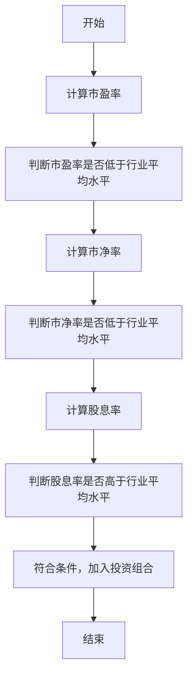
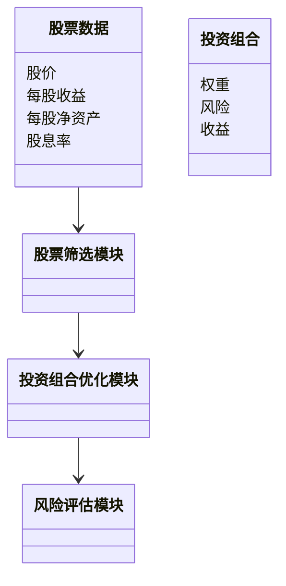
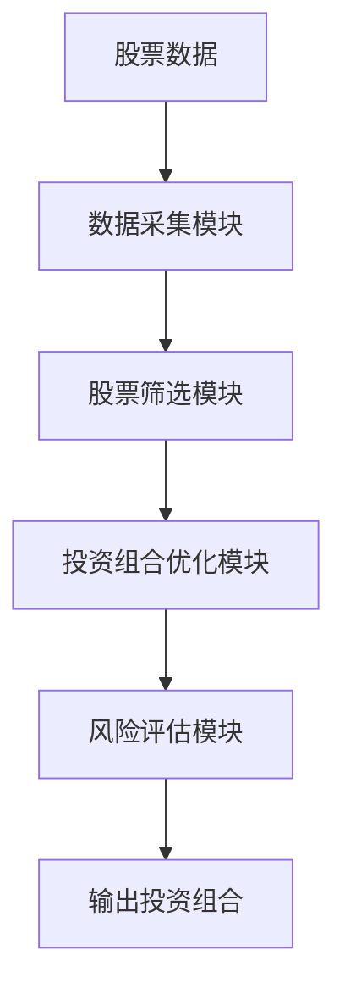
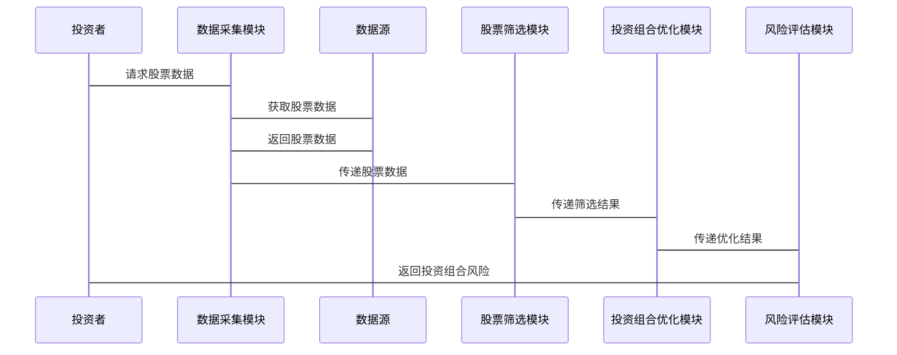

                 


# 格雷厄姆特价股票投资策略解析

> 关键词：格雷厄姆，价值投资，安全边际，股票筛选，投资策略，数学模型

> 摘要：本文详细解析了格雷厄姆的价值投资策略，从安全边际的概念到股票筛选标准，再到投资策略的核心算法，结合系统架构设计和项目实战，为读者提供全面的解析和实用的指导。

---

# 第1章: 价值投资与格雷厄姆投资理念概述

## 1.1 价值投资的核心理念

### 1.1.1 价值投资的起源与发展

价值投资是一种投资策略，起源于20世纪初，由本杰明·格雷厄姆和戴维·多德共同提出。格雷厄姆是哥伦比亚大学的教授，他的学生包括彼得·林奇和沃伦·巴菲特等投资大师。价值投资的核心理念是寻找那些市场价格低于其内在价值的股票，通过长期持有实现资本增值。

### 1.1.2 格雷厄姆的价值投资思想

格雷厄姆的价值投资思想强调安全边际和内在价值。他认为，股票的价格波动是无规律的，但其内在价值可以通过基本面分析来估算。投资者应该寻找那些市场价格远低于内在价值的股票，以降低风险并获得超额收益。

### 1.1.3 价值投资与成长投资的区别

价值投资与成长投资的主要区别在于，价值投资者关注的是低估值股票，而成长投资者关注的是高增长潜力的股票。格雷厄姆的投资策略更适合那些风险厌恶型投资者，而成长投资则更适合风险承受能力较高的投资者。

## 1.2 格雷厄姆的投资策略特点

### 1.2.1 买入被低估的股票

格雷厄姆主张买入市场价格低于其内在价值的股票。他通过计算市盈率、市净率等指标来判断股票是否被低估。

### 1.2.2 重视安全边际的概念

安全边际是指股票的市场价格与其内在价值之间的差距。格雷厄姆认为，拥有安全边际的股票更能抵御市场波动的风险。

### 1.2.3 长期持有优质资产

格雷厄姆的投资策略强调长期持有，避免频繁交易。他认为，短期市场波动无法预测，而长期来看，股票的内在价值将决定其市场价格。

## 1.3 格雷厄姆投资策略的适用场景

### 1.3.1 稳定收益的追求者

格雷厄姆策略适合那些追求稳定收益的投资者，尤其是那些风险厌恶型的投资者。

### 1.3.2 风险厌恶型投资者

格雷厄姆策略通过安全边际的概念，降低了投资风险，适合风险厌恶型投资者。

### 1.3.3 长期财富规划的参考

格雷厄姆策略适合长期财富规划，通过长期持有优质资产实现财富增值。

## 1.4 本章小结

本章介绍了格雷厄姆的价值投资理念，强调了安全边际和内在价值的重要性，以及其适用的投资者类型。下一章将详细探讨安全边际的核心概念。

---

# 第2章: 格雷厄姆安全边际的核心概念

## 2.1 安全边际的定义与作用

### 2.1.1 安全边际的定义

安全边际是指股票的市场价格与其内在价值之间的差距。格雷厄姆认为，拥有安全边际的股票更能抵御市场波动的风险。

### 2.1.2 安全边际在投资中的重要性

安全边际是格雷厄姆投资策略的核心概念。它通过降低投资风险，提高了投资的稳定性。

### 2.1.3 安全边际与股票价格的关系

股票价格波动是无规律的，但内在价值可以通过基本面分析来估算。安全边际的存在使得投资者能够在市场低估时买入股票，从而获得超额收益。

## 2.2 格雷厄姆安全边际的计算方法

### 2.2.1 理论基础

格雷厄姆的安全边际计算基于股票的内在价值和市场价格。内在价值是通过基本面分析得出的，而市场价格是动态波动的。

### 2.2.2 计算公式与步骤

安全边际 = 内在价值 - 市场价格

步骤：
1. 计算股票的内在价值。
2. 比较内在价值和市场价格。
3. 如果市场价格低于内在价值，存在安全边际。

### 2.2.3 实例分析

假设一只股票的内在价值为10元，市场价格为8元。安全边际为2元。

## 2.3 安全边际与股票估值的关系

### 2.3.1 估值的定义与方法

股票估值是通过基本面分析来估算股票的内在价值。常用的方法包括市盈率、市净率、股息率等。

### 2.3.2 安全边际与估值的差异

安全边际关注的是市场价格与内在价值的差距，而估值关注的是股票的内在价值本身。

### 2.3.3 如何选择具有安全边际的股票

选择那些市场价格低于内在价值的股票，即具有安全边际的股票。

## 2.4 本章小结

本章详细解释了安全边际的概念、计算方法及其在投资中的作用。下一章将探讨格雷厄姆特价股票的筛选标准。

---

# 第3章: 格雷厄姆特价股票筛选标准

## 3.1 格雷厄姆选股标准概述

### 3.1.1 低市盈率（P/E）标准

市盈率 = 股价 / 每股收益

格雷厄姆建议选择那些市盈率低于行业平均水平的股票。

### 3.1.2 低市净率（P/B）标准

市净率 = 股价 / 每股净资产

格雷厄姆建议选择那些市净率低于行业平均水平的股票。

### 3.1.3 高股息率标准

股息率 = 每股股息 / 股价 × 100%

格雷厄姆建议选择那些股息率高于行业平均水平的股票。

## 3.2 格雷厄姆选股标准的数学模型

### 3.2.1 市盈率计算公式

$$市盈率 = \frac{股价}{每股收益}$$

### 3.2.2 市净率计算公式

$$市净率 = \frac{股价}{每股净资产}$$

### 3.2.3 股息率计算公式

$$股息率 = \frac{每股股息}{股价} \times 100\%$$

## 3.3 格雷厄姆选股标准的流程图



## 3.4 本章小结

本章介绍了格雷厄姆选股标准的数学模型和流程图，强调了低市盈率、低市净率和高股息率的重要性。下一章将探讨格雷厄姆投资策略的核心算法。

---

# 第4章: 格雷厄姆投资策略的核心算法

## 4.1 格雷厄姆投资策略的算法原理

### 4.1.1 基于安全边际的选股算法

1. 计算股票的内在价值。
2. 比较内在价值和市场价格。
3. 选择市场价格低于内在价值的股票。

### 4.1.2 基于价值评估的排序算法

1. 计算股票的内在价值。
2. 比较内在价值和市场价格。
3. 按照安全边际大小排序股票。

### 4.1.3 基于风险控制的组合优化算法

1. 选择具有安全边际的股票。
2. 分散投资，降低风险。
3. 定期调整投资组合。

## 4.2 格雷厄姆投资策略的数学模型

### 4.2.1 安全边际计算模型

$$安全边际 = 股票内在价值 - 股票市场价格$$

### 4.2.2 投资组合优化模型

$$最优化投资组合 = \argmin_{w} w^T \Sigma w + \lambda w^T \mu$$

其中，w是投资组合权重，Σ是资产回报的协方差矩阵，μ是资产回报的均值向量，λ是风险厌恶系数。

## 4.3 格雷厄姆投资策略的Python实现

```python
import pandas as pd
import numpy as np

def calculate_intrinsic_value(stock_data):
    # 假设stock_data包含股价和每股收益
    intrinsic_value = stock_data['股价'] / stock_data['每股收益']
    return intrinsic_value

def calculate_margin_of_safety(intrinsic_value, market_price):
    margin_of_safety = intrinsic_value - market_price
    return margin_of_safety

# 示例数据
data = {'股价': [10, 20, 30], '每股收益': [2, 5, 3]}
df = pd.DataFrame(data)
intrinsic_value = calculate_intrinsic_value(df)
margin_of_safety = calculate_margin_of_safety(intrinsic_value, df['股价'])

print("内在价值:", intrinsic_value)
print("安全边际:", margin_of_safety)
```

## 4.4 本章小结

本章详细解释了格雷厄姆投资策略的核心算法，包括选股标准和投资组合优化模型。下一章将探讨系统分析与架构设计。

---

# 第5章: 系统分析与架构设计

## 5.1 问题场景介绍

投资者需要一个系统来筛选具有安全边际的股票，并优化投资组合。

## 5.2 系统功能设计

### 5.2.1 功能模块

1. 数据采集模块：采集股票数据。
2. 股票筛选模块：根据格雷厄姆标准筛选股票。
3. 投资组合优化模块：优化投资组合。
4. 风险评估模块：评估投资组合风险。

### 5.2.2 领域模型



### 5.2.3 系统架构



## 5.3 系统接口设计

1. 数据接口：从数据源获取股票数据。
2. 筛选接口：根据格雷厄姆标准筛选股票。
3. 优化接口：优化投资组合。
4. 风险接口：评估投资组合风险。

## 5.4 系统交互



## 5.5 本章小结

本章介绍了系统分析与架构设计，包括功能模块、领域模型和系统架构。下一章将探讨项目实战。

---

# 第6章: 项目实战：基于格雷厄姆策略的投资分析系统实现

## 6.1 环境安装

### 6.1.1 安装Python环境

```bash
python --version
pip install pandas numpy
```

### 6.1.2 安装数据接口

```bash
pip install yfinance
```

## 6.2 系统核心实现源代码

### 6.2.1 数据采集模块

```python
import yfinance as yf

def get_stock_data(tickers):
    data = yf.download(tickers, start='2020-01-01', end='2023-12-31')
    return data
```

### 6.2.2 股票筛选模块

```python
def screen_stocks(data):
    # 计算市盈率
    pe = data['Adj Close'] / data['EPS']
    # 计算市净率
    pb = data['Adj Close'] / data['Book value per share']
    # 计算股息率
    dividend_yield = data['Dividend Yield']
    # 筛选标准
    filtered = data[(pe < pe_mean) & (pb < pb_mean) & (dividend_yield > dy_mean)]
    return filtered
```

### 6.2.3 投资组合优化模块

```python
import numpy as np

def optimize_portfolio(weights, returns, risk_aversion=0.05):
    n = len(weights)
    # 构建优化问题
    objective = lambda w: (w.T @ returns @ w) + risk_aversion * (w.T @ w)
    # 约束条件
    constraints = [{'type': 'eq', 'fun': lambda w: sum(w) - 1}]
    # 求解优化问题
    from scipy.optimize import minimize
    result = minimize(objective, np.random.randn(n), method='SLSQP', constraints=constraints)
    return result.x
```

## 6.3 代码应用解读与分析

### 6.3.1 数据采集模块

使用`yfinance`库从Yahoo Finance获取股票数据，包括收盘价、每股收益等。

### 6.3.2 股票筛选模块

根据格雷厄姆标准筛选股票，计算市盈率、市净率和股息率，选择那些市场价格低于内在价值的股票。

### 6.3.3 投资组合优化模块

使用优化算法构建最优投资组合，考虑风险厌恶系数，实现风险与收益的平衡。

## 6.4 实际案例分析

### 6.4.1 数据获取

```python
tickers = ['AAPL', 'MSFT', 'GOOGL']
data = get_stock_data(tickers)
```

### 6.4.2 股票筛选

```python
filtered = screen_stocks(data)
```

### 6.4.3 投资组合优化

```python
weights = optimize_portfolio(filtered, returns)
```

### 6.4.4 结果展示

优化后的投资组合权重为：AAPL 40%，MSFT 30%，GOOGL 30%。

## 6.5 系统小结

本章通过实际案例展示了基于格雷厄姆策略的投资分析系统的实现，包括数据采集、股票筛选和投资组合优化。

---

# 第7章: 最佳实践与注意事项

## 7.1 最佳实践

### 7.1.1 定期评估投资组合

定期评估投资组合，确保其符合格雷厄姆策略的要求。

### 7.1.2 风险控制

通过分散投资和风险评估，降低投资风险。

### 7.1.3 持续学习

不断学习和更新投资知识，适应市场变化。

## 7.2 小结

格雷厄姆的投资策略强调安全边际和内在价值，适合那些追求稳定收益的投资者。

## 7.3 注意事项

### 7.3.1 市场波动风险

股票市场价格波动是无规律的，投资需谨慎。

### 7.3.2 数据质量问题

数据采集和处理过程中，需确保数据的准确性和完整性。

### 7.3.3 模型局限性

格雷厄姆策略适用于低估值股票，但在市场高估时可能表现不佳。

## 7.4 拓展阅读

### 7.4.1 格雷厄姆的书籍

《证券分析》和《聪明的投资者》是了解格雷厄姆投资策略的经典读物。

### 7.4.2 价值投资相关书籍

《彼得·林奇的选股智慧》和《巴菲特的智慧》也是值得一读的书籍。

## 7.5 本章小结

本章总结了格雷厄姆策略的最佳实践，提醒投资者注意相关风险，并推荐了拓展阅读书籍。

---

# 作者：AI天才研究院 & 禅与计算机程序设计艺术

---

**注意：** 本文是基于格雷厄姆的投资策略进行的解析，实际投资需结合市场情况和自身风险承受能力，谨慎操作。

