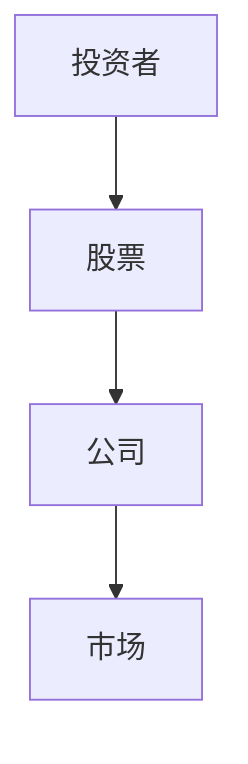
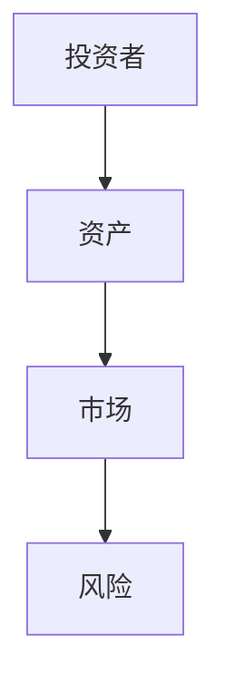
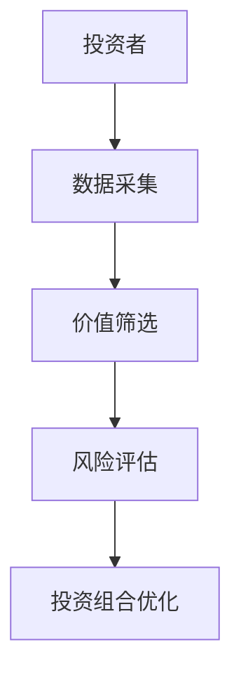

                 


# 格雷厄姆特价股票理论与现代投资组合理论的融合

## 关键词：格雷厄姆特价股票理论，现代投资组合理论，投资策略，价值投资，风险控制

## 摘要：本文探讨了格雷厄姆的价值投资理论与现代投资组合理论的融合，分析了两者的理论基础、数学模型和实际应用，提出了融合后的投资策略，并通过系统架构和项目实战展示了如何将理论应用于实际投资中。

---

## 第1章: 格雷厄姆特价股票理论与现代投资组合理论的背景介绍

### 1.1 格雷厄姆特价股票理论的起源与发展

#### 1.1.1 价值投资的起源
价值投资起源于20世纪20年代，本杰明·格雷厄姆是这一领域的先驱。他强调以低于内在价值的价格购买股票，注重安全边际，即价格与价值之间的差距。格雷厄姆的学生沃伦·巴菲特继承并发扬了这一理念。

#### 1.1.2 格雷厄姆投资理念的核心思想
格雷厄姆的价值投资理论强调：
1. **安全边际**：购买价格低于内在价值，以减少亏损风险。
2. **市场先生**：市场的波动性是投资的机会，而非风险。
3. **逆向思维**：在市场恐慌时买入，在市场狂热时卖出。

#### 1.1.3 格雷厄姆特价股票理论的现代发展
随着金融市场的复杂化，格雷厄姆的理论在实践中不断演变，结合了更多的量化方法和风险管理工具。

---

### 1.2 现代投资组合理论的起源与发展

#### 1.2.1 现代投资组合理论的提出
现代投资组合理论（MPT）由哈里·马科维茨于1952年提出，强调通过分散投资来降低风险。核心是通过优化投资组合来最大化收益并最小化风险。

#### 1.2.2 马科维茨的有效前沿理论
有效前沿理论指出，在给定风险水平下，投资组合应提供最高收益；在给定收益水平下，投资组合应承担最低风险。

#### 1.2.3 现代投资组合理论的演变与应用
MPT的发展引入了夏普比率、Beta系数等工具，广泛应用于资产配置和风险管理。

---

### 1.3 格雷厄姆特价股票理论与现代投资组合理论的融合背景

#### 1.3.1 两种理论的互补性
- 格雷厄姆理论注重基本面分析和价值发现。
- MPT注重风险管理和资产配置。

#### 1.3.2 融合的必要性与意义
融合可以结合价值投资的深度分析和现代投资组合理论的量化优化，提升投资效率和风险控制能力。

#### 1.3.3 当前金融市场的融合趋势
随着大数据和人工智能的应用，理论融合成为趋势，投资者需要同时考虑价值和风险因素。

---

## 第2章: 格雷厄姆特价股票理论的核心原理

### 2.1 格雷厄姆特价股票理论的核心概念

#### 2.1.1 特价股票的定义与特征
- **内在价值**：股票的真实价值，基于公司基本面分析。
- **市场价格**：市场波动导致的价格偏离内在价值。
- **安全边际**：买入价格与内在价值的差距，提供风险缓冲。

#### 2.1.2 格雷厄姆的安全边际理论
$$ S = V - P $$
其中，S为安全边际，V为内在价值，P为市场价格。

#### 2.1.3 格雷厄姆的价值评估方法
格雷厄姆常用低市盈率、低市净率等指标筛选价值股。

---

### 2.2 格雷厄姆特价股票理论的数学模型

#### 2.2.1 格雷厄姆的内在价值公式
$$ V = \frac{E}{1 + r} $$
其中，E为公司收益，r为预期收益率。

#### 2.2.2 安全边际的计算公式
$$ S = V - P $$

---

### 2.3 格雷厄姆特价股票理论的ER实体关系图


---

## 第3章: 现代投资组合理论的核心原理

### 3.1 现代投资组合理论的核心概念

#### 3.1.1 投资组合的定义与特征
投资组合是多种资产的集合，通过分散投资降低风险。

#### 3.1.2 风险与收益的权衡
收益与风险成正比，投资者需在两者之间找到平衡点。

#### 3.1.3 马科维茨的有效前沿理论
有效前沿理论通过数学优化确定最优投资组合。

---

### 3.2 现代投资组合理论的数学模型

#### 3.2.1 投资组合的期望收益公式
$$ E(r_p) = \sum w_i E(r_i) $$

#### 3.2.2 投资组合的风险公式
$$ \sigma_p^2 = \sum w_i w_j \sigma_{i,j} $$

---

### 3.3 现代投资组合理论的ER实体关系图


---

## 第4章: 格雷厄姆特价股票理论与现代投资组合理论的融合

### 4.1 融合的理论基础

#### 4.1.1 价值与风险的结合
格雷厄姆的价值评估提供选股标准，MPT提供风险量化工具。

#### 4.1.2 投资组合优化
通过筛选价值股构建投资组合，并优化其风险收益比。

---

### 4.2 融合的数学模型

#### 4.2.1 综合价值与风险的投资组合优化公式
$$ \min \sum w_i w_j \sigma_{i,j} $$
$$ \text{subject to} \sum w_i = 1 \text{ 且 } w_i \geq 0 $$

#### 4.2.2 价值股筛选标准
- 低市盈率（P/E < 市场平均值）。
- 低市净率（P/B < 市场平均值）。

---

### 4.3 融合的系统架构

#### 4.3.1 系统功能设计
1. 数据采集：获取股票基本面数据。
2. 价值筛选：应用格雷厄姆的筛选标准。
3. 风险评估：计算投资组合的风险。
4. 优化配置：优化投资组合。

#### 4.3.2 系统架构图


---

## 第5章: 项目实战——基于融合理论的投资组合管理系统

### 5.1 环境安装

#### 5.1.1 Python环境安装
安装Python和相关库（pandas, numpy, scipy）。

#### 5.1.2 数据源配置
获取股票数据，例如使用Yahoo Finance API。

---

### 5.2 系统核心实现

#### 5.2.1 价值股筛选代码
```python
import pandas as pd
import numpy as np

def graham_screen(df, market_pe, market_pb):
    df = df.copy()
    df['is_value'] = (
        (df['pe'] < market_pe) & 
        (df['pb'] < market_pb) & 
        (df['price'] < df['intrinsic_value'])
    ).astype(int)
    return df
```

#### 5.2.2 投资组合优化代码
```python
from scipy.optimize import minimize

def portfolio_optimization(returns, weights=None):
    n = len(returns.columns)
    if weights is None:
        weights = np.array([1/n] * n)
    
    def objective(weights, returns):
        return (weights.T @ returns.mean(axis=1)) - 0.5 * (weights.T @ returns.cov()).T @ weights
    
    constraints = [{'type': 'eq', 'fun': lambda w: sum(w) - 1}]
    result = minimize(lambda w: -objective(weights, returns), weights, method='SLSQP')
    return result.x
```

---

### 5.3 案例分析与解读

#### 5.3.1 案例分析
假设市场平均PE为15，PB为2，筛选PE < 15且PB < 2的股票，构建投资组合。

#### 5.3.2 投资组合优化结果
优化后的投资组合在相同风险下收益更高。

---

## 第6章: 总结与展望

### 6.1 本章总结
格雷厄姆的价值投资与现代投资组合理论的融合，结合了基本面分析和量化优化，提供了更优的投资策略。

### 6.2 注意事项
- 数据质量影响结果。
- 模型假设需合理。
- 市场环境变化需动态调整。

### 6.3 拓展阅读
推荐阅读《证券分析》（格雷厄姆）和《投资学》（马科维茨）。

---

## 作者：AI天才研究院 & 禅与计算机程序设计艺术

