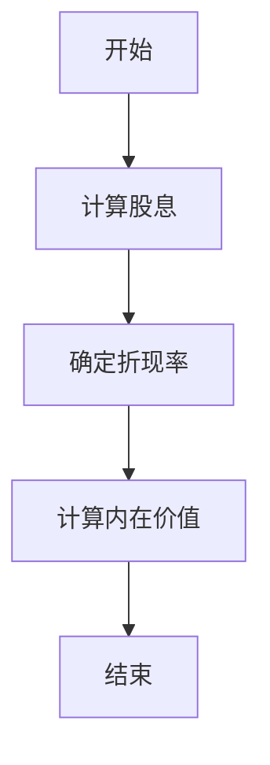
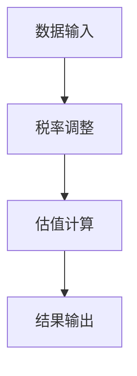

                 


# 格雷厄姆特价股票理论在不同税收环境下的调整

> 关键词：格雷厄姆投资理论，特价股票，税收影响，股票估值，投资策略

> 摘要：本文深入探讨了格雷厄姆特价股票理论在不同税收环境下的调整方法，分析了税收政策对股票估值的影响，提出了适用于不同税率环境的数学模型和算法，并通过实际案例展示了如何在实际投资中应用这些理论。

---

## 第一部分: 格雷厄姆特价股票理论基础

### 第1章: 格雷厄姆投资理论概述

#### 1.1 格雷厄姆投资理论的核心概念

格雷厄姆是价值投资的鼻祖，其理论强调购买被市场低估的股票。核心在于通过分析公司的基本面，如市盈率（P/E）、市净率（P/B）等，计算股票的内在价值。

**公式：**
$$ 内在价值 = \frac{股息}{折现率} $$

**流程图：**


#### 1.2 税收对投资决策的影响

税收是影响投资收益的重要因素。不同国家或地区的税率差异会导致投资策略的调整。例如，股息收入的税率高于资本利得税的国家，投资者可能会更倾向于资本利得。

### 第2章: 格雷厄姆特价股票理论的核心要素

#### 2.1 股票内在价值的计算方法

格雷厄姆的内在价值计算不考虑税收，但实际操作中必须调整。以股息为例，税后股息计算公式为：
$$ 税后股息 = 股息 \times (1 - 税率) $$

#### 2.2 税收对股票估值的影响

税收影响现金流预测。例如，若税率增加，税后现金流减少，导致内在价值下降。

---

## 第二部分: 不同税收环境下的理论调整

### 第3章: 税收政策对股票估值模型的调整

#### 3.1 税收对股息政策的影响

高税率环境下，公司可能减少股息分配，转而进行股票回购。税后股息计算：
$$ 税后股息 = 股息 \times (1 - 税率) $$

#### 3.2 税收对资本利得的影响

资本利得税影响投资期限。长期资本利得税通常低于短期，鼓励长期投资。

### 第4章: 税收环境下的股票估值模型

#### 4.1 税后现金流计算公式

$$ 税后现金流 = 现金流 \times (1 - 税率) $$

#### 4.2 内在价值调整公式

$$ 内在价值_{调整后} = \frac{税后现金流}{折现率} $$

---

## 第三部分: 数学模型与算法实现

### 第5章: 税收影响下的股票估值算法

#### 5.1 税后现金流计算

**代码示例：**
```python
def calculate_taxed_cash_flow(cash_flow, tax_rate):
    return cash_flow * (1 - tax_rate)
```

#### 5.2 内在价值调整

**代码示例：**
```python
def calculate_intrinsic_value(taxed_cash_flow, discount_rate):
    return taxed_cash_flow / discount_rate
```

---

## 第四部分: 系统分析与架构设计

### 第6章: 投资分析系统设计

#### 6.1 系统功能设计

**功能模块：**
- 数据输入模块
- 税率调整模块
- 估值计算模块

#### 6.2 系统架构图



---

## 第五部分: 项目实战

### 第7章: 实际应用案例

#### 7.1 环境安装

安装Python和相关库：
```bash
pip install numpy pandas
```

#### 7.2 代码实现

```python
import pandas as pd

def adjust_for_taxes(value, tax_rate):
    return value * (1 - tax_rate)

# 示例数据
data = pd.DataFrame({'value': [100, 200, 300], 'tax_rate': [0.1, 0.15, 0.2]})
data['adjusted_value'] = data.apply(lambda x: adjust_for_taxes(x['value'], x['tax_rate']), axis=1)
print(data)
```

---

## 第六部分: 小结

### 第8章: 投资策略优化

#### 8.1 最佳实践

- 理解当地税收政策
- 调整估值模型
- 长期投资策略

#### 8.2 投资建议

在不同税收环境下，投资者应灵活调整策略，优先选择税负较低的投资方式。

---

作者：AI天才研究院  
文章来源：禅与计算机程序设计艺术

