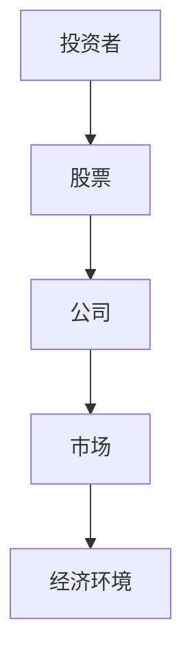
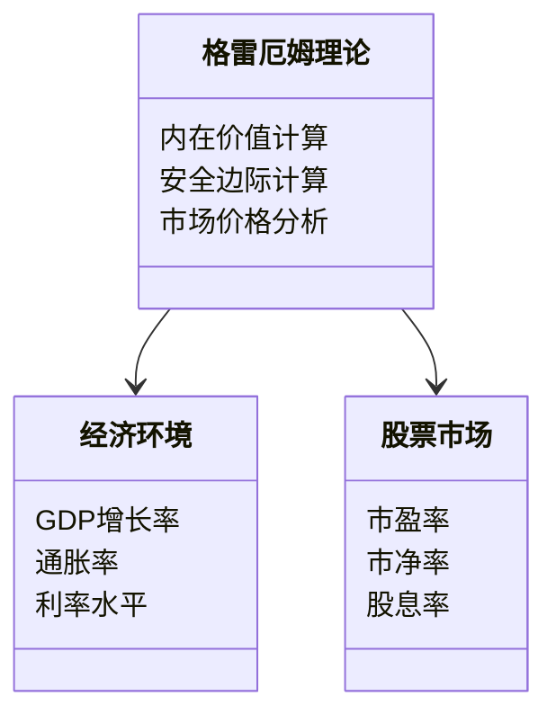

                 


# 格雷厄姆特价股票理论在不同规模经济体中的表现

> 关键词：格雷厄姆投资理论，特价股票，价值投资，规模经济体，股票市场分析

> 摘要：本文深入探讨了格雷厄姆特价股票理论在不同规模经济体中的表现，分析了该理论在发达国家和发展中国家的应用差异，并结合实际案例和数学模型，详细阐述了其在不同经济环境下的投资策略和效果。通过系统分析和实战案例，本文为投资者提供了如何在不同经济环境下有效运用格雷厄姆理论的指导。

---

## 第一部分: 格雷厄姆特价股票理论基础

### 第1章: 格雷厄姆特价股票理论概述

#### 1.1 格雷厄姆投资理论的起源
格雷厄姆价值投资理论是20世纪最经典的金融理论之一，由本杰明·格雷厄姆（Benjamin Graham）提出。该理论强调以低于内在价值的价格购买股票，注重安全边际和长期投资策略。

- **价值投资的起源与发展**  
  格雷厄姆在《证券分析》（1934年）和《聪明的投资者》（1949年）中系统阐述了价值投资理念，强调股票的内在价值是其未来现金流的现值，而市场价格经常偏离内在价值。

- **格雷厄姆的投资理念与方法**  
  格雷厄姆主张以安全边际为核心，即以低于内在价值的价格买入股票，避免过度依赖市场情绪，注重基本面分析。

- **格雷厄姆理论的核心思想**  
  格雷厄姆认为，市场先生（Market先生）是股票市场的化身，其情绪波动为投资者提供了低价买入和高价卖出的机会。

#### 1.2 特价股票的定义与特征
特价股票是指市场价格低于其内在价值的股票，通常具有以下特征：
- **低市盈率（P/E）**：市盈率低于行业平均水平。
- **低市净率（P/B）**：市净率低于行业平均水平。
- **高股息率**：股息收益率较高。
- **估值折扣**：市场价格低于根据未来现金流折现计算的内在价值。

#### 1.3 格雷厄姆理论在投资中的重要性
- **格雷厄姆理论的适用场景**  
  适用于市场恐慌、市场低估、经济衰退等情况下，寻找被市场忽视的优质股票。

- **格雷厄姆理论在投资决策中的作用**  
  作为价值投资的核心理论，格雷厄姆理论帮助投资者在市场波动中发现低估机会，降低投资风险。

- **格雷厄姆理论的局限性**  
  该理论假设股票价格最终会回归内在价值，但在市场有效或长期熊市中，部分股票可能长期被低估。

---

### 第2章: 格雷厄姆特价股票理论的核心概念

#### 2.1 格雷厄姆理论的核心要素
- **安全边际（Margin of Safety）**  
  安全边际是市场价格与内在价值之间的差额，确保投资者在买入时有一定的安全空间，即使价格波动，也能保证本金安全。

- **内在价值（Intrinsic Value）**  
  内在价值是股票的未来现金流的现值，通过分析公司的财务状况和未来盈利能力计算得出。

- **市场先生（Mr. Market）**  
  格雷厄姆将市场情绪化为市场先生，强调投资者应忽视短期市场波动，专注于长期投资。

#### 2.2 格雷厄姆理论的数学模型
- **内在价值的计算公式**  
  内在价值可以通过股利贴现模型（DDM）计算：
  $$ V = \sum_{t=1}^{n} \frac{D_t}{(1+r)^t} + \frac{P_n}{(1+r)^n} $$
  其中，$D_t$是第$t$年的股息，$r$是折现率，$P_n$是第$n$年的终值。

- **安全边际的计算公式**  
  安全边际可以通过以下公式计算：
  $$ S = V - P $$
  其中，$S$是安全边际，$V$是内在价值，$P$是市场价格。

- **市盈率的计算公式**  
  市盈率（P/E）计算公式为：
  $$ P/E = \frac{P}{E} $$
  其中，$P$是股价，$E$是每股收益。

#### 2.3 格雷厄姆理论的实体关系图


---

### 第3章: 格雷厄姆理论在不同规模经济体中的应用

#### 3.1 发达国家经济环境下的应用
- **发达国家的市场特点**  
  发达国家市场成熟，波动性较低，公司治理完善，信息公开透明。

- **格雷厄姆理论在发达国家的应用案例**  
  在2008年金融危机期间，许多美国银行股价格被低估，投资者可以以低于内在价值的价格买入，最终获得超额收益。

- **发达国家市场中的策略调整**  
  在发达国家市场中，投资者可以结合宏观经济指标（如GDP增长率、通胀率）和行业趋势，优化投资组合。

#### 3.2 发展中国家经济环境下的应用
- **发展中国家的市场特点**  
  发展中国家市场波动性较大，信息不透明，但增长潜力较高。

- **格雷厄姆理论在发展中国家的应用案例**  
  在中国股市中，许多中小盘股由于市场关注度低，价格可能被低估，适合运用格雷厄姆理论进行投资。

- **发展中国家市场中的策略调整**  
  在发展中国家市场中，投资者需要更加关注公司基本面，如盈利能力、财务健康状况，同时注意宏观经济风险。

---

## 第二部分: 格雷厄姆理论的系统分析与架构设计

### 第4章: 格雷厄姆理论的系统分析

#### 4.1 问题场景介绍
- **问题背景**  
  格雷厄姆理论适用于不同规模经济体，但其表现可能因市场环境而异。

- **系统功能设计**  
  通过构建格雷厄姆理论分析框架，分析不同经济体中股票市场的特点及其对投资策略的影响。

#### 4.2 系统架构设计


---

## 第三部分: 格雷厄姆理论的项目实战

### 第5章: 格雷厄姆理论的实战分析

#### 5.1 环境安装与数据准备
- **环境安装**  
  需要安装Python编程语言和相关数据分析库（如Pandas、NumPy）。

- **数据准备**  
  收集不同国家的股票市场数据，包括市盈率、市净率、股息率等。

#### 5.2 核心实现
- **代码实现**  
  使用Python编写格雷厄姆理论的内在价值计算和安全边际计算代码。

```python
import pandas as pd
import numpy as np

def calculate_intrinsic_value(stock_data, required_return):
    # 假设股息增长率固定
    growth_rate = 0.05
    stock_data['Intrinsic Value'] = stock_data['股息'].apply(
        lambda d: d / (required_return - growth_rate)
    )
    return stock_data

# 示例数据
data = {
    '股票代码': ['A', 'B', 'C'],
    '股息': [1, 2, 1.5],
    '股价': [20, 30, 25],
    '市盈率': [10, 15, 12],
    '市净率': [2, 3, 2.5]
}
stock_data = pd.DataFrame(data)

# 计算内在价值（假设required_return=0.1）
intrinsic_value = calculate_intrinsic_value(stock_data, 0.1)
print(intrinsic_value)
```

#### 5.3 案例分析
- **案例1：发达国家市场中的应用**  
  以美国市场为例，分析苹果公司（AAPL）的股价是否低于其内在价值。

- **案例2：发展中国家市场中的应用**  
  以中国市场为例，分析某中小盘股的股价是否低于其内在价值。

#### 5.4 项目小结
通过代码实现和案例分析，验证格雷厄姆理论在不同规模经济体中的适用性，并总结其在实际投资中的注意事项。

---

## 第四部分: 总结与展望

### 第6章: 总结与展望

#### 6.1 核心内容总结
- 格雷厄姆特价股票理论是价值投资的核心理论，适用于不同规模经济体。
- 在发达国家和发展中国家的应用中，需结合市场环境进行策略调整。

#### 6.2 未来研究方向
- 探讨格雷厄姆理论与其他投资策略的结合。
- 在更多国家进行实证分析，验证其适用性。

---

## 作者信息

作者：AI天才研究院/AI Genius Institute & 禅与计算机程序设计艺术 /Zen And The Art of Computer Programming

---

通过以上目录结构和内容安排，本文系统地探讨了格雷厄姆特价股票理论在不同规模经济体中的表现，结合理论分析、数学模型和实际案例，为投资者提供了全面的指导。

