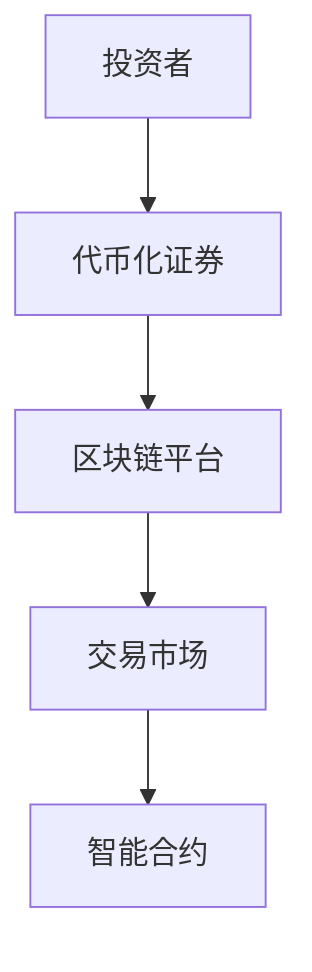
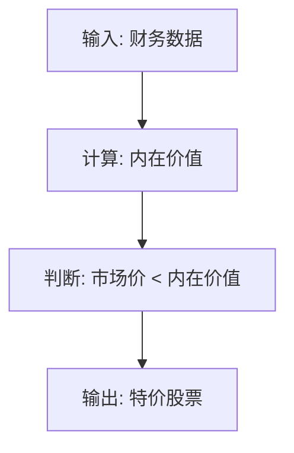
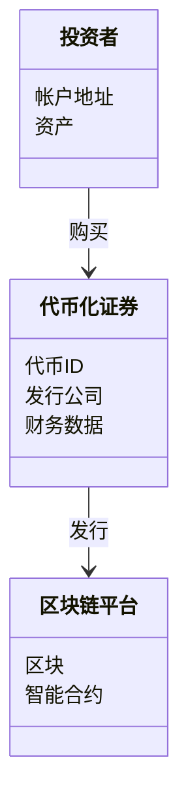

                 


# 格雷厄姆特价股票理论在代币化证券中的运用

> 关键词：格雷厄姆理论、代币化证券、价值投资、区块链技术、智能合约

> 摘要：本文深入探讨了格雷厄姆特价股票理论在代币化证券中的应用，分析了如何利用区块链技术实现其核心理念。通过数学模型、算法流程图和实际案例，详细讲解了价值评估、智能合约设计以及系统架构实现，为读者提供了从理论到实践的完整指南。

---

# 第一部分: 格雷厄姆特价股票理论与代币化证券基础

## 第1章: 格雷厄姆特价股票理论概述

### 1.1 格雷厄姆特价股票理论的基本概念

#### 1.1.1 价值投资的核心理念
格雷厄姆的价值投资理论强调以低于内在价值的价格购买股票，长期持有，等待市场重新评估其价值。其核心理念包括：
- **安全边际**：买入价格远低于内在价值，以降低风险。
- **内在价值**：企业未来现金流的现值，通过基本面分析计算。

#### 1.1.2 特价股票的定义与特征
- **定义**：市场价格显著低于内在价值的股票。
- **特征**：
  - 市盈率（P/E）低于行业平均水平。
  - 市净率（P/B）低于1。
  - 股息率较高，且稳定增长。

#### 1.1.3 格雷厄姆投资策略的关键原则
- 长期持有：避免频繁交易，减少交易成本。
- 分批建仓：分散投资，降低风险。
- 避免短期波动：关注长期价值，而非短期价格波动。

### 1.2 代币化证券的基本概念

#### 1.2.1 代币化证券的定义
代币化证券是将传统金融资产（如股票、债券）转化为数字代币，利用区块链技术进行发行、交易和结算。

#### 1.2.2 代币化证券的特点与优势
- **透明性**：区块链记录所有交易，确保透明可追溯。
- **高效性**：去中心化交易，减少中间环节，降低成本。
- **可编程性**：通过智能合约实现自动化的发行、转让和分红。

#### 1.2.3 代币化证券与传统证券的区别
| 特性 | 传统证券 | 代币化证券 |
|------|----------|------------|
| 发行方式 | 中央机构 | 区块链平台 |
| 交易速度 | 较慢，需中介 | 实时交易，无需中介 |
| 成本 | 较高 | 较低 |

### 1.3 格雷厄姆理论与代币化证券的结合

#### 1.3.1 格雷厄姆理论在现代金融中的应用
- 投资者利用格雷厄姆理论寻找被低估的股票，通过长期持有实现收益。
- 传统证券市场中，价值投资依赖于基本面分析和市场情绪判断。

#### 1.3.2 代币化证券对传统投资理论的挑战
- 去中心化和透明性使得代币化证券的交易更加高效，降低了信息不对称。
- 智能合约的应用使得价值评估和交易自动化，减少了人为干预。

#### 1.3.3 格雷厄姆理论与代币化证券的契合点
- 代币化证券的透明性和高效性为格雷厄姆理论提供了更好的实施环境。
- 智能合约可以自动执行价值评估和交易，确保投资策略的严格执行。

---

## 第2章: 格雷厄姆特价股票理论的核心概念与联系

### 2.1 核心概念原理

#### 2.1.1 价值评估模型
格雷厄姆的内在价值计算公式为：
$$ V = \frac{CF}{r - g} $$
其中：
- $CF$ 是未来现金流的现值。
- $r$ 是折现率。
- $g$ 是增长率。

#### 2.1.2 市盈率与市净率分析
- 市盈率（P/E）= 股价 / 每股收益。
- 市净率（P/B）= 股价 / 每股净资产。

#### 2.1.3 股票内在价值的计算方法
- 通过基本面分析确定企业的未来现金流。
- 使用合理的折现率计算内在价值。

### 2.2 核心概念属性特征对比表格

| 特性 | 格雷厄姆理论 | 代币化证券 |
|------|-------------|------------|
| 核心目标 | 寻找被低估股票 | 提供高效、透明的交易环境 |
| 技术基础 | 基础面分析 | 区块链技术 |
| 优势 | 降低投资风险 | 提高交易效率 |

### 2.3 ER实体关系图架构



---

## 第3章: 格雷厄姆特价股票理论的算法原理

### 3.1 算法原理概述

#### 3.1.1 价值评估算法的基本流程
1. 收集企业基本面数据（如收入、利润、现金流）。
2. 计算内在价值（使用格雷厄姆公式）。
3. 对比市场价格与内在价值，判断是否为特价股票。

#### 3.1.2 数据输入与处理
- 输入：企业财务数据、市场数据。
- 处理：清洗数据，计算关键指标（P/E、P/B）。

#### 3.1.3 算法输出与结果解释
- 输出：价值评估结果（是否为特价股票）。
- 解释：低于内在价值则为特价股票。

### 3.2 价值评估算法的 mermaid 流程图



### 3.3 算法实现的 Python 源代码

```python
def calculate_intrinsic_value(revenue, profit, cash_flow, growth_rate, discount_rate):
    # 计算未来现金流现值
    PV = cash_flow / (discount_rate - growth_rate)
    return PV

# 示例数据
revenue = 1000000
profit = 200000
cash_flow = 500000
growth_rate = 0.05
discount_rate = 0.10

intrinsic_value = calculate_intrinsic_value(revenue, profit, cash_flow, growth_rate, discount_rate)
market_price = 50  # 示例市场价格

if market_price < intrinsic_value:
    print("该股票为特价股票")
else:
    print("该股票不是特价股票")
```

---

## 第4章: 代币化证券的系统分析与架构设计

### 4.1 系统功能设计

#### 4.1.1 领域模型 mermaid 类图



### 4.2 系统架构设计

#### 4.2.1 系统架构 mermaid 图


---

## 第5章: 项目实战

### 5.1 代币化证券交易平台的实现

#### 5.1.1 环境安装
- 安装区块链平台（如 Ethereum）。
- 安装智能合约开发工具（如 Solidity）。

#### 5.1.2 核心实现源代码

```solidity
// 智能合约：代币化证券发行
contract SecurityToken {
    mapping(address => uint) public balances;

    function buyToken(address recipient, uint amount) public {
        balances[recipient] += amount;
    }

    function sellToken(address recipient, uint amount) public {
        balances[recipient] -= amount;
    }
}
```

---

## 第6章: 总结与扩展

### 6.1 总结
格雷厄姆的特价股票理论在代币化证券中的应用为投资者提供了新的机会，通过区块链技术和智能合约实现了理论的高效实施。

### 6.2 最佳实践 tips
- 使用智能合约自动执行投资策略。
- 定期更新企业基本面数据，确保价值评估的准确性。

### 6.3 小结
代币化证券与格雷厄姆理论的结合不仅降低了交易成本，还提高了投资效率，未来将有更广泛的应用。

### 6.4 注意事项
- 风险提示：代币化证券市场波动较大，需谨慎投资。
- 技术风险：区块链技术仍在发展，需关注技术成熟度。

### 6.5 拓展阅读
- 推荐阅读《The Intelligent Investor》。
- 参考区块链技术相关书籍。

---

# 作者：AI天才研究院/AI Genius Institute & 禅与计算机程序设计艺术/Zen And The Art of Computer Programming

---

**本文为AI天才研究院原创文章，转载请注明出处。**

