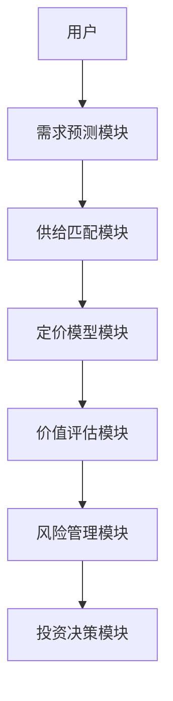

                 

# 格雷厄姆特价股票理论在共享经济平台时代的新思考

---

## 关键词

- 格雷厄姆特价股票理论
- 共享经济平台
- 动态定价模型
- 价值投资
- 数字经济

---

## 摘要

本文探讨了格雷厄姆特价股票理论在共享经济平台时代的新应用。通过分析共享经济的运作模式和定价机制，本文提出将格雷厄姆的价值投资理念与现代数据驱动的定价策略相结合，为投资者和平台提供新的视角。文章还结合数学模型和算法，展示了如何在共享经济中优化定价和风险管理，为未来的投资策略提供参考。

---

## 第一部分：格雷厄姆特价股票理论概述

### 第1章：格雷厄姆特价股票理论的核心概念

#### 1.1 格雷厄姆投资理论的背景与起源

格雷厄姆是价值投资的鼻祖，其理论强调购买被市场低估的股票。他提出，股票的价值应基于其内在价值，而非市场情绪。以下是格雷厄姆理论的核心要点：

- **价值投资**：寻找市场价格低于内在价值的股票。
- **安全边际**：在投资时留有余地，以应对市场的不确定性。
- **低市盈率和高市净率**：选择市盈率低、市净率高的公司，这些公司通常具有稳定的收益和较低的风险。

#### 1.2 特价股票的定义与特征

特价股票是指市场价格显著低于其内在价值的股票。以下是其主要特征：

- **低估值**：市盈率、市净率等指标低于行业平均水平。
- **高股息率**：公司愿意将利润以股息形式返还给股东。
- **稳定收益**：公司业绩稳定，具有持续增长潜力。

### 第2章：共享经济平台的运作模式

#### 2.1 共享经济的定义与特征

共享经济是一种通过数字化平台连接资源供需双方的经济模式。其主要特征包括：

- **闲置资源利用**：最大化资源利用率，减少浪费。
- **动态定价**：根据供需波动实时调整价格。
- **用户参与**：用户既是消费者也是提供者。

#### 2.2 共享经济平台的运作机制

共享经济平台通过技术手段优化资源配置，实现高效匹配。其运作机制包括：

- **供需匹配**：利用算法将需求与供给精准对接。
- **动态定价**：基于实时数据调整价格，确保收益最大化。
- **用户信任机制**：通过评分系统建立用户间的信任。

### 第3章：格雷厄姆特价股票理论在共享经济中的应用

#### 3.1 特价股票理论在共享经济中的适用性分析

共享经济平台的市场特点为特价股票理论提供了新的应用场景。以下是其适用性分析：

- **低估值平台**：某些共享经济平台可能因市场波动或竞争而被低估，具备投资价值。
- **稳定收益模式**：成功的共享经济平台通常具有稳定的收入来源，适合长期投资。
- **数据驱动决策**：利用大数据分析优化定价和运营策略，提升平台价值。

#### 3.2 共享经济平台中的定价策略与特价股票定价的异同

共享经济平台的定价策略与传统股票定价有显著差异。以下是其异同点：

| 特性 | 共享经济定价 | 特价股票定价 |
|------|--------------|--------------|
| 动态性 | 实时调整       | 较低波动性   |
| 影响因素 | 供需、季节性  | 财务表现、市场情绪 |
| 目标 | 最大化收益     | 实现安全边际 |

---

## 第二部分：共享经济平台中的定价模型与风险管理

### 第4章：定价模型与价值评估

#### 4.1 动态定价模型

共享经济平台通常采用动态定价模型，根据供需变化实时调整价格。以下是模型的组成部分：

1. **需求预测**：基于历史数据和当前需求预测未来价格。
2. **供给匹配**：根据可用资源调整供给量。
3. **价格调整**：根据供需匹配结果调整价格。

#### 4.2 价值评估模型

格雷厄姆的价值评估模型在共享经济中的应用：

1. **内在价值计算**：基于平台的收入、利润和增长率计算其内在价值。
2. **安全边际分析**：确保投资价格低于内在价值，留有安全空间。

### 第5章：风险管理与投资策略

#### 5.1 风险管理

共享经济平台面临市场波动、政策变化和竞争风险。以下是风险管理策略：

1. **分散投资**：通过投资不同平台分散风险。
2. **定期评估**：定期重新评估平台的价值，及时调整投资组合。
3. **监控市场动态**：密切关注市场变化，及时应对潜在风险。

#### 5.2 投资策略

结合格雷厄姆理论的投资策略：

1. **寻找低估平台**：投资那些市场价格低于内在价值的共享经济平台。
2. **长期持有**：坚持价值投资理念，长期持有优质平台股票。
3. **持续学习**：关注行业动态，提升投资决策能力。

---

## 第三部分：数学模型与算法实现

### 第6章：动态定价模型的数学表达

#### 6.1 需求预测模型

需求预测模型基于线性回归，公式如下：

$$
D = aP + b
$$

其中，D为需求量，P为价格，a和b为回归系数。

#### 6.2 供给匹配模型

供给匹配模型基于最优化理论，目标是最小化供需差异：

$$
\min \sum_{i=1}^{n} |D_i - S_i|
$$

其中，D_i和S_i分别为第i个时间段的需求和供给。

### 第7章：价值评估模型的算法实现

#### 7.1 内在价值计算

内在价值计算基于格雷厄姆的公式：

$$
V = \frac{E}{P/E} \times P
$$

其中，V为内在价值，E为净利润，P/E为市盈率，P为当前股价。

#### 7.2 安全边际分析

安全边际计算公式为：

$$
\text{安全边际} = V - P
$$

当安全边际为正时，股票具有投资价值。

---

## 第四部分：系统架构与实际案例

### 第8章：系统架构设计

#### 8.1 系统功能设计

系统功能包括：

- 数据采集与处理
- 定价模型计算
- 价值评估分析
- 风险管理模块

#### 8.2 系统架构图

以下是系统架构的mermaid图：

### 第9章：实际案例分析

#### 9.1 案例背景

以共享出行平台为例，分析其股票定价和投资价值。

#### 9.2 数据分析

基于历史数据，计算平台的内在价值和安全边际。

#### 9.3 投资建议

根据分析结果，提出投资建议，包括买入、持有或卖出决策。

---

## 结论与展望

### 结论

格雷厄姆特价股票理论在共享经济平台时代展现出新的应用潜力。通过结合动态定价模型和价值评估方法，投资者可以在共享经济中找到低估的平台，实现长期稳健的投资回报。

### 展望

随着技术的进步和共享经济的不断发展，格雷厄姆理论将与更多创新的定价和风险管理策略结合，为投资者提供更丰富的工具和方法。

---

## 参考文献

1. 格雷厄姆，本杰明. 《证券分析》
2. 罗斯，彼得. 《共享经济：重构社会资本》
3. 张维迎. 《信息与市场：博弈论应用》

---

## 作者

作者：AI天才研究院/AI Genius Institute & 禅与计算机程序设计艺术 /Zen And The Art of Computer Programming

