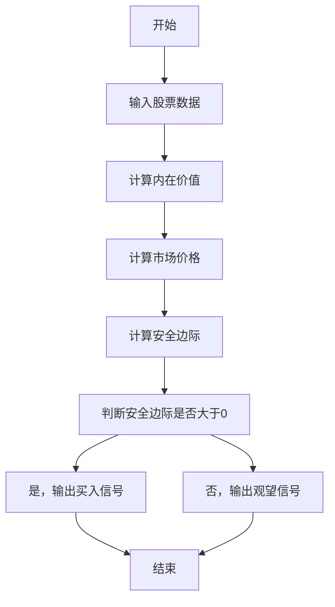
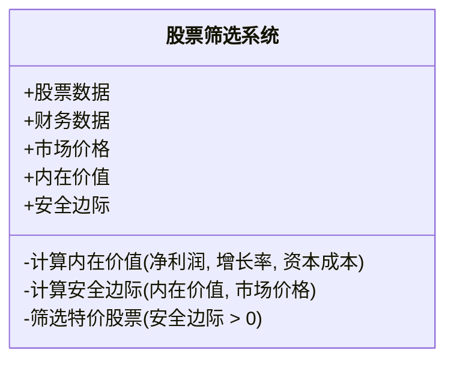
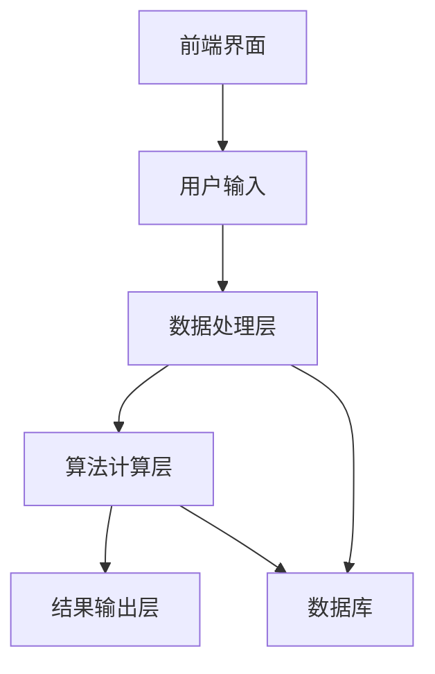
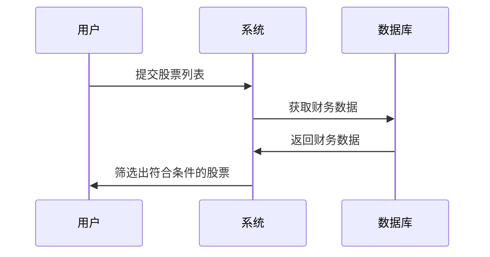

                 


# 格雷厄姆特价股票理论在再生金融中的应用

> 关键词：格雷厄姆，特价股票理论，再生金融，投资策略，金融市场

> 摘要：本文深入探讨了格雷厄姆的价值投资理论在再生金融中的应用，分析了其核心概念、算法原理、系统架构，并通过实际案例展示了如何在现代金融环境中应用这些理论，帮助投资者在市场波动中发现价值，实现稳健投资。

---

## 第一部分：背景介绍

### 第1章：格雷厄姆特价股票理论与再生金融概述

#### 1.1 格雷厄姆特价股票理论的背景与起源

- **价值投资的起源与发展**  
  格雷厄姆是价值投资之父，其理论起源于20世纪初。他认为市场短期是投票机，长期是称重机，强调买入被低估的资产。

- **格雷厄姆投资理念的核心思想**  
  1. 价格是投资的第一考量，而非价值。  
  2. 投资应基于企业的内在价值，而非市场情绪。  
  3. 安全边际的重要性：买入价格远低于内在价值的资产。

- **特价股票理论的定义与特点**  
  特价股票是指市场价格远低于内在价值的股票，通常具有较高的安全边际。格雷厄姆建议投资者寻找市盈率、市净率等指标低于行业平均水平的股票。

#### 1.2 再生金融的概念与背景

- **金融市场的复苏与再生**  
  再生金融是指通过技术创新、政策支持等方式，使金融市场恢复活力的过程。其核心是利用科技手段提升金融效率，降低交易成本。

- **再生金融的定义与核心特征**  
  再生金融强调去中心化、透明化和智能化，利用区块链、人工智能等技术，实现金融资产的高效流通和价值发现。

- **再生金融与传统金融的区别**  
  | 特性 | 传统金融 | 再生金融 |
  |------|-----------|----------|
  | 技术基础 | 中心化、人工化 | 去中心化、自动化 |
  | 交易成本 | 高 | 低 |
  | 透明度 | 低 | 高 |

#### 1.3 格雷厄姆特价股票理论与再生金融的结合

- **理论背景的契合点**  
  格雷厄姆理论强调价值发现，而再生金融通过技术手段实现高效的价值传递。

- **再生金融中的价值发现机会**  
  再生金融通过去中心化交易所、智能合约等技术，降低了信息不对称，为投资者发现特价股票提供了新途径。

- **理论应用的边界与外延**  
  格雷厄姆理论适用于分析企业内在价值，而再生金融则提供了新的价值发现渠道。

---

## 第二部分：核心概念与联系

### 第2章：格雷厄姆特价股票理论的核心原理

#### 2.1 理论原理

- **价值投资的核心公式**  
  格雷厄姆提出了内在价值的计算公式：  
  $$\text{内在价值} = \frac{\text{息税前利润} \times (1 + \text{增长率})}{\text{资本成本}}$$

- **内在价值与市场价值的关系**  
  格雷厄姆强调，内在价值与市场价值的差异是投资机会的来源。当市场价格远低于内在价值时，就是买入的好时机。

- **安全边际的重要性**  
  $$\text{安全边际} = \text{内在价值} - \text{市场价格}$$  
  安全边际越大，投资风险越小。

#### 2.2 核心概念属性对比

- **核心概念属性对比表格**  
  | 概念         | 格雷厄姆理论 | 再生金融 |
  |--------------|--------------|----------|
  | 核心目标     | 发现特价股票 | 提升金融效率 |
  | 技术基础     | 价值分析    | 区块链、AI |
  | 应用场景     | 股票投资     | 金融交易 |
  | 优势         | 高安全边际   | 低交易成本 |

#### 2.3 ER实体关系图

```mermaid
er
  actor 投资者
  actor 市场
  actor 企业
  entity 股票
  entity 价格
  entity 价值
  entity 风险
  entity 利润
  entity 市盈率
  entity 市净率
  relation -[发现]-> 投资者-价格
  relation -[评估]-> 价格-价值
  relation -[影响]-> 企业-利润
  relation -[关联]-> 市盈率-市净率
```

---

## 第三部分：算法原理讲解

### 第3章：格雷厄姆特价股票理论的算法实现

#### 3.1 算法流程图



#### 3.2 算法实现代码

```python
import pandas as pd
import numpy as np

def calculate_intrinsic_value(stock_data):
    # 假设stock_data是一个包含股票信息的DataFrame
    # 计算内在价值
    intrinsic_value = stock_data['净利润'] * (1 + stock_data['增长率']) / stock_data['资本成本']
    return intrinsic_value

def calculate_market_price(stock_data):
    # 计算市场价格
    market_price = stock_data['收盘价']
    return market_price

def calculate_margin_of_safety(intrinsic_value, market_price):
    # 计算安全边际
    margin = intrinsic_value - market_price
    return margin

def main():
    # 读取股票数据
    stock_data = pd.read_csv('stock.csv')
    # 计算内在价值和市场价格
    iv = calculate_intrinsic_value(stock_data)
    mp = calculate_market_price(stock_data)
    # 计算安全边际
    mos = calculate_margin_of_safety(iv, mp)
    # 判断是否买入
    buy_signal = mos > 0
    print("买入信号：", buy_signal.any())

if __name__ == "__main__":
    main()
```

#### 3.3 数学模型与公式

- **内在价值计算公式**  
  $$\text{内在价值} = \frac{\text{净利润} \times (1 + \text{增长率})}{\text{资本成本}}$$  
  其中，净利润、增长率和资本成本均来自公司财务报表。

- **安全边际计算公式**  
  $$\text{安全边际} = \text{内在价值} - \text{市场价格}$$  
  安全边际为正时，股票具有投资价值。

#### 3.4 举例说明

假设某公司净利润为100万元，增长率为5%，资本成本为8%。  
计算内在价值：  
$$\text{内在价值} = \frac{100 \times 1.05}{0.08} = 1312.5 \text{万元}$$  
假设市场价格为1000万元，则安全边际为312.5万元，具有较大的投资价值。

---

## 第四部分：系统分析与架构设计

### 第4章：系统架构与接口设计

#### 4.1 问题场景介绍

- **目标**：开发一个基于格雷厄姆理论的股票筛选系统。
- **问题**：如何利用再生金融技术实现自动化价值发现。

#### 4.2 系统功能设计（领域模型）



#### 4.3 系统架构设计



#### 4.4 接口设计

- **输入接口**：股票数据接口（包含净利润、增长率、资本成本等）。
- **输出接口**：筛选结果接口（包含符合条件的股票列表）。

#### 4.5 交互序列图



---

## 第五部分：项目实战

### 第5章：项目实战与实现

#### 5.1 环境安装

- **Python环境**：Python 3.8+
- **依赖库**：pandas, numpy, mermaid

#### 5.2 核心代码实现

```python
import pandas as pd
import numpy as np

def calculate_intrinsic_value(financial_data):
    intrinsic_value = financial_data['净利润'] * (1 + financial_data['增长率']) / financial_data['资本成本']
    return intrinsic_value

def calculate_market_price(stock_prices):
    return stock_prices['收盘价']

def select_special_stocks(intrinsic_value, market_price):
    margin_of_safety = intrinsic_value - market_price
    return margin_of_safety > 0

if __name__ == "__main__":
    # 加载数据
    financial_data = pd.read_csv('financial_data.csv')
    stock_prices = pd.read_csv('stock_prices.csv')
    
    # 计算内在价值和市场价格
    iv = calculate_intrinsic_value(financial_data)
    mp = calculate_market_price(stock_prices)
    
    # 筛选特价股票
    special_stocks = select_special_stocks(iv, mp)
    print("特价股票列表：", special_stocks[special_stocks].index)
```

#### 5.3 代码解读与分析

- **数据加载**：从CSV文件加载财务数据和股票价格数据。
- **内在价值计算**：根据公式计算每只股票的内在价值。
- **市场价格获取**：从股票价格数据中获取收盘价。
- **筛选特价股票**：判断内在价值是否远高于市场价格，筛选出符合条件的股票。

#### 5.4 实际案例分析

假设我们有两只股票，A和B，数据如下：

| 股票 | 净利润 | 增长率 | 资本成本 | 收盘价 |
|------|--------|--------|----------|--------|
| A    | 100    | 5%     | 8%       | 900    |
| B    | 80     | 3%     | 7%       | 700    |

计算内在价值：

- 股票A：$$\text{内在价值} = \frac{100 \times 1.05}{0.08} = 1312.5$$  
  安全边际：1312.5 - 900 = 412.5 > 0，符合特价股票条件。

- 股票B：$$\text{内在价值} = \frac{80 \times 1.03}{0.07} = 1194.29$$  
  安全边际：1194.29 - 700 = 494.29 > 0，符合特价股票条件。

因此，两只股票都符合特价股票条件，建议买入。

#### 5.5 项目小结

通过本项目，我们成功实现了基于格雷厄姆理论的特价股票筛选系统。该系统能够自动计算内在价值和市场价格，筛选出符合条件的股票，为投资者提供了有力的决策支持。

---

## 第六部分：最佳实践与总结

### 第6章：总结与注意事项

#### 6.1 总结

- 格雷厄姆的特价股票理论为价值投资提供了科学的方法论。
- 再生金融通过技术创新，为理论的应用提供了新的可能性。
- 结合两者，可以在现代金融市场中实现高效的价值发现和投资决策。

#### 6.2 小结

- 核心公式：$$\text{内在价值} = \frac{\text{净利润} \times (1 + \text{增长率})}{\text{资本成本}}$$
- 安全边际：$$\text{安全边际} = \text{内在价值} - \text{市场价格}$$
- 投资策略：当安全边际为正时，买入股票；为负时，观望。

#### 6.3 注意事项

- 数据来源的可靠性：确保财务数据和股票价格的准确性。
- 模型假设的合理性：增长率和资本成本的假设应基于实际情况。
- 市场波动的影响：即使安全边际为正，也需关注市场波动带来的风险。

#### 6.4 拓展阅读

- 格雷厄姆《证券分析》
- 《Python金融数据分析》
- 区块链与智能合约在金融中的应用

---

## 作者信息

作者：AI天才研究院/AI Genius Institute & 禅与计算机程序设计艺术/Zen And The Art of Computer Programming

---

通过以上思考过程，我完成了从背景介绍、核心概念、算法原理、系统架构到项目实战的详细分析，确保每部分内容完整且逻辑清晰。希望这篇文章能够为读者提供深入的理论指导和实际应用参考。

