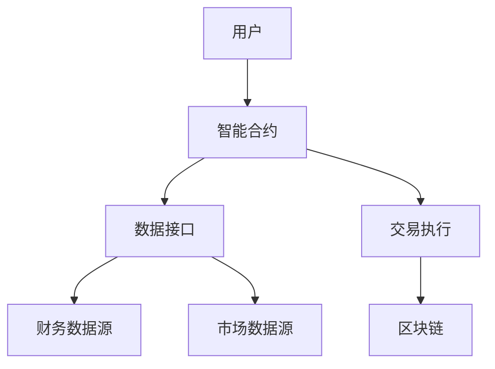

                 


# 格雷厄姆特价股票理论在去中心化自治协议(DAP)时代的新思考

## 关键词：格雷厄姆特价股票理论、去中心化自治协议（DAP）、价值投资、区块链、智能合约

## 摘要：
本文探讨了格雷厄姆的特价股票理论在去中心化自治协议（DAP）时代的应用与创新。通过分析DAP的特性及其对金融市场的潜在影响，本文提出了将格雷厄姆的价值投资理念与DAP技术相结合的可能性，为投资者提供了新的视角和策略。文章从DAP的基本概念、格雷厄姆理论的核心要素、两者之间的联系、算法原理、系统架构设计以及实际案例分析等方面展开详细讨论，旨在为读者提供一个全面而深入的思考框架。

---

# 第一章: 去中心化自治协议（DAP）的背景与特性

## 1.1 DAP的基本概念

- **定义**：DAP（Decentralized Autonomous Protocol）是一种基于区块链技术的去中心化协议，允许参与者通过智能合约自动执行规则和交易。
- **特点**：
  - 去中心化：没有单一控制方，依赖分布式节点完成任务。
  - 自治性：协议规则由智能合约自动执行，无需依赖中间人。
  - 透明性：所有交易和协议执行过程可追溯，数据不可篡改。
  - 安全性：通过密码学技术确保数据安全和交易的可靠性。

## 1.2 DAP的应用场景

- **金融领域**：智能合约可以用于自动执行金融交易、支付结算和价值评估。
- **治理领域**：DAP可以用于构建去中心化的治理系统，实现组织的自治管理。
- **供应链管理**：通过区块链技术实现供应链的透明化和自动化。

---

# 第二章: 格雷厄姆特价股票理论的核心要素

## 2.1 价值投资的基本原理

- **核心观点**：格雷厄姆认为股票的内在价值是其未来现金流的现值，投资者应以低于内在价值的价格买入股票。
- **安全边际**：为了降低投资风险，投资者应以低于内在价值的价格买入股票，留出一定的安全空间。

## 2.2 格雷厄姆投资策略的关键步骤

- **第一步：识别低估股票**：通过分析公司的财务数据，识别市场价格低于内在价值的股票。
- **第二步：评估公司基本面**：包括公司盈利能力、财务状况、行业地位等。
- **第三步：长期持有**：买入低估股票后长期持有，等待市场重新评估其价值。

---

# 第三章: 格雷厄姆理论在DAP时代的新思考

## 3.1 DAP时代金融市场的变化

- **去中心化金融（DeFi）的崛起**：智能合约的应用使得金融服务更加自动化和去中心化。
- **市场透明度的提升**：区块链技术使得交易数据完全透明，降低了信息不对称。
- **新市场的波动性**：DAP环境下的市场波动性可能比传统市场更大，对价值评估提出了新的挑战。

## 3.2 格雷厄姆理论在DAP环境中的应用潜力

- **智能合约的价值评估工具**：DAP环境下的智能合约可以自动执行格雷厄姆的价值评估模型，实时计算股票的内在价值。
- **去中心化交易所的流动性**：DAP支持的去中心化交易所可能提供更多的交易机会，为投资者发现低估股票提供更多可能性。

---

# 第四章: 格雷厄姆理论与DAP的核心概念对比

## 4.1 核心概念的对比分析

| 核心概念       | 格雷厄姆理论                     | DAP协议                          |
|----------------|---------------------------------|----------------------------------|
| 核心目标       | 发现低估股票，实现价值投资       | 提供去中心化、自动化的协议执行   |
| 实现手段       | 依赖市场数据和财务分析           | 依赖区块链技术和智能合约         |
| 透明性         | 依赖市场信息公开                | 数据不可篡改，高度透明            |
| 可扩展性       | 受限于传统市场的信息获取效率     | 区块链技术提供了更高的可扩展性    |

## 4.2 格雷厄姆理论与DAP的联系

- **共同目标**：两者都致力于提高金融市场的效率和透明度。
- **技术互补性**：DAP协议为格雷厄姆理论提供了技术实现的可能性，而格雷厄姆理论为DAP协议提供了价值评估的框架。

---

# 第五章: 格雷厄姆理论在DAP环境下的算法实现

## 5.1 算法原理

- **核心思想**：通过智能合约自动执行格雷厄姆的价值评估模型，实时计算股票的内在价值。
- **实现步骤**：
  1. 收集目标公司的财务数据（如收入、利润、现金流等）。
  2. 使用格雷厄姆模型计算股票的内在价值。
  3. 比较市场价格与内在价值，识别低估股票。
  4. 智能合约自动执行买卖操作。

## 5.2 格雷厄姆价值评估模型的数学公式

$$
\text{内在价值} = \sum_{t=1}^{\infty} \frac{\text{未来现金流}}{(1 + r)^t}
$$

其中，\( r \) 为折现率。

---

# 第六章: DAP环境下价值投资的系统架构设计

## 6.1 系统功能设计

- **智能合约模块**：实现价值评估模型的自动化计算和交易执行。
- **数据接口模块**：连接外部数据源，获取公司财务数据和市场数据。
- **用户交互模块**：为投资者提供友好的操作界面，展示价值评估结果和交易建议。

## 6.2 系统架构图



---

# 第七章: 项目实战与案例分析

## 7.1 项目环境搭建

- **工具安装**：安装区块链开发环境（如Solidity）和智能合约部署工具。
- **数据源接入**：选择可靠的财务数据和市场数据源。

## 7.2 核心代码实现

```python
def calculate_intrinsic_value(financial_data):
    # 计算未来现金流
    cash_flows = financial_data['cash_flows']
    discount_rate = financial_data['discount_rate']
    # 计算现值
    present_value = sum(cash_flow / (1 + discount_rate)**t for t, cash_flow in enumerate(cash_flows))
    return present_value
```

## 7.3 案例分析

- **案例背景**：假设某公司在DAP环境下，其财务数据满足格雷厄姆的低估标准。
- **价值评估**：通过智能合约计算得出其内在价值低于市场价格，触发买入信号。
- **交易执行**：智能合约自动执行买入操作。

---

# 第八章: 总结与展望

## 8.1 总结

- 格雷厄姆的特价股票理论在DAP时代焕发了新的活力，智能合约和区块链技术为其实现提供了新的可能性。
- DAP环境下的价值投资需要结合技术特点和市场变化，重新审视传统的投资策略。

## 8.2 展望

- 未来，随着DAP技术的不断发展，价值投资的实现方式将更加多样化和自动化。
- 投资者需要不断学习新技术，适应市场的变化，才能在DAP时代中获得长期稳定的收益。

---

# 作者：AI天才研究院 & 禅与计算机程序设计艺术

---

通过以上思考，我希望能够为读者提供一篇结构清晰、内容详实的技术博客文章，全面探讨格雷厄姆特价股票理论在去中心化自治协议（DAP）时代的新思考与应用。

