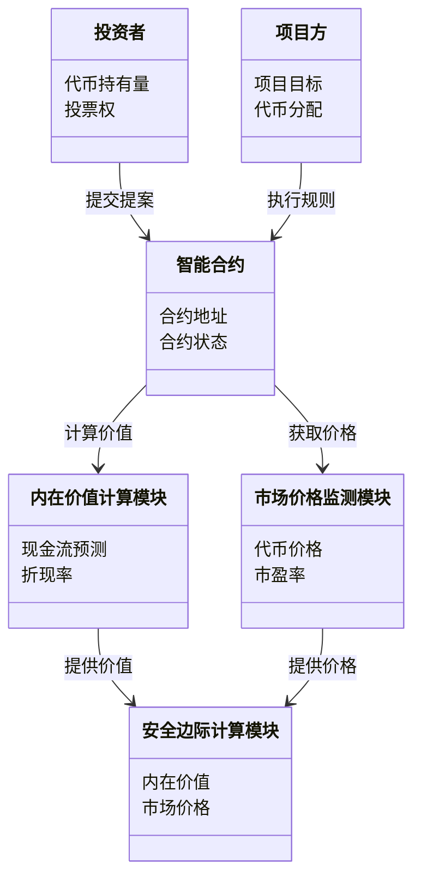

                 


# 格雷厄姆特价股票理论在去中心化自治组织(DAO)时代的新思考

> 关键词：格雷厄姆理论, 特价股票, 去中心化自治组织, 投资策略, 区块链, 智能合约, 代币经济

> 摘要：本文从格雷厄姆特价股票理论的基本概念出发，探讨其在去中心化自治组织（DAO）时代下的新应用与思考。通过分析DAO的治理机制、代币经济模型等核心要素，结合格雷厄姆理论中的安全边际、内在价值等核心概念，提出一种新的投资策略和数学模型。文章还通过实际案例分析，展示如何在DAO环境中应用格雷厄姆理论，实现稳健的投资回报。本文旨在为投资者和区块链技术爱好者提供新的视角和实践指导。

---

## 第1章 格雷厄姆特价股票理论的背景与核心思想

### 1.1 投资学中的格雷厄姆理论
#### 1.1.1 格雷厄姆投资理论的起源与发展
格雷厄姆是价值投资的鼻祖，其理论在20世纪初奠定基础。他主张以低于内在价值的价格购买优质股票，强调安全边际的重要性。格雷厄姆的方法在传统金融领域影响深远，尤其是在机构投资和长期价值投资中占据重要地位。

#### 1.1.2 格雷厄姆特价股票的核心概念
格雷厄姆提出的“特价股票”是指那些市场价格远低于其内在价值的股票。这种股票通常被视为被市场低估，具有较高的投资潜力。核心概念包括：
- **内在价值**：资产在未来现金流的现值。
- **安全边际**：市场价格与内在价值的差距，确保投资的安全性。

#### 1.1.3 格雷厄姆投资哲学对现代投资的影响
格雷厄姆的理论强调长期、稳健的投资策略，注重基本面分析和风险控制。这些理念在现代金融中被广泛应用，尤其是在机构投资者和个人投资者中。

---

### 1.2 去中心化自治组织（DAO）的基本概念
#### 1.2.1 DAO的定义与特征
DAO是基于区块链技术的自治组织，通过智能合约自动执行治理规则。其核心特征包括：
- **去中心化**：无中心化机构控制，决策通过投票机制完成。
- **透明性**：所有交易和治理记录在区块链上，公开可查。
- **不可篡改性**：智能合约确保规则的严格执行。

#### 1.2.2 DAO的起源与发展趋势
DAO的概念起源于区块链社区，早期代表项目包括The DAO。随着技术发展，DAO的应用场景逐渐扩展到治理、融资、供应链管理等多个领域。

#### 1.2.3 DAO与传统组织的对比分析
- **组织结构**：DAO基于智能合约，传统组织依赖于中心化机构。
- **决策机制**：DAO通过投票机制，传统组织通过管理层决策。
- **透明度**：DAO高度透明，传统组织可能涉及内部信息不透明。

---

### 1.3 格雷厄姆理论与DAO的结合背景
#### 1.3.1 格雷厄姆理论在现代金融中的应用现状
格雷厄姆理论在传统金融中已得到广泛应用，但在区块链和数字资产领域仍有较大潜力。

#### 1.3.2 DAO时代下金融投资的新模式
DAO的兴起为投资提供了新的模式，尤其是代币经济和去中心化金融（DeFi）的发展，使得格雷厄姆理论的应用场景更加丰富。

#### 1.3.3 格雷厄姆理论与DAO结合的必要性
随着区块链技术的普及，DAO的治理和经济模型需要新的理论支持，而格雷厄姆理论提供了稳健的投资策略和风险控制方法。

---

## 第2章 核心概念的解析与对比

### 2.1 格雷厄姆理论的核心要素
#### 2.1.1 特价股票的定义与标准
- **定义**：市场价格远低于内在价值的股票。
- **标准**：市盈率、市净率等指标低于行业平均水平。

#### 2.1.2 格雷厄姆的安全边际概念
- **安全边际** = 内在价值 - 市场价格。
- **作用**：降低投资风险，确保收益的稳健性。

#### 2.1.3 格雷厄姆的内在价值计算方法
- **公式**：内在价值 = 未来现金流的现值。
- **方法**：DCF模型（现金流折现法）。

### 2.2 DAO的核心机制与属性
#### 2.2.1 DAO的治理机制
- **投票机制**：基于代币持有量的投票权。
- **智能合约**：自动执行治理规则。

#### 2.2.2 DAO的代币经济模型
- **代币类型**：治理代币、收益代币等。
- **经济激励**：通过代币分配激励参与者。

#### 2.2.3 DAO的智能合约特性
- **智能合约**：自动执行规则，确保透明性和不可篡改性。

### 2.3 核心概念的对比分析
#### 2.3.1 格雷厄姆理论与DAO的对比表格

| 对比维度 | 格雷厄姆理论 | DAO |
|----------|--------------|-----|
| 核心目标 | 稳健投资回报 | 自治组织治理 |
| 决策机制 | 专家判断 | 投票机制 |
| 透明性   | 低 | 高 |

#### 2.3.2 格雷厄姆理论与DAO的ER实体关系图
```mermaid
erDiagram
    actor 投资者 {
        <属性> 代币持有量
        <属性> 投票权
    }
    actor 项目方 {
        <属性> 项目目标
        <属性> 代币分配
    }
    entity 智能合约 {
        <属性> 合约地址
        <属性> 合约状态
    }
    entity 内在价值 {
        <属性> 现金流预测
        <属性> 折现率
    }
    entity 市场价格 {
        <属性> 代币价格
        <属性> 市盈率
    }
    investor -> 智能合约 : 提交提案
   项目方 -> 智能合约 : 执行规则
    智能合约 -> 内在价值 : 计算价值
    智能合约 -> 市场价格 : 比较价值
```

---

## 第3章 格雷厄姆理论与DAO的结合原理

### 3.1 格雷厄姆理论在DAO中的应用场景
#### 3.1.1 特价股票识别与DAO治理的结合
- **识别方法**：通过智能合约分析代币价格与内在价值的差距。
- **应用案例**：识别DAO中的廉价代币投资机会。

#### 3.1.2 安全边际在DAO投资中的应用
- **策略**：购买价格低于内在价值的代币，确保安全边际。
- **风险控制**：通过智能合约自动执行止损机制。

#### 3.1.3 内在价值计算与代币估值的关系
- **公式**：代币内在价值 = 项目未来现金流的现值。
- **实现**：通过智能合约计算代币的内在价值。

### 3.2 格雷厄姆理论与DAO结合的数学模型
#### 3.2.1 特价股票识别的数学公式
$$
\text{安全边际} = \text{内在价值} - \text{市场价格}
$$

#### 3.2.2 安全边际计算的公式
$$
\text{投资价值} = \max(\text{内在价值}, \text{市场价格} + \text{安全边际})
$$

#### 3.2.3 内在价值与代币估值的对比分析
$$
\text{内在价值} = \sum_{t=1}^{n} \frac{\text{现金流}_t}{(1 + r)^t}
$$

---

## 第4章 系统分析与架构设计方案

### 4.1 问题场景介绍
#### 4.1.1 格雷厄姆理论在DAO中的应用需求
- **需求**：DAO治理中的投资决策支持。
- **目标**：实现基于格雷厄姆理论的DAO投资策略。

#### 4.1.2 系统的约束与边界条件
- **约束**：智能合约的可编程性。
- **边界**：仅考虑DAO治理中的投资决策。

### 4.2 系统功能设计
#### 4.2.1 系统功能模块划分
- **模块1**：内在价值计算模块。
- **模块2**：市场价格监测模块。
- **模块3**：安全边际计算模块。

#### 4.2.2 系统功能的领域模型Mermaid类图


### 4.3 系统架构设计
#### 4.3.1 系统架构的Mermaid架构图
```mermaid
container 区块链网络 {
    组件 智能合约平台
    组件 代币发行模块
    组件 投票机制模块
}
container 投资者端 {
    组件 投资者界面
    组件 投票功能
    组件 代币持有量查询
}
container 项目方端 {
    组件 项目目标设定
    组件 代币分配规则
}
```

---

## 第5章 项目实战与实现

### 5.1 环境安装与配置
#### 5.1.1 开发环境的搭建
- **工具**：以太坊测试网、Solidity、Remix IDE。

#### 5.1.2 依赖库的安装与配置
- **依赖**：Web3.js、Solidity编译器。

### 5.2 核心功能实现
#### 5.2.1 特价股票识别算法的实现
- **代码示例**：
```solidity
function calculate内在价值(address tokenAddress) public returns (uint256) {
    uint256 cashFlows = ...; // 现金流预测
    uint256 discountRate = ...; // 折现率
    uint256 intrinsicValue = 0;
    for (uint256 i = 0; i < cashFlows.length; i++) {
        intrinsicValue += cashFlows[i] / (1 + discountRate) ** i;
    }
    return intrinsicValue;
}
```

#### 5.2.2 安全边际计算的实现
- **代码示例**：
```solidity
function calculate安全边际(address tokenAddress) public returns (uint256) {
    uint256市场价格 = get市场价格(tokenAddress);
    uint256内在价值 = calculate内在价值(tokenAddress);
    return 内在价值 - 市场价格;
}
```

---

## 第6章 最佳实践与总结

### 6.1 最佳实践
- **风险管理**：始终关注安全边际，避免过度投资。
- **技术实现**：确保智能合约的正确性和可编程性。

### 6.2 小结
本文通过分析格雷厄姆理论与DAO的结合，提出了一种新的投资策略。通过智能合约和代币经济模型，实现了格雷厄姆理论在去中心化环境下的应用。

### 6.3 注意事项
- **市场波动**：DAO市场波动较大，需谨慎操作。
- **技术风险**：智能合约漏洞可能引发重大风险。

### 6.4 拓展阅读
- **推荐书籍**：《The Intelligent Investor》。
- **推荐项目**：The DAO、MakerDAO。

---

## 作者：AI天才研究院/AI Genius Institute & 禅与计算机程序设计艺术 /Zen And The Art of Computer Programming

---

以上是《格雷厄姆特价股票理论在去中心化自治组织(DAO)时代的新思考》的完整目录和内容大纲，涵盖了从理论到实践的各个方面，适合投资者、区块链技术爱好者和DAO领域的从业者阅读。

