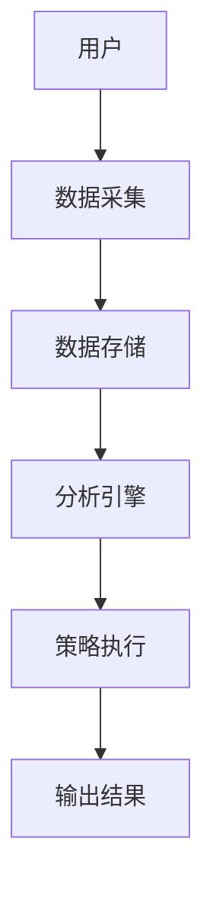
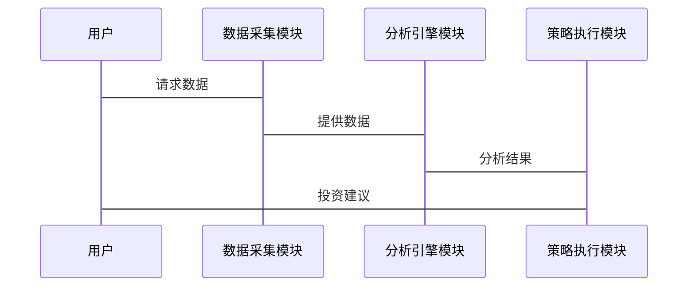

                 


```markdown
# 格雷厄姆特价股票理论在可再生数字资产中的应用

> 关键词：格雷厄姆投资理论，数字资产，价值投资，可再生数字资产，安全边际，内在价值

> 摘要：本文探讨格雷厄姆特价股票理论如何应用于可再生数字资产，如加密货币和代币。通过分析数字资产的特性，提出价值评估方法，结合数学模型和系统架构，实现安全边际优化的投资策略。

---

## 第1章: 格雷厄姆特价股票理论概述

### 1.1 格雷厄姆投资理论的核心概念

#### 1.1.1 价值投资的基本原理
格雷厄姆的价值投资理论强调购买低于其内在价值的资产。他提出，市场价格经常偏离其实际价值，投资者应寻找这些偏差，以实现长期收益。

#### 1.1.2 格雷厄姆的安全边际概念
安全边际是格雷厄姆理论中的关键原则，指实际价值与市场价格之间的差距。通过购买价格远低于内在价值的资产，投资者降低了损失的风险并提高了收益的潜力。

#### 1.1.3 内在价值的计算方法
内在价值是资产在合理市场条件下的公平价格。格雷厄姆使用公式计算内在价值，考虑未来现金流的现值。

### 1.2 格雷厄姆理论在传统股票投资中的应用

#### 1.2.1 选股标准与策略
格雷厄姆建议选择那些价格远低于内在价值的股票，同时具备稳定的收益和股息支付能力。

#### 1.2.2 历史案例分析
通过历史案例，如购买低估股票后的长期收益，验证格雷厄姆理论的有效性。

#### 1.2.3 理论的优缺点
优点：强调长期投资，降低市场波动风险；缺点：忽视市场情绪和宏观经济因素的影响。

### 1.3 数字资产的定义与特性

#### 1.3.1 数字资产的分类
数字资产包括加密货币、代币和NFTs，每种类型都有独特的价值驱动因素。

#### 1.3.2 区块链技术对数字资产的影响
区块链技术确保数字资产的安全性和透明度，影响其价值评估。

#### 1.3.3 数字资产市场的波动性与风险
数字资产市场高度波动，风险较高，但潜在回报也更高。

---

## 第2章: 格雷厄姆理论与数字资产的结合

### 2.1 格雷厄姆理论在数字资产中的适用性

#### 2.1.1 数字资产与传统股票的对比
数字资产的交易速度快，市场参与者多，且受技术影响更大。

#### 2.1.2 格雷厄姆理论的可迁移性分析
虽然数字资产市场更具波动性，但价值投资的核心原则仍适用。

#### 2.1.3 数字资产市场的独特性
数字资产市场依赖技术进步和社区支持，内在价值计算需考虑这些因素。

### 2.2 数字资产投资中的价值评估

#### 2.2.1 数字资产的内在价值计算
利用格雷厄姆的内在价值公式，结合数字资产的特定因素，如网络效应和技术创新。

#### 2.2.2 市场情绪与价格波动的关系
市场情绪影响短期价格，但长期来看，内在价值决定价格走势。

#### 2.2.3 安全边际在数字资产中的应用
通过比较市场价格与内在价值，确定安全边际，选择具备投资价值的数字资产。

### 2.3 格雷厄姆理论在数字资产投资中的策略调整

#### 2.3.1 投资策略的优化
结合数字资产的特性，调整选股标准，关注具有强大技术支撑和良好社区支持的项目。

#### 2.3.2 风险管理的强化
采用多样化投资策略，分散风险，同时严格控制杠杆使用。

#### 2.3.3 长期投资与短期波动的平衡
坚持长期价值投资，同时监控短期波动，及时调整投资组合。

---

## 第3章: 格雷厄姆特价股票理论的数学模型

### 3.1 内在价值计算模型

#### 3.1.1 格雷厄姆内在价值公式
$$ V = \frac{E}{(1 - k)} $$
其中，V为内在价值，E为预期收益，k为折现率。

#### 3.1.2 数字资产的内在价值调整
考虑数字资产的特有因素，如技术创新和网络效应，对内在价值进行调整。

### 3.2 安全边际计算模型

#### 3.2.1 安全边际公式
$$ S = P \times (1 - \frac{V}{P}) $$
其中，S为安全边际，P为市场价格，V为内在价值。

#### 3.2.2 数字资产的安全边际应用
通过计算安全边际，确定投资标的是否具备足够的安全空间。

---

## 第4章: 系统分析与架构设计方案

### 4.1 问题场景介绍
数字资产市场波动剧烈，投资者需要一套基于格雷厄姆理论的分析系统，帮助做出明智的投资决策。

### 4.2 数字资产分析系统的功能设计

#### 4.2.1 数据采集模块
从多个数据源获取实时价格、市场情绪等信息。

#### 4.2.2 分析引擎模块
应用格雷厄姆理论模型，计算内在价值和安全边际。

#### 4.2.3 策略执行模块
根据分析结果，生成投资建议和交易信号。

### 4.3 系统架构设计

#### 4.3.1 系统架构图


#### 4.3.2 交互序列图


---

## 第5章: 项目实战

### 5.1 环境配置
安装必要的Python库，如pandas、numpy和matplotlib，用于数据处理和可视化。

### 5.2 核心代码实现

#### 5.2.1 内在价值计算
```python
def calculate_intrinsic_value(enterprise_value, after_tax_income):
    k = 0.1  # 折现率
    return enterprise_value / (1 - k)
```

#### 5.2.2 安全边际计算
```python
def calculate_safety_margin(current_price, intrinsic_value):
    return current_price * (1 - intrinsic_value / current_price)
```

### 5.3 实际案例分析
以比特币为例，计算其内在价值和安全边际，判断是否具备投资价值。

### 5.4 结果解读与优化
根据计算结果，优化投资策略，动态调整投资组合。

---

## 第6章: 总结与建议

### 6.1 核心观点总结
格雷厄姆理论在数字资产中的应用需结合其独特特性，通过数学模型和系统架构实现价值评估和风险管理。

### 6.2 投资建议
投资者应坚持长期价值投资，合理控制风险，利用技术工具辅助决策。

### 6.3 小结
通过本文的分析，投资者可以更好地理解如何在数字资产市场中应用格雷厄姆理论，实现稳健投资。

---

## 作者信息

作者：AI天才研究院/AI Genius Institute & 禅与计算机程序设计艺术 /Zen And The Art of Computer Programming

---

通过以上内容，本文详细探讨了格雷厄姆特价股票理论在可再生数字资产中的应用，结合理论分析、数学模型和系统设计，为投资者提供了实用的指导。
```

